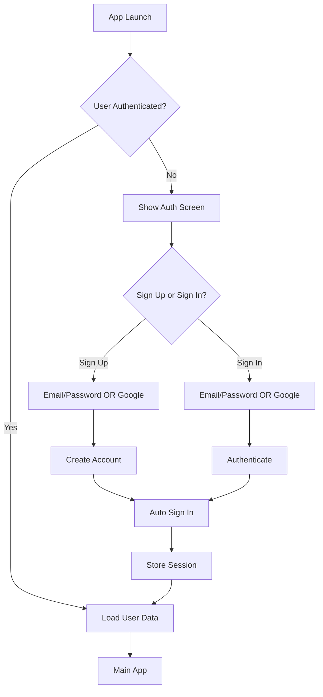

# Backend Solution Research & Recommendations
## Smart Subscription Tracker - React Native App

**Date**: 2025-11-08  
**Priorities**: Cost-effectiveness, Ease of Implementation, Scalability

---

## Executive Summary

After analyzing multiple backend solutions for the Smart Subscription Tracker React Native/Expo app, **Supabase** emerges as the optimal choice based on your priorities. It offers the best balance of cost-effectiveness (generous free tier), ease of implementation (excellent React Native/Expo support), and scalability, while providing PostgreSQL's robustness and built-in authentication with Google OAuth.

**Recommended Solution**: Supabase  
**Runner-up**: Firebase  
**Timeline**: 2-3 weeks for full implementation  
**Estimated Cost**: $0/month initially (free tier sufficient for 50,000+ MAU)

---

## 1. Backend Solutions Comparison

### 1.1 Supabase ⭐ **RECOMMENDED**

#### Overview
Open-source Firebase alternative built on PostgreSQL, with real-time subscriptions, authentication, and storage.

#### Setup Complexity
- **Rating**: ⭐⭐⭐⭐⭐ (Excellent)
- Official React Native SDK with Expo support
- Simple configuration via environment variables
- Auto-generated TypeScript types from database schema
- CLI tool for local development and migrations
- Setup time: 30-60 minutes

#### Cost Structure
```
FREE TIER (Excellent for your use case):
✅ 500MB database storage
✅ 1GB file storage
✅ 2GB bandwidth/month
✅ 50,000 monthly active users
✅ 500K Edge Function invocations
✅ Unlimited API requests
✅ Social OAuth providers included
✅ No credit card required

PRO TIER: $25/month
- 8GB database storage
- 100GB file storage
- 50GB bandwidth
- 100K MAU
- Better support & features

PAID ONLY IF: You exceed 50K users or 500MB DB storage
```

#### Scalability
- **Rating**: ⭐⭐⭐⭐⭐ (Excellent)
- Built on PostgreSQL (battle-tested)
- Horizontal scaling available on Pro tier
- Connection pooling included
- Automatic backups on paid tiers
- Can handle millions of users with proper architecture

#### Real-time Sync
- **Rating**: ⭐⭐⭐⭐⭐ (Excellent)
- PostgreSQL LISTEN/NOTIFY for real-time updates
- Real-time subscriptions to database changes
- Broadcast channels for real-time messaging
- React hooks for easy subscription management
- Works seamlessly with Expo

#### Offline Support
- **Rating**: ⭐⭐⭐⭐ (Very Good)
- No built-in offline persistence
- Can implement with AsyncStorage + sync logic
- Simple to implement "optimistic updates"
- Good community patterns for offline-first

#### Developer Experience
- **Rating**: ⭐⭐⭐⭐⭐ (Excellent)
- Auto-generated REST and GraphQL APIs
- TypeScript support out of the box
- Excellent documentation
- Active community and Discord support
- Local development with Docker
- Dashboard UI for database management
- Row Level Security (RLS) for data isolation

#### React Native/Expo Compatibility
- **Rating**: ⭐⭐⭐⭐⭐ (Excellent)
- Official `@supabase/supabase-js` library
- Works perfectly with Expo
- Excellent examples and documentation
- Compatible with AsyncStorage for session persistence

#### Google OAuth Integration
- **Rating**: ⭐⭐⭐⭐⭐ (Excellent)
- Built-in OAuth providers (Google, Apple, GitHub, etc.)
- One-click setup in dashboard
- Handles token refresh automatically
- Seamless integration with React Native

#### Pros
✅ Completely free for small-medium apps (50K MAU)
✅ PostgreSQL = familiar, powerful, reliable
✅ Excellent documentation and community
✅ Row Level Security for data isolation
✅ Real-time subscriptions included
✅ Open-source (can self-host if needed)
✅ TypeScript-first approach
✅ Fast API auto-generation
✅ Easy Google OAuth setup

#### Cons
❌ Offline support requires custom implementation
❌ Slightly steeper learning curve than Firebase for SQL beginners
❌ Real-time connections count toward database connections
❌ Edge functions use Deno (not Node.js)

#### Best For
Small to medium apps, developers who want PostgreSQL's power, cost-conscious projects, apps needing data isolation via RLS

---

### 1.2 Firebase

#### Overview
Google's mature Backend-as-a-Service with Firestore, Authentication, Cloud Functions, and more.

#### Setup Complexity
- **Rating**: ⭐⭐⭐⭐ (Very Good)
- Official React Native Firebase library (`@react-native-firebase/app`)
- Requires native modules (not pure JS)
- Expo compatibility through EAS Build or prebuild
- Setup time: 1-2 hours (including build configuration)

#### Cost Structure
```
SPARK PLAN (Free):
✅ 1GB stored data
✅ 50K reads/day, 20K writes/day, 20K deletes/day
✅ 10GB/month bandwidth
✅ Google Analytics for Firebase
✅ Authentication (all providers)
⚠️ Limited for growing apps

BLAZE PLAN (Pay as you go):
- $0.18/GB stored
- $0.06 per 100K reads
- $0.18 per 100K writes
- First 50K reads, 20K writes free daily
- Can become expensive at scale
```

#### Scalability
- **Rating**: ⭐⭐⭐⭐⭐ (Excellent)
- Battle-tested at Google scale
- Automatic scaling
- Global CDN
- Multi-region support
- Can handle massive scale

#### Real-time Sync
- **Rating**: ⭐⭐⭐⭐⭐ (Excellent)
- Built-in real-time listeners
- Firestore's snapshot listeners
- Extremely reliable
- No additional setup needed

#### Offline Support
- **Rating**: ⭐⭐⭐⭐⭐ (Excellent)
- Best-in-class offline support
- Automatic data persistence
- Conflict resolution built-in
- Works seamlessly

#### Developer Experience
- **Rating**: ⭐⭐⭐⭐ (Very Good)
- Mature ecosystem
- Extensive documentation
- Large community
- Firebase Console UI
- NoSQL data model (simpler for some, limiting for others)

#### React Native/Expo Compatibility
- **Rating**: ⭐⭐⭐ (Good)
- Requires native modules
- Not compatible with Expo Go
- Needs EAS Build or expo prebuild
- More complex setup than pure JS solutions

#### Google OAuth Integration
- **Rating**: ⭐⭐⭐⭐⭐ (Excellent)
- Native Google integration (it's a Google product)
- Multiple auth methods supported
- Seamless setup

#### Pros
✅ Industry standard, mature platform
✅ Excellent real-time and offline support
✅ Comprehensive features (Analytics, Crashlytics, etc.)
✅ Massive community and resources
✅ Google's infrastructure and reliability

#### Cons
❌ Costs can escalate quickly with reads/writes
❌ Requires native modules (Expo complications)
❌ NoSQL limitations for complex queries
❌ Vendor lock-in to Google ecosystem
❌ Free tier limits restrictive for growing apps

#### Best For
Apps needing best-in-class offline support, teams already in Google ecosystem, apps with complex real-time requirements

---

### 1.3 AWS Amplify

#### Overview
AWS's framework for building cloud-powered mobile and web apps, using DynamoDB, Cognito, AppSync, etc.

#### Setup Complexity
- **Rating**: ⭐⭐ (Complex)
- Steeper learning curve
- AWS CLI and Amplify CLI required
- Multiple AWS services to configure
- Setup time: 3-4 hours for first-time users

#### Cost Structure
```
FREE TIER (12 months):
✅ DynamoDB: 25GB storage, 25 read/write units
✅ Cognito: 50,000 MAU
✅ AppSync: 250K queries/month
✅ Lambda: 1M requests/month

AFTER FREE TIER:
- DynamoDB: Pay per request
- Cognito: $0.0055/MAU after 50K
- AppSync: $4/million queries
- Can be cost-effective but complex to estimate
```

#### Scalability
- **Rating**: ⭐⭐⭐⭐⭐ (Excellent)
- AWS infrastructure
- Unlimited scalability
- Global presence
- Enterprise-grade

#### Real-time Sync
- **Rating**: ⭐⭐⭐⭐ (Very Good)
- AppSync provides GraphQL subscriptions
- Real-time updates available
- Requires more configuration

#### Offline Support
- **Rating**: ⭐⭐⭐⭐ (Very Good)
- DataStore provides offline-first capability
- Automatic sync when online
- Conflict resolution included

#### Developer Experience
- **Rating**: ⭐⭐ (Challenging)
- Complex AWS ecosystem
- Multiple services to learn
- Documentation can be overwhelming
- Powerful but steep learning curve

#### React Native/Expo Compatibility
- **Rating**: ⭐⭐⭐⭐ (Very Good)
- Official AWS Amplify React Native library
- Works with Expo (some limitations)
- Good documentation

#### Google OAuth Integration
- **Rating**: ⭐⭐⭐⭐ (Very Good)
- Supported via Cognito
- Requires configuration in AWS Console
- Well-documented

#### Pros
✅ AWS infrastructure reliability
✅ Comprehensive feature set
✅ Great for teams already on AWS
✅ Enterprise-grade security
✅ Offline DataStore capability

#### Cons
❌ Very complex setup and learning curve
❌ Multiple AWS services to manage
❌ Overkill for small apps
❌ Cost estimation difficult
❌ Poor DX compared to alternatives
❌ Slower development velocity

#### Best For
Enterprise applications, teams with AWS expertise, apps needing specific AWS services

---

### 1.4 Appwrite

#### Overview
Open-source, self-hosted Firebase alternative with focus on developer experience.

#### Setup Complexity
- **Rating**: ⭐⭐⭐ (Moderate)
- Self-hosted: Docker setup required
- Cloud: Simple signup (new service)
- SDK installation straightforward
- Setup time: 1-2 hours (cloud) or 3-4 hours (self-hosted)

#### Cost Structure
```
CLOUD (Beta):
✅ Free tier available
✅ Pricing not fully defined yet
✅ Expected to be competitive

SELF-HOSTED:
✅ Completely free
💰 Server costs ($5-20/month for VPS)
⚙️ Requires maintenance
```

#### Scalability
- **Rating**: ⭐⭐⭐ (Good)
- Depends on hosting setup
- Can scale with proper infrastructure
- Self-hosted scalability varies
- Cloud version in beta

#### Real-time Sync
- **Rating**: ⭐⭐⭐⭐ (Very Good)
- Real-time events via WebSockets
- Subscribe to database changes
- Works well with React Native

#### Offline Support
- **Rating**: ⭐⭐ (Limited)
- No built-in offline support
- Manual implementation needed
- Community solutions available

#### Developer Experience
- **Rating**: ⭐⭐⭐⭐ (Very Good)
- Developer-friendly APIs
- Good documentation
- Active community
- Nice dashboard UI
- Self-hosted control

#### React Native/Expo Compatibility
- **Rating**: ⭐⭐⭐⭐ (Very Good)
- Official React Native SDK
- Expo compatible
- Good examples in docs

#### Google OAuth Integration
- **Rating**: ⭐⭐⭐⭐ (Very Good)
- Multiple OAuth providers
- Easy configuration
- Well-supported

#### Pros
✅ Open-source and self-hostable
✅ Developer-friendly
✅ All-in-one solution
✅ Good documentation
✅ Active development

#### Cons
❌ Cloud version still in beta
❌ Self-hosting requires maintenance
❌ Smaller community than alternatives
❌ Less mature than Firebase/Supabase
❌ Limited offline support

#### Best For
Developers wanting full control, teams with DevOps capability, privacy-focused projects

---

## 2. Backend Solution Comparison Matrix

| Feature | Supabase ⭐ | Firebase | AWS Amplify | Appwrite |
|---------|-----------|----------|-------------|----------|
| **Setup Complexity** | ⭐⭐⭐⭐⭐ | ⭐⭐⭐⭐ | ⭐⭐ | ⭐⭐⭐ |
| **Free Tier Generosity** | ⭐⭐⭐⭐⭐ | ⭐⭐⭐ | ⭐⭐⭐⭐ | ⭐⭐⭐⭐⭐ |
| **Scalability** | ⭐⭐⭐⭐⭐ | ⭐⭐⭐⭐⭐ | ⭐⭐⭐⭐⭐ | ⭐⭐⭐ |
| **Real-time Sync** | ⭐⭐⭐⭐⭐ | ⭐⭐⭐⭐⭐ | ⭐⭐⭐⭐ | ⭐⭐⭐⭐ |
| **Offline Support** | ⭐⭐⭐⭐ | ⭐⭐⭐⭐⭐ | ⭐⭐⭐⭐ | ⭐⭐ |
| **Developer Experience** | ⭐⭐⭐⭐⭐ | ⭐⭐⭐⭐ | ⭐⭐ | ⭐⭐⭐⭐ |
| **RN/Expo Compatibility** | ⭐⭐⭐⭐⭐ | ⭐⭐⭐ | ⭐⭐⭐⭐ | ⭐⭐⭐⭐ |
| **Google OAuth** | ⭐⭐⭐⭐⭐ | ⭐⭐⭐⭐⭐ | ⭐⭐⭐⭐ | ⭐⭐⭐⭐ |
| **Cost @ 1K users** | Free | Free | Free | Free |
| **Cost @ 10K users** | Free | $10-30 | Free | Free |
| **Cost @ 100K users** | $25 | $100-300 | $50-150 | $25-50 |
| **Learning Curve** | Low-Medium | Medium | High | Medium |
| **Time to Production** | 2-3 weeks | 3-4 weeks | 4-6 weeks | 2-3 weeks |

---

## 3. Authentication Strategy Recommendation

### 3.1 Recommended Approach: Supabase Auth

#### User Registration/Login Flow



#### Implementation Details

**1. Email/Password Authentication**
- Use Supabase's built-in email/password auth
- Email verification optional (can enable for security)
- Password reset via email
- Secure password hashing (handled by Supabase)

**2. Google OAuth Integration**
```typescript
// Simplified flow
const signInWithGoogle = async () => {
  const { data, error } = await supabase.auth.signInWithOAuth({
    provider: 'google',
    options: {
      redirectTo: 'yourapp://auth/callback',
      skipBrowserRedirect: false,
    }
  });
};
```

**3. Session Management**
- Supabase automatically manages JWT tokens
- Sessions persisted in AsyncStorage
- Auto-refresh before expiration
- Global session state via React Context

**4. Security Best Practices**
- Use Row Level Security (RLS) for data isolation
- Enable email verification in production
- Implement rate limiting on auth endpoints
- Use secure storage for tokens
- Implement session timeout

**5. User Identifier Strategy**
- **Recommended**: Use Supabase's auto-generated `user.id` (UUID)
- Also store email for user-friendly reference
- UUID benefits:
  - Unique across all users
  - Not personally identifiable
  - Can't be guessed
  - Consistent with database best practices

---

## 4. Data Architecture

### 4.1 Database Schema (PostgreSQL)

```sql
-- Users table (managed by Supabase Auth)
-- auth.users is built-in, we extend it with a public profile

-- User profiles (public-facing data)
CREATE TABLE profiles (
  id UUID REFERENCES auth.users(id) PRIMARY KEY,
  email TEXT UNIQUE NOT NULL,
  name TEXT,
  avatar_url TEXT,
  created_at TIMESTAMPTZ DEFAULT NOW(),
  updated_at TIMESTAMPTZ DEFAULT NOW()
);

-- Subscriptions table
CREATE TABLE subscriptions (
  id UUID DEFAULT uuid_generate_v4() PRIMARY KEY,
  user_id UUID REFERENCES auth.users(id) ON DELETE CASCADE NOT NULL,
  name TEXT NOT NULL,
  cost DECIMAL(10,2) NOT NULL,
  billing_cycle TEXT CHECK (billing_cycle IN ('monthly', 'yearly')) NOT NULL,
  renewal_date DATE NOT NULL,
  is_custom_renewal_date BOOLEAN DEFAULT false,
  notification_id TEXT,
  category TEXT NOT NULL,
  color TEXT,
  icon TEXT,
  domain TEXT,
  reminders BOOLEAN DEFAULT true,
  description TEXT,
  created_at TIMESTAMPTZ DEFAULT NOW(),
  updated_at TIMESTAMPTZ DEFAULT NOW()
);

-- Indexes for performance
CREATE INDEX idx_subscriptions_user_id ON subscriptions(user_id);
CREATE INDEX idx_subscriptions_renewal_date ON subscriptions(renewal_date);

-- Row Level Security (RLS) Policies
ALTER TABLE profiles ENABLE ROW LEVEL SECURITY;
ALTER TABLE subscriptions ENABLE ROW LEVEL SECURITY;

-- Users can only see their own profile
CREATE POLICY "Users can view own profile" 
  ON profiles FOR SELECT 
  USING (auth.uid() = id);

-- Users can update their own profile
CREATE POLICY "Users can update own profile" 
  ON profiles FOR UPDATE 
  USING (auth.uid() = id);

-- Users can only see their own subscriptions
CREATE POLICY "Users can view own subscriptions" 
  ON subscriptions FOR SELECT 
  USING (auth.uid() = user_id);

-- Users can insert their own subscriptions
CREATE POLICY "Users can insert own subscriptions" 
  ON subscriptions FOR INSERT 
  WITH CHECK (auth.uid() = user_id);

-- Users can update their own subscriptions
CREATE POLICY "Users can update own subscriptions" 
  ON subscriptions FOR UPDATE 
  USING (auth.uid() = user_id);

-- Users can delete their own subscriptions
CREATE POLICY "Users can delete own subscriptions" 
  ON subscriptions FOR DELETE 
  USING (auth.uid() = user_id);

-- Auto-update updated_at timestamp
CREATE OR REPLACE FUNCTION update_updated_at_column()
RETURNS TRIGGER AS $$
BEGIN
  NEW.updated_at = NOW();
  RETURN NEW;
END;
$$ language 'plpgsql';

CREATE TRIGGER update_subscriptions_updated_at 
  BEFORE UPDATE ON subscriptions 
  FOR EACH ROW 
  EXECUTE FUNCTION update_updated_at_column();

CREATE TRIGGER update_profiles_updated_at 
  BEFORE UPDATE ON profiles 
  FOR EACH ROW 
  EXECUTE FUNCTION update_updated_at_column();
```

### 4.2 Data Organization Strategy

**User Data Isolation**
- Each user's data completely isolated via Row Level Security (RLS)
- Users can only access their own subscriptions
- No need for manual user_id filtering in client code
- Database enforces isolation at the row level

**Data Relationships**
```
auth.users (Supabase managed)
  ├── profiles (1:1 relationship)
  └── subscriptions (1:many relationship)
```

**Real-time Subscriptions**
```typescript
// Subscribe to user's subscriptions in real-time
const subscription = supabase
  .channel('subscriptions_changes')
  .on(
    'postgres_changes',
    {
      event: '*',
      schema: 'public',
      table: 'subscriptions',
      filter: `user_id=eq.${userId}`
    },
    (payload) => {
      // Handle real-time updates
      console.log('Change received!', payload);
    }
  )
  .subscribe();
```

### 4.3 Migration Strategy from Local Storage to Cloud

#### Phase 1: Preparation
1. Add Supabase configuration to project
2. Create database schema in Supabase dashboard
3. Test RLS policies with sample data
4. Implement authentication flow

#### Phase 2: Migration Implementation

```typescript
// Migration utility
export const migrateLocalToCloud = async (userId: string) => {
  try {
    // 1. Get all local subscriptions
    const localSubscriptions = await storage.getAll();
    
    if (localSubscriptions.length === 0) {
      return { success: true, migrated: 0 };
    }

    // 2. Transform to cloud format
    const cloudSubscriptions = localSubscriptions.map(sub => ({
      user_id: userId,
      name: sub.name,
      cost: sub.cost,
      billing_cycle: sub.billingCycle,
      renewal_date: sub.renewalDate,
      is_custom_renewal_date: sub.isCustomRenewalDate || false,
      notification_id: sub.notificationId || null,
      category: sub.category,
      color: sub.color || null,
      icon: sub.icon || null,
      domain: sub.domain || null,
      reminders: sub.reminders !== false, // default true
      description: sub.description || null,
      created_at: sub.createdAt || new Date().toISOString(),
      updated_at: sub.updatedAt || new Date().toISOString(),
    }));

    // 3. Batch insert to Supabase
    const { data, error } = await supabase
      .from('subscriptions')
      .insert(cloudSubscriptions);

    if (error) throw error;

    // 4. Clear local storage after successful migration
    await AsyncStorage.removeItem('@subscriptions');
    
    // 5. Store migration flag
    await AsyncStorage.setItem('@migrated_to_cloud', 'true');

    return { 
      success: true, 
      migrated: localSubscriptions.length 
    };
  } catch (error) {
    console.error('Migration error:', error);
    return { success: false, error };
  }
};
```

#### Phase 3: Sync Strategy

**Approach: Cloud-First with Local Cache**

```typescript
// Cloud-first approach
class SupabaseStorage {
  async getAll(): Promise<Subscription[]> {
    const { data, error } = await supabase
      .from('subscriptions')
      .select('*')
      .order('created_at', { ascending: false });

    if (error) throw error;
    
    // Cache locally for offline access
    await AsyncStorage.setItem('@cache_subscriptions', JSON.stringify(data));
    
    return data;
  }

  async save(subscription: Subscription): Promise<boolean> {
    const { error } = await supabase
      .from('subscriptions')
      .upsert({
        id: subscription.id,
        ...subscription,
        user_id: (await supabase.auth.getUser()).data.user?.id
      });

    if (error) {
      // Fallback to local if offline
      if (error.message.includes('network')) {
        return await this.saveToLocalQueue(subscription);
      }
      throw error;
    }

    return true;
  }

  async saveToLocalQueue(subscription: Subscription): Promise<boolean> {
    // Store in local queue for sync when online
    const queue = await this.getSyncQueue();
    queue.push({ action: 'upsert', data: subscription });
    await AsyncStorage.setItem('@sync_queue', JSON.stringify(queue));
    return true;
  }

  async syncQueue(): Promise<void> {
    const queue = await this.getSyncQueue();
    
    for (const item of queue) {
      if (item.action === 'upsert') {
        await this.save(item.data);
      } else if (item.action === 'delete') {
        await this.delete(item.data.id);
      }
    }
    
    await AsyncStorage.removeItem('@sync_queue');
  }
}
```

**Conflict Resolution**
- Last-write-wins strategy (simple, effective for single-user app)
- Use `updated_at` timestamp for conflict detection
- For multi-device scenarios, Supabase's `updated_at` wins

**When to Sync**
- On app launch
- After user authentication
- On app resume from background
- Periodically (every 5 minutes if active)
- Immediately after each user action (optimistic updates)

---

## 5. Implementation Roadmap

### Phase 1: Foundation Setup (Week 1)
**Duration**: 3-4 days  
**Complexity**: ⭐⭐ (Low-Medium)

**Tasks:**
1. ✅ Create Supabase account and project
2. ✅ Install Supabase client library
   ```bash
   npm install @supabase/supabase-js
   ```
3. ✅ Set up environment variables
4. ✅ Configure Supabase client
5. ✅ Create database schema (SQL migrations)
6. ✅ Test RLS policies
7. ✅ Configure Google OAuth in Supabase dashboard

**Deliverables:**
- Working Supabase project
- Database schema deployed
- Environment configured

**Challenges & Mitigations:**
- Challenge: Understanding RLS policies
  - Mitigation: Use Supabase's policy templates and test thoroughly
- Challenge: OAuth redirect configuration
  - Mitigation: Follow Expo + Supabase OAuth guide exactly

---

### Phase 2: Authentication Implementation (Week 1-2)
**Duration**: 4-5 days  
**Complexity**: ⭐⭐⭐ (Medium)

**Tasks:**
1. ✅ Create authentication context/provider
2. ✅ Build sign-up screen UI
3. ✅ Build sign-in screen UI
4. ✅ Implement email/password auth
5. ✅ Implement Google OAuth flow
6. ✅ Add session persistence
7. ✅ Create protected routes
8. ✅ Add sign-out functionality
9. ✅ Handle auth errors gracefully

**Deliverables:**
- Complete authentication flow
- Session management
- Protected app navigation

**Challenges & Mitigations:**
- Challenge: Google OAuth redirect handling in React Native
  - Mitigation: Use `expo-auth-session` or `expo-web-browser`
- Challenge: Session persistence
  - Mitigation: Supabase handles this automatically with AsyncStorage
- Challenge: Auth state across app restarts
  - Mitigation: Check session on app launch

---

### Phase 3: Data Layer Migration (Week 2)
**Duration**: 3-4 days  
**Complexity**: ⭐⭐⭐ (Medium)

**Tasks:**
1. ✅ Create new Supabase storage adapter
2. ✅ Implement CRUD operations with Supabase
3. ✅ Build migration utility
4. ✅ Add migration UI/prompt
5. ✅ Test migration with sample data
6. ✅ Implement error handling and rollback
7. ✅ Update all screens to use new storage

**Deliverables:**
- Cloud-connected storage layer
- Migration utility
- Updated app using Supabase

**Challenges & Mitigations:**
- Challenge: Data loss during migration
  - Mitigation: Keep local backup until confirmed cloud sync
- Challenge: Large datasets migration
  - Mitigation: Batch inserts, show progress indicator
- Challenge: Notification IDs after migration
  - Mitigation: Re-schedule notifications after migration

---

### Phase 4: Real-time & Sync (Week 2-3)
**Duration**: 3-4 days  
**Complexity**: ⭐⭐⭐⭐ (Medium-High)

**Tasks:**
1. ✅ Implement real-time subscriptions
2. ✅ Add optimistic updates
3. ✅ Create offline queue system
4. ✅ Implement sync on reconnect
5. ✅ Add sync status indicators
6. ✅ Handle conflict resolution
7. ✅ Test multi-device scenarios

**Deliverables:**
- Real-time data updates
- Offline support
- Sync mechanism

**Challenges & Mitigations:**
- Challenge: Handling offline state
  - Mitigation: Queue changes locally, sync when online
- Challenge: Real-time performance
  - Mitigation: Use filtered subscriptions, unsubscribe when not needed
- Challenge: Notification sync
  - Mitigation: Store notification IDs in database

---

### Phase 5: Testing & Polish (Week 3)
**Duration**: 2-3 days  
**Complexity**: ⭐⭐ (Low-Medium)

**Tasks:**
1. ✅ Test all authentication flows
2. ✅ Test data migration thoroughly
3. ✅ Test offline/online transitions
4. ✅ Test across iOS and Android
5. ✅ Add error boundaries
6. ✅ Implement loading states
7. ✅ Add user feedback (toasts, alerts)
8. ✅ Performance testing
9. ✅ Security audit of RLS policies

**Deliverables:**
- Tested, production-ready app
- Documentation
- Deployment guide

**Challenges & Mitigations:**
- Challenge: Edge cases in offline mode
  - Mitigation: Comprehensive testing scenarios
- Challenge: RLS policy bugs
  - Mitigation: Test with multiple user accounts

---

## 6. Recommended Technology Stack

```typescript
// Core Dependencies
{
  "@supabase/supabase-js": "^2.39.0",        // Supabase client
  "expo-auth-session": "~5.5.2",              // OAuth handling
  "expo-web-browser": "~13.0.3",              // OAuth browser
  "@react-native-async-storage/async-storage": "2.2.0", // Session storage
}

// Project Structure
src/
├── config/
│   └── supabase.ts                 // Supabase client configuration
├── contexts/
│   └── AuthContext.tsx             // Authentication context
├── services/
│   ├── authService.ts              // Auth operations
│   ├── storageService.ts           // Data CRUD operations
│   └── migrationService.ts         // Migration utilities
├── hooks/
│   ├── useAuth.ts                  // Auth hook
│   ├── useSubscriptions.ts         // Subscriptions hook
│   └── useRealtime.ts              // Real-time subscriptions
└── screens/
    ├── AuthScreen.tsx              // Sign in/up
    ├── HomeScreen.tsx              // Main screen
    └── ... (existing screens)
```

---

## 7. Cost Projections

### Scenario 1: Small App (1,000 users)
- **Supabase**: $0/month (free tier)
- **Firebase**: $0/month (free tier, but approaching limits)
- **AWS Amplify**: $0/month (free tier)
- **Winner**: All free, Supabase best DX

### Scenario 2: Growing App (10,000 users)
- **Supabase**: $0/month (still under 50K MAU)
- **Firebase**: $10-30/month (exceeding free tier reads/writes)
- **AWS Amplify**: $0-20/month (depending on usage)
- **Winner**: Supabase (free)

### Scenario 3: Successful App (100,000 users)
- **Supabase**: $25/month (Pro tier)
- **Firebase**: $100-300/month (significant read/write costs)
- **AWS Amplify**: $50-150/month (complex to estimate)
- **Winner**: Supabase (most cost-effective)

---

## 8. Security Considerations

### Authentication Security
✅ JWT tokens with automatic refresh  
✅ Secure token storage via AsyncStorage  
✅ OAuth 2.0 for Google sign-in  
✅ Email verification (optional)  
✅ Password reset via email  
✅ Rate limiting on auth endpoints  

### Data Security
✅ Row Level Security (RLS) for complete data isolation  
✅ No data leakage between users  
✅ Encrypted connections (HTTPS)  
✅ Database-level security policies  
✅ No need for user_id checks in client code  

### Best Practices
✅ Never store sensitive data in AsyncStorage unencrypted  
✅ Validate all inputs client-side and server-side  
✅ Use environment variables for API keys  
✅ Implement proper error handling  
✅ Log security events  
✅ Regular security audits of RLS policies  

---

## 9. Alternative Considerations

### When to Consider Firebase Instead
- Your app needs absolute best-in-class offline support
- You're already heavily invested in Google Cloud
- You need Google Analytics and Crashlytics integration
- You don't mind the Expo native module complexity
- Cost is less important than features

### When to Consider AWS Amplify
- Your organization is standardized on AWS
- You need specific AWS service integrations
- You have AWS expertise on the team
- You're building an enterprise application
- You need specific compliance features

### When to Consider Appwrite
- You want complete control and self-hosting
- Privacy is paramount
- You have DevOps resources
- You want to avoid vendor lock-in
- You're comfortable managing infrastructure

---

## 10. Final Recommendation

### Primary Choice: **Supabase** ⭐

**Why Supabase Wins:**

1. **Cost-Effectiveness** (Priority #1)
   - Free tier supports up to 50,000 MAU
   - Only $25/month when you exceed free tier
   - Most cost-effective at scale

2. **Ease of Implementation** (Priority #2)
   - Pure JavaScript, works perfectly with Expo
   - Excellent documentation
   - Fast development velocity
   - Auto-generated TypeScript types
   - Simple setup (30-60 minutes)

3. **Scalability** (Priority #3)
   - PostgreSQL foundation
   - Battle-tested at scale
   - Easy to upgrade infrastructure
   - Professional support available

4. **Additional Benefits:**
   - Row Level Security for data isolation
   - Real-time subscriptions included
   - Google OAuth built-in
   - Open-source (no vendor lock-in)
   - Active community
   - Great developer experience

### Implementation Timeline
**Total Time**: 2-3 weeks  
**Complexity**: Medium  
**Risk**: Low  
**ROI**: High  

### Getting Started
1. Sign up for Supabase (free): https://supabase.com
2. Create a new project
3. Follow Phase 1 of the implementation roadmap
4. Reference Supabase React Native guide: https://supabase.com/docs/guides/getting-started/tutorials/with-react-native

### Next Steps
Once you're ready to implement, I recommend:
1. Review this document and ask questions
2. Set up Supabase project
3. Start with Phase 1 (Foundation Setup)
4. Implement authentication before data migration
5. Test thoroughly at each phase
6. Deploy to production incrementally

---

## 11. References & Resources

### Supabase Resources
- Documentation: https://supabase.com/docs
- React Native Guide: https://supabase.com/docs/guides/getting-started/tutorials/with-react-native
- Auth Guide: https://supabase.com/docs/guides/auth
- Row Level Security: https://supabase.com/docs/guides/auth/row-level-security
- Discord Community: https://discord.supabase.com

### React Native Integration
- Expo Auth Session: https://docs.expo.dev/versions/latest/sdk/auth-session/
- AsyncStorage: https://react-native-async-storage.github.io/async-storage/

### Code Examples
- Supabase + Expo Template: https://github.com/supabase-community/expo-chat
- Auth Implementation: https://github.com/supabase/supabase/tree/master/examples/auth/react-native-auth

---

**Document Version**: 1.0  
**Last Updated**: 2025-11-08  
**Author**: Technical Architect  
**Status**: Ready for Review