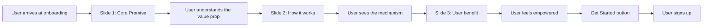

# Onboarding Tagline Integration Plan

## Executive Summary
This plan outlines the strategy to integrate Renvo's core tagline "Never get blindsided by a recurring charge again" throughout the onboarding experience, transforming the current generic tracking-focused messaging into a compelling narrative about proactive protection from unexpected charges.

---

## Current State Analysis

### Existing Onboarding Flow
The onboarding currently consists of 3 slides with the following structure:

**Slide 1:** Calendar icon
- Title: "Track your recurring items effortlessly"
- Subtitle: "Never forget a due date"

**Slide 2:** Bar chart icon  
- Title: "See where your money goes"
- Subtitle: "See all your recurring items in one place"

**Slide 3:** Wallet icon
- Title: "Stay in control"
- Subtitle: "Easily manage your recurring items and get reminders"

### Current Messaging Issues
1. **Generic positioning**: Focuses on "tracking" and "managing" - features that every subscription app offers
2. **Weak value proposition**: Doesn't address the core pain point of being surprised by charges
3. **Feature-focused**: Emphasizes what the app does rather than the problem it solves
4. **Missing emotional connection**: Doesn't tap into the user's fear/frustration of unexpected charges
5. **No consistency with login**: The powerful tagline on [`LoginScreen.tsx:292`](screens/LoginScreen.tsx:292) isn't carried through to onboarding

---

## Proposed Changes

### Strategy Overview
Transform the onboarding into a narrative arc:
1. **Hero Statement** (Slide 1): Lead with the tagline to establish the core value proposition
2. **Visibility Benefit** (Slide 2): Show how seeing everything prevents surprises
3. **Proactive Control** (Slide 3): Emphasize staying ahead of charges to maintain peace of mind

### Visual Consistency
- Maintain existing icons and animation structure
- Preserve the smooth slide transitions and animations
- Keep the gradient background and visual polish
- Icons should support the new messaging (may need evaluation)

---

## Detailed Slide-by-Slide Changes

### Slide 1: Hero Statement
**Icon:** `calendar-outline` (consider changing to `shield-checkmark-outline` to emphasize protection)

**BEFORE:**
```
Title: "Track your recurring items effortlessly"
Subtitle: "Never forget a due date"
```

**AFTER:**
```
Title: "Never get blindsided by a recurring charge again"
Subtitle: "Track every subscription, bill, and renewal in one place"
```

**Rationale:**
- Leads with the tagline to establish immediate emotional connection
- Addresses the user's pain point directly (being blindsided)
- Subtitle provides the practical solution (centralized tracking)
- Sets the tone for the entire onboarding experience
- Creates consistency with the login screen messaging

**Alternative Option:**
```
Title: "Never get blindsided again"
Subtitle: "Track every recurring charge before it hits your account"
```

---

### Slide 2: Visibility Prevents Surprises
**Icon:** `bar-chart-outline` (good as-is - represents insight/visibility)

**BEFORE:**
```
Title: "See where your money goes"
Subtitle: "See all your recurring items in one place"
```

**AFTER:**
```
Title: "See every charge before it happens"
Subtitle: "Get full visibility into upcoming renewals and billing dates"
```

**Rationale:**
- Emphasizes the proactive nature (BEFORE charges happen)
- "Full visibility" reinforces the prevention of surprises
- Focuses on the outcome (avoiding blindsides) rather than the feature (viewing items)
- Natural progression from Slide 1's promise

**Alternative Option:**
```
Title: "Know what's coming, always"
Subtitle: "Complete visibility into every upcoming charge and renewal"
```

---

### Slide 3: Proactive Control
**Icon:** `wallet-outline` (consider `notifications-outline` or `timer-outline` to emphasize alerts)

**BEFORE:**
```
Title: "Stay in control"
Subtitle: "Easily manage your recurring items and get reminders"
```

**AFTER:**
```
Title: "Stay ahead of every charge"
Subtitle: "Get timely reminders so you're never caught off guard"
```

**Rationale:**
- "Stay ahead" emphasizes proactive rather than reactive management
- "Never caught off guard" directly connects to the anti-blindside theme
- "Timely reminders" promises the mechanism that prevents surprises
- Completes the narrative arc: Promise → Visibility → Action

**Alternative Option:**
```
Title: "Take control before charges hit"
Subtitle: "Smart reminders help you review, cancel, or prepare for renewals"
```

---

## Content Theme Comparison

### Current Theme: Generic Tracking
```
Track → See → Manage
(Features-focused, passive, commodity)
```

### New Theme: Proactive Protection  
```
Never be blindsided → See before it happens → Stay ahead
(Value-focused, active, unique positioning)
```

---

## User Journey Visualization



### Emotional Journey
- **Slide 1**: Recognition ("Yes, I hate being blindsided!")
- **Slide 2**: Understanding ("I can see everything before it happens")  
- **Slide 3**: Confidence ("I'm in control and protected")

---

## Implementation Recommendations

### Code Changes Required
All changes will be made in [`screens/OnboardingScreen.tsx`](screens/OnboardingScreen.tsx) in the `slides` array (lines 32-54):

1. Update `slides[0]` (id: '1'):
   - Line 37: Change `title` to new Slide 1 title
   - Line 38: Change `subtitle` to new Slide 1 subtitle
   - Consider: Line 35: Change `icon` from 'calendar-outline' to 'shield-checkmark-outline'

2. Update `slides[1]` (id: '2'):
   - Line 44: Change `title` to new Slide 2 title
   - Line 45: Change `subtitle` to new Slide 2 subtitle

3. Update `slides[2]` (id: '3'):
   - Line 51: Change `title` to new Slide 3 title
   - Line 52: Change `subtitle` to new Slide 3 subtitle
   - Consider: Line 49: Change `icon` from 'wallet-outline' to 'notifications-outline'

### Icon Evaluation
Current icons may need updating to better support new messaging:
- **Slide 1**: Consider `shield-checkmark-outline` or `eye-outline` (protection/awareness)
- **Slide 2**: Keep `bar-chart-outline` (works well for visibility)
- **Slide 3**: Consider `notifications-outline` or `alarm-outline` (proactive alerts)

### Testing Checklist
- [ ] Verify text renders correctly on all screen sizes
- [ ] Check text doesn't overflow on smaller devices
- [ ] Ensure animations still work smoothly
- [ ] Validate color contrast for accessibility
- [ ] Test on both light and dark themes
- [ ] Confirm messaging resonates with test users

---

## Alternative Messaging Options

### Option Set A: Direct & Bold
```
Slide 1: "Never get blindsided by a recurring charge again"
Slide 2: "See every charge before it happens"  
Slide 3: "Stay ahead of every charge"
```

### Option Set B: Softer & Supportive
```
Slide 1: "Never miss a recurring charge again"
Slide 2: "Know what's coming, always"
Slide 3: "Take control of your subscriptions"
```

### Option Set C: Problem-Focused
```
Slide 1: "Stop unexpected charges from catching you off guard"
Slide 2: "See all your renewals before they charge"
Slide 3: "Cancel, adjust, or prepare with advance notice"
```

**Recommendation**: Use Option Set A for maximum impact and alignment with the tagline.

---

## Brand Voice Guidelines

### Key Principles for New Messaging
1. **Direct**: Don't soften the pain point - users HATE being blindsided
2. **Empowering**: Position user as in control, not the victim
3. **Proactive**: Emphasize "before" and "ahead" rather than "after" or "when"
4. **Clear**: No jargon or clever wordplay - simple, powerful language
5. **Consistent**: Every slide reinforces the anti-blindside theme

### Words to Use
- Blindsided, caught off guard, surprised (pain points)
- Before, ahead, advance, upcoming (proactive)
- See, know, visibility, transparent (awareness)
- Never, always, every (confidence)

### Words to Avoid
- Track, manage, organize (commodity features)
- Easy, simple, effortless (generic benefits)
- Later, eventually, whenever (passive timing)

---

## Success Metrics

### Qualitative
- Users understand the core value proposition immediately
- Messaging creates emotional connection with the problem
- Onboarding feels cohesive with login screen experience
- Users feel empowered rather than overwhelmed

### Quantitative (Post-Launch)
- Onboarding completion rate
- Time spent on each slide
- Sign-up conversion rate after onboarding
- User feedback on messaging clarity

---

## Next Steps

1. **Review & Approve**: Discuss this plan and select preferred messaging options
2. **Icon Selection**: Decide if icon changes are needed for Slides 1 & 3
3. **Implementation**: Switch to Code mode to implement approved changes
4. **Testing**: Verify changes on multiple devices and themes
5. **User Testing**: Validate messaging resonates with target users
6. **Monitor**: Track metrics post-launch to measure impact

---

## Risk Considerations

### Potential Concerns
1. **Length**: "Never get blindsided by a recurring charge again" is longer than current title
   - **Mitigation**: Test on small screens; may need line break optimization
   
2. **Tone**: More direct language might feel aggressive to some users
   - **Mitigation**: Subtitle provides softer context; overall empowering tone
   
3. **Brand Consistency**: Changing messaging requires alignment with other marketing
   - **Mitigation**: This aligns with login tagline; should drive consistency

### Technical Risks
- Minimal - only text changes in a well-established component
- No structural changes to onboarding flow
- No API or backend dependencies

---

## Appendix: Current vs. Proposed Summary

| Slide | Current Focus | Proposed Focus | Key Shift |
|-------|--------------|----------------|-----------|
| 1 | Track effortlessly | Never be blindsided | Feature → Value |
| 2 | See where money goes | See charges before they happen | Past → Future |
| 3 | Manage & get reminders | Stay ahead of charges | Reactive → Proactive |

**Overall Transformation**: From generic subscription tracker to protective financial guardian that prevents surprises.