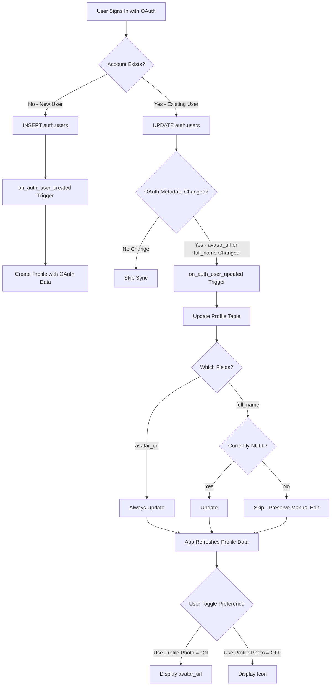

# OAuth Profile Sync Design Specification

## Problem Statement

When an existing email/password user signs in with Google OAuth, Supabase merges/links their account by **updating** the `auth.users` record. However, the current [`on_auth_user_created`](../database/supabase_migration.sql:160) trigger only fires on **INSERT** events, missing OAuth metadata like `avatar_url` that should be synced to the profiles table.

## Solution Overview

**Approach**: Hybrid solution combining database-level triggers with application-level refresh
- **Database**: Add UPDATE trigger with smart conditional logic
- **Application**: Explicit profile refresh after OAuth sign-in + preserved toggle preference
- **Hybrid**: Always sync avatar_url data, but user controls display via app toggle
- **Complete**: Include backfill migration for existing users

## Design Decisions

### 1. Update Policy (Hybrid Approach)
- **avatar_url**: ALWAYS update when OAuth provides new value (latest OAuth wins)
- **full_name**: Only update if currently NULL (respect manual edits)
- **Rationale**: Decouple data sync from display preference
  - Profile table = source of truth for OAuth data
  - App toggle (@use_profile_photo) = user preference for display
  - User can switch between OAuth photo and icon anytime

### 2. Trigger Conditions (Performance Optimized)
Only fire when:
- OAuth metadata exists in `raw_user_meta_data`
- OAuth metadata has actually changed (prevents unnecessary writes)
- Specifically check: avatar_url or full_name changed

### 3. Application-Level Sync (User Experience)
After successful OAuth sign-in in [`AuthContext.tsx`](../contexts/AuthContext.tsx:910-1055):
1. Database trigger fires automatically (background sync)
2. App explicitly refreshes profile data (ensures UI updates immediately)
3. User toggle preference (@use_profile_photo) preserved (no auto-switch)

### 4. Backfill Strategy (Data Integrity)
One-time migration to update existing users who:
- Have OAuth data in `auth.users.raw_user_meta_data`
- Missing avatar_url or full_name that should be synced
- Signed up before this fix was deployed

## Architecture Flow



## Implementation Details

### Database Changes

#### File: `database/oauth_profile_sync_migration.sql`

**Purpose**: Add UPDATE trigger to sync OAuth metadata to profiles table

**Components**:

1. **Function**: `handle_auth_user_update()`
   - Checks if OAuth metadata changed
   - Updates avatar_url (always if present)
   - Updates full_name (only if NULL)
   - Returns NEW to complete the trigger

2. **Trigger**: `on_auth_user_updated`
   - Fires AFTER UPDATE on `auth.users`
   - Only for each row
   - Calls `handle_auth_user_update()`

**SQL Implementation**:
```sql
-- Function to sync OAuth metadata on auth.users UPDATE
CREATE OR REPLACE FUNCTION public.handle_auth_user_update()
RETURNS TRIGGER AS $$
DECLARE
  new_avatar_url TEXT;
  new_full_name TEXT;
  profile_exists BOOLEAN;
BEGIN
  -- Extract OAuth metadata from updated user
  new_avatar_url := NEW.raw_user_meta_data->>'avatar_url';
  new_full_name := COALESCE(
    NEW.raw_user_meta_data->>'full_name',
    NEW.raw_user_meta_data->>'name'
  );

  -- Check if this is an OAuth update with metadata
  IF new_avatar_url IS NULL AND new_full_name IS NULL THEN
    -- No OAuth metadata to sync
    RETURN NEW;
  END IF;

  -- Check if profile exists
  SELECT EXISTS(
    SELECT 1 FROM public.profiles WHERE id = NEW.id
  ) INTO profile_exists;

  IF NOT profile_exists THEN
    -- Profile doesn't exist, skip (should not happen, but defensive)
    RETURN NEW;
  END IF;

  -- Update profile with OAuth metadata
  UPDATE public.profiles
  SET
    -- Always update avatar_url if present (latest OAuth wins)
    avatar_url = CASE
      WHEN new_avatar_url IS NOT NULL THEN new_avatar_url
      ELSE avatar_url
    END,
    -- Only update full_name if currently NULL (preserve manual edits)
    full_name = CASE
      WHEN new_full_name IS NOT NULL AND full_name IS NULL THEN new_full_name
      ELSE full_name
    END,
    updated_at = NOW()
  WHERE id = NEW.id
    -- Only update if something actually changed
    AND (
      (new_avatar_url IS NOT NULL AND (avatar_url IS NULL OR avatar_url != new_avatar_url))
      OR (new_full_name IS NOT NULL AND full_name IS NULL)
    );

  RETURN NEW;
END;
$$ LANGUAGE plpgsql SECURITY DEFINER;

-- Trigger for auth.users UPDATE events
CREATE TRIGGER on_auth_user_updated
  AFTER UPDATE ON auth.users
  FOR EACH ROW
  EXECUTE FUNCTION public.handle_auth_user_update();
```

#### File: `database/oauth_profile_backfill.sql`

**Purpose**: One-time backfill for existing users with OAuth data

**SQL Implementation**:
```sql
-- Backfill OAuth metadata for existing users
-- This updates profiles for users who have OAuth data but missing avatar_url/full_name

DO $$
DECLARE
  updated_count INTEGER := 0;
BEGIN
  -- Update profiles with OAuth data from auth.users
  WITH oauth_users AS (
    SELECT
      id,
      raw_user_meta_data->>'avatar_url' as oauth_avatar_url,
      COALESCE(
        raw_user_meta_data->>'full_name',
        raw_user_meta_data->>'name'
      ) as oauth_full_name
    FROM auth.users
    WHERE raw_user_meta_data IS NOT NULL
      AND (
        raw_user_meta_data->>'avatar_url' IS NOT NULL
        OR raw_user_meta_data->>'full_name' IS NOT NULL
        OR raw_user_meta_data->>'name' IS NOT NULL
      )
  )
  UPDATE public.profiles p
  SET
    avatar_url = CASE
      WHEN o.oauth_avatar_url IS NOT NULL THEN o.oauth_avatar_url
      ELSE p.avatar_url
    END,
    full_name = CASE
      WHEN o.oauth_full_name IS NOT NULL AND p.full_name IS NULL THEN o.oauth_full_name
      ELSE p.full_name
    END,
    updated_at = NOW()
  FROM oauth_users o
  WHERE p.id = o.id
    AND (
      (o.oauth_avatar_url IS NOT NULL AND (p.avatar_url IS NULL OR p.avatar_url != o.oauth_avatar_url))
      OR (o.oauth_full_name IS NOT NULL AND p.full_name IS NULL)
    );

  GET DIAGNOSTICS updated_count = ROW_COUNT;
  RAISE NOTICE 'Backfilled OAuth data for % profile(s)', updated_count;
END $$;
```

### Application Changes

#### File: `contexts/AuthContext.tsx`

**Changes Required**:

1. **After Google OAuth Success** (line ~1027):
```typescript
// Existing code
if (__DEV__) {
  console.log('[OAuth] Session set successfully');
}

// ADD: Refresh profile data to get updated avatar_url
try {
  const { data: profile } = await supabase
    .from('profiles')
    .select('id, email, full_name, avatar_url')
    .eq('id', sessionData.session.user.id)
    .single();
  
  if (__DEV__ && profile) {
    console.log('[OAuth] Profile refreshed:', {
      hasAvatar: !!profile.avatar_url,
      avatarUrl: profile.avatar_url,
      fullName: profile.full_name
    });
  }
} catch (err) {
  // Non-critical - profile will be loaded on next screen anyway
  if (__DEV__) {
    console.warn('[OAuth] Failed to refresh profile:', err);
  }
}

// Trigger migration after successful OAuth sign-in
performMigration();
```

2. **After Apple OAuth Success** (line ~1174):
```typescript
// Same addition as Google OAuth above
```

**Rationale**: Explicitly refresh ensures UI has latest avatar_url immediately after OAuth sign-in, even if trigger has slight delay.

#### File: `screens/SettingsScreen.tsx`

**No Changes Required**:
- Existing toggle logic is perfect (@use_profile_photo)
- User can toggle between OAuth photo and icon anytime
- Data sync is now independent of display preference

## Edge Cases Handled

### 1. User Manually Sets Icon, Then OAuth Signs In
**Before Fix**: avatar_url not synced, user stuck with icon
**After Fix**: 
- avatar_url synced to profile table
- User's toggle preference preserved (still shows icon)
- User can toggle to OAuth photo anytime in Settings

### 2. User Changes Full Name Manually
**Behavior**: 
- Manual edit preserved (full_name only updates if NULL)
- OAuth full_name ignored on subsequent sign-ins
- User control respected

### 3. User Switches OAuth Providers
**Behavior**:
- Latest OAuth provider's avatar_url wins
- Profile table always has current OAuth photo
- User can still toggle to icon if preferred

### 4. Password Change or Email Update
**Behavior**:
- Trigger checks if OAuth metadata changed
- If no change, trigger returns immediately (no DB write)
- Efficient - no unnecessary updates

### 5. Profile Photo Load Errors
**Existing Handling** (already in SettingsScreen.tsx:771):
```typescript
onError={(e) => {
  console.error('Profile photo load error:', {
    url: profileData?.avatar_url,
    error: e.nativeEvent.error,
  });
  setImageLoadError(true);
  setIsImageLoading(false);
}}
```
**Behavior**: Gracefully falls back to icon on load failure

## Migration Strategy

### Step 1: Apply Database Migration
```bash
# In Supabase SQL Editor
# Run: database/oauth_profile_sync_migration.sql
```

**Expected Output**: 
- Function created: `handle_auth_user_update()`
- Trigger created: `on_auth_user_updated`

### Step 2: Run Backfill (Optional but Recommended)
```bash
# In Supabase SQL Editor
# Run: database/oauth_profile_backfill.sql
```

**Expected Output**: 
- Notice: "Backfilled OAuth data for N profile(s)"
- N = number of users with OAuth data that was missing

### Step 3: Update Application Code
1. Modify [`AuthContext.tsx`](../contexts/AuthContext.tsx)
2. Add profile refresh after OAuth sign-in
3. Deploy application

### Step 4: Test
See Testing Strategy section below

### Rollback Plan

If issues occur, rollback is simple:

```sql
-- Remove trigger
DROP TRIGGER IF EXISTS on_auth_user_updated ON auth.users;

-- Remove function
DROP FUNCTION IF EXISTS public.handle_auth_user_update();
```

**Note**: This only stops future syncs. Already-synced data remains (safe).

## Testing Strategy

### Test Case 1: New OAuth User
**Steps**:
1. New user signs up with Google OAuth
2. Verify profile created with avatar_url
3. Check SettingsScreen shows OAuth photo

**Expected**: Works (existing INSERT trigger)

### Test Case 2: Existing Email User + OAuth Sign-In
**Steps**:
1. Create user with email/password
2. Sign out
3. Sign in with Google OAuth (same email)
4. Check profiles table for avatar_url

**Expected**: avatar_url updated from OAuth metadata

### Test Case 3: User Toggle Preference
**Steps**:
1. User with OAuth photo
2. Toggle "Profile Photo" OFF in Settings
3. Verify icon displayed
4. Sign out and sign in with OAuth again
5. Verify toggle still OFF, icon still displayed

**Expected**: Toggle preference preserved across sessions

### Test Case 4: Avatar URL Changes
**Steps**:
1. User signs in with Google OAuth
2. User changes their Google profile photo
3. User signs in again with OAuth
4. Check if avatar_url updated

**Expected**: New avatar_url synced to profile

### Test Case 5: Performance
**Steps**:
1. User changes password (no OAuth metadata change)
2. Monitor database logs
3. Verify trigger returns early (no profile UPDATE)

**Expected**: Efficient - no unnecessary writes

### Test Case 6: Backfill Migration
**Steps**:
1. Identify users with OAuth data but NULL avatar_url
2. Run backfill script
3. Verify profiles updated
4. Check count matches expectation

**Expected**: All eligible profiles updated

## Performance Considerations

### Trigger Efficiency
- **Early Return**: Trigger checks conditions before UPDATE
- **Conditional UPDATE**: Only updates if values actually changed
- **Index Usage**: Uses primary key (id) for lookups

### Database Impact
- **Minimal**: Only fires on auth.users UPDATE (rare event)
- **Fast**: Single-row updates with indexed lookups
- **No Cascade**: No downstream triggers affected

### Application Impact
- **Async**: Profile refresh is non-blocking
- **Cached**: Settings screen already loads profile data
- **Graceful**: Errors don't block OAuth flow

## Security Considerations

### Function Security
- **SECURITY DEFINER**: Function runs with creator privileges
- **Safe**: Only updates user's own profile (WHERE id = NEW.id)
- **Read-Only Source**: Reads from auth.users (trusted source)

### Data Validation
- **NULL Checks**: Validates OAuth metadata exists
- **Profile Existence**: Checks profile exists before UPDATE
- **Conditional Logic**: Only updates when appropriate

## Monitoring & Debugging

### Database Logs
Monitor for:
```sql
-- Check trigger execution
SELECT * FROM pg_stat_user_functions 
WHERE funcname = 'handle_auth_user_update';

-- Check recent profile updates
SELECT id, avatar_url, full_name, updated_at
FROM public.profiles
WHERE updated_at > NOW() - INTERVAL '1 hour'
ORDER BY updated_at DESC;
```

### Application Logs
Monitor for:
```typescript
// AuthContext OAuth success
'[OAuth] Session set successfully'
'[OAuth] Profile refreshed: { hasAvatar: true, ... }'

// Settings screen
'[Settings] Profile loaded: { hasAvatar: true, ... }'
```

### Error Scenarios
Watch for:
- Profile refresh failures (non-critical, logged)
- Image load errors (handled gracefully)
- Trigger execution errors (check Supabase logs)

## Future Enhancements

### Potential Improvements
1. **Multi-provider support**: Track which OAuth provider provided avatar
2. **Avatar history**: Keep history of avatar changes
3. **Manual upload**: Allow users to upload custom avatars
4. **Sync frequency**: Add rate limiting if users spam OAuth sign-ins

### Not Recommended
- ❌ Auto-toggle preference on OAuth sign-in (breaks user agency)
- ❌ Overwrite manual full_name edits (disrespectful to user)
- ❌ Sync all metadata fields (privacy concerns)

## Documentation Updates

### Files to Update
1. ✅ This design doc (OAUTH_PROFILE_SYNC_DESIGN.md)
2. TODO: Update OAUTH_SETUP_GUIDE.md with trigger info
3. TODO: Update README.md if database setup changed
4. TODO: Add troubleshooting section to docs

## Success Criteria

### Implementation Complete When:
- ✅ Database migration file created and tested
- ✅ Backfill migration created and tested
- ✅ AuthContext updated with profile refresh
- ✅ All test cases pass
- ✅ No regressions in existing OAuth flow
- ✅ Documentation updated

### User Experience Success:
- User signs in with OAuth → sees their profile photo
- User can toggle between photo and icon anytime
- User's manual edits to name are preserved
- System performs efficiently under load

## Conclusion

This hybrid approach provides the best of both worlds:
- **Automatic**: OAuth data syncs automatically via triggers
- **User Control**: Toggle preference preserved in app
- **Performant**: Smart conditions prevent unnecessary writes
- **Maintainable**: Clear separation between data sync and display logic
- **Complete**: Includes backfill for existing users

The solution is production-ready and can be deployed incrementally without breaking existing functionality.