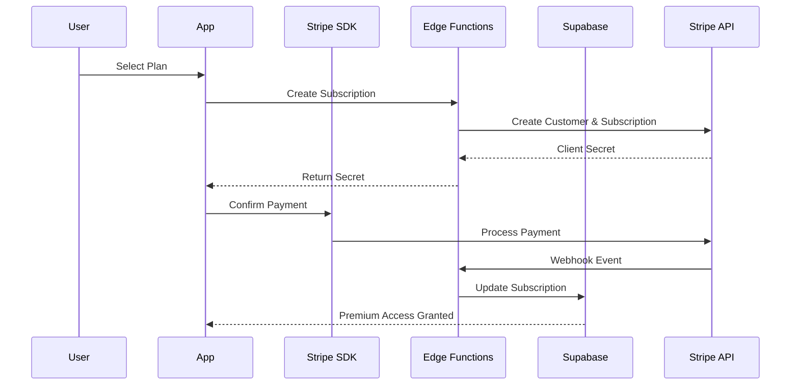

# Apple In-App Purchase (IAP) Implementation Plan

## Document Information
- **Version**: 1.0.0
- **Created**: 2025-12-05
- **Status**: Planning
- **Purpose**: Complete migration plan from Stripe to Apple IAP for iOS subscriptions

---

## Executive Summary

This document outlines a comprehensive, phased approach to migrating Renvo's subscription system from Stripe to Apple In-App Purchase (IAP) to comply with Apple's App Store requirements. The migration involves implementing StoreKit 2, server-side receipt validation, App Store Server Notifications V2, and a migration strategy for existing Stripe subscribers.

### Key Objectives
- ✅ Comply with Apple's IAP requirements for in-app subscriptions
- ✅ Maintain seamless user experience during migration
- ✅ Implement robust server-side validation for security
- ✅ Preserve existing subscriber data and access
- ✅ Support subscription restoration across devices

### Migration Timeline
- **Phase 1-2**: 2-3 weeks (Research, Planning, Setup)
- **Phase 3-4**: 3-4 weeks (Core Implementation, Backend)
- **Phase 5**: 2 weeks (Migration Strategy)
- **Phase 6-7**: 2-3 weeks (Testing, Deployment)
- **Total Estimated Duration**: 9-12 weeks

---

## Table of Contents

1. [Current Architecture Analysis](#current-architecture-analysis)
2. [Phase 1: Research & Planning](#phase-1-research--planning)
3. [Phase 2: Development Infrastructure](#phase-2-development-infrastructure)
4. [Phase 3: Core IAP Implementation](#phase-3-core-iap-implementation)
5. [Phase 4: Backend Integration](#phase-4-backend-integration)
6. [Phase 5: Migration Strategy](#phase-5-migration-strategy)
7. [Phase 6: Testing & Validation](#phase-6-testing--validation)
8. [Phase 7: Deployment & Monitoring](#phase-7-deployment--monitoring)
9. [Critical Considerations](#critical-considerations)
10. [Risk Assessment & Mitigation](#risk-assessment--mitigation)
11. [Appendices](#appendices)

---

## Current Architecture Analysis

### Existing Stripe Implementation

**Frontend Components:**
- [`config/stripe.ts`](../config/stripe.ts) - Stripe configuration and pricing
- [`components/PaywallModal.tsx`](../components/PaywallModal.tsx) - Subscription upgrade UI
- [`screens/PaymentScreen.tsx`](../screens/PaymentScreen.tsx) - Payment processing screen
- Stripe React Native SDK integration

**Backend Components:**
- [`supabase/functions/create-subscription/`](../supabase/functions/create-subscription/index.ts) - Subscription creation
- [`supabase/functions/stripe-webhook/`](../supabase/functions/stripe-webhook/index.ts) - Webhook event handling
- Stripe Edge Functions for payment operations

**Database Schema:**
```sql
user_subscriptions
├── stripe_customer_id
├── stripe_subscription_id
├── stripe_price_id
├── tier_id (free/premium_tier)
├── billing_cycle (monthly/annual)
└── status (active/canceled/past_due)

payment_transactions
├── stripe_payment_intent_id
├── stripe_invoice_id
└── stripe_charge_id
```

### Current Payment Flow



---

## Phase 1: Research & Planning

### Duration: 1-2 weeks

### Objectives
- Understand Apple IAP requirements and guidelines
- Research StoreKit 2 vs StoreKit 1 decision
- Analyze App Store Connect setup requirements
- Select React Native IAP library
- Document technical architecture

### Tasks

#### 1.1 Apple IAP Requirements Research

**Action Items:**
- [ ] Read Apple's [In-App Purchase Programming Guide](https://developer.apple.com/in-app-purchase/)
- [ ] Study [App Store Review Guidelines Section 3.1](https://developer.apple.com/app-store/review/guidelines/#in-app-purchase)
- [ ] Review [StoreKit 2 Documentation](https://developer.apple.com/documentation/storekit)
- [ ] Understand [App Store Server API](https://developer.apple.com/documentation/appstoreserverapi)
- [ ] Research [Server Notifications V2](https://developer.apple.com/documentation/appstoreservernotifications)

**Key Requirements to Document:**
- Subscription must use IAP for digital content
- External payment methods prohibited for digital goods
- Pricing must use App Store tiers
- Receipt validation requirements
- Subscription management requirements
- Restore purchases functionality mandatory

**Deliverable:** Document `docs/APPLE_IAP_REQUIREMENTS.md`

#### 1.2 Library Selection

**Options:**

**Option A: react-native-iap** ✅ RECOMMENDED
- **Pros:**
  - Mature library (417+ code examples)
  - Active maintenance
  - Supports both iOS and Android
  - StoreKit 2 support
  - Strong community support
- **Cons:**
  - Requires native module linking
  - Learning curve for API

**Option B: expo-iap**
- **Pros:**
  - Expo ecosystem integration
  - Open IAP spec compliance
  - 1042+ code examples
- **Cons:**
  - Newer library
  - May require Expo-specific setup

**Decision:** Use [`react-native-iap`](https://github.com/hyochan/react-native-iap) for maximum flexibility and maturity.

**Deliverable:** Technical decision document

#### 1.3 StoreKit Version Decision

**StoreKit 2 vs StoreKit 1:**

| Feature | StoreKit 1 | StoreKit 2 |
|---------|-----------|------------|
| **API Style** | Delegate-based | Modern async/await |
| **Transaction Format** | Receipt-based | JWS (JSON Web Signature) |
| **Server Validation** | verifyReceipt endpoint (deprecated) | App Store Server API |
| **iOS Version** | iOS 3+ | iOS 15+ |
| **Maintenance** | Legacy | Current |

**Decision:** Use **StoreKit 2** with fallback to StoreKit 1 for iOS 14 and below.

**Rationale:**
- Modern API design
- Better security with JWS
- Future-proof implementation
- App Store Server API integration

**Deliverable:** Architecture decision record

#### 1.4 Pricing Strategy

**Stripe Pricing:**
- Monthly: $4.99/month
- Yearly: $39.00/year

**App Store Pricing Tiers:**
- Research equivalent App Store pricing tiers
- Consider App Store's 30% commission
- Monthly: Target Tier X ($4.99)
- Yearly: Target Tier Y ($39.99)

**Action Items:**
- [ ] Map Stripe prices to App Store tiers
- [ ] Calculate revenue impact with 30% commission
- [ ] Plan pricing transition strategy
- [ ] Update financial projections

**Deliverable:** Pricing comparison spreadsheet

### Dependencies
- None (initial phase)

### Estimated Effort
- **Research**: 3-4 days
- **Documentation**: 2-3 days
- **Total**: 1 week

### Risks & Mitigation
- **Risk**: Incomplete understanding of requirements
  - **Mitigation**: Thorough documentation review, consult Apple Developer Support

---

## Phase 2: Development Infrastructure

### Duration: 1-2 weeks

### Objectives
- Set up App Store Connect with IAP products
- Configure development environment
- Integrate react-native-iap library
- Set up sandbox testing environment

### Tasks

#### 2.1 App Store Connect Setup

**Prerequisites:**
- Active Apple Developer Account ($99/year)
- App created in App Store Connect
- Bundle ID configured
- Team settings configured

**Action Items:**

**Step 1: Create IAP Products**
```
App Store Connect → Your App → Features → In-App Purchases
```

1. **Monthly Subscription**
   - Type: Auto-Renewable Subscription
   - Reference Name: Premium Monthly
   - Product ID: `com.renvo.premium.monthly`
   - Subscription Group: Premium Subscriptions
   - Price: Tier X ($4.99)
   - Subscription Duration: 1 month

2. **Yearly Subscription**
   - Type: Auto-Renewable Subscription
   - Reference Name: Premium Yearly
   - Product ID: `com.renvo.premium.yearly`
   - Subscription Group: Premium Subscriptions
   - Price: Tier Y ($39.99)
   - Subscription Duration: 1 year

**Step 2: Configure Subscription Group**
- Name: Premium Subscriptions
- Set upgrade/downgrade paths
- Configure subscription levels

**Step 3: Localizations**
- Add display names for all supported locales
- Add descriptions
- Review subscription information

**Step 4: Tax Category**
- Select appropriate tax category
- Configure per-country tax settings if needed

**Deliverable:** App Store Connect configuration documentation with screenshots

#### 2.2 Sandbox Testing Setup

**Action Items:**
- [ ] Create sandbox test accounts in App Store Connect
- [ ] Document sandbox credentials securely
- [ ] Configure test devices
- [ ] Set up StoreKit Configuration file for Xcode testing

**Sandbox Test Accounts:**
Create at least 3 test accounts:
1. New user (never subscribed)
2. Active subscriber
3. Canceled subscriber

**StoreKit Configuration File:**
```swift
// StoreKit Configuration in Xcode
// File → New → File → StoreKit Configuration File
// Add products matching App Store Connect IDs
```

**Deliverable:** Sandbox testing guide document

#### 2.3 Library Integration

**Step 1: Install react-native-iap**

```bash
npm install react-native-iap
```

**Step 2: iOS Native Setup**

```bash
cd ios && pod install && cd ..
```

**Step 3: Configure Info.plist**

```xml
<key>SKAdNetworkItems</key>
<array>
  <!-- Add required SKAdNetwork IDs if needed -->
</array>
```

**Step 4: Add Capability in Xcode**
- Open `ios/Renvo.xcworkspace`
- Select target → Signing & Capabilities
- Add "In-App Purchase" capability

**Step 5: Create IAP Configuration**

Create [`config/appleIAP.ts`](../config/appleIAP.ts):

```typescript
/**
 * Apple In-App Purchase Configuration
 */

export const IAP_PRODUCTS = {
  monthly: {
    productId: 'com.renvo.premium.monthly',
    amount: 4.99,
    interval: 'month' as const,
    displayName: 'Monthly Premium',
    description: 'Unlimited recurring items, billed monthly',
    features: [
      'Unlimited recurring item tracking',
      'Advanced analytics',
      'Export capabilities',
      'Priority support',
    ],
  },
  yearly: {
    productId: 'com.renvo.premium.yearly',
    amount: 39.99,
    interval: 'year' as const,
    displayName: 'Yearly Premium',
    description: 'Unlimited recurring items, billed annually',
    savingsText: 'Save 17%',
    features: [
      'Unlimited recurring item tracking',
      'Advanced analytics',
      'Export capabilities',
      'Priority support',
      'Best value - Save 17%',
    ],
  },
};

export const IAP_PRODUCT_IDS = [
  IAP_PRODUCTS.monthly.productId,
  IAP_PRODUCTS.yearly.productId,
];

// Subscription group ID from App Store Connect
export const SUBSCRIPTION_GROUP_ID = 'premium_subscriptions';
```

**Deliverable:** Working IAP library integration with product configuration

#### 2.4 Development Environment

**Environment Variables:**

Add to `.env`:
```bash
# Apple IAP Configuration
EXPO_PUBLIC_IAP_SHARED_SECRET=your_shared_secret_here
EXPO_PUBLIC_IAP_ENVIRONMENT=sandbox # or production

# App Store Server API (for backend)
APP_STORE_CONNECT_KEY_ID=your_key_id
APP_STORE_CONNECT_ISSUER_ID=your_issuer_id
APP_STORE_CONNECT_PRIVATE_KEY_PATH=/path/to/key.p8
```

**Deliverable:** Environment configuration guide

### Dependencies
- Apple Developer Account active
- App in App Store Connect
- Phase 1 research completed

### Estimated Effort
- **App Store Connect**: 1-2 days
- **Library Integration**: 1-2 days
- **Sandbox Setup**: 1 day
- **Total**: 1 week

### Risks & Mitigation
- **Risk**: App Store Connect configuration errors
  - **Mitigation**: Follow Apple's setup guides carefully, maintain detailed documentation
- **Risk**: Native module integration issues
  - **Mitigation**: Test on clean Expo/React Native setup first

---

## Phase 3: Core IAP Implementation

### Duration: 2-3 weeks

### Objectives
- Implement purchase flow using react-native-iap
- Create IAP service layer
- Handle subscription lifecycle events
- Implement purchase restoration

### Tasks

#### 3.1 IAP Service Layer

Create [`services/appleIAPService.ts`](../services/appleIAPService.ts):

```typescript
/**
 * Apple IAP Service
 * Handles all Apple In-App Purchase operations
 */

import {
  initConnection,
  endConnection,
  getProducts,
  requestPurchase,
  finishTransaction,
  purchaseUpdatedListener,
  purchaseErrorListener,
  getAvailablePurchases,
  validateReceiptIos,
  type Product,
  type Purchase,
  type PurchaseError,
  type SubscriptionPurchase,
} from 'react-native-iap';
import { Platform } from 'react-native';
import { IAP_PRODUCT_IDS } from '../config/appleIAP';
import { supabase } from '../config/supabase';

class AppleIAPService {
  private purchaseUpdateSubscription: any = null;
  private purchaseErrorSubscription: any = null;
  private isInitialized = false;

  /**
   * Initialize IAP connection
   */
  async initialize(): Promise<void> {
    if (this.isInitialized) {
      console.log('IAP already initialized');
      return;
    }

    try {
      console.log('Initializing IAP connection...');
      await initConnection();
      this.isInitialized = true;
      console.log('✅ IAP connection initialized');

      // Set up purchase listeners
      this.setupPurchaseListeners();
    } catch (error) {
      console.error('❌ Failed to initialize IAP:', error);
      throw error;
    }
  }

  /**
   * Set up purchase event listeners
   */
  private setupPurchaseListeners(): void {
    // Listen for purchase updates
    this.purchaseUpdateSubscription = purchaseUpdatedListener(
      async (purchase: Purchase | SubscriptionPurchase) => {
        console.log('📦 Purchase update received:', purchase);
        await this.handlePurchaseUpdate(purchase);
      }
    );

    // Listen for purchase errors
    this.purchaseErrorSubscription = purchaseErrorListener(
      (error: PurchaseError) => {
        console.error('❌ Purchase error:', error);
        this.handlePurchaseError(error);
      }
    );
  }

  /**
   * Get available products from App Store
   */
  async getProducts(): Promise<Product[]> {
    try {
      console.log('Fetching products:', IAP_PRODUCT_IDS);
      const products = await getProducts({ skus: IAP_PRODUCT_IDS });
      console.log('✅ Products fetched:', products.length);
      return products;
    } catch (error) {
      console.error('❌ Failed to fetch products:', error);
      throw error;
    }
  }

  /**
   * Purchase a subscription
   */
  async purchaseSubscription(productId: string): Promise<void> {
    try {
      console.log('🛒 Initiating purchase for:', productId);
      
      // Request purchase
      await requestPurchase({ sku: productId });
      
      // Purchase listener will handle the response
      console.log('✅ Purchase request sent');
    } catch (error) {
      console.error('❌ Purchase failed:', error);
      throw error;
    }
  }

  /**
   * Handle purchase update
   */
  private async handlePurchaseUpdate(
    purchase: Purchase | SubscriptionPurchase
  ): Promise<void> {
    try {
      console.log('Processing purchase:', purchase.transactionId);

      // Validate receipt on server
      const isValid = await this.validatePurchaseOnServer(purchase);

      if (!isValid) {
        console.error('❌ Receipt validation failed');
        throw new Error('Invalid receipt');
      }

      // Finish the transaction
      await finishTransaction({ purchase, isConsumable: false });
      console.log('✅ Transaction finished:', purchase.transactionId);

    } catch (error) {
      console.error('❌ Failed to process purchase:', error);
      throw error;
    }
  }

  /**
   * Validate purchase on server
   */
  private async validatePurchaseOnServer(
    purchase: Purchase | SubscriptionPurchase
  ): Promise<boolean> {
    try {
      const { data: { user } } = await supabase.auth.getUser();
      if (!user) throw new Error('Not authenticated');

      // Call Supabase Edge Function for validation
      const { data, error } = await supabase.functions.invoke(
        'validate-apple-receipt',
        {
          body: {
            transactionId: purchase.transactionId,
            productId: purchase.productId,
            transactionReceipt: purchase.transactionReceipt,
          },
        }
      );

      if (error) throw error;
      return data.isValid;
    } catch (error) {
      console.error('❌ Server validation failed:', error);
      return false;
    }
  }

  /**
   * Handle purchase error
   */
  private handlePurchaseError(error: PurchaseError): void {
    console.error('Purchase error details:', {
      code: error.code,
      message: error.message,
      debugMessage: error.debugMessage,
    });
  }

  /**
   * Restore previous purchases
   */
  async restorePurchases(): Promise<Purchase[]> {
    try {
      console.log('🔄 Restoring purchases...');
      const purchases = await getAvailablePurchases();
      console.log(`✅ Found ${purchases.length} previous purchases`);

      // Process each restored purchase
      for (const purchase of purchases) {
        await this.handlePurchaseUpdate(purchase);
      }

      return purchases;
    } catch (error) {
      console.error('❌ Failed to restore purchases:', error);
      throw error;
    }
  }

  /**
   * Cleanup and disconnect
   */
  async disconnect(): Promise<void> {
    try {
      // Remove listeners
      if (this.purchaseUpdateSubscription) {
        this.purchaseUpdateSubscription.remove();
        this.purchaseUpdateSubscription = null;
      }
      if (this.purchaseErrorSubscription) {
        this.purchaseErrorSubscription.remove();
        this.purchaseErrorSubscription = null;
      }

      // End connection
      await endConnection();
      this.isInitialized = false;
      console.log('✅ IAP connection closed');
    } catch (error) {
      console.error('❌ Failed to disconnect IAP:', error);
    }
  }
}

export const appleIAPService = new AppleIAPService();
```

**Deliverable:** Complete IAP service with purchase flow

#### 3.2 Purchase Flow UI Updates

Update [`screens/PaymentScreen.tsx`](../screens/PaymentScreen.tsx) to support both Stripe and Apple IAP:

```typescript
// Add platform detection
import { Platform } from 'react-native';
import { appleIAPService } from '../services/appleIAPService';

// In handlePayment function:
const handlePayment = async () => {
  if (Platform.OS === 'ios') {
    // Use Apple IAP
    await handleAppleIAPPayment();
  } else {
    // Use existing Stripe flow
    await handleStripePayment();
  }
};

const handleAppleIAPPayment = async () => {
  try {
    const productId = plan === 'monthly' 
      ? IAP_PRODUCTS.monthly.productId
      : IAP_PRODUCTS.yearly.productId;

    await appleIAPService.purchaseSubscription(productId);
    
    // IAP service listeners will handle success/failure
  } catch (error) {
    console.error('IAP purchase failed:', error);
    Alert.alert('Purchase Failed', 'Unable to complete purchase');
  }
};
```

**Deliverable:** Updated payment screens with IAP support

#### 3.3 Subscription Restoration

Create restore purchases functionality:

```typescript
/**
 * Restore Purchases Feature
 */
export async function restorePurchases(): Promise<void> {
  try {
    Alert.alert(
      'Restore Purchases',
      'This will restore any previous premium subscriptions.',
      [
        { text: 'Cancel', style: 'cancel' },
        {
          text: 'Restore',
          onPress: async () => {
            try {
              const purchases = await appleIAPService.restorePurchases();
              
              if (purchases.length > 0) {
                Alert.alert(
                  'Success',
                  'Your purchases have been restored!'
                );
              } else {
                Alert.alert(
                  'No Purchases Found',
                  'No previous purchases found for this account.'
                );
              }
            } catch (error) {
              Alert.alert(
                'Restore Failed',
                'Unable to restore purchases. Please try again.'
              );
            }
          },
        },
      ]
    );
  } catch (error) {
    console.error('Restore failed:', error);
  }
}
```

Add restore button to settings/subscription management screen.

**Deliverable:** Working restore purchases functionality

### Dependencies
- Phase 2 completed (library integrated)
- App Store Connect products configured

### Estimated Effort
- **IAP Service**: 3-4 days
- **UI Integration**: 2-3 days
- **Restoration**: 1-2 days
- **Total**: 2 weeks

### Risks & Mitigation
- **Risk**: Purchase flow failures
  - **Mitigation**: Comprehensive error handling, retry logic
- **Risk**: Transaction state management
  - **Mitigation**: Proper listener cleanup, state persistence

---

## Phase 4: Backend Integration

### Duration: 2-3 weeks

### Objectives
- Implement server-side receipt validation
- Create App Store Server Notifications webhook
- Update database schema
- Synchronize subscription state

### Tasks

#### 4.1 Server-Side Receipt Validation

Create Supabase Edge Function [`supabase/functions/validate-apple-receipt/index.ts`](../supabase/functions/validate-apple-receipt/index.ts):

```typescript
/**
 * Apple Receipt Validation Edge Function
 * 
 * Validates Apple IAP receipts using App Store Server API
 * Implements StoreKit 2 JWS validation
 */

import { serve } from 'https://deno.land/std@0.168.0/http/server.ts';
import { createClient } from 'https://esm.sh/@supabase/supabase-js@2';
import { corsHeaders } from '../_shared/cors.ts';

serve(async (req) => {
  // Handle CORS
  if (req.method === 'OPTIONS') {
    return new Response('ok', { headers: corsHeaders });
  }

  try {
    // Authenticate user
    const authHeader = req.headers.get('Authorization');
    if (!authHeader) {
      return errorResponse('Missing authorization', 401);
    }

    const supabase = createClient(
      Deno.env.get('PROJECT_URL') ?? '',
      Deno.env.get('SERVICE_ROLE_KEY') ?? '',
      {
        global: { headers: { Authorization: authHeader } }
      }
    );

    const { data: { user }, error: authError } = await supabase.auth.getUser();
    if (authError || !user) {
      return errorResponse('Unauthorized', 401);
    }

    // Parse request
    const { transactionId, productId, transactionReceipt } = await req.json();

    console.log('Validating receipt:', { transactionId, productId });

    // Validate with App Store Server API
    const validation = await validateWithAppStore(
      transactionReceipt,
      transactionId
    );

    if (!validation.isValid) {
      console.error('Receipt validation failed:', validation.error);
      return errorResponse('Invalid receipt', 400);
    }

    // Update subscription in database
    await updateSubscriptionFromReceipt(supabase, user.id, validation.data);

    return successResponse({
      isValid: true,
      subscriptionId: validation.data.subscriptionId,
    });

  } catch (error) {
    console.error('Validation error:', error);
    return errorResponse('Validation failed', 500);
  }
});

/**
 * Validate receipt with App Store Server API
 */
async function validateWithAppStore(
  receipt: string,
  transactionId: string
): Promise<ValidationResult> {
  try {
    // Use App Store Server API for validation
    // This is more secure than the deprecated verifyReceipt endpoint
    
    const apiKey = Deno.env.get('APP_STORE_CONNECT_PRIVATE_KEY');
    const keyId = Deno.env.get('APP_STORE_CONNECT_KEY_ID');
    const issuerId = Deno.env.get('APP_STORE_CONNECT_ISSUER_ID');

    if (!apiKey || !keyId || !issuerId) {
      throw new Error('App Store Connect credentials not configured');
    }

    // Create JWT token for authentication
    const token = await createAppStoreConnectToken(apiKey, keyId, issuerId);

    // Call App Store Server API
    const response = await fetch(
      `https://api.storekit.itunes.apple.com/inApps/v1/transactions/${transactionId}`,
      {
        headers: {
          'Authorization': `Bearer ${token}`,
          'Content-Type': 'application/json',
        },
      }
    );

    if (!response.ok) {
      throw new Error(`App Store API error: ${response.status}`);
    }

    const data = await response.json();
    
    // Parse JWS (JSON Web Signature)
    const transactionInfo = parseJWS(data.signedTransactionInfo);
    
    return {
      isValid: true,
      data: transactionInfo,
    };

  } catch (error) {
    console.error('App Store validation failed:', error);
    return {
      isValid: false,
      error: error.message,
    };
  }
}

/**
 * Update subscription from receipt data
 */
async function updateSubscriptionFromReceipt(
  supabase: any,
  userId: string,
  transactionInfo: any
): Promise<void> {
  const { error } = await supabase
    .from('user_subscriptions')
    .upsert({
      user_id: userId,
      tier_id: 'premium_tier',
      billing_cycle: transactionInfo.productId.includes('yearly') ? 'annual' : 'monthly',
      status: 'active',
      apple_transaction_id: transactionInfo.transactionId,
      apple_original_transaction_id: transactionInfo.originalTransactionId,
      apple_product_id: transactionInfo.productId,
      current_period_start: new Date(transactionInfo.purchaseDate).toISOString(),
      current_period_end: new Date(transactionInfo.expiresDate).toISOString(),
    }, {
      onConflict: 'user_id',
    });

  if (error) {
    console.error('Failed to update subscription:', error);
    throw error;
  }
}

function errorResponse(message: string, status: number) {
  return new Response(
    JSON.stringify({ error: message }),
    {
      headers: { ...corsHeaders, 'Content-Type': 'application/json' },
      status,
    }
  );
}

function successResponse(data: any) {
  return new Response(
    JSON.stringify({ success: true, data }),
    {
      headers: { ...corsHeaders, 'Content-Type': 'application/json' },
      status: 200,
    }
  );
}
```

**Deliverable:** Working server-side receipt validation

#### 4.2 App Store Server Notifications V2

Create webhook handler [`supabase/functions/apple-webhook/index.ts`](../supabase/functions/apple-webhook/index.ts):

```typescript
/**
 * App Store Server Notifications V2 Handler
 * 
 * Handles subscription lifecycle events from Apple
 * https://developer.apple.com/documentation/appstoreservernotifications
 */

import { serve } from 'https://deno.land/std@0.168.0/http/server.ts';
import { createClient } from 'https://esm.sh/@supabase/supabase-js@2';

serve(async (req) => {
  try {
    const body = await req.text();
    const signature = req.headers.get('x-apple-signature');

    // Verify webhook signature
    const isValid = await verifyAppleSignature(body, signature);
    if (!isValid) {
      console.error('Invalid webhook signature');
      return new Response('Invalid signature', { status: 401 });
    }

    const notification = JSON.parse(body);
    console.log('Received notification:', notification.notificationType);

    // Initialize Supabase
    const supabase = createClient(
      Deno.env.get('PROJECT_URL') ?? '',
      Deno.env.get('SERVICE_ROLE_KEY') ?? ''
    );

    // Process notification based on type
    switch (notification.notificationType) {
      case 'SUBSCRIBED':
        await handleSubscribed(supabase, notification);
        break;
      
      case 'DID_RENEW':
        await handleRenewal(supabase, notification);
        break;
      
      case 'DID_FAIL_TO_RENEW':
        await handleRenewalFailure(supabase, notification);
        break;
      
      case 'DID_CHANGE_RENEWAL_STATUS':
        await handleRenewalStatusChange(supabase, notification);
        break;
      
      case 'EXPIRED':
        await handleExpiration(supabase, notification);
        break;
      
      case 'REFUND':
        await handleRefund(supabase, notification);
        break;

      default:
        console.log('Unhandled notification type:', notification.notificationType);
    }

    // Always return 200 to acknowledge receipt
    return new Response(JSON.stringify({ received: true }), {
      headers: { 'Content-Type': 'application/json' },
      status: 200,
    });

  } catch (error) {
    console.error('Webhook processing error:', error);
    return new Response(JSON.stringify({ error: error.message }), {
      headers: { 'Content-Type': 'application/json' },
      status: 200, // Still return 200 to prevent retries
    });
  }
});

async function handleSubscribed(supabase: any, notification: any) {
  const transactionInfo = parseJWS(notification.data.signedTransactionInfo);
  
  // Find user by original transaction ID
  const { data: subscription } = await supabase
    .from('user_subscriptions')
    .select('user_id')
    .eq('apple_original_transaction_id', transactionInfo.originalTransactionId)
    .single();

  if (!subscription) {
    console.error('No subscription found for transaction');
    return;
  }

  // Update subscription status
  await supabase
    .from('user_subscriptions')
    .update({
      status: 'active',
      tier_id: 'premium_tier',
      current_period_start: new Date(transactionInfo.purchaseDate).toISOString(),
      current_period_end: new Date(transactionInfo.expiresDate).toISOString(),
    })
    .eq('apple_original_transaction_id', transactionInfo.originalTransactionId);
}

async function handleRenewal(supabase: any, notification: any) {
  const transactionInfo = parseJWS(notification.data.signedTransactionInfo);
  
  await supabase
    .from('user_subscriptions')
    .update({
      status: 'active',
      current_period_start: new Date(transactionInfo.purchaseDate).toISOString(),
      current_period_end: new Date(transactionInfo.expiresDate).toISOString(),
      apple_transaction_id: transactionInfo.transactionId,
    })
    .eq('apple_original_transaction_id', transactionInfo.originalTransactionId);

  // Record renewal transaction
  await supabase
    .from('payment_transactions')
    .insert({
      user_subscription_id: subscription.id,
      apple_transaction_id: transactionInfo.transactionId,
      amount: transactionInfo.price / 1000, // Convert from microdollars
      currency: transactionInfo.currency,
      status: 'succeeded',
      transaction_date: new Date(transactionInfo.purchaseDate).toISOString(),
    });
}

async function handleExpiration(supabase: any, notification: any) {
  const transactionInfo = parseJWS(notification.data.signedTransactionInfo);
  
  // Get free tier
  const { data: freeTier } = await supabase
    .from('subscription_tiers')
    .select('tier_id')
    .eq('tier_id', 'free')
    .single();

  await supabase
    .from('user_subscriptions')
    .update({
      status: 'canceled',
      tier_id: freeTier?.tier_id || 'free',
      canceled_at: new Date().toISOString(),
    })
    .eq('apple_original_transaction_id', transactionInfo.originalTransactionId);
}

// Helper function to verify Apple's signature
async function verifyAppleSignature(
  body: string,
  signature: string | null
): Promise<boolean> {
  if (!signature) return false;
  
  // TODO: Implement proper signature verification using Apple's public key
  // https://developer.apple.com/documentation/appstoreservernotifications/responding_to_app_store_server_notifications
  
  return true; // For now, accept all (implement proper verification in production)
}

// Helper to parse JWS token
function parseJWS(jws: string): any {
  const parts = jws.split('.');
  if (parts.length !== 3) throw new Error('Invalid JWS format');
  
  const payload = JSON.parse(atob(parts[1]));
  return payload;
}
```

**Deliverable:** Working webhook handler for Apple notifications

#### 4.3 Database Schema Updates

Update database schema to support Apple IAP:

```sql
-- Add Apple IAP columns to user_subscriptions
ALTER TABLE user_subscriptions
ADD COLUMN IF NOT EXISTS apple_transaction_id TEXT,
ADD COLUMN IF NOT EXISTS apple_original_transaction_id TEXT UNIQUE,
ADD COLUMN IF NOT EXISTS apple_product_id TEXT,
ADD COLUMN IF NOT EXISTS payment_provider TEXT DEFAULT 'stripe' CHECK (payment_provider IN ('stripe', 'apple_iap'));

-- Create index for Apple transaction lookups
CREATE INDEX IF NOT EXISTS idx_apple_original_transaction_id 
ON user_subscriptions(apple_original_transaction_id);

-- Add Apple IAP columns to payment_transactions
ALTER TABLE payment_transactions
ADD COLUMN IF NOT EXISTS apple_transaction_id TEXT,
ADD COLUMN IF NOT EXISTS payment_provider TEXT DEFAULT 'stripe';

-- Create Apple webhook events table
CREATE TABLE IF NOT EXISTS apple_webhook_events (
  id UUID DEFAULT gen_random_uuid() PRIMARY KEY,
  notification_type TEXT NOT NULL,
  transaction_id TEXT,
  original_transaction_id TEXT,
  event_data JSONB NOT NULL,
  processing_status TEXT DEFAULT 'processed',
  processed_at TIMESTAMPTZ DEFAULT NOW(),
  created_at TIMESTAMPTZ DEFAULT NOW()
);

CREATE INDEX IF NOT EXISTS idx_apple_webhook_transaction_id 
ON apple_webhook_events(original_transaction_id);
```

**Deliverable:** Updated database schema supporting both payment providers

### Dependencies
- Phase 3 completed (IAP service implemented)
- App Store Connect configured
- App Store Server API credentials

### Estimated Effort
- **Receipt Validation**: 3-4 days
- **Webhook Handler**: 3-4 days
- **Database Updates**: 1-2 days
- **Total**: 2 weeks

### Risks & Mitigation
- **Risk**: Receipt validation failures
  - **Mitigation**: Comprehensive error logging, fallback mechanisms
- **Risk**: Webhook delivery failures
  - **Mitigation**: Implement retry logic, idempotency checks

---

## Phase 5: Migration Strategy

### Duration: 2 weeks

### Objectives
- Define migration path for existing Stripe subscribers
- Implement dual-system operation
- Create user communication plan
- Handle edge cases

### Tasks

#### 5.1 Migration Approach

**Strategy: Graceful Transition with Dual Operation**

**Key Principles:**
1. No forced migrations - users choose when to switch
2. Maintain Stripe for existing subscribers
3. New iOS users must use Apple IAP
4. Provide clear migration incentives
5. Grace period for transition

**Timeline:**
- **Week 1-2**: Deploy IAP alongside Stripe
- **Week 3-8**: Transition period (6 weeks grace)
- **Week 9+**: Stripe subscriptions remain but managed externally

#### 5.2 Implementation Plan

**Step 1: Dual System Operation**

Update payment flow to check platform:

```typescript
/**
 * Determine which payment provider to use
 */
function getPaymentProvider(): 'stripe' | 'apple_iap' {
  if (Platform.OS === 'ios') {
    // Check if user has existing Stripe subscription
    const hasStripeSubscription = checkExistingStripeSubscription();
    
    if (hasStripeSubscription) {
      // Allow continuing with Stripe during grace period
      return 'stripe';
    }
    
    // New subscriptions must use Apple IAP
    return 'apple_iap';
  }
  
  // Android continues using Stripe (or implement Google Play Billing)
  return 'stripe';
}
```

**Step 2: Subscription Status UI**

Show subscription provider in UI:

```typescript
// In subscription management screen
<View>
  <Text>Subscription Provider: {subscription.payment_provider}</Text>
  {subscription.payment_provider === 'stripe' && Platform.OS === 'ios' && (
    <View style={styles.migrationBanner}>
      <Text>
        Apple requires switching to in-app purchases. 
        Please migrate by [DATE] to continue your subscription.
      </Text>
      <Button onPress={handleMigration}>Migrate Now</Button>
    </View>
  )}
</View>
```

**Step 3: Migration Flow**

```typescript
/**
 * Migrate from Stripe to Apple IAP
 */
async function migrateToAppleIAP() {
  try {
    // 1. Show migration explanation
    Alert.alert(
      'Migrate to Apple In-App Purchase',
      'Your subscription will continue seamlessly. You\'ll use Apple\'s payment system going forward.',
      [
        { text: 'Cancel', style: 'cancel' },
        {
          text: 'Continue',
          onPress: async () => {
            // 2. Cancel Stripe subscription (at end of period)
            await cancelStripeSubscription(true); // cancel_at_period_end
            
            // 3. Purchase via Apple IAP
            const success = await purchaseAppleSubscription();
            
            if (success) {
              // 4. Mark as migrated
              await markAsMigrated();
              
              Alert.alert(
                'Migration Complete',
                'Your subscription now uses Apple In-App Purchase!'
              );
            }
          },
        },
      ]
    );
  } catch (error) {
    console.error('Migration failed:', error);
    Alert.alert('Migration Failed', 'Please try again or contact support.');
  }
}
```

**Deliverable:** Working migration flow

#### 5.3 Database Migration Support

```sql
-- Track migration status
ALTER TABLE user_subscriptions
ADD COLUMN IF NOT EXISTS migrated_from_stripe BOOLEAN DEFAULT FALSE,
ADD COLUMN IF NOT EXISTS migration_date TIMESTAMPTZ,
ADD COLUMN IF NOT EXISTS stripe_subscription_id_legacy TEXT;

-- Function to handle migration
CREATE OR REPLACE FUNCTION migrate_subscription_to_apple_iap(
  p_user_id UUID,
  p_apple_transaction_id TEXT,
  p_apple_product_id TEXT
)
RETURNS void AS $$
BEGIN
  UPDATE user_subscriptions
  SET
    payment_provider = 'apple_iap',
    apple_transaction_id = p_apple_transaction_id,
    apple_product_id = p_apple_product_id,
    migrated_from_stripe = TRUE,
    migration_date = NOW(),
    stripe_subscription_id_legacy = stripe_subscription_id,
    stripe_subscription_id = NULL
  WHERE user_id = p_user_id;
END;
$$ LANGUAGE plpgsql;
```

**Deliverable:** Database migration support

#### 5.4 User Communication

**Email Campaign:**
1. **Week 1**: Announcement of upcoming change
2. **Week 3**: Reminder with migration instructions
3. **Week 5**: Final notice before cutoff
4. **Week 7**: Post-migration support

**In-App Messaging:**
- Banner in app announcing change
- Migration guide in settings
- FAQ section

**Support Documentation:**
- Create migration FAQ
- Update help center
- Train support team

**Deliverable:** Communication plan and materials

#### 5.5 Edge Cases

**Scenario 1: User Has Active Stripe Subscription**
- **Action**: Allow completion of current period
- **Post-Period**: Require IAP for renewal

**Scenario 2: User Cancels During Migration**
- **Action**: Refund pro-rata from Stripe
- **Follow-up**: Send re-subscription offer via IAP

**Scenario 3: User Has Multiple Devices**
- **Action**: Restore purchases handles cross-device
- **Requirement**: Same Apple ID on all devices

**Scenario 4: Family Sharing**
- **Action**: Apple Family Sharing supported by StoreKit
- **Note**: Document limitations

**Deliverable:** Edge case handling documentation

### Dependencies
- Phases 3-4 completed (IAP fully implemented)
- Stripe system still operational
- Communication materials ready

### Estimated Effort
- **Migration Flow**: 3-4 days
- **Database Updates**: 1-2 days
- **Communication**: 2-3 days
- **Testing**: 2-3 days
- **Total**: 2 weeks

### Risks & Mitigation
- **Risk**: User confusion during migration
  - **Mitigation**: Clear communication, in-app guidance
- **Risk**: Revenue impact during transition
  - **Mitigation**: Grace period, incentives for early migration

---

## Phase 6: Testing & Validation

### Duration: 2-3 weeks

### Objectives
- Comprehensive sandbox testing
- Test all subscription scenarios
- Validate receipt verification
- Test webhook handling
- Verify cross-device sync

### Tasks

#### 6.1 Sandbox Testing Checklist

**Environment Setup:**
- [ ] Configure sandbox test accounts
- [ ] Set up StoreKit Configuration in Xcode
- [ ] Deploy Edge Functions to staging
- [ ] Configure webhook endpoints for sandbox

**Purchase Flow Testing:**
- [ ] Test monthly subscription purchase
- [ ] Test yearly subscription purchase
- [ ] Test purchase cancellation (user cancels before confirmation)
- [ ] Test payment failure scenarios
- [ ] Test network interruption during purchase
- [ ] Verify receipt validation succeeds
- [ ] Verify database updates correctly

**Subscription Lifecycle:**
- [ ] Test subscription activation after purchase
- [ ] Test subscription renewal (use sandbox accelerated time)
- [ ] Test subscription expiration
- [ ] Test subscription cancellation
- [ ] Test re-subscription after cancellation
- [ ] Test upgrade from monthly to yearly
- [ ] Test downgrade from yearly to monthly

**Restoration Testing:**
- [ ] Test restore purchases on same device
- [ ] Test restore purchases on new device
- [ ] Test restore with no prior purchases
- [ ] Test restore with expired subscription
- [ ] Verify cross-device synchronization

**Webhook Testing:**
- [ ] Test SUBSCRIBED event
- [ ] Test DID_RENEW event
- [ ] Test DID_FAIL_TO_RENEW event
- [ ] Test EXPIRED event
- [ ] Test REFUND event
- [ ] Verify idempotency (duplicate events)
- [ ] Test webhook signature verification

**Edge Cases:**
- [ ] Test with VPN enabled
- [ ] Test in airplane mode (offline purchase queue)
- [ ] Test rapid repeated purchases
- [ ] Test purchase during app update
- [ ] Test with multiple Apple IDs
- [ ] Test with Family Sharing enabled

**Migration Testing:**
- [ ] Test migration from Stripe to IAP
- [ ] Test dual-subscription prevention
- [ ] Test grace period handling
- [ ] Test Stripe cancellation during migration

**Performance Testing:**
- [ ] Measure purchase flow latency
- [ ] Test with poor network conditions
- [ ] Verify memory usage during transactions
- [ ] Test battery impact

**Deliverable:** Test results document with all scenarios

#### 6.2 Automated Testing

**Unit Tests:**

```typescript
// __tests__/services/appleIAPService.test.ts
describe('AppleIAPService', () => {
  describe('initialize', () => {
    it('should initialize IAP connection', async () => {
      await appleIAPService.initialize();
      expect(appleIAPService.isInitialized).toBe(true);
    });
  });

  describe('getProducts', () => {
    it('should fetch available products', async () => {
      const products = await appleIAPService.getProducts();
      expect(products).toHaveLength(2);
      expect(products[0].productId).toBeDefined();
    });
  });

  describe('purchaseSubscription', () => {
    it('should initiate purchase flow', async () => {
      const productId = 'com.renvo.premium.monthly';
      await expect(
        appleIAPService.purchaseSubscription(productId)
      ).resolves.not.toThrow();
    });
  });
});
```

**Integration Tests:**

```typescript
// __tests__/integration/iap-purchase-flow.test.ts
describe('IAP Purchase Flow', () => {
  it('should complete full purchase flow', async () => {
    // 1. Initialize
    await appleIAPService.initialize();
    
    // 2. Get products
    const products = await appleIAPService.getProducts();
    const monthlyProduct = products.find(p => 
      p.productId.includes('monthly')
    );
    
    // 3. Purchase
    await appleIAPService.purchaseSubscription(monthlyProduct.productId);
    
    // 4. Verify subscription in database
    const subscription = await getSubscriptionStatus();
    expect(subscription.tier_id).toBe('premium_tier');
    expect(subscription.status).toBe('active');
  });
});
```

**Deliverable:** Automated test suite

#### 6.3 App Store Review Preparation

**Required Implementations:**
- [ ] Restore purchases button visible in UI
- [ ] Subscription management accessible
- [ ] Terms of service link
- [ ] Privacy policy link
- [ ] Subscription terms clearly stated
- [ ] Auto-renewal disclosure
- [ ] Cancellation instructions

**Review Materials:**
- [ ] Demo account for reviewers
- [ ] Test instructions document
- [ ] Screenshots showing IAP
- [ ] Privacy policy updated

**Deliverable:** App Store review checklist completed

### Dependencies
- Phases 3-5 completed (full implementation)
- Sandbox environment configured
- Test accounts created

### Estimated Effort
- **Sandbox Testing**: 5-7 days
- **Automated Tests**: 3-4 days
- **Review Prep**: 2-3 days
- **Total**: 2-3 weeks

### Risks & Mitigation
- **Risk**: Sandbox environment limitations
  - **Mitigation**: Document known issues, plan production validation
- **Risk**: Missed edge cases
  - **Mitigation**: Comprehensive test matrix, beta testing

---

## Phase 7: Deployment & Monitoring

### Duration: 2-3 weeks

### Objectives
- Deploy to production gradually
- Monitor system performance
- Track key metrics
- Provide user support
- Iterate based on feedback

### Tasks

#### 7.1 Deployment Strategy

**Phased Rollout:**

**Week 1: Beta Release (10% of users)**
- Enable IAP for 10% of iOS users
- Monitor closely for issues
- Collect feedback

**Week 2: Expanded Release (50% of users)**
- Increase to 50% if no major issues
- Continue monitoring

**Week 3: Full Release (100% of users)**
- Release to all users
- Announce migration timeline

**Deployment Checklist:**
- [ ] Deploy Edge Functions to production
- [ ] Configure production webhook URL in App Store Connect
- [ ] Update environment variables
- [ ] Enable IAP in production app
- [ ] Submit app update to App Store
- [ ] Wait for Apple approval
- [ ] Enable feature flag for gradual rollout

**Deliverable:** Deployed production IAP system

#### 7.2 Monitoring & Analytics

**Key Metrics to Track:**

**Business Metrics:**
- New IAP subscriptions per day
- IAP vs Stripe subscription ratio
- Revenue from IAP
- Conversion rate (paywall → purchase)
- Migration completion rate
- Refund rate

**Technical Metrics:**
- Purchase success rate
- Receipt validation success rate
- Webhook delivery success rate
- Average purchase flow duration
- API response times
- Error rates by type

**User Metrics:**
- Time to complete purchase
- Restore purchases usage
- Support ticket volume
- User satisfaction scores

**Monitoring Setup:**

```typescript
// Analytics tracking
export const iapAnalytics = {
  trackPurchaseStarted: (productId: string) => {
    analytics.track('IAP_Purchase_Started', {
      product_id: productId,
      platform: Platform.OS,
      timestamp: new Date().toISOString(),
    });
  },

  trackPurchaseCompleted: (productId: string, transactionId: string) => {
    analytics.track('IAP_Purchase_Completed', {
      product_id: productId,
      transaction_id: transactionId,
      platform: Platform.OS,
      timestamp: new Date().toISOString(),
    });
  },

  trackPurchaseFailed: (productId: string, error: string) => {
    analytics.track('IAP_Purchase_Failed', {
      product_id: productId,
      error_message: error,
      platform: Platform.OS,
      timestamp: new Date().toISOString(),
    });
  },

  trackRestoreStarted: () => {
    analytics.track('IAP_Restore_Started', {
      platform: Platform.OS,
      timestamp: new Date().toISOString(),
    });
  },

  trackRestoreCompleted: (purchaseCount: number) => {
    analytics.track('IAP_Restore_Completed', {
      purchase_count: purchaseCount,
      platform: Platform.OS,
      timestamp: new Date().toISOString(),
    });
  },
};
```

**Dashboard Setup:**
- Create Grafana/similar dashboard for real-time monitoring
- Set up alerts for error rate spikes
- Track webhook delivery latency
- Monitor database performance

**Deliverable:** Monitoring dashboard and alerting system

#### 7.3 Support Preparation

**Support Documentation:**
- [ ] Create IAP FAQ
- [ ] Update help center articles
- [ ] Create troubleshooting guide
- [ ] Document common issues

**Common Issues & Solutions:**

**Issue 1: "Purchase not showing up"**
- Solution: Use restore purchases button
- Check internet connection
- Verify correct Apple ID

**Issue 2: "Payment failed"**
- Solution: Verify payment method in Apple ID settings
- Check App Store restrictions
- Try different payment method

**Issue 3: "Can't restore subscription"**
- Solution: Ensure using same Apple ID
- Check subscription not expired
- Contact support with transaction ID

**Support Tools:**
- Transaction lookup by Apple ID
- Subscription status checker
- Receipt validator tool

**Deliverable:** Support documentation and tools

#### 7.4 Post-Launch Iteration

**Week 1-2 Focus:**
- Fix critical bugs
- Optimize purchase flow
- Address user feedback

**Week 3-4 Focus:**
- Improve error messages
- Enhance UI/UX based on analytics
- Optimize performance

**Continuous Improvement:**
- A/B test pricing presentation
- Optimize paywall conversion
- Improve restore flow
- Add subscription upgrade prompts

**Deliverable:** Iteration plan based on data

### Dependencies
- All previous phases completed
- App Store approval obtained
- Support team trained

### Estimated Effort
- **Deployment**: 3-5 days
- **Monitoring Setup**: 2-3 days
- **Support Prep**: 2-3 days
- **Post-Launch**: Ongoing
- **Total**: 2-3 weeks initial + ongoing

### Risks & Mitigation
- **Risk**: Production issues during rollout
  - **Mitigation**: Gradual rollout, quick rollback plan
- **Risk**: Support overwhelmed
  - **Mitigation**: Comprehensive documentation, automated responses

---

## Critical Considerations

### 1. StoreKit 2 vs StoreKit 1

**Recommendation: Use StoreKit 2 with StoreKit 1 Fallback**

**StoreKit 2 Advantages:**
- Modern async/await API
- JWS-based transactions (more secure)
- Better error handling
- App Store Server API integration
- Active development

**Implementation:**
```typescript
// Check iOS version and use appropriate API
const isStoreKit2Available = Platform.Version >= 15;

if (isStoreKit2Available) {
  // Use StoreKit 2 features
} else {
  // Fallback to StoreKit 1
}
```

### 2. Receipt Validation Strategy

**Server-Side Validation is Mandatory**

**Why:**
- Client-side validation can be bypassed
- Server has secure storage for secrets
- Proper transaction verification
- Fraud prevention

**Implementation Levels:**

**Level 1: Basic Validation (Development)**
```typescript
// Client validates locally
const receipt = await validateReceipt(productId);
```

**Level 2: Server Validation (Production)** ✅ REQUIRED
```typescript
// Server validates with App Store Server API
const isValid = await validateReceiptOnServer({
  transactionId: purchase.transactionId,
  receipt: purchase.transactionReceipt,
});
```

### 3. Subscription Restoration

**Apple Requirement: Users must be able to restore purchases**

**Implementation:**
- Restore button must be visible in settings
- Must work across devices
- Must handle expired subscriptions
- Must sync with server

**Best Practices:**
- Show restore in subscription management
- Provide clear instructions
- Handle edge cases (no purchases found)
- Log restoration events

### 4. Cross-Device Synchronization

**Challenge: Same subscription across iPhone, iPad, etc.**

**Solution:**
- Use `originalTransactionId` as unique identifier
- Store in database with user account
- Restore purchases syncs across devices
- Server validates and updates all sessions

**Database Design:**
```sql
user_subscriptions (
  user_id UUID, -- Links to user account
  apple_original_transaction_id TEXT UNIQUE, -- Cross-device identifier
  ...
)
```

### 5. App Store Review Requirements

**Must Have:**
- [ ] Restore purchases button visible
- [ ] Subscription management link
- [ ] Clear pricing and terms
- [ ] Auto-renewal disclosure
- [ ] Cancellation instructions
- [ ] Terms of service
- [ ] Privacy policy

**Common Rejection Reasons:**
- Restore button not visible
- External payment links
- Unclear subscription terms
- Missing privacy policy

### 6. Pricing Considerations

**App Store Commission:**
- First year: 30% commission
- After year 1: 15% commission (if subscriber retained)

**Pricing Strategy:**
- Adjust prices to account for commission
- Use App Store pricing tiers
- Consider regional pricing
- Monitor competitor pricing

**Current Pricing Impact:**
```
Stripe:
- Monthly: $4.99 → 100% revenue = $4.99
- Yearly: $39.00 → 100% revenue = $39.00

Apple IAP (Year 1):
- Monthly: $4.99 → 70% revenue = $3.49
- Yearly: $39.99 → 70% revenue = $27.99

Apple IAP (Year 2+):
- Monthly: $4.99 → 85% revenue = $4.24
- Yearly: $39.99 → 85% revenue = $33.99
```

### 7. Refund and Cancellation Handling

**Apple's System:**
- Users request refunds through App Store
- Apple approves/denies refunds
- App receives REFUND notification
- Server must revoke access

**Implementation:**
- Handle REFUND webhook event
- Update subscription status
- Downgrade to free tier
- Log refund for analytics

**Customer Service:**
- Direct users to App Store for refunds
- Cannot process refunds in-app
- Provide refund request instructions

### 8. Subscription Groups and Levels

**Apple Requires:**
- Subscriptions in same group can upgrade/downgrade
- Only one active subscription per group
- Clear upgrade paths defined

**Configuration:**
- Create subscription group in App Store Connect
- Set monthly as lower tier
- Set yearly as higher tier
- Define upgrade/downgrade behavior

### 9. Family Sharing

**Apple Feature:**
- Users can share subscriptions with family
- Managed through Apple ID Family Sharing
- No additional implementation required

**Considerations:**
- Monitor for abuse
- Family sharing counts as one subscriber
- Track in analytics separately

### 10. Promotional Offers

**Apple Supports:**
- Introductory offers (free trial, discounted intro)
- Promotional offers (win-back, retention)
- Offer codes

**Future Enhancement:**
- Implement intro offers for new users
- Create promotional offers for lapsed users
- Use offer codes for marketing

---

## Risk Assessment & Mitigation

### High-Priority Risks

#### Risk 1: Purchase Flow Failures

**Probability:** Medium  
**Impact:** High  
**Severity:** HIGH

**Description:**
- Transactions fail due to network issues
- StoreKit errors
- Receipt validation failures

**Mitigation:**
- Comprehensive error handling
- Retry logic with exponential backoff
- Queue failed transactions for retry
- Clear error messages to users
- Monitoring and alerting

**Contingency:**
- Manual transaction resolution process
- Support team training for common issues
- Fallback to support ticket system

#### Risk 2: Data Synchronization Issues

**Probability:** Medium  
**Impact:** High  
**Severity:** HIGH

**Description:**
- Subscription status not updating in database
- Webhook delivery failures
- Race conditions between client and webhook

**Mitigation:**
- Idempotency keys for all operations
- Webhook retry mechanism
- Client-side polling as backup
- Transaction logging for debugging

**Contingency:**
- Manual sync tool for support team
- Database reconciliation scripts
- Detailed logging for forensics

#### Risk 3: Migration User Experience

**Probability:** High  
**Impact:** Medium  
**Severity:** MEDIUM-HIGH

**Description:**
- User confusion during migration
- Loss of users during transition
- Negative reviews

**Mitigation:**
- Clear, proactive communication
- In-app migration guidance
- Grace period for transition
- Incentives for early migration
- Excellent support documentation

**Contingency:**
- Extended grace period if needed
- Personalized support for high-value users
- Refund policy for dissatisfied users

#### Risk 4: App Store Review Rejection

**Probability:** Medium  
**Impact:** High  
**Severity:** MEDIUM-HIGH

**Description:**
- App rejected for IAP violations
- Delays in release
- Need to revise implementation

**Mitigation:**
- Thorough review guidelines study
- Pre-submission checklist
- Clear restore purchases button
- Complete documentation
- Test account for reviewers

**Contingency:**
- Fast response to reviewer feedback
- Alternative implementation ready
- Expedited review request if appropriate

### Medium-Priority Risks

#### Risk 5: Performance Issues

**Probability:** Low  
**Impact:** Medium  
**Severity:** MEDIUM

**Description:**
- Slow purchase flow
- High memory usage
- Battery drain

**Mitigation:**
- Performance testing before release
- Optimize network calls
- Efficient state management
- Background processing where appropriate

#### Risk 6: Webhook Delivery Failures

**Probability:** Medium  
**Impact:** Medium  
**Severity:** MEDIUM

**Description:**
- Apple webhooks not delivered
- Server not receiving notifications
- Delayed status updates

**Mitigation:**
- Monitor webhook delivery
- Implement retry logic
- Client-side status polling backup
- Transaction history reconciliation

### Low-Priority Risks

#### Risk 7: Sandbox Environment Limitations

**Probability:** High  
**Impact:** Low  
**Severity:** LOW

**Description:**
- Sandbox doesn't perfectly match production
- Accelerated renewal timing confusing
- Limited testing scenarios

**Mitigation:**
- Document sandbox limitations
- Beta test with real users
- Production monitoring from day one

---

## Appendices

### Appendix A: Technical Stack

**Frontend:**
- React Native (Expo)
- react-native-iap library
- TypeScript
- StoreKit 2 (iOS 15+) / StoreKit 1 (iOS 14-)

**Backend:**
- Supabase (PostgreSQL)
- Supabase Edge Functions (Deno)
- App Store Server API
- App Store Server Notifications V2

**Infrastructure:**
- App Store Connect
- Apple Developer Account
- JWT authentication for App Store API

### Appendix B: Key URLs and Resources

**Apple Documentation:**
- [In-App Purchase Documentation](https://developer.apple.com/in-app-purchase/)
- [StoreKit Documentation](https://developer.apple.com/documentation/storekit)
- [App Store Server API](https://developer.apple.com/documentation/appstoreserverapi)
- [Server Notifications](https://developer.apple.com/documentation/appstoreservernotifications)
- [App Store Review Guidelines](https://developer.apple.com/app-store/review/guidelines/)

**react-native-iap:**
- [GitHub Repository](https://github.com/hyochan/react-native-iap)
- [Documentation](https://react-native-iap.dooboolab.com/)

**Supabase:**
- [Edge Functions Guide](https://supabase.com/docs/guides/functions)
- [Database Documentation](https://supabase.com/docs/guides/database)

### Appendix C: File Structure

**New Files to Create:**
```
config/
  appleIAP.