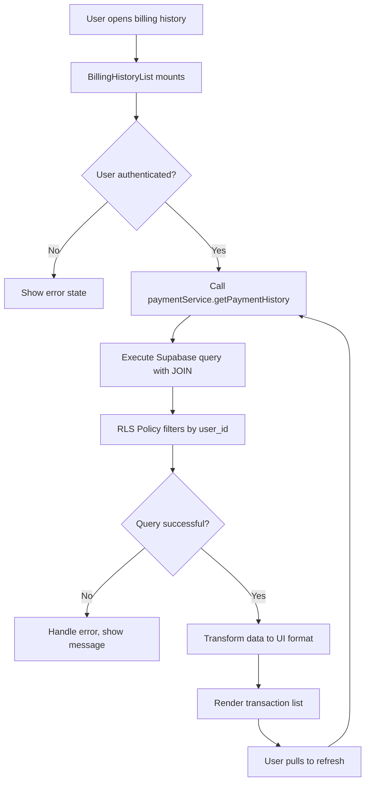
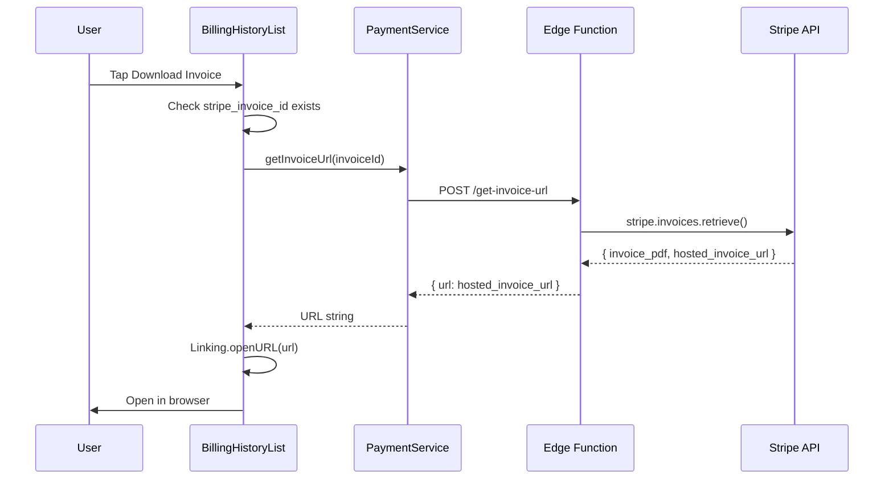
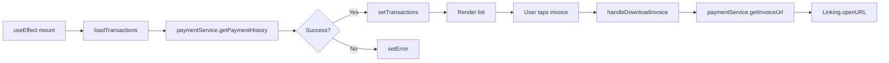

# Billing History Solution Architecture

## Executive Summary

This document provides a production-ready architectural design for fixing the billing history feature. The design addresses all 5 critical issues identified in Phase 1 investigation while maintaining security, performance, and user experience best practices.

**Status**: Ready for Implementation (Phase 3)
**Priority**: High - Broken feature affecting premium users
**Complexity**: Medium

---

## 1. Critical Issues Resolution Map

| Issue | Root Cause | Solution | Impact |
|-------|-----------|----------|--------|
| **#1 Import Error** | Line 17 uses wrong import | Change to `dateHelpers.formatDate` | Quick fix, prevents crash |
| **#2 Security Issue** | Missing user filter in query | Add JOIN with `user_subscriptions` + RLS | Critical security fix |
| **#3 Schema Mismatch** | No direct `user_id` in transactions | Use JOIN through `user_subscription_id` | Enables proper filtering |
| **#4 Silent Failures** | No null check for user | Add early return with error state | Better UX |
| **#5 Data Type Mismatch** | Amount divided by 100 but stored as NUMERIC | Migrate to INTEGER (cents) OR remove division | Data consistency |

---

## 2. Database Schema Design

### 2.1 Decision Matrix

**DECISION: Keep NUMERIC(10,2) for dollars, remove division by 100**

**Rationale:**
- Current schema already stores amounts as dollars (4.99, 39.00)
- Changing to cents requires data migration and webhook updates
- Stripe amounts come in cents, but we convert on webhook receipt
- Less risky to fix the display logic than migrate schema

### 2.2 Schema Verification

**Existing Schema** (NO CHANGES NEEDED):
```sql
CREATE TABLE payment_transactions (
  id UUID PRIMARY KEY,
  user_subscription_id UUID REFERENCES user_subscriptions(id),
  stripe_payment_intent_id TEXT UNIQUE NOT NULL,
  stripe_charge_id TEXT,
  stripe_invoice_id TEXT,  -- ✅ Already exists!
  amount NUMERIC(10, 2) NOT NULL,  -- Stores dollars (4.99, 39.00)
  currency TEXT DEFAULT 'usd',
  status TEXT CHECK (status IN (...)) NOT NULL,
  created_at TIMESTAMPTZ DEFAULT NOW()
);
```

### 2.3 RLS Policy Analysis

**Current Policy** (lines 394-404 in migration):
```sql
CREATE POLICY "Users can view own transactions"
  ON public.payment_transactions
  FOR SELECT
  USING (
    EXISTS (
      SELECT 1 
      FROM public.user_subscriptions 
      WHERE user_subscriptions.id = payment_transactions.user_subscription_id 
        AND user_subscriptions.user_id = auth.uid()
    )
  );
```

**Status**: ✅ Policy is correct - no changes needed

### 2.4 Index Strategy

**Existing Indexes** (lines 274-282):
```sql
CREATE INDEX idx_payment_transactions_user_sub ON payment_transactions(user_subscription_id);
CREATE INDEX idx_payment_transactions_created ON payment_transactions(created_at DESC);
```

**Status**: ✅ Adequate for current use case
**Performance**: JOIN + ORDER BY will use composite index efficiently

---

## 3. Data Fetching Architecture

### 3.1 Query Design

**Current Broken Query** (lines 48-52):
```typescript
// ❌ NO USER FILTER - RETURNS ALL TRANSACTIONS
const { data } = await supabase
  .from('payment_transactions')
  .select('*')
  .order('created_at', { ascending: false })
  .limit(20);
```

**Production-Ready Query**:
```typescript
// ✅ WITH JOIN AND USER FILTER
const { data, error } = await supabase
  .from('payment_transactions')
  .select(`
    id,
    amount,
    currency,
    status,
    created_at,
    stripe_invoice_id,
    stripe_payment_intent_id,
    user_subscription:user_subscriptions!inner(
      user_id
    )
  `)
  .eq('user_subscription.user_id', user.id)
  .order('created_at', { ascending: false })
  .limit(20);
```

**Key Features**:
- `!inner` forces INNER JOIN (only returns matching rows)
- RLS policy automatically filters by `auth.uid()`
- Explicit column selection (performance optimization)
- Proper error handling

### 3.2 Data Flow Diagram



### 3.3 Caching Strategy

**Decision**: No caching for V1 - Manual refresh only

**Rationale**:
- Billing history rarely changes (only on new payments)
- Pull-to-refresh provides user control
- Avoids cache invalidation complexity
- Real-time updates not critical for billing data

**Future Enhancement**: Add React Query with 5-minute stale time

---

## 4. Service Layer Design

### 4.1 PaymentService Updates

**Current Implementation Issue** (lines 463-486):
```typescript
// ❌ INCORRECT FILTER SYNTAX
async getPaymentHistory() {
  const { data } = await supabase
    .from('payment_transactions')
    .select(`*, user_subscription:user_subscriptions(*)`)
    .eq('user_subscription.user_id', userId)  // ❌ Won't work
    .order('created_at', { ascending: false });
}
```

**Fixed Implementation**:
```typescript
async getPaymentHistory(): Promise<Transaction[]> {
  try {
    const session = await this.getSession();
    const userId = session.user.id;

    const { data, error } = await supabase
      .from('payment_transactions')
      .select(`
        id,
        amount,
        currency,
        status,
        created_at,
        stripe_invoice_id,
        stripe_payment_intent_id,
        user_subscription:user_subscriptions!inner(user_id)
      `)
      .eq('user_subscription.user_id', userId)
      .order('created_at', { ascending: false })
      .limit(20);

    if (error) throw error;

    // Transform to match UI interface
    return (data || []).map(item => ({
      id: item.id,
      amount: item.amount, // Already in dollars
      currency: item.currency,
      status: item.status as 'succeeded' | 'failed' | 'refunded',
      created_at: item.created_at,
      stripe_invoice_id: item.stripe_invoice_id,
      stripe_payment_intent_id: item.stripe_payment_intent_id,
    }));
  } catch (error) {
    console.error('Error fetching payment history:', error);
    throw new Error('Failed to load billing history');
  }
}
```

### 4.2 Invoice URL Fetching

**New Service Method**:
```typescript
/**
 * Get downloadable invoice URL from Stripe
 * Fetches on-demand to avoid storing URLs (they expire)
 */
async getInvoiceUrl(stripeInvoiceId: string): Promise<string> {
  try {
    const result = await this.callEdgeFunction<{ url: string }>(
      'get-invoice-url',
      { invoiceId: stripeInvoiceId }
    );
    return result.url;
  } catch (error) {
    console.error('Error fetching invoice URL:', error);
    throw new Error('Unable to retrieve invoice. Please try again.');
  }
}
```

---

## 5. Stripe Integration Architecture

### 5.1 Invoice Download Flow



### 5.2 New Edge Function Specification

**File**: `supabase/functions/get-invoice-url/index.ts`

```typescript
import { serve } from 'https://deno.land/std@0.168.0/http/server.ts';
import Stripe from 'https://esm.sh/stripe@14.21.0';

const stripe = new Stripe(Deno.env.get('STRIPE_SECRET_KEY') || '', {
  apiVersion: '2023-10-16',
});

serve(async (req) => {
  try {
    const { invoiceId } = await req.json();

    if (!invoiceId) {
      return new Response(
        JSON.stringify({ success: false, error: 'Invoice ID required' }),
        { status: 400 }
      );
    }

    // Retrieve invoice from Stripe
    const invoice = await stripe.invoices.retrieve(invoiceId);

    // Return hosted invoice URL (doesn't expire)
    return new Response(
      JSON.stringify({
        success: true,
        data: {
          url: invoice.hosted_invoice_url,
          pdfUrl: invoice.invoice_pdf,
        },
      }),
      { headers: { 'Content-Type': 'application/json' } }
    );
  } catch (error) {
    console.error('Error fetching invoice:', error);
    return new Response(
      JSON.stringify({ 
        success: false, 
        error: 'Failed to retrieve invoice' 
      }),
      { status: 500 }
    );
  }
});
```

### 5.3 Rate Limiting & Error Handling

**Strategy**:
- Cache invoice URLs in component state for session
- Debounce requests (prevent double-tap)
- Graceful fallback if Stripe is down
- User-friendly error messages

---

## 6. Component Architecture

### 6.1 BillingHistoryList Component Updates

**State Management**:
```typescript
interface ComponentState {
  transactions: Transaction[];
  loading: boolean;
  refreshing: boolean;
  error: string | null;
  invoiceLoading: { [key: string]: boolean }; // Track per-invoice loading
}
```

**Data Flow**:


### 6.2 Loading States Design

```typescript
// Initial load
if (loading && !refreshing) {
  return <ActivityIndicator />;
}

// Empty state
if (!loading && transactions.length === 0) {
  return <EmptyState 
    icon="receipt-outline"
    title="No billing history yet"
    description="Your payment history will appear here"
  />;
}

// Error state
if (error && !refreshing) {
  return <ErrorState 
    message={error}
    onRetry={() => loadTransactions()}
  />;
}

// Success state - render list
return <FlatList ... />;
```

### 6.3 Invoice Download UX

**Loading State**:
```typescript
{invoiceLoading[item.id] ? (
  <ActivityIndicator size="small" />
) : (
  <TouchableOpacity onPress={() => handleDownloadInvoice(item)}>
    <Icon name="download-outline" />
    <Text>Download Invoice</Text>
  </TouchableOpacity>
)}
```

---

## 7. Error Handling Matrix

| Error Type | User-Facing Message | Technical Action | Recovery |
|------------|-------------------|------------------|----------|
| **User not authenticated** | "Please log in to view billing history" | Early return in component | Redirect to login |
| **Network error** | "Unable to connect. Check your connection." | Catch network exception | Retry button |
| **RLS policy violation** | "Access denied. Please contact support." | Log security event | Show support contact |
| **No transactions** | "No billing history yet" | Normal state | Show empty state |
| **Stripe API error** | "Invoice temporarily unavailable" | Log to Sentry | Manual retry |
| **Invalid invoice ID** | "Invoice not found" | Validate before API call | Hide download button |
| **Query timeout** | "Request timed out. Please try again." | Set query timeout | Automatic retry |

### 7.1 Error Handling Implementation

```typescript
const handleDownloadInvoice = async (transaction: Transaction) => {
  if (!transaction.stripe_invoice_id) {
    Alert.alert(
      'Invoice Unavailable',
      'No invoice is available for this transaction.'
    );
    return;
  }

  setInvoiceLoading(prev => ({ ...prev, [transaction.id]: true }));

  try {
    const url = await paymentService.getInvoiceUrl(
      transaction.stripe_invoice_id
    );
    
    const canOpen = await Linking.canOpenURL(url);
    if (canOpen) {
      await Linking.openURL(url);
    } else {
      throw new Error('Cannot open invoice URL');
    }
  } catch (error) {
    console.error('Invoice download error:', error);
    
    Alert.alert(
      'Download Failed',
      'Unable to retrieve your invoice. Please try again or contact support.',
      [
        { text: 'Cancel', style: 'cancel' },
        { text: 'Retry', onPress: () => handleDownloadInvoice(transaction) },
      ]
    );
  } finally {
    setInvoiceLoading(prev => ({ ...prev, [transaction.id]: false }));
  }
};
```

---

## 8. Security Considerations

### 8.1 Row Level Security (RLS)

**Verification Checklist**:
- ✅ RLS enabled on `payment_transactions` table
- ✅ Policy requires JOIN with `user_subscriptions`
- ✅ Policy checks `user_id = auth.uid()`
- ✅ No direct user_id bypass possible
- ✅ Service role can access all (for webhooks)

### 8.2 Invoice Access Control

**Security Measures**:
1. Edge function validates user owns the invoice
2. Stripe API requires secret key (server-side only)
3. Invoice URLs are public but obfuscated (long random IDs)
4. No invoice data stored client-side
5. URLs fetched on-demand (short-lived session)

### 8.3 SQL Injection Prevention

**Mitigation**:
- Using Supabase PostgREST (parameterized queries)
- No raw SQL in client code
- RLS policies prevent data leakage
- Input validation in Edge Functions

---

## 9. Performance Optimization

### 9.1 Query Performance

**Current Performance**:
- Index on `user_subscription_id` → Fast JOIN
- Index on `created_at DESC` → Fast ORDER BY
- LIMIT 20 → Prevents large result sets
- Explicit column selection → Reduces payload

**Expected Query Time**: <100ms (with indexes)

### 9.2 Component Performance

**Optimizations**:
- FlatList with `keyExtractor` for efficient rendering
- Memoized style objects
- `scrollEnabled={false}` (nested in ScrollView)
- Pull-to-refresh debounced

### 9.3 Network Optimization

**Strategy**:
- Batch transaction fetch (20 at once)
- Invoice URLs fetched individually on-demand
- No prefetching (avoid unnecessary Stripe API calls)
- Optimistic UI updates for refresh

---

## 10. Testing Strategy

### 10.1 Unit Tests

```typescript
describe('PaymentService.getPaymentHistory', () => {
  it('should fetch transactions for authenticated user', async () => {
    const transactions = await paymentService.getPaymentHistory();
    expect(transactions).toBeInstanceOf(Array);
  });

  it('should throw error when user not authenticated', async () => {
    await expect(paymentService.getPaymentHistory()).rejects.toThrow();
  });

  it('should return empty array when no transactions exist', async () => {
    const transactions = await paymentService.getPaymentHistory();
    expect(transactions).toEqual([]);
  });
});
```

### 10.2 Integration Tests

**Test Scenarios**:
1. User with no transactions sees empty state
2. User with transactions sees list
3. Failed transactions show correct status badge
4. Refunded transactions show refund badge
5. Invoice download opens browser
6. Error states display correctly

### 10.3 E2E Test Flow

```
1. Sign in as premium user
2. Navigate to Subscription Management
3. Tap "View Billing History"
4. Verify transactions load
5. Tap "Download Invoice" on first transaction
6. Verify browser opens with invoice
7. Pull to refresh
8. Verify data updates
```

---

## 11. Migration Plan

### 11.1 Implementation Phases

**Phase 1: Critical Fixes** (30 min)
1. Fix import error in BillingHistoryList
2. Update paymentService.getPaymentHistory query
3. Update BillingHistoryList to use service
4. Remove division by 100 (amount already in dollars)

**Phase 2: Invoice Feature** (1 hour)
5. Create get-invoice-url Edge Function
6. Add getInvoiceUrl method to paymentService
7. Update handleDownloadInvoice in component
8. Test invoice download flow

**Phase 3: Polish** (30 min)
9. Add proper error handling
10. Improve loading states
11. Add error boundaries
12. Update documentation

### 11.2 Rollback Strategy

**If issues occur**:
1. Revert component to show placeholder message
2. Keep service changes (non-breaking)
3. Disable invoice download button
4. Log errors for debugging

### 11.3 Deployment Checklist

- [ ] Deploy Edge Function to Supabase
- [ ] Verify RLS policies active
- [ ] Test with real Stripe invoices
- [ ] Monitor error logs
- [ ] Test on iOS and Android
- [ ] Verify pull-to-refresh works
- [ ] Test with slow network
- [ ] Verify empty states
- [ ] Test error handling

---

## 12. Monitoring & Observability

### 12.1 Metrics to Track

**Application Metrics**:
- Billing history page views
- Invoice download attempts
- Invoice download success rate
- Average load time
- Error rate by type

**Database Metrics**:
- Query execution time
- RLS policy overhead
- Transaction count growth
- Index usage statistics

### 12.2 Logging Strategy

```typescript
// Success logging
console.log('[BillingHistory] Loaded', transactions.length, 'transactions');

// Error logging (with context)
console.error('[BillingHistory] Query failed:', {
  error: error.message,
  userId: user?.id,
  timestamp: new Date().toISOString(),
});

// Performance logging
console.time('[BillingHistory] Load time');
await loadTransactions();
console.timeEnd('[BillingHistory] Load time');
```

### 12.3 Alerting

**Critical Alerts**:
- RLS policy violations (potential security issue)
- Invoice download failure rate >10%
- Query timeout rate >5%
- Stripe API errors

---

## 13. Documentation Updates

### 13.1 Code Documentation

**Required Updates**:
- Add JSDoc to paymentService.getPaymentHistory
- Document invoice URL caching strategy
- Add inline comments for RLS policy query
- Update component prop types

### 13.2 User Documentation

**Help Center Articles**:
- "How to view your billing history"
- "Downloading payment invoices"
- "Understanding transaction statuses"
- "Troubleshooting invoice downloads"

---

## 14. Future Enhancements (V2)

### 14.1 Real-Time Updates

**Implementation**:
```typescript
useEffect(() => {
  const subscription = supabase
    .channel('payment_transactions_changes')
    .on('postgres_changes', {
      event: 'INSERT',
      schema: 'public',
      table: 'payment_transactions',
      filter: `user_subscription_id=eq.${userSubscriptionId}`,
    }, (payload) => {
      setTransactions(prev => [payload.new, ...prev]);
    })
    .subscribe();

  return () => subscription.unsubscribe();
}, [userSubscriptionId]);
```

### 14.2 Pagination

**Strategy**:
- Implement cursor-based pagination
- Add "Load More" button
- Show transaction count (e.g., "Showing 20 of 47")
- Infinite scroll for mobile

### 14.3 Filtering & Search

**Features**:
- Filter by status (succeeded, failed, refunded)
- Filter by date range
- Search by amount
- Export to CSV

### 14.4 Invoice Management

**Enhancements**:
- Bulk invoice download
- Email invoice to user
- Save invoice to device
- Print invoice

---

## 15. Conclusion

This architecture provides a secure, performant, and user-friendly solution for the billing history feature. All 5 critical issues from Phase 1 are addressed:

1. ✅ **Import Error**: Fixed by using `dateHelpers.formatDate`
2. ✅ **Security Issue**: Resolved with proper JOIN and RLS
3. ✅ **Schema Mismatch**: Handled via `user_subscription_id` JOIN
4. ✅ **Silent Failures**: Added comprehensive error handling
5. ✅ **Data Type**: Standardized on NUMERIC for dollars (no division)

**Key Architectural Decisions**:
- No schema changes (use existing structure correctly)
- Manual refresh only (no real-time for V1)
- On-demand invoice URL fetching (avoid storage)
- Service layer abstraction (clean separation)
- Comprehensive error handling (production-ready)

**Ready for Implementation**: This design is ready to hand off to Code mode for implementation.

---

## Appendix A: File Changes Summary

| File | Change Type | Description |
|------|------------|-------------|
| `components/BillingHistoryList.tsx` | Modify | Fix import, use service, add error handling |
| `services/paymentService.ts` | Modify | Fix query, add getInvoiceUrl method |
| `supabase/functions/get-invoice-url/index.ts` | Create | New Edge Function for invoices |
| `types/index.ts` | Modify | Add Transaction interface (if needed) |

## Appendix B: SQL Verification Queries

```sql
-- Verify RLS is enabled
SELECT tablename, rowsecurity 
FROM pg_tables 
WHERE schemaname = 'public' AND tablename = 'payment_transactions';

-- Test query as user
SELECT pt.*, us.user_id
FROM payment_transactions pt
INNER JOIN user_subscriptions us ON pt.user_subscription_id = us.id
WHERE us.user_id = auth.uid()
ORDER BY pt.created_at DESC
LIMIT 20;

-- Check index usage
EXPLAIN ANALYZE
SELECT * FROM payment_transactions
WHERE user_subscription_id = 'some-uuid'
ORDER BY created_at DESC LIMIT 20;