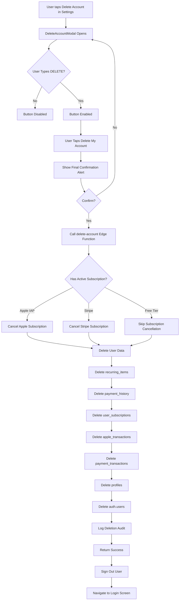
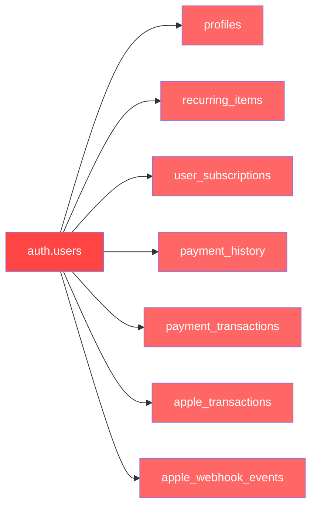

# Delete Account Feature - Implementation Plan

## Document Information
- **Version**: 1.0.0
- **Created**: 2025-12-07
- **Status**: Planning Phase
- **Complexity**: High

---

## 1. Overview

### Purpose
Implement a comprehensive "Delete Account" feature that allows users to permanently remove their account and all associated data from the Renvo subscription tracking app.

### Key Requirements
- **Deletion Type**: Hard delete with immediate permanent removal
- **Grace Period**: None - deletion is immediate and irreversible
- **Subscription Handling**: Auto-cancel active subscriptions (both Apple IAP and Stripe)
- **Data Scope**: Complete account removal including auth.users record
- **Post-Deletion**: Immediate sign-out and redirect to login screen
- **Confirmation**: Type "DELETE" to confirm (prevents accidental deletion)

### Modal Design (from Screenshot)
- Modal title: "Delete Account" with close (X) button
- Red warning icon (triangle with exclamation)
- Bold warning text: "This action cannot be undone"
- Description: "Deleting your account will permanently remove:"
- List of items to be deleted
- Confirmation input: "Type DELETE to confirm"
- Text input field for typing "DELETE"
- Red "Delete My Account" button (disabled until "DELETE" is typed)
- "Cancel" button

---

## 2. Architecture Overview

### High-Level Flow



### Data Deletion Cascade



---

## 3. Phase 1: Frontend Implementation

### 3.1 Create DeleteAccountModal Component

**File**: `components/DeleteAccountModal.tsx`

**Props Interface**:
```typescript
interface DeleteAccountModalProps {
  visible: boolean;
  onClose: () => void;
  onSuccess: () => void;
}
```

**Component Structure**:
1. **Modal Container** - Full screen overlay with blur background
2. **Header Section**:
   - Close (X) button (top-right)
   - Warning icon (red triangle with exclamation)
   - Title: "Delete Account"
   - Subtitle: "This action cannot be undone"

3. **Content Section** (scrollable):
   - Warning card with list of what will be deleted:
     - All subscription data (recurring items)
     - Billing history
     - User settings and preferences
     - Premium subscription (if active)
   - Text: "Type DELETE to confirm"
   - Text input field
   - Button container (2 buttons stacked vertically)

4. **Button Section**:
   - "Delete My Account" (red, disabled until "DELETE" typed)
   - "Cancel" (secondary style)

**State Management**:
```typescript
const [inputText, setInputText] = useState('');
const [loading, setLoading] = useState(false);

const isDeleteEnabled = inputText.trim() === 'DELETE';
```

**Styling**:
- Follow existing modal patterns from [`CancelSubscriptionModal.tsx`](../components/CancelSubscriptionModal.tsx)
- Use theme colors from [`ThemeContext.tsx`](../contexts/ThemeContext.tsx)
- Red color scheme for destructive action
- Blur backdrop using `expo-blur`
- Animated entrance using `react-native-reanimated`

### 3.2 Update SettingsScreen

**File**: [`screens/SettingsScreen.tsx`](../screens/SettingsScreen.tsx:1168)

**Changes**:
1. Import DeleteAccountModal component
2. Add state for modal visibility:
```typescript
const [showDeleteAccountModal, setShowDeleteAccountModal] = useState(false);
```

3. Update existing Delete Account button handler (line 1168):
```typescript
const handleDeleteAccount = () => {
  if (Platform.OS === 'ios') {
    Haptics.impactAsync(Haptics.ImpactFeedbackStyle.Light);
  }
  setShowDeleteAccountModal(true);
};
```

4. Add modal at bottom of component:
```typescript
<DeleteAccountModal
  visible={showDeleteAccountModal}
  onClose={() => setShowDeleteAccountModal(false)}
  onSuccess={handleDeleteSuccess}
/>
```

5. Add success handler:
```typescript
const handleDeleteSuccess = async () => {
  setShowDeleteAccountModal(false);
  // Sign out will happen in the modal after successful deletion
};
```

### 3.3 Input Validation Logic

**Requirements**:
- Input must exactly match "DELETE" (case-sensitive)
- Button disabled until exact match
- Clear input on modal open
- Trim whitespace before comparison

**Implementation**:
```typescript
const handleInputChange = (text: string) => {
  setInputText(text);
};

const isDeleteEnabled = inputText.trim() === 'DELETE';
```

---

## 4. Phase 2: Backend Implementation

### 4.1 Create Supabase Edge Function

**File**: `supabase/functions/delete-account/index.ts`

**Endpoint**: `POST /delete-account`

**Function Structure**:
```typescript
import { serve } from 'https://deno.land/std@0.177.0/http/server.ts';
import { createClient } from 'https://esm.sh/@supabase/supabase-js@2';
import Stripe from 'https://esm.sh/stripe@13.8.0';

serve(async (req) => {
  try {
    // 1. Authenticate user
    const authHeader = req.headers.get('Authorization');
    const supabase = createClient(env.SUPABASE_URL, env.SUPABASE_ANON_KEY, {
      global: { headers: { Authorization: authHeader! } }
    });
    
    const { data: { user }, error: authError } = await supabase.auth.getUser();
    if (authError || !user) {
      return new Response(JSON.stringify({ error: 'Unauthorized' }), {
        status: 401,
        headers: { 'Content-Type': 'application/json' }
      });
    }

    // 2. Check for active subscriptions
    const { data: userSub } = await supabase
      .from('user_subscriptions')
      .select('*')
      .eq('user_id', user.id)
      .single();

    // 3. Cancel subscriptions if active
    if (userSub) {
      if (userSub.stripe_subscription_id) {
        await cancelStripeSubscription(userSub.stripe_subscription_id);
      }
      // Apple subscriptions are managed externally, but we'll delete the record
    }

    // 4. Delete all user data using helper function
    await deleteUserData(user.id, supabase);

    // 5. Delete auth.users record (Supabase Admin API)
    const supabaseAdmin = createClient(env.SUPABASE_URL, env.SUPABASE_SERVICE_ROLE_KEY);
    await supabaseAdmin.auth.admin.deleteUser(user.id);

    // 6. Log deletion for audit
    await logAccountDeletion(user.id, user.email);

    return new Response(JSON.stringify({ 
      success: true,
      message: 'Account deleted successfully'
    }), {
      status: 200,
      headers: { 'Content-Type': 'application/json' }
    });

  } catch (error) {
    console.error('Error deleting account:', error);
    return new Response(JSON.stringify({ 
      error: 'Failed to delete account',
      message: error.message
    }), {
      status: 500,
      headers: { 'Content-Type': 'application/json' }
    });
  }
});
```

### 4.2 Subscription Cancellation Logic

**Stripe Cancellation**:
```typescript
async function cancelStripeSubscription(subscriptionId: string): Promise<void> {
  const stripe = new Stripe(Deno.env.get('STRIPE_SECRET_KEY')!, {
    apiVersion: '2023-10-16',
  });

  try {
    // Cancel immediately (not at period end)
    await stripe.subscriptions.cancel(subscriptionId);
    console.log(`Stripe subscription ${subscriptionId} cancelled`);
  } catch (error) {
    console.error('Error cancelling Stripe subscription:', error);
    // Continue with deletion even if cancellation fails
  }
}
```

**Apple IAP Handling**:
- Apple subscriptions are managed through Apple's systems
- No direct API to cancel (user must do it in Settings)
- We delete the database records but subscription remains active in Apple until user cancels
- Document this behavior for users

### 4.3 Database Cleanup Operations

**Helper Function**:
```typescript
async function deleteUserData(userId: string, supabase: any): Promise<void> {
  // Delete in order to respect foreign key constraints
  
  // 1. Delete payment history
  await supabase.from('payment_history').delete().eq('user_id', userId);
  
  // 2. Delete recurring items
  await supabase.from('recurring_items').delete().eq('user_id', userId);
  
  // 3. Delete Apple transactions
  await supabase.from('apple_transactions').delete().eq('user_id', userId);
  
  // 4. Delete payment transactions
  const { data: userSub } = await supabase
    .from('user_subscriptions')
    .select('id')
    .eq('user_id', userId)
    .single();
  
  if (userSub) {
    await supabase.from('payment_transactions')
      .delete()
      .eq('user_subscription_id', userSub.id);
  }
  
  // 5. Delete user subscription
  await supabase.from('user_subscriptions').delete().eq('user_id', userId);
  
  // 6. Delete profile
  await supabase.from('profiles').delete().eq('id', userId);
  
  // Note: auth.users will be deleted separately using Admin API
}
```

**Tables to Delete From**:
1. `payment_history` (references recurring_items)
2. `recurring_items` (main subscription data)
3. `apple_transactions` (Apple IAP records)
4. `payment_transactions` (Stripe payment records)
5. `user_subscriptions` (subscription tier and billing)
6. `apple_webhook_events` (webhook logs - optional, may keep for audit)
7. `profiles` (user profile data)
8. `auth.users` (authentication record)

### 4.4 Error Handling & Transactions

**Transaction Approach**:
- Use database transactions where possible
- Rollback on any failure
- Return detailed error messages

**Error Scenarios**:
1. User not authenticated → 401 Unauthorized
2. Database connection fails → 500 Server Error
3. Stripe cancellation fails → Log error, continue deletion
4. Partial deletion fails → Rollback transaction
5. Auth user deletion fails → Log error, manual cleanup needed

**Implementation**:
```typescript
try {
  // Start transaction (if using PostgreSQL client)
  await supabase.rpc('begin_transaction');
  
  // Perform deletions
  await deleteUserData(userId, supabase);
  
  // Commit transaction
  await supabase.rpc('commit_transaction');
} catch (error) {
  // Rollback on error
  await supabase.rpc('rollback_transaction');
  throw error;
}
```

### 4.5 Audit Logging

**Create Audit Log Table** (optional but recommended):
```sql
CREATE TABLE IF NOT EXISTS account_deletion_logs (
  id UUID PRIMARY KEY DEFAULT gen_random_uuid(),
  user_id UUID NOT NULL,
  user_email TEXT NOT NULL,
  deletion_timestamp TIMESTAMPTZ DEFAULT NOW(),
  had_active_subscription BOOLEAN,
  subscription_type TEXT, -- 'apple' | 'stripe' | 'free'
  deletion_reason TEXT,
  deleted_by TEXT, -- 'user' | 'admin'
  ip_address TEXT,
  user_agent TEXT
);
```

**Log Function**:
```typescript
async function logAccountDeletion(
  userId: string,
  userEmail: string,
  subscriptionType: string | null = null
): Promise<void> {
  const supabaseAdmin = createClient(
    Deno.env.get('SUPABASE_URL')!,
    Deno.env.get('SUPABASE_SERVICE_ROLE_KEY')!
  );

  await supabaseAdmin.from('account_deletion_logs').insert({
    user_id: userId,
    user_email: userEmail,
    had_active_subscription: subscriptionType !== null,
    subscription_type: subscriptionType || 'free',
    deleted_by: 'user',
    deletion_timestamp: new Date().toISOString()
  });
}
```

---

## 5. Phase 3: Integration & Testing

### 5.1 Connect Frontend to Backend

**Service Function** (create new or add to existing service):

**File**: `services/accountService.ts` (new file)

```typescript
import { supabase } from '../config/supabase';

class AccountService {
  async deleteAccount(): Promise<{ success: boolean; error?: string }> {
    try {
      const { data: { session } } = await supabase.auth.getSession();
      
      if (!session) {
        return { success: false, error: 'No active session' };
      }

      const { data, error } = await supabase.functions.invoke('delete-account', {
        headers: {
          Authorization: `Bearer ${session.access_token}`,
        },
      });

      if (error) {
        console.error('Error deleting account:', error);
        return { success: false, error: error.message };
      }

      return { success: true };
    } catch (error) {
      console.error('Exception deleting account:', error);
      return { 
        success: false, 
        error: error instanceof Error ? error.message : 'Unknown error' 
      };
    }
  }
}

export const accountService = new AccountService();
```

**Update DeleteAccountModal**:
```typescript
const handleDeleteAccount = async () => {
  setLoading(true);

  try {
    const result = await accountService.deleteAccount();

    if (!result.success) {
      throw new Error(result.error || 'Failed to delete account');
    }

    // Success - sign out user
    if (Platform.OS === 'ios') {
      Haptics.notificationAsync(Haptics.NotificationFeedbackType.Success);
    }

    // Close modal
    onClose();

    // Sign out (this will redirect to login screen)
    await signOut();

  } catch (error) {
    console.error('Error deleting account:', error);
    
    if (Platform.OS === 'ios') {
      Haptics.notificationAsync(Haptics.NotificationFeedbackType.Error);
    }

    Alert.alert(
      'Deletion Failed',
      'Unable to delete your account. Please try again or contact support.',
      [{ text: 'OK' }]
    );
  } finally {
    setLoading(false);
  }
};
```

### 5.2 Test Scenarios

#### Test Case 1: Free Tier User Deletion
**Preconditions**:
- User has free tier account
- User has 2-3 recurring items

**Steps**:
1. Navigate to Settings
2. Tap "Delete Account"
3. Type "DELETE" in input field
4. Tap "Delete My Account" button
5. Confirm final alert

**Expected Results**:
- ✅ All recurring items deleted from database
- ✅ Profile deleted
- ✅ Auth user deleted
- ✅ User signed out
- ✅ Redirected to login screen
- ✅ Cannot sign in with same credentials

#### Test Case 2: Premium User with Apple IAP
**Preconditions**:
- User has active Apple IAP subscription
- User has 10+ recurring items

**Steps**:
1. Navigate to Settings
2. Tap "Delete Account"
3. Verify modal shows "Premium subscription" in deletion list
4. Type "DELETE" in input field
5. Tap "Delete My Account" button
6. Confirm final alert

**Expected Results**:
- ✅ All recurring items deleted
- ✅ User subscription record deleted
- ✅ Apple transaction records deleted
- ✅ Profile deleted
- ✅ Auth user deleted
- ✅ User signed out
- ⚠️ Apple subscription remains active in Apple's system (user must cancel separately)

#### Test Case 3: Premium User with Stripe
**Preconditions**:
- User has active Stripe subscription
- User has billing history

**Steps**:
1. Navigate to Settings
2. Tap "Delete Account"
3. Type "DELETE" in input field
4. Tap "Delete My Account" button
5. Confirm final alert

**Expected Results**:
- ✅ Stripe subscription cancelled via API
- ✅ Payment transactions deleted
- ✅ All recurring items deleted
- ✅ User subscription deleted
- ✅ Profile deleted
- ✅ Auth user deleted
- ✅ User signed out

#### Test Case 4: Error Scenarios
**Scenarios to Test**:
1. Network failure during deletion
2. Partial deletion (database fails midway)
3. Stripe API failure
4. Invalid authentication token
5. User closes app during deletion

**Expected Results**:
- ✅ Proper error messages displayed
- ✅ No partial account state
- ✅ User can retry deletion
- ✅ Rollback occurs on failure

### 5.3 Edge Cases

1. **User with payment_history but no active subscription**:
   - Should delete successfully
   - Payment history should be removed

2. **User with failed payment attempts**:
   - Should handle gracefully
   - Delete all transaction records

3. **User deletes account while having pending webhook events**:
   - Webhook events can be preserved for audit
   - Or deleted if not needed

4. **Multiple rapid deletion attempts**:
   - Prevent with loading state
   - Idempotent deletion (won't fail if already deleted)

---

## 6. Phase 4: Safety & Recovery Considerations

### 6.1 Pre-Deletion Warnings

**Warning Modal Content**:
```
⚠️ This action cannot be undone

Deleting your account will permanently remove:
• All subscription data (X recurring items)
• Billing history
• User settings and preferences
• Premium subscription (if active)

Type DELETE to confirm
```

**Additional Confirmation**:
After typing DELETE and clicking button, show final alert:
```
Alert.alert(
  'Final Confirmation',
  'Are you absolutely sure you want to delete your account? This action is permanent and cannot be undone.',
  [
    { text: 'Cancel', style: 'cancel' },
    { text: 'Delete Forever', style: 'destructive', onPress: handleDelete }
  ]
);
```

### 6.2 Data Retention Policy

**Audit Logs**:
- Keep deletion logs for 90 days (compliance)
- Store minimal data: user_id, email, timestamp
- Auto-purge after retention period

**No Recovery**:
- Hard delete = no recovery option
- Document this clearly in UI and terms
- Consider adding to Privacy Policy

### 6.3 Alternative: Soft Delete Option

**If you decide to add grace period later**:

1. Add `deleted_at` column to profiles table
2. Mark account as deleted instead of hard delete
3. Schedule actual deletion for 30 days later
4. Allow user to recover during grace period
5. Create scheduled job to purge old deleted accounts

**Not implementing this now** per your requirements, but documenting for future consideration.

### 6.4 Export Data Option

**Optional Enhancement** (not in current scope):
- Add "Export My Data" button before deletion
- Generate JSON/CSV of all recurring items
- Email to user or download directly
- Complies with GDPR "right to data portability"

---

## 7. Technical Specifications

### 7.1 Component API

**DeleteAccountModal Props**:
```typescript
interface DeleteAccountModalProps {
  visible: boolean;           // Controls modal visibility
  onClose: () => void;        // Called when user cancels
  onSuccess: () => void;      // Called after successful deletion
}
```

**Component State**:
```typescript
interface DeleteAccountModalState {
  inputText: string;          // User input for "DELETE" confirmation
  loading: boolean;           // Loading state during API call
}
```

### 7.2 Edge Function Specification

**Endpoint**: `POST /functions/v1/delete-account`

**Headers**:
```
Authorization: Bearer <supabase_access_token>
Content-Type: application/json
```

**Request Body**: None (user ID from auth token)

**Response - Success** (200):
```json
{
  "success": true,
  "message": "Account deleted successfully"
}
```

**Response - Error** (4xx/5xx):
```json
{
  "error": "Error type",
  "message": "Detailed error message"
}
```

### 7.3 Database Operations Order

**Deletion Sequence** (must follow this order for FK constraints):
1. `payment_history` (references `recurring_items.id`)
2. `payment_transactions` (references `user_subscriptions.id`)
3. `apple_transactions` (references `profiles.id`)
4. `recurring_items` (references `profiles.id`)
5. `user_subscriptions` (references `profiles.id`)
6. `apple_webhook_events` (optional, may keep for audit)
7. `profiles` (references `auth.users.id`)
8. `auth.users` (final deletion via Admin API)

**RLS Policies**:
- Most deletions will use `user_id` from authenticated session
- Final `auth.users` deletion requires Service Role key

### 7.4 Error Codes

| Code | Error | Description |
|------|-------|-------------|
| 401 | Unauthorized | No valid session token |
| 403 | Forbidden | Insufficient permissions |
| 404 | Not Found | User not found |
| 409 | Conflict | Concurrent deletion attempt |
| 500 | Server Error | Database or API failure |
| 503 | Service Unavailable | Stripe API unavailable |

---

## 8. Implementation Checklist

### Frontend Tasks
- [ ] Create `components/DeleteAccountModal.tsx`
- [ ] Implement modal UI matching design
- [ ] Add DELETE input validation
- [ ] Add loading states and animations
- [ ] Integrate into `screens/SettingsScreen.tsx`
- [ ] Add haptic feedback (iOS)
- [ ] Test on iOS and Android

### Backend Tasks
- [ ] Create `supabase/functions/delete-account/index.ts`
- [ ] Implement user authentication check
- [ ] Add Stripe subscription cancellation
- [ ] Add database cleanup logic
- [ ] Implement auth.users deletion via Admin API
- [ ] Add audit logging
- [ ] Add error handling and rollback
- [ ] Test with different user scenarios

### Integration Tasks
- [ ] Create `services/accountService.ts`
- [ ] Connect modal to Edge Function
- [ ] Implement post-deletion sign-out
- [ ] Add comprehensive error messages
- [ ] Test end-to-end flow

### Testing Tasks
- [ ] Test free tier user deletion
- [ ] Test Apple IAP user deletion
- [ ] Test Stripe user deletion
- [ ] Test error scenarios
- [ ] Test rollback behavior
- [ ] Verify all data is deleted
- [ ] Test concurrent deletion attempts

### Documentation Tasks
- [ ] Update Privacy Policy with deletion info
- [ ] Document data retention policy
- [ ] Create user-facing deletion guide
- [ ] Add technical documentation
- [ ] Document known limitations (Apple IAP)

---

## 9. Known Limitations & Considerations

### Apple IAP Limitations
**Issue**: Cannot cancel Apple subscriptions via API
**Impact**: User's Apple subscription remains active until they manually cancel
**Mitigation**: 
- Show clear warning in modal about this
- Provide instructions to cancel in Apple Settings
- Consider adding button to open Apple subscription settings

**Modal Warning Text**:
```
⚠️ Note for Premium Users:
If you have an Apple subscription, you must cancel it separately in 
iPhone Settings > [Your Name] > Subscriptions after deleting your account.
```

### Stripe Immediate Cancellation
**Issue**: Immediate cancellation means user loses access right away
**Impact**: User might lose access to data they paid for
**Consideration**: Could offer prorated refund or access until period end
**Current Approach**: Hard delete = immediate cancellation (per requirements)

### Data Recovery
**Issue**: No recovery mechanism after deletion
**Impact**: User cannot undo deletion
**Mitigation**: Multiple confirmation steps, clear warnings

### Audit Compliance
**Issue**: Some jurisdictions require deletion logs
**Impact**: Need to balance privacy with compliance
**Solution**: Keep minimal logs (user_id, email, timestamp) for 90 days

---

## 10. Success Criteria

### Functional Requirements
✅ User can delete their account from Settings screen
✅ Modal requires typing "DELETE" for confirmation
✅ All user data is permanently removed
✅ Active subscriptions are cancelled
✅ User is signed out after deletion
✅ Deletion process handles errors gracefully

### Non-Functional Requirements
✅ Deletion completes in < 5 seconds
✅ UI is responsive during deletion
✅ Error messages are clear and actionable
✅ Audit logs are created for compliance
✅ Works on both iOS and Android
✅ Follows app's design patterns

### User Experience Requirements
✅ Clear warnings prevent accidental deletion
✅ Loading states show progress
✅ Success/error feedback is immediate
✅ Modal design matches screenshot requirements
✅ Haptic feedback enhances interaction (iOS)

---

## 11. Future Enhancements

### Phase 2 Considerations (Not in Current Scope)
1. **30-Day Grace Period**: Soft delete with recovery option
2. **Data Export**: Download all data before deletion
3. **Deletion Reason**: Collect feedback on why user is leaving
4. **Account Deactivation**: Temporary disable instead of delete
5. **Scheduled Deletion**: User sets future deletion date
6. **Email Confirmation**: Send confirmation email before deletion
7. **Admin Override**: Support team can prevent/reverse deletion

---

## 12. Deployment Plan

### Pre-Deployment
1. Test in development environment
2. Test in staging environment
3. Review code with team
4. Update Privacy Policy
5. Prepare support documentation

### Deployment Steps
1. Deploy database changes (if any)
2. Deploy Edge Function to Supabase
3. Deploy app update to TestFlight
4. Monitor for errors
5. Deploy to production

### Post-Deployment
1. Monitor deletion success rate
2. Track error logs
3. Collect user feedback
4. Address any issues
5. Update documentation as needed

---

## 13. Resources & References

### Code References
- Modal Pattern: [`components/CancelSubscriptionModal.tsx`](../components/CancelSubscriptionModal.tsx)
- Settings Integration: [`screens/SettingsScreen.tsx`](../screens/SettingsScreen.tsx:1168)
- Auth Context: [`contexts/AuthContext.tsx`](../contexts/AuthContext.tsx)
- Supabase Config: [`config/supabase.ts`](../config/supabase.ts)

### Database Schema
- User Profiles: [`types/index.ts`](../types/index.ts:671-678)
- Subscriptions: [`types/index.ts`](../types/index.ts:153-179)
- Database Migration: [`database/supabase_migration.sql`](../database/supabase_migration.sql)

### External Documentation
- Supabase Auth Admin API: https://supabase.com/docs/reference/javascript/auth-admin-deleteuser
- Stripe Subscriptions API: https://stripe.com/docs/api/subscriptions/cancel
- React Native IAP: https://github.com/dooboolab-community/react-native-iap

---

## 14. Contact & Support

### Implementation Questions
- Review this document with team
- Discuss Apple IAP limitations
- Confirm data retention requirements
- Verify compliance needs

### Technical Support
- Supabase Edge Functions: Supabase documentation
- Stripe Integration: Stripe support
- Apple IAP: Apple Developer documentation

---

**Document End**

This plan is ready for review and implementation. Please review and provide feedback on:
1. Approach to Apple IAP subscription handling
2. Audit log requirements
3. Any additional confirmations needed
4. Timeline and priority