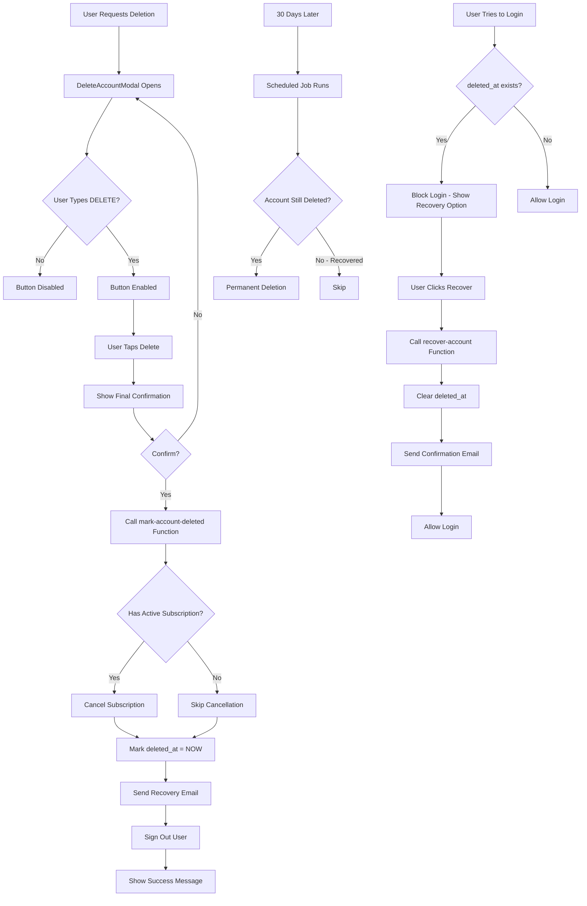
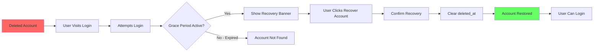

# Delete Account Feature - Implementation Plan v2.0 (30-Day Grace Period)

## Document Information
- **Version**: 2.0.0 (Revised)
- **Created**: 2025-12-07
- **Status**: Planning Phase
- **Complexity**: High
- **Change**: Switched from hard delete to soft delete with 30-day recovery period

---

## 1. Overview

### Purpose
Implement a comprehensive "Delete Account" feature with a **30-day grace period** that allows users to recover their account before permanent deletion.

### Key Requirements (REVISED)
- **Deletion Type**: Soft delete (mark as deleted, preserve data for 30 days)
- **Grace Period**: 30 days from deletion request
- **Recovery**: Users can recover their account anytime within 30 days
- **Subscription Handling**: Cancel active subscriptions on deletion request
- **Data Scope**: Complete account removal after grace period expires
- **Post-Deletion**: Sign out immediately, account inaccessible during grace period
- **Confirmation**: Type "DELETE" to confirm (prevents accidental deletion)

### Modal Design Updates
- Modal title: "Delete Account" with close (X) button
- Red warning icon (triangle with exclamation)
- **UPDATED**: "You have 30 days to change your mind"
- Description: "Deleting your account will:"
- List of items:
  - Cancel your subscription (if active)
  - Hide all your data
  - Start a 30-day countdown
  - Allow recovery within 30 days
- Confirmation input: "Type DELETE to confirm"
- Text input field for typing "DELETE"
- Red "Delete My Account" button (disabled until "DELETE" is typed)
- "Cancel" button

---

## 2. Architecture Overview (REVISED)

### High-Level Flow



### Recovery Flow



---

## 3. Database Schema Changes

### 3.1 Add Soft Delete Column

**Migration File**: `database/add_soft_delete_migration.sql`

```sql
-- Add deleted_at column to profiles table for soft delete
ALTER TABLE public.profiles 
ADD COLUMN deleted_at TIMESTAMPTZ DEFAULT NULL;

-- Add index for efficient queries
CREATE INDEX idx_profiles_deleted_at ON public.profiles(deleted_at);

-- Add comment
COMMENT ON COLUMN public.profiles.deleted_at IS 'Timestamp when user requested account deletion. NULL = active account. After 30 days, account is permanently deleted.';
```

### 3.2 Update RLS Policies

**Update existing policies to exclude deleted accounts**:

```sql
-- Update existing SELECT policy to exclude deleted accounts
DROP POLICY IF EXISTS "Users can view own profile" ON public.profiles;

CREATE POLICY "Users can view own profile"
  ON public.profiles
  FOR SELECT
  USING (
    auth.uid() = id 
    AND deleted_at IS NULL  -- Exclude deleted accounts
  );

-- Update UPDATE policy
DROP POLICY IF EXISTS "Users can update own profile" ON public.profiles;

CREATE POLICY "Users can update own profile"
  ON public.profiles
  FOR UPDATE
  USING (
    auth.uid() = id 
    AND deleted_at IS NULL  -- Prevent updates to deleted accounts
  )
  WITH CHECK (
    auth.uid() = id 
    AND deleted_at IS NULL
  );

-- Similar updates for recurring_items, user_subscriptions, etc.
```

### 3.3 Create Deletion Audit Log Table

```sql
CREATE TABLE IF NOT EXISTS public.account_deletion_logs (
  id UUID PRIMARY KEY DEFAULT gen_random_uuid(),
  user_id UUID NOT NULL,
  user_email TEXT NOT NULL,
  deletion_requested_at TIMESTAMPTZ DEFAULT NOW(),
  scheduled_deletion_at TIMESTAMPTZ NOT NULL,
  recovered_at TIMESTAMPTZ,
  permanently_deleted_at TIMESTAMPTZ,
  had_active_subscription BOOLEAN,
  subscription_type TEXT,
  deletion_reason TEXT,
  recovery_reason TEXT,
  ip_address TEXT,
  user_agent TEXT,
  
  CONSTRAINT valid_dates CHECK (
    scheduled_deletion_at > deletion_requested_at
  )
);

-- Index for cleanup job
CREATE INDEX idx_deletion_logs_scheduled ON public.account_deletion_logs(scheduled_deletion_at)
  WHERE permanently_deleted_at IS NULL;

-- RLS for admin access only
ALTER TABLE public.account_deletion_logs ENABLE ROW LEVEL SECURITY;

CREATE POLICY "Service role can manage deletion logs"
  ON public.account_deletion_logs
  FOR ALL
  USING (auth.jwt()->>'role' = 'service_role');
```

---

## 4. Edge Functions

### 4.1 Mark Account as Deleted

**File**: `supabase/functions/mark-account-deleted/index.ts`

```typescript
import { serve } from 'https://deno.land/std@0.177.0/http/server.ts';
import { createClient } from 'https://esm.sh/@supabase/supabase-js@2';
import Stripe from 'https://esm.sh/stripe@13.8.0';

serve(async (req) => {
  try {
    // 1. Authenticate user
    const authHeader = req.headers.get('Authorization');
    const supabase = createClient(
      Deno.env.get('SUPABASE_URL')!,
      Deno.env.get('SUPABASE_ANON_KEY')!,
      { global: { headers: { Authorization: authHeader! } } }
    );
    
    const { data: { user }, error: authError } = await supabase.auth.getUser();
    if (authError || !user) {
      return new Response(
        JSON.stringify({ error: 'Unauthorized' }),
        { status: 401, headers: { 'Content-Type': 'application/json' } }
      );
    }

    // 2. Check if account is already deleted
    const { data: profile } = await supabase
      .from('profiles')
      .select('deleted_at')
      .eq('id', user.id)
      .single();

    if (profile?.deleted_at) {
      return new Response(
        JSON.stringify({ 
          error: 'Account already marked for deletion',
          deletedAt: profile.deleted_at 
        }),
        { status: 400, headers: { 'Content-Type': 'application/json' } }
      );
    }

    // 3. Check for active subscriptions and cancel them
    const { data: userSub } = await supabase
      .from('user_subscriptions')
      .select('*')
      .eq('user_id', user.id)
      .single();

    let subscriptionType = 'free';
    if (userSub) {
      if (userSub.stripe_subscription_id) {
        await cancelStripeSubscription(userSub.stripe_subscription_id);
        subscriptionType = 'stripe';
      } else if (userSub.tier_id === 'premium') {
        subscriptionType = 'apple';
        // Apple subscriptions managed externally
      }
    }

    // 4. Mark account as deleted (soft delete)
    const deletedAt = new Date();
    const scheduledDeletionAt = new Date(deletedAt.getTime() + 30 * 24 * 60 * 60 * 1000); // 30 days

    const { error: updateError } = await supabase
      .from('profiles')
      .update({ 
        deleted_at: deletedAt.toISOString(),
        updated_at: deletedAt.toISOString()
      })
      .eq('id', user.id);

    if (updateError) {
      throw new Error(`Failed to mark account as deleted: ${updateError.message}`);
    }

    // 5. Log the deletion request
    await supabase.from('account_deletion_logs').insert({
      user_id: user.id,
      user_email: user.email!,
      deletion_requested_at: deletedAt.toISOString(),
      scheduled_deletion_at: scheduledDeletionAt.toISOString(),
      had_active_subscription: subscriptionType !== 'free',
      subscription_type: subscriptionType,
    });

    // 6. Send recovery email (optional - implement later)
    // await sendRecoveryEmail(user.email, scheduledDeletionAt);

    return new Response(
      JSON.stringify({ 
        success: true,
        message: 'Account marked for deletion',
        deletedAt: deletedAt.toISOString(),
        scheduledDeletionAt: scheduledDeletionAt.toISOString(),
        gracePeriodDays: 30
      }),
      { status: 200, headers: { 'Content-Type': 'application/json' } }
    );

  } catch (error) {
    console.error('Error marking account for deletion:', error);
    return new Response(
      JSON.stringify({ 
        error: 'Failed to delete account',
        message: error.message
      }),
      { status: 500, headers: { 'Content-Type': 'application/json' } }
    );
  }
});

async function cancelStripeSubscription(subscriptionId: string): Promise<void> {
  const stripe = new Stripe(Deno.env.get('STRIPE_SECRET_KEY')!, {
    apiVersion: '2023-10-16',
  });

  try {
    await stripe.subscriptions.cancel(subscriptionId);
    console.log(`Stripe subscription ${subscriptionId} cancelled`);
  } catch (error) {
    console.error('Error cancelling Stripe subscription:', error);
    // Continue even if cancellation fails
  }
}
```

### 4.2 Recover Account

**File**: `supabase/functions/recover-account/index.ts`

```typescript
import { serve } from 'https://deno.land/std@0.177.0/http/server.ts';
import { createClient } from 'https://esm.sh/@supabase/supabase-js@2';

serve(async (req) => {
  try {
    const authHeader = req.headers.get('Authorization');
    const supabase = createClient(
      Deno.env.get('SUPABASE_URL')!,
      Deno.env.get('SUPABASE_ANON_KEY')!,
      { global: { headers: { Authorization: authHeader! } } }
    );
    
    const { data: { user }, error: authError } = await supabase.auth.getUser();
    if (authError || !user) {
      return new Response(
        JSON.stringify({ error: 'Unauthorized' }),
        { status: 401, headers: { 'Content-Type': 'application/json' } }
      );
    }

    // Check if account is marked for deletion
    const { data: profile } = await supabase
      .from('profiles')
      .select('deleted_at')
      .eq('id', user.id)
      .single();

    if (!profile?.deleted_at) {
      return new Response(
        JSON.stringify({ error: 'Account is not marked for deletion' }),
        { status: 400, headers: { 'Content-Type': 'application/json' } }
      );
    }

    // Check if grace period has expired (30 days)
    const deletedAt = new Date(profile.deleted_at);
    const now = new Date();
    const daysSinceDeletion = (now.getTime() - deletedAt.getTime()) / (1000 * 60 * 60 * 24);

    if (daysSinceDeletion > 30) {
      return new Response(
        JSON.stringify({ 
          error: 'Recovery period has expired',
          message: 'Your account was permanently deleted after the 30-day grace period.'
        }),
        { status: 410, headers: { 'Content-Type': 'application/json' } }
      );
    }

    // Recover account by clearing deleted_at
    const { error: updateError } = await supabase
      .from('profiles')
      .update({ 
        deleted_at: null,
        updated_at: new Date().toISOString()
      })
      .eq('id', user.id);

    if (updateError) {
      throw new Error(`Failed to recover account: ${updateError.message}`);
    }

    // Update deletion log with recovery info
    await supabase
      .from('account_deletion_logs')
      .update({ recovered_at: new Date().toISOString() })
      .eq('user_id', user.id)
      .is('recovered_at', null);

    return new Response(
      JSON.stringify({ 
        success: true,
        message: 'Account recovered successfully'
      }),
      { status: 200, headers: { 'Content-Type': 'application/json' } }
    );

  } catch (error) {
    console.error('Error recovering account:', error);
    return new Response(
      JSON.stringify({ 
        error: 'Failed to recover account',
        message: error.message
      }),
      { status: 500, headers: { 'Content-Type': 'application/json' } }
    );
  }
});
```

### 4.3 Permanent Deletion Job (Scheduled)

**File**: `supabase/functions/cleanup-deleted-accounts/index.ts`

```typescript
import { serve } from 'https://deno.land/std@0.177.0/http/server.ts';
import { createClient } from 'https://esm.sh/@supabase/supabase-js@2';

serve(async (req) => {
  try {
    // Verify this is a scheduled/cron request
    const authHeader = req.headers.get('Authorization');
    if (authHeader !== `Bearer ${Deno.env.get('CRON_SECRET')}`) {
      return new Response('Unauthorized', { status: 401 });
    }

    const supabaseAdmin = createClient(
      Deno.env.get('SUPABASE_URL')!,
      Deno.env.get('SUPABASE_SERVICE_ROLE_KEY')!
    );

    // Find accounts deleted more than 30 days ago
    const thirtyDaysAgo = new Date();
    thirtyDaysAgo.setDate(thirtyDaysAgo.getDate() - 30);

    const { data: expiredAccounts } = await supabaseAdmin
      .from('profiles')
      .select('id, email, deleted_at')
      .not('deleted_at', 'is', null)
      .lt('deleted_at', thirtyDaysAgo.toISOString());

    if (!expiredAccounts || expiredAccounts.length === 0) {
      return new Response(
        JSON.stringify({ message: 'No accounts to delete', count: 0 }),
        { status: 200, headers: { 'Content-Type': 'application/json' } }
      );
    }

    let deletedCount = 0;
    const errors = [];

    for (const account of expiredAccounts) {
      try {
        // Perform complete deletion
        await deleteUserData(account.id, supabaseAdmin);
        
        // Delete auth user
        await supabaseAdmin.auth.admin.deleteUser(account.id);
        
        // Update log
        await supabaseAdmin
          .from('account_deletion_logs')
          .update({ permanently_deleted_at: new Date().toISOString() })
          .eq('user_id', account.id)
          .is('permanently_deleted_at', null);
        
        deletedCount++;
        console.log(`Permanently deleted account: ${account.email}`);
      } catch (error) {
        console.error(`Failed to delete account ${account.email}:`, error);
        errors.push({ userId: account.id, email: account.email, error: error.message });
      }
    }

    return new Response(
      JSON.stringify({ 
        success: true,
        deletedCount,
        totalProcessed: expiredAccounts.length,
        errors: errors.length > 0 ? errors : undefined
      }),
      { status: 200, headers: { 'Content-Type': 'application/json' } }
    );

  } catch (error) {
    console.error('Error in cleanup job:', error);
    return new Response(
      JSON.stringify({ error: error.message }),
      { status: 500, headers: { 'Content-Type': 'application/json' } }
    );
  }
});

async function deleteUserData(userId: string, supabase: any): Promise<void> {
  // Delete in order to respect foreign key constraints
  await supabase.from('payment_history').delete().eq('user_id', userId);
  await supabase.from('recurring_items').delete().eq('user_id', userId);
  await supabase.from('apple_transactions').delete().eq('user_id', userId);
  
  const { data: userSub } = await supabase
    .from('user_subscriptions')
    .select('id')
    .eq('user_id', userId)
    .single();
  
  if (userSub) {
    await supabase.from('payment_transactions')
      .delete()
      .eq('user_subscription_id', userSub.id);
  }
  
  await supabase.from('user_subscriptions').delete().eq('user_id', userId);
  await supabase.from('profiles').delete().eq('id', userId);
}
```

---

## 5. Frontend Implementation

### 5.1 Updated DeleteAccountModal

**Key Changes**:
- Update messaging to mention 30-day grace period
- Show countdown information
- Explain recovery process
- Remove "immediate deletion" language

**Updated Warning Card**:
```typescript
<View style={styles.warningCard}>
  <Text style={styles.warningCardTitle}>
    What happens when you delete your account:
  </Text>
  <View style={styles.bulletPoint}>
    <Text style={styles.bulletDot}>•</Text>
    <Text style={styles.bulletText}>
      Your subscription will be cancelled immediately
    </Text>
  </View>
  <View style={styles.bulletPoint}>
    <Text style={styles.bulletDot}>•</Text>
    <Text style={styles.bulletText}>
      All your data will be hidden and inaccessible
    </Text>
  </View>
  <View style={styles.bulletPoint}>
    <Text style={styles.bulletDot}>•</Text>
    <Text style={styles.bulletText}>
      You have 30 days to recover your account
    </Text>
  </View>
  <View style={styles.bulletPoint}>
    <Text style={styles.bulletDot}>•</Text>
    <Text style={styles.bulletText}>
      After 30 days, your account will be permanently deleted
    </Text>
  </View>
</View>

<View style={styles.gracePeriodInfo}>
  <Ionicons name="time-outline" size={20} color={theme.colors.primary} />
  <Text style={styles.gracePeriodText}>
    Recovery period: 30 days from deletion
  </Text>
</View>
```

### 5.2 Account Recovery Screen

**New File**: `screens/AccountRecoveryScreen.tsx`

```typescript
// Screen shown when user tries to login with deleted account
// Shows countdown of remaining days
// Provides "Recover Account" button
// Explains what happens after 30 days
```

### 5.3 Auth Middleware Update

**File**: `contexts/AuthContext.tsx`

Add check in sign-in flow to detect deleted accounts:

```typescript
const signIn = async (email: string, password: string) => {
  // ... existing code ...
  
  // After successful auth, check if account is deleted
  const { data: profile } = await supabase
    .from('profiles')
    .select('deleted_at')
    .eq('id', user.id)
    .single();
  
  if (profile?.deleted_at) {
    // Account is deleted - show recovery option
    const deletedAt = new Date(profile.deleted_at);
    const daysRemaining = 30 - Math.floor((Date.now() - deletedAt.getTime()) / (1000 * 60 * 60 * 24));
    
    if (daysRemaining > 0) {
      // Still in grace period - offer recovery
      await signOut(); // Sign them out
      return {
        success: false,
        message: 'account_deleted',
        daysRemaining,
        deletedAt: profile.deleted_at
      };
    } else {
      // Grace period expired
      await signOut();
      return {
        success: false,
        message: 'Account has been permanently deleted'
      };
    }
  }
  
  return { success: true };
};
```

---

## 6. Scheduled Jobs

### 6.1 Setup Supabase Cron Job

**Using pg_cron extension** (if available) or **external cron service**:

```sql
-- Option 1: Using Supabase scheduled functions (recommended)
-- Configure in Supabase Dashboard under Database > Cron Jobs

-- Run cleanup daily at 2 AM UTC
SELECT cron.schedule(
  'cleanup-deleted-accounts',
  '0 2 * * *',  -- Daily at 2 AM
  $$
  SELECT net.http_post(
    url := 'https://your-project.supabase.co/functions/v1/cleanup-deleted-accounts',
    headers := '{"Content-Type": "application/json", "Authorization": "Bearer YOUR_CRON_SECRET"}'::jsonb
  );
  $$
);
```

**Option 2**: Use external service (GitHub Actions, AWS Lambda, etc.)

---

## 7. Updated UI Flows

### 7.1 Deletion Flow

```
User taps Delete Account
  ↓
Modal shows 30-day grace period info
  ↓
User types DELETE
  ↓
Final confirmation
  ↓
Account marked as deleted
  ↓
Subscriptions cancelled
  ↓
User signed out
  ↓
Success message: "Account will be deleted in 30 days"
```

### 7.2 Recovery Flow

```
User tries to login
  ↓
Auth detects deleted_at exists
  ↓
Check if within 30 days
  ↓
Show recovery banner:
  "Your account is scheduled for deletion in X days.
   Would you like to recover it?"
  ↓
User clicks "Recover Account"
  ↓
Confirmation dialog
  ↓
Call recover-account function
  ↓
Clear deleted_at
  ↓
Success: "Account recovered! You can now login."
```

### 7.3 Permanent Deletion Flow

```
30 days pass
  ↓
Scheduled job runs
  ↓
Finds accounts with deleted_at > 30 days ago
  ↓
For each account:
  - Delete all user data
  - Delete auth.users
  - Log permanent deletion
  ↓
User can no longer recover
```

---

## 8. Key Changes from v1.0

| Aspect | v1.0 (Hard Delete) | v2.0 (Soft Delete) |
|--------|-------------------|-------------------|
| **Deletion Type** | Immediate permanent | Mark as deleted |
| **Data Retention** | None | 30 days |
| **Recovery** | Not possible | Yes, within 30 days |
| **Database Column** | N/A | `deleted_at` timestamp |
| **Edge Functions** | 1 (delete-account) | 3 (mark-deleted, recover, cleanup) |
| **Scheduled Jobs** | None | Daily cleanup job |
| **User Experience** | Final warning only | Grace period + recovery option |
| **RLS Policies** | Standard | Exclude deleted accounts |

---

## 9. Implementation Checklist

### Database Tasks
- [ ] Add `deleted_at` column to profiles table
- [ ] Create account_deletion_logs table
- [ ] Update RLS policies to exclude deleted accounts
- [ ] Create indexes for performance
- [ ] Test RLS policy changes

### Backend Tasks
- [ ] Create `mark-account-deleted` Edge Function
- [ ] Create `recover-account` Edge Function
- [ ] Create `cleanup-deleted-accounts` Edge Function
- [ ] Setup scheduled job for cleanup
- [ ] Add subscription cancellation logic
- [ ] Implement audit logging
- [ ] Test all Edge Functions

### Frontend Tasks
- [ ] Update DeleteAccountModal with grace period messaging
- [ ] Create AccountRecoveryScreen
- [ ] Update AuthContext to detect deleted accounts
- [ ] Add recovery UI flow in login
- [ ] Add countdown display
- [ ] Create service functions for API calls
- [ ] Test user flows

### Testing Tasks
- [ ] Test soft delete for all user types
- [ ] Test recovery within grace period
- [ ] Test recovery rejection after 30 days
- [ ] Test scheduled cleanup job
- [ ] Test login blocking for deleted accounts
- [ ] Verify RLS policies work correctly
- [ ] Test concurrent deletion/recovery attempts

### Documentation Tasks
- [ ] Update Privacy Policy with 30-day retention
- [ ] Document recovery process for users
- [ ] Create internal docs for support team
- [ ] Add grace period info to FAQs

---

## 10. Success Criteria

### Functional Requirements
✅ User can request account deletion
✅ Account is soft deleted (data preserved)
✅ Active subscriptions are cancelled
✅ User is signed out immediately
✅ Login is blocked for deleted accounts
✅ User can recover within 30 days
✅ Recovery option shown on login attempt
✅ Permanent deletion occurs after 30 days
✅ Scheduled job runs reliably
✅ Audit logs track all actions

### User Experience
✅ Clear messaging about 30-day grace period
✅ Recovery process is simple and obvious
✅ Countdown shows days remaining
✅ Success confirmations at each step
✅ Error handling is graceful

---

## 11. Future Enhancements

1. **Email Notifications**:
   - Day 1: Deletion confirmation
   - Day 15: Reminder (15 days left)
   - Day 28: Final warning (2 days left)
   - Recovery confirmation

2. **Data Export**: Allow export before deletion

3. **Cancellation Reason**: Collect feedback

4. **Admin Tools**: Manual recovery/deletion by support

5. **Recovery Link**: Email with direct recovery link

---

This revised plan provides a much better user experience with safety nets while still accomplishing the goal of account deletion. Ready to proceed?