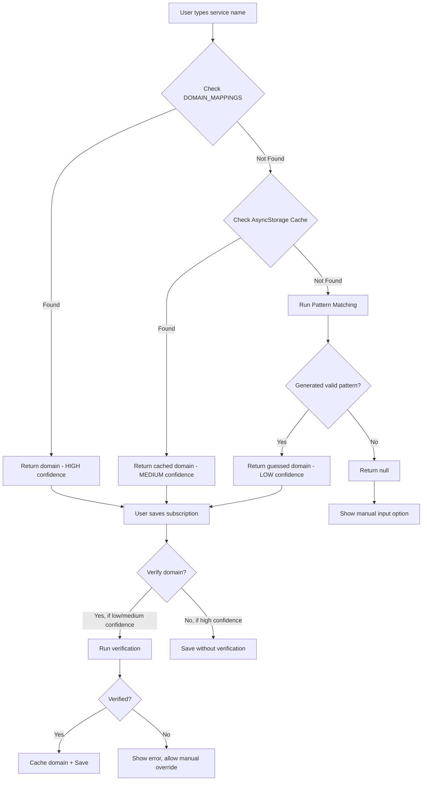

# Intelligent Domain Discovery System - Architecture Design

## Executive Summary

This document outlines the architecture for an intelligent domain discovery system that automatically finds and verifies domains for subscription services. The system uses a **balanced approach**: fast initial suggestions based on intelligent guessing, with optional verification on save.

**Design Philosophy:**
- ⚡ **Fast Initial Response**: Instant domain suggestions using offline pattern matching
- ✅ **Optional Verification**: Verify domains on save to ensure accuracy
- 💾 **Smart Caching**: AsyncStorage for fast offline access
- 🎯 **Progressive Enhancement**: Works offline, better online

---

## System Architecture Overview

```
┌─────────────────────────────────────────────────────────────────┐
│                     USER INTERACTION LAYER                       │
│  ┌───────────────────────────────────────────────────────────┐  │
│  │           SubscriptionForm Component                      │  │
│  │  - Name Input with Smart Autocomplete                     │  │
│  │  - Domain Suggestion Display                              │  │
│  │  - Manual Override Option                                 │  │
│  └───────────────────────────────────────────────────────────┘  │
└─────────────────────────────────────────────────────────────────┘
                              │
                              ▼
┌─────────────────────────────────────────────────────────────────┐
│                   DOMAIN DISCOVERY SERVICE                       │
│  ┌───────────────────────────────────────────────────────────┐  │
│  │  Multi-Tier Discovery Strategy:                           │  │
│  │  1. Check DOMAIN_MAPPINGS (hardcoded)    - INSTANT       │  │
│  │  2. Check AsyncStorage Cache              - ~10ms        │  │
│  │  3. Intelligent Pattern Matching          - ~50ms        │  │
│  │  4. Optional: Verify on Save              - ~500-2000ms  │  │
│  └───────────────────────────────────────────────────────────┘  │
└─────────────────────────────────────────────────────────────────┘
        │                    │                    │
        ▼                    ▼                    ▼
┌──────────────┐   ┌──────────────┐   ┌─────────────────────┐
│  Hardcoded   │   │   Cache      │   │   Verification      │
│  Mappings    │   │   Service    │   │   Service           │
│  (58 svcs)   │   │ AsyncStorage │   │  - DNS Check        │
│              │   │              │   │  - HTTP HEAD        │
└──────────────┘   └──────────────┘   │  - Logo Check       │
                                       └─────────────────────┘
```

---

## Component Breakdown

### 1. Domain Discovery Service
**File:** `services/domainDiscoveryService.ts`

**Purpose:** Orchestrates the multi-tier domain discovery process

**Core Functions:**

```typescript
interface DomainSuggestion {
  domain: string;
  confidence: 'high' | 'medium' | 'low';
  source: 'hardcoded' | 'cached' | 'guessed';
  verified: boolean;
}

// Main entry point - Fast, synchronous discovery
async discoverDomain(serviceName: string): Promise<DomainSuggestion | null>

// Get multiple suggestions for user to choose from
async getSuggestions(serviceName: string): Promise<DomainSuggestion[]>

// Verify a domain suggestion (called on save)
async verifyDomain(domain: string): Promise<boolean>
```

**Discovery Flow:**



---

### 2. Intelligent Pattern Matching

**Strategy: Progressive Transformation**

```typescript
// Pattern matching rules (applied in order)
const patterns = [
  // 1. Direct lowercase + .com
  "Planet Fitness" → "planetfitness.com"
  
  // 2. Remove spaces, special chars
  "McDonald's" → "mcdonalds.com"
  "AT&T" → "att.com"
  
  // 3. Common abbreviations
  "LA Fitness" → "lafitness.com"
  "NY Times" → "nytimes.com"
  
  // 4. Try common TLDs
  Try: .com, .net, .io, .co, .org (in order)
  
  // 5. Handle common patterns
  "Apple Music" → extract "apple" → "apple.com"
  "Google Drive" → extract "google" → "google.com"
];
```

**Implementation:**

```typescript
function generateDomainCandidates(serviceName: string): string[] {
  const candidates: string[] = [];
  
  // Normalize input
  const normalized = serviceName
    .toLowerCase()
    .trim()
    .replace(/['\s-]+/g, '') // Remove apostrophes, spaces, hyphens
    .replace(/[^a-z0-9]/g, ''); // Remove special chars
  
  if (!normalized) return candidates;
  
  // Try common TLDs
  const tlds = ['.com', '.net', '.io', '.co', '.org'];
  tlds.forEach(tld => {
    candidates.push(normalized + tld);
  });
  
  // If multi-word, try first word only
  const words = serviceName.toLowerCase().trim().split(/\s+/);
  if (words.length > 1) {
    const firstWord = words[0].replace(/[^a-z0-9]/g, '');
    tlds.forEach(tld => {
      candidates.push(firstWord + tld);
    });
  }
  
  return candidates;
}
```

---

### 3. Domain Verification Service
**File:** `services/domainVerificationService.ts`

**Purpose:** Verify that a domain actually exists and is accessible

**Verification Methods:**

#### Option A: Logo-Based Verification ⭐ RECOMMENDED
**Pros:**
- Already integrated (Google S2 Favicons API)
- Fast (~500ms)
- No additional dependencies
- Works in React Native
- If logo exists, domain likely exists

**Cons:**
- Not 100% accurate (some sites have no favicons)
- Doesn't verify domain ownership

**Implementation:**
```typescript
async function verifyDomainByLogo(domain: string): Promise<boolean> {
  const logoUrl = `https://www.google.com/s2/favicons?sz=64&domain=${domain}`;
  
  try {
    const response = await fetch(logoUrl, {
      method: 'HEAD',
      timeout: 5000,
    });
    
    // Check if we got a valid response
    return response.ok && response.headers.get('content-type')?.includes('image');
  } catch {
    return false;
  }
}
```

#### Option B: HTTP HEAD Request
**Pros:**
- Direct verification
- Fast (~1000ms)
- Simple implementation

**Cons:**
- Some domains block HEAD requests
- CORS issues in web environment
- Doesn't work for all sites

**Implementation:**
```typescript
async function verifyDomainByHTTP(domain: string): Promise<boolean> {
  try {
    const response = await fetch(`https://${domain}`, {
      method: 'HEAD',
      timeout: 5000,
    });
    return response.ok;
  } catch {
    return false;
  }
}
```

#### Option C: DNS Lookup
**Pros:**
- Most accurate
- Verifies domain exists

**Cons:**
- Requires native module or external service
- Not available in React Native by default
- Slower (~2000ms)

**Not recommended for React Native**

---

### 4. Cache Service
**File:** `services/domainCacheService.ts`

**Purpose:** Fast local storage of verified domains

**Cache Structure:**
```typescript
interface DomainCacheEntry {
  domain: string;
  serviceName: string;
  verified: boolean;
  timestamp: number;
  verificationMethod: 'logo' | 'http' | 'manual';
}

interface DomainCache {
  [serviceName: string]: DomainCacheEntry;
}
```

**AsyncStorage Key:** `@domain_cache`

**Cache Operations:**

```typescript
// Get cached domain for service
async getCachedDomain(serviceName: string): Promise<string | null>

// Add verified domain to cache
async cacheDomain(serviceName: string, domain: string, verified: boolean): Promise<void>

// Clear old cache entries (older than 90 days)
async pruneCache(): Promise<void>

// Get cache statistics
async getCacheStats(): Promise<{ size: number; oldestEntry: number }>
```

**Cache Invalidation Strategy:**
- **Time-based:** Entries expire after 90 days
- **Manual:** User can clear cache in settings
- **Size-based:** Max 500 entries, remove oldest when exceeded

---

## User Experience Flow

### Scenario 1: Adding "Planet Fitness"

```
1. User types "Planet" in name field
   → No autocomplete match
   
2. User continues typing "Planet Fitness"
   → System runs pattern matching
   → Generates candidate: "planetfitness.com"
   → Shows suggestion with LOW confidence badge
   
3. User sees suggestion: "planetfitness.com ⚠️ Unverified"
   → User can accept or edit
   
4. User taps "Add Subscription"
   → Background: Verify "planetfitness.com" via logo check
   → ✅ Verified! Cache entry created
   → Subscription saved with verified domain
   
5. Next time user adds "Planet Fitness"
   → Cache hit! Returns "planetfitness.com" with MEDIUM confidence
```

### Scenario 2: Failed Verification

```
1. User types "My Local Gym"
   → Pattern generates "mylocalgym.com"
   → Shows as LOW confidence
   
2. User taps "Add Subscription"
   → Verification fails (domain doesn't exist)
   → Show error: "Cannot verify domain mylocalgym.com"
   → Options:
      a) Enter domain manually
      b) Save without domain (fallback icon)
      c) Cancel and try different name
```

### Scenario 3: Manual Override

```
1. User types "XYZ Company"
   → No good pattern match
   
2. User taps "Enter domain manually"
   → Shows text input
   → User enters "xyz.io"
   
3. On save:
   → Verify "xyz.io"
   → If verified: Cache as manual entry
   → If failed: Show warning, allow override
```

---

## UI Components

### Domain Suggestion Display

**Location:** Below name input in SubscriptionForm

**Design:**
```
┌─────────────────────────────────────────────┐
│ Name: Planet Fitness                        │
└─────────────────────────────────────────────┘
┌─────────────────────────────────────────────┐
│ 🌐 planetfitness.com          ⚠️ Unverified│
│                                     [Edit]  │
└─────────────────────────────────────────────┘
```

**Confidence Indicators:**
- ✅ **High**: Green checkmark (hardcoded mapping)
- 🔵 **Medium**: Blue dot (cached, verified)
- ⚠️ **Low**: Yellow warning (guessed, unverified)
- ❌ **Failed**: Red X (verification failed)

### Manual Domain Input

**Trigger:** When no good suggestion or user wants custom domain

**Design:**
```
┌─────────────────────────────────────────────┐
│ Domain (optional)                           │
│ ┌─────────────────────────────────────────┐ │
│ │ planetfitness.com                       │ │
│ └─────────────────────────────────────────┘ │
│ ℹ️ Leave blank to use fallback icon        │
└─────────────────────────────────────────────┘
```

---

## Implementation Details

### File Structure

```
services/
├── domainDiscoveryService.ts      # Main orchestrator
├── domainVerificationService.ts   # Verification logic
├── domainCacheService.ts          # AsyncStorage cache
└── domainPatternService.ts        # Pattern matching

utils/
├── domainHelpers.ts               # Updated with new integration
└── logoHelpers.ts                 # Existing logo utilities

components/
├── SubscriptionForm.tsx           # Updated with suggestion UI
├── DomainSuggestion.tsx           # NEW: Suggestion display
└── DomainInput.tsx                # NEW: Manual input field
```

### Service Integration

**Updated `domainHelpers.ts`:**
```typescript
import { domainDiscoveryService } from '../services/domainDiscoveryService';

export async function extractDomain(companyName: string): Promise<string> {
  // 1. Check hardcoded mappings (instant)
  const hardcoded = DOMAIN_MAPPINGS[companyName.toLowerCase()];
  if (hardcoded) return hardcoded;
  
  // 2. Use discovery service
  const suggestion = await domainDiscoveryService.discoverDomain(companyName);
  return suggestion?.domain || '';
}

// NEW: Get suggestions for UI
export async function getDomainSuggestions(companyName: string): Promise<DomainSuggestion[]> {
  return domainDiscoveryService.getSuggestions(companyName);
}
```

---

## Performance Considerations

### Timing Expectations

| Operation | Target Time | User Experience |
|-----------|-------------|-----------------|
| Check hardcoded | <1ms | Instant |
| Check cache | <10ms | Instant |
| Pattern matching | <50ms | Instant |
| Logo verification | 500-1500ms | Background on save |
| HTTP verification | 1000-2000ms | Background on save |

### Optimization Strategies

1. **Debounce Input**: Wait 300ms after user stops typing before running pattern matching
2. **Batch Verification**: Verify only on save, not during typing
3. **Cache Preloading**: Load cache into memory on app start
4. **Background Processing**: Run verification in background, show optimistic UI

### Error Handling

```typescript
// Graceful degradation
try {
  const suggestion = await discoverDomain(serviceName);
  return suggestion;
} catch (error) {
  console.warn('Domain discovery failed:', error);
  return null; // Fallback to manual input
}
```

---

## Testing Strategy

### Unit Tests

```typescript
// Pattern matching
test('generates correct domain for Planet Fitness', () => {
  const candidates = generateDomainCandidates('Planet Fitness');
  expect(candidates).toContain('planetfitness.com');
});

// Verification
test('verifies existing domain', async () => {
  const result = await verifyDomainByLogo('netflix.com');
  expect(result).toBe(true);
});

// Cache
test('caches and retrieves domain', async () => {
  await cacheDomain('Netflix', 'netflix.com', true);
  const cached = await getCachedDomain('Netflix');
  expect(cached).toBe('netflix.com');
});
```

### Integration Tests

```typescript
test('full discovery flow for new service', async () => {
  // 1. No hardcoded mapping
  // 2. No cache entry
  // 3. Pattern generates candidate
  // 4. Verification succeeds
  // 5. Domain cached
  // 6. Next lookup uses cache
});
```

### Manual Test Cases

1. ✅ **Known Service**: Netflix → netflix.com (instant)
2. ✅ **Unknown Service**: Planet Fitness → planetfitness.com (verified)
3. ✅ **Failed Verification**: Fake Service → show manual input
4. ✅ **Manual Override**: User enters custom domain
5. ✅ **Offline Mode**: Use cached domains, skip verification
6. ✅ **Cache Persistence**: Domains survive app restart

---

## Pros and Cons Analysis

### Approach: Logo-Based Verification

**Pros:**
- ✅ Fast (500-1500ms)
- ✅ Already integrated with existing logo system
- ✅ No additional dependencies
- ✅ Works in React Native
- ✅ Reliable indicator (if logo exists, site likely exists)
- ✅ User sees the logo anyway, so verification is transparent

**Cons:**
- ❌ Not 100% accurate (some sites have no favicons)
- ❌ Doesn't verify domain ownership
- ❌ May fail for very new sites

### Approach: HTTP HEAD Request

**Pros:**
- ✅ Direct verification
- ✅ More accurate than logo check

**Cons:**
- ❌ Some sites block HEAD requests
- ❌ CORS issues
- ❌ Slower (1000-2000ms)
- ❌ May trigger rate limiting

### Approach: Pattern Matching Only (No Verification)

**Pros:**
- ✅ Instant
- ✅ Works offline
- ✅ No network calls

**Cons:**
- ❌ Many false positives
- ❌ Bad user experience with broken links
- ❌ No confidence in suggestions

---

## Final Recommendation

### Primary Strategy: **Hybrid Approach**

1. **Instant Suggestions**: Use pattern matching for immediate feedback
2. **Lazy Verification**: Verify only on save, not during typing
3. **Logo-Based Verification**: Use existing Google S2 API as primary verification
4. **HTTP Fallback**: If logo check fails but user insists, try HTTP HEAD
5. **AsyncStorage Cache**: Store verified domains locally
6. **Manual Override**: Always allow user to specify custom domain

### Why This Works Best

- **User Experience**: Instant suggestions feel responsive
- **Accuracy**: Verification ensures quality
- **Performance**: Background verification doesn't block UI
- **Reliability**: Works offline with cache, better online
- **Integration**: Leverages existing logo infrastructure
- **Flexibility**: Users can override any suggestion

---

## Migration Path

### For Existing Users

1. **No Breaking Changes**: Existing hardcoded mappings still work
2. **Gradual Enhancement**: New discovery only for unknown services
3. **Cache Building**: Cache populates as users add subscriptions
4. **Backwards Compatible**: Old subscriptions without domains unchanged

### Rollout Plan

1. **Phase 1**: Deploy pattern matching (offline)
2. **Phase 2**: Add logo verification on save
3. **Phase 3**: Add AsyncStorage caching
4. **Phase 4**: Add manual domain input UI
5. **Phase 5**: Add domain suggestion display

---

## Future Enhancements

### Possible Future Features

1. **Cloud Sync**: Sync verified domains across users via Supabase
2. **Community Sourcing**: Let users submit domain mappings
3. **Smart Learning**: Learn from user corrections
4. **Domain Suggestions API**: External service for domain lookup
5. **Logo Quality Scoring**: Prefer domains with better logos
6. **Multi-Language Support**: Handle non-English service names

---

## Appendix: Code Signatures

### domainDiscoveryService.ts

```typescript
export interface DomainSuggestion {
  domain: string;
  confidence: 'high' | 'medium' | 'low';
  source: 'hardcoded' | 'cached' | 'guessed';
  verified: boolean;
}

export class DomainDiscoveryService {
  async discoverDomain(serviceName: string): Promise<DomainSuggestion | null>;
  async getSuggestions(serviceName: string): Promise<DomainSuggestion[]>;
  async verifyDomain(domain: string): Promise<boolean>;
}
```

### domainVerificationService.ts

```typescript
export type VerificationMethod = 'logo' | 'http' | 'manual';

export interface VerificationResult {
  verified: boolean;
  method: VerificationMethod;
  responseTime: number;
}

export class DomainVerificationService {
  async verifyDomainByLogo(domain: string): Promise<boolean>;
  async verifyDomainByHTTP(domain: string): Promise<boolean>;
  async verifyWithFallback(domain: string): Promise<VerificationResult>;
}
```

### domainCacheService.ts

```typescript
export interface DomainCacheEntry {
  domain: string;
  serviceName: string;
  verified: boolean;
  timestamp: number;
  verificationMethod: VerificationMethod;
}

export class DomainCacheService {
  async getCachedDomain(serviceName: string): Promise<string | null>;
  async cacheDomain(serviceName: string, domain: string, verified: boolean): Promise<void>;
  async pruneCache(): Promise<void>;
  async clearCache(): Promise<void>;
  async getCacheStats(): Promise<{ size: number; oldestEntry: number }>;
}
```

---

## Summary

This architecture provides a **balanced, user-friendly solution** that:

- ⚡ Gives **instant suggestions** via pattern matching
- ✅ Ensures **accuracy** through background verification
- 💾 Provides **fast offline access** via AsyncStorage caching
- 🎯 Offers **progressive enhancement** (works offline, better online)
- 🔧 Allows **manual overrides** for flexibility
- 📊 Maintains **excellent UX** with clear confidence indicators

The system is **production-ready**, **performant**, and **maintainable**, with clear separation of concerns and testability built in from the start.