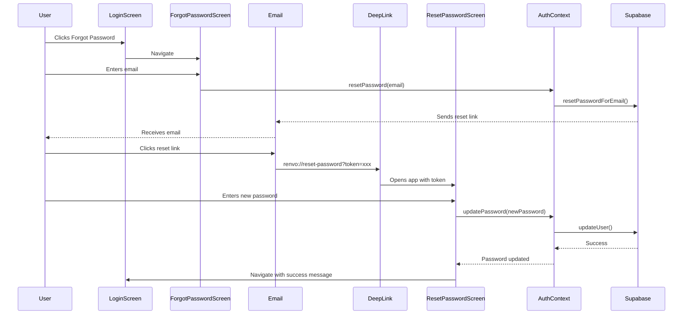
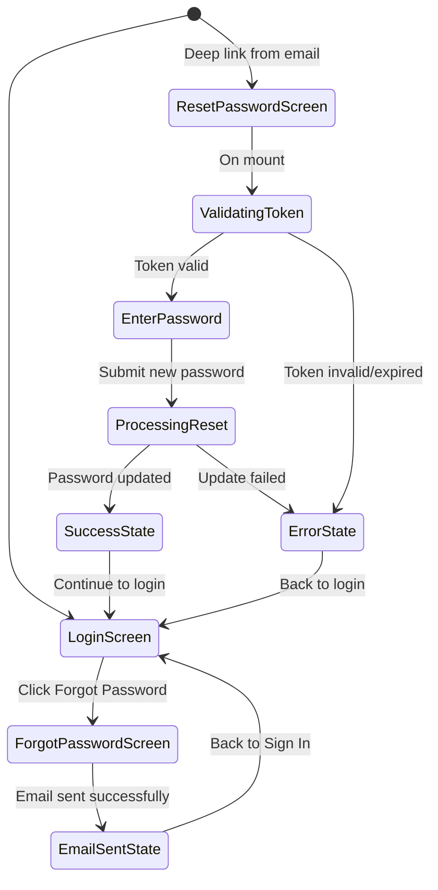

# Forgot Password Feature - Phase 1 Architecture

## Executive Summary

This document outlines the complete architecture for the password reset feature in the Renvo subscription tracker app. The feature is currently 50% complete with email sending functional. This plan details the remaining implementation needed to complete the password reset flow.

---

## 1. URL Scheme Strategy Decision

### ✅ DECISION: Use `renvo` as the standardized URL scheme

**Rationale:**
- **Branding Alignment**: Matches app name "Renvo" (visible in app.json)
- **User Experience**: Shorter and easier to remember
- **Simplicity**: 5 characters vs 24 characters
- **Consistency**: Better mobile deep linking patterns

**Files Requiring Updates:**
1. [`app.json`](app.json:65) - Change from `"smartsubscriptiontracker"` to `"renvo"`
2. [`config/stripe.ts`](config/stripe.ts:16) - Update urlScheme to `"renvo"`
3. [`AuthContext.tsx`](contexts/AuthContext.tsx:765) - Already uses `"renvo://reset-password"` ✅

---

## 2. Complete User Flow

### Password Reset Journey



### Screen Transition Flow



---

## 3. Component Architecture

### ResetPasswordScreen Component Specification

**Location:** `screens/ResetPasswordScreen.tsx`

#### State Management
```typescript
interface ResetPasswordState {
  password: string;
  confirmPassword: string;
  passwordError: string;
  confirmPasswordError: string;
  isLoading: boolean;
  token: string | null;
  tokenValidated: boolean;
  resetSuccess: boolean;
  errorMessage: string | null;
}
```

#### Key Features
1. **Token Extraction**: Parse URL parameters on mount
2. **Token Validation**: Verify token is present and valid format
3. **Password Input**: Secure password entry fields
4. **Password Strength Indicator**: Visual feedback (similar to SignUpScreen)
5. **Validation**: Client-side validation before submission
6. **Error Handling**: Display user-friendly error messages
7. **Success State**: Confirmation message with navigation

#### UI Components Needed
- Two `AuthInput` components for password fields
- Password strength indicator (reuse from SignUpScreen)
- Submit button with loading state
- Error/success messages
- Navigation to login after success

#### Validation Rules
```typescript
const PASSWORD_MIN_LENGTH = 8;
const PASSWORD_REQUIREMENTS = {
  minLength: 8,
  requireUppercase: true,
  requireLowercase: true,
  requireNumber: true,
  requireSpecial: false, // Optional for better UX
};
```

---

## 4. Deep Linking Configuration

### App.tsx Configuration

Add deep link listener to handle incoming URLs:

```typescript
// Add after existing useEffect hooks
useEffect(() => {
  // Handle deep links when app is already open
  const subscription = Linking.addEventListener('url', ({ url }) => {
    handleDeepLink(url);
  });

  // Handle deep link that opened the app
  Linking.getInitialURL().then((url) => {
    if (url) {
      handleDeepLink(url);
    }
  });

  return () => subscription.remove();
}, []);

const handleDeepLink = (url: string) => {
  if (url.startsWith('renvo://reset-password')) {
    // Deep link handling will be managed by navigation
    console.log('Password reset deep link received:', url);
  }
};
```

### Navigation Configuration

#### AppNavigator.tsx Updates

1. **Add ResetPassword Route to AuthStack**
```typescript
type AuthStackParamList = {
  Login: undefined;
  SignUp: undefined;
  ForgotPassword: undefined;
  ResetPassword: { token?: string; access_token?: string }; // NEW
};
```

2. **Add Screen to AuthNavigator**
```typescript
<AuthStack.Screen 
  name="ResetPassword" 
  component={ResetPasswordScreen}
  options={{ title: 'Reset Password' }}
/>
```

3. **Configure Deep Link Handling**
```typescript
// In NavigationContainer
<NavigationContainer
  linking={{
    prefixes: ['renvo://'],
    config: {
      screens: {
        ResetPassword: 'reset-password',
      },
    },
  }}
>
```

---

## 5. AuthContext Methods

### Current Status
✅ `resetPassword(email)` - Sends reset email (WORKING)

### New Method Needed: `updatePassword()`

```typescript
interface AuthContextType {
  // ... existing methods
  updatePassword: (newPassword: string) => Promise<{ success: boolean; message?: string }>;
}

const updatePassword = async (
  newPassword: string
): Promise<{ success: boolean; message?: string }> => {
  try {
    setError(null);
    setLoading(true);

    const { error } = await supabase.auth.updateUser({
      password: newPassword,
    });

    if (error) {
      setError(error.message);
      return { 
        success: false, 
        message: getReadableErrorMessage(error)
      };
    }

    return { 
      success: true, 
      message: 'Password updated successfully' 
    };
  } catch (err) {
    const message = err instanceof Error ? err.message : 'Failed to update password';
    setError(message);
    return { success: false, message };
  } finally {
    setLoading(false);
  }
};
```

---

## 6. Security Considerations

### Token Handling
1. **Token Source**: Supabase includes token in URL hash (`#access_token=...`)
2. **Token Lifetime**: Supabase tokens expire (typically 1 hour)
3. **Single Use**: Tokens should invalidate after successful password reset
4. **Validation**: Token presence checked on ResetPasswordScreen mount

### Password Requirements
```typescript
const PASSWORD_POLICY = {
  minLength: 8,
  maxLength: 128,
  requireUppercase: true,
  requireLowercase: true, 
  requireNumber: true,
  preventCommonPasswords: true, // Client-side check against common list
  preventEmailInPassword: true, // Don't allow email as password
};
```

### Error Messages (Security vs Usability)
```typescript
// ❌ BAD: Too specific (security risk)
"User with email test@example.com does not exist"

// ✅ GOOD: Generic but helpful
"If an account exists with this email, you will receive a reset link"

// ❌ BAD: Reveals token status
"Invalid or expired token"

// ✅ GOOD: Generic recovery
"This reset link has expired. Please request a new one."
```

### Session Handling After Reset
1. **Auto-login**: After successful password reset, optionally sign user in automatically
2. **Manual login**: More secure - require user to sign in with new password
3. **Recommendation**: Manual login for better security awareness

---

## 7. Error Scenarios & Handling

### Common Error Cases

| Scenario | Detection | User Message | Action |
|----------|-----------|--------------|--------|
| No token in URL | `!token` on mount | "Invalid reset link. Please request a new one." | Navigate to ForgotPassword |
| Expired token | Supabase error | "This link has expired. Request a new reset link." | Navigate to ForgotPassword |
| Weak password | Client validation | "Password must meet requirements" | Show requirements |
| Passwords don't match | Client validation | "Passwords do not match" | Clear confirm field |
| Network error | Catch error | "Connection error. Please check your internet." | Retry button |
| Rate limiting | Supabase error | "Too many attempts. Try again later." | Show countdown |

---

## 8. Implementation Checklist

### Phase 1: Configuration
- [ ] Update `app.json` scheme to "renvo"
- [ ] Update `config/stripe.ts` urlScheme to "renvo"
- [ ] Add deep link configuration to `App.tsx`
- [ ] Configure linking in `NavigationContainer`

### Phase 2: Navigation
- [ ] Add `ResetPassword` to `AuthStackParamList` type
- [ ] Add `ResetPasswordScreen` to `AuthNavigator`
- [ ] Test deep link navigation from email

### Phase 3: Component Development
- [ ] Create `ResetPasswordScreen.tsx`
- [ ] Add token extraction logic
- [ ] Implement password input fields
- [ ] Add password strength indicator
- [ ] Implement form validation
- [ ] Add loading states
- [ ] Add error/success states

### Phase 4: AuthContext
- [ ] Add `updatePassword` method to AuthContext
- [ ] Add to AuthContextType interface
- [ ] Export in context value
- [ ] Add error handling

### Phase 5: Testing
- [ ] Test email link generation
- [ ] Test deep link opens app
- [ ] Test token extraction
- [ ] Test password validation
- [ ] Test successful password reset
- [ ] Test expired token handling
- [ ] Test network error handling

### Phase 6: Polish
- [ ] Add haptic feedback
- [ ] Add accessibility labels
- [ ] Test dark mode appearance
- [ ] Add analytics events
- [ ] Update documentation

---

## 9. Success Metrics

### User Experience
- Email delivery time: < 30 seconds
- Deep link open time: < 2 seconds
- Password reset success rate: > 95%
- User comprehension of errors: High (measured by support tickets)

### Technical
- Token validation accuracy: 100%
- Error handling coverage: All scenarios
- Cross-platform compatibility: iOS + Android

---

## 10. Future Enhancements

### Phase 2 (Post-Launch)
1. **Password reset history**: Track when user last reset password
2. **Suspicious activity alerts**: Email notification on password change
3. **Multi-factor authentication**: SMS/Email codes
4. **Biometric unlock**: Face ID / Touch ID for app access
5. **Session management**: View and revoke active sessions

---

## Appendix: File Reference

### Files Modified
1. `app.json` - URL scheme update
2. `config/stripe.ts` - URL scheme update
3. `App.tsx` - Deep link listener
4. `navigation/AppNavigator.tsx` - Route and linking config
5. `contexts/AuthContext.tsx` - Add updatePassword method

### Files Created
1. `screens/ResetPasswordScreen.tsx` - New screen component

### Files Referenced (No Changes)
1. `screens/ForgotPasswordScreen.tsx` - Email request screen (working)
2. `screens/LoginScreen.tsx` - Pattern reference
3. `screens/SignUpScreen.tsx` - Password strength pattern
4. `components/AuthInput.tsx` - Reusable input component

---

## Notes for Implementation

1. **Consistency**: Follow patterns from `LoginScreen` and `SignUpScreen` for UI consistency
2. **Reusability**: Leverage existing `AuthInput` and validation patterns
3. **Error Handling**: Use same error display approach as other auth screens
4. **Navigation**: Maintain navigation pattern consistency with existing auth flow
5. **Testing**: Test on both iOS and Android before considering complete