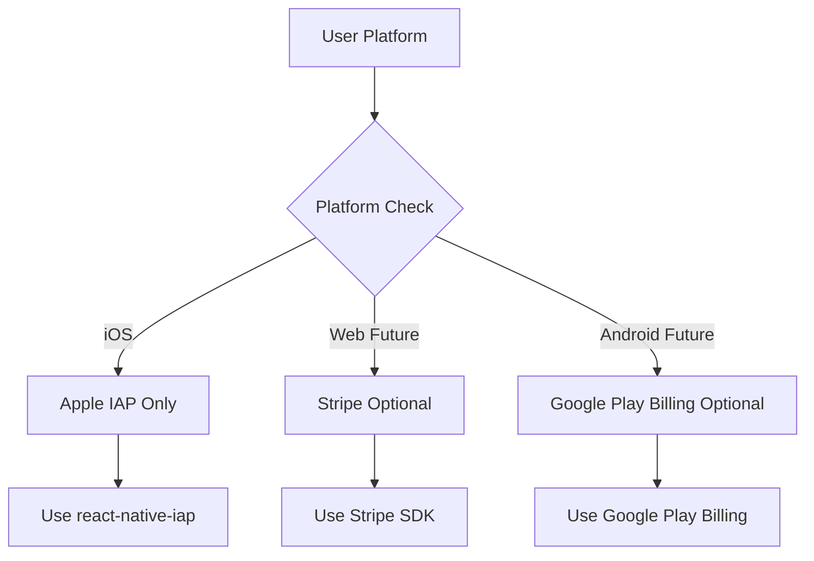

# Apple IAP Migration Strategy - Phase 5
## Stripe to Apple IAP Transition Plan

**Document Version:** 1.0.0  
**Last Updated:** 2024-12-05  
**Status:** Planning  

---

## Table of Contents

1. [Executive Summary](#executive-summary)
2. [Current State Analysis](#current-state-analysis)
3. [Migration Approach](#migration-approach)
4. [Database Cleanup Strategy](#database-cleanup-strategy)
5. [Platform Detection Logic](#platform-detection-logic)
6. [Code Changes Required](#code-changes-required)
7. [Testing Strategy](#testing-strategy)
8. [Rollback Plan](#rollback-plan)
9. [Timeline & Milestones](#timeline--milestones)
10. [Risk Assessment](#risk-assessment)

---

## Executive Summary

### Situation
Renvo has implemented both Stripe and Apple IAP payment systems. Currently:
- **No existing Stripe subscribers** (confirmed by team)
- Apple IAP fully implemented and functional for iOS
- Database schema supports dual payment providers
- App Store requires iOS apps to use Apple IAP for in-app subscriptions

### Strategy
Since there are no existing Stripe users to migrate, this is a **clean transition** rather than a traditional migration:
1. **Remove Stripe dependencies** from iOS builds
2. **Clean up database** tables and functions related to Stripe
3. **Simplify payment logic** to use Apple IAP exclusively on iOS
4. **Preserve Stripe infrastructure** for potential web/Android support later

### Timeline
**Estimated Duration:** 1-2 weeks

---

## Current State Analysis

### Implemented Systems

#### ✅ Apple IAP (Fully Implemented)
- **Configuration:** [`config/appleIAP.ts`](../config/appleIAP.ts)
- **Service:** [`services/appleIAPService.ts`](../services/appleIAPService.ts)
- **UI Integration:** [`components/PaywallModal.tsx`](../components/PaywallModal.tsx)
- **Backend:** 
  - [`supabase/functions/validate-apple-receipt`](../supabase/functions/validate-apple-receipt/index.ts)
  - [`supabase/functions/apple-webhook`](../supabase/functions/apple-webhook/index.ts)
- **Database:** [`database/apple_iap_migration.sql`](../database/apple_iap_migration.sql)

#### ⚠️ Stripe (Ready for Deprecation)
- **Configuration:** [`config/stripe.ts`](../config/stripe.ts)
- **UI Components:** References in PaywallModal
- **Backend Functions:**
  - `supabase/functions/create-subscription`
  - `supabase/functions/cancel-subscription`
  - `supabase/functions/stripe-webhook`
  - `supabase/functions/switch-billing-cycle`
  - `supabase/functions/request-refund`
  - `supabase/functions/get-billing-portal`
- **Database Tables:**
  - `user_subscriptions` (Stripe fields to deprecate)
  - `payment_transactions`
  - `refund_requests`
  - `stripe_webhooks`

### User Base Status
- **Total users:** All users currently on **Free tier**
- **Stripe subscribers:** **0 confirmed**
- **Apple IAP subscribers:** Ready to onboard

---

## Migration Approach

### Philosophy: Clean Transition

Since there are no existing Stripe subscribers:
- ✅ No user migration flows needed
- ✅ No grace periods required
- ✅ No dual-provider support needed
- ✅ Can deprecate Stripe code immediately on iOS

### Platform Strategy



### Payment Provider Decision Matrix

| Platform | Current Implementation | Post-Migration |
|----------|----------------------|----------------|
| **iOS** | Apple IAP + Stripe (dual) | **Apple IAP only** |
| **Web** | Stripe infrastructure exists | Keep for future use |
| **Android** | None | Add later if needed |

---

## Database Cleanup Strategy

### Approach: Deprecate but Don't Delete

**Rationale:**
1. Preserve Stripe infrastructure for potential web/Android support
2. Avoid breaking changes to existing database schema
3. Maintain audit trail capability
4. Allow easy rollback if needed

### Database Changes Required

#### 1. Profiles Table - Add Migration Flags

```sql
-- Add migration tracking columns
ALTER TABLE public.profiles 
ADD COLUMN IF NOT EXISTS stripe_deprecated BOOLEAN DEFAULT false,
ADD COLUMN IF NOT EXISTS ios_migrated_to_apple BOOLEAN DEFAULT false,
ADD COLUMN IF NOT EXISTS migration_completed_at TIMESTAMPTZ;

COMMENT ON COLUMN public.profiles.stripe_deprecated IS 'Marks Stripe payment method as deprecated for this user';
COMMENT ON COLUMN public.profiles.ios_migrated_to_apple IS 'Confirms iOS user fully migrated to Apple IAP';
```

#### 2. Update Helper Functions

```sql
-- Update get_user_subscription_status_with_provider to prioritize Apple IAP
CREATE OR REPLACE FUNCTION public.get_active_payment_provider(p_user_id UUID)
RETURNS TEXT
LANGUAGE plpgsql
SECURITY DEFINER
AS $$
DECLARE
  v_provider TEXT;
  v_platform TEXT;
BEGIN
  -- Get user's payment provider
  SELECT payment_provider INTO v_provider
  FROM public.profiles
  WHERE id = p_user_id;
  
  -- If Apple IAP is active, always use it (iOS requirement)
  IF v_provider = 'apple' THEN
    RETURN 'apple';
  END IF;
  
  -- Check for active Stripe subscription (web/future use)
  IF EXISTS (
    SELECT 1 FROM public.user_subscriptions
    WHERE user_id = p_user_id
    AND status IN ('active', 'trialing')
    AND stripe_subscription_id IS NOT NULL
  ) THEN
    RETURN 'stripe';
  END IF;
  
  RETURN NULL; -- Free tier
END;
$$;
```

#### 3. Deprecation Migration Script

Create [`database/deprecate_stripe_ios.sql`](../database/deprecate_stripe_ios.sql):

```sql
-- Mark all iOS users as stripe_deprecated
-- (Since we have no Stripe users, this is a safety measure)
UPDATE public.profiles
SET 
  stripe_deprecated = true,
  ios_migrated_to_apple = false,
  migration_completed_at = NOW()
WHERE EXISTS (
  SELECT 1 FROM auth.users 
  WHERE auth.users.id = profiles.id
);

-- Verify no active Stripe subscriptions exist
DO $$
DECLARE
  v_stripe_count INTEGER;
BEGIN
  SELECT COUNT(*) INTO v_stripe_count
  FROM public.user_subscriptions
  WHERE stripe_subscription_id IS NOT NULL
  AND status IN ('active', 'trialing', 'past_due');
  
  IF v_stripe_count > 0 THEN
    RAISE EXCEPTION 'Found % active Stripe subscriptions. Migration cannot proceed.', v_stripe_count;
  ELSE
    RAISE NOTICE 'Verified: 0 active Stripe subscriptions. Safe to proceed.';
  END IF;
END $$;
```

### Tables to Keep (For Future Web Support)

Keep these Stripe tables but mark as deprecated:
- ✅ `user_subscriptions` (needed for user subscription tracking)
- ✅ `payment_transactions` (audit trail)
- ✅ `refund_requests` (historical data)
- ✅ `stripe_webhooks` (debugging)
- ✅ `subscription_tiers` (shared by both systems)

### Environment Variables

**Keep but document as deprecated:**
```bash
# Deprecated - Keep for potential web support
EXPO_PUBLIC_STRIPE_PUBLISHABLE_KEY=pk_test_... # DEPRECATED for iOS
STRIPE_SECRET_KEY=sk_test_... # Server-side only, keep for web
STRIPE_WEBHOOK_SECRET=whsec_... # Server-side only, keep for web
```

---

## Platform Detection Logic

### Implementation Strategy

#### 1. Platform Detection Service

Create [`services/platformService.ts`](../services/platformService.ts):

```typescript
/**
 * Platform Detection Service
 * Determines which payment provider to use based on platform
 */

import { Platform } from 'react-native';

export type PaymentPlatform = 'ios' | 'android' | 'web';
export type PaymentProvider = 'apple' | 'google' | 'stripe' | null;

class PlatformService {
  /**
   * Get current platform
   */
  getPlatform(): PaymentPlatform {
    if (Platform.OS === 'ios') return 'ios';
    if (Platform.OS === 'android') return 'android';
    return 'web';
  }

  /**
   * Determine which payment provider to use
   */
  getPaymentProvider(): PaymentProvider {
    const platform = this.getPlatform();
    
    switch (platform) {
      case 'ios':
        return 'apple'; // Apple IAP required by App Store
      case 'android':
        return null; // TODO: Implement Google Play Billing
      case 'web':
        return null; // TODO: Implement Stripe for web
      default:
        return null;
    }
  }

  /**
   * Check if Apple IAP is available
   */
  isAppleIAPAvailable(): boolean {
    return Platform.OS === 'ios';
  }

  /**
   * Check if Stripe is available (web only)
   */
  isStripeAvailable(): boolean {
    // Future: Enable for web builds
    return false;
  }

  /**
   * Check if any payment system is available
   */
  canPurchase(): boolean {
    return this.getPaymentProvider() !== null;
  }
}

export const platformService = new PlatformService();
export default platformService;
```

#### 2. Update PaywallModal

Modify [`components/PaywallModal.tsx`](../components/PaywallModal.tsx):

```typescript
import platformService from '../services/platformService';
import appleIAPService from '../services/appleIAPService';

export default function PaywallModal({ visible, onClose, onUpgradePress }: PaywallModalProps) {
  const paymentProvider = platformService.getPaymentProvider();
  
  // Only show paywall if payment is available
  if (!paymentProvider) {
    return (
      <Modal visible={visible}>
        <Text>Payment not available on this platform</Text>
      </Modal>
    );
  }

  // iOS: Use Apple IAP
  if (paymentProvider === 'apple') {
    return <AppleIAPPaywall {...props} />;
  }

  // Future: Web Stripe, Android Google Play
  return null;
}
```

---

## Code Changes Required

### Priority 1: Critical Changes

#### 1. **Update [`config/stripe.ts`](../config/stripe.ts)**

Add deprecation notice:

```typescript
/**
 * Stripe Configuration
 * 
 * ⚠️ DEPRECATED FOR iOS
 * This configuration is kept for potential web support.
 * iOS builds MUST use Apple IAP (config/appleIAP.ts)
 * 
 * @deprecated Use config/appleIAP.ts for iOS builds
 */
```

#### 2. **Update [`components/PaywallModal.tsx`](../components/PaywallModal.tsx)**

```typescript
// Add platform check at the top
import { Platform } from 'react-native';
import platformService from '../services/platformService';

// Inside component:
const paymentProvider = platformService.getPaymentProvider();

if (Platform.OS === 'ios') {
  // Use Apple IAP products and purchase flow
  // Remove all Stripe references
}
```

#### 3. **Update [`screens/SettingsScreen.tsx`](../screens/SettingsScreen.tsx)**

Show correct payment provider:

```typescript
const paymentProvider = platformService.getPaymentProvider();

<Text>Payment Method: {paymentProvider === 'apple' ? 'Apple In-App Purchase' : 'Free Tier'}</Text>
```

#### 4. **Update [`services/subscriptionLimitService.ts`](../services/subscriptionLimitService.ts)**

```typescript
/**
 * Check subscription status - Apple IAP only on iOS
 */
async getSubscriptionStatus() {
  if (Platform.OS === 'ios') {
    return this.getAppleIAPStatus();
  }
  // Future: Check Stripe for web
  return this.getFreeStatus();
}
```

### Priority 2: Backend Functions

#### Keep But Document as Deprecated

Add deprecation headers to these Edge Functions:

- `supabase/functions/create-subscription/index.ts`
- `supabase/functions/cancel-subscription/index.ts`
- `supabase/functions/stripe-webhook/index.ts`
- `supabase/functions/switch-billing-cycle/index.ts`
- `supabase/functions/request-refund/index.ts`
- `supabase/functions/get-billing-portal/index.ts`

```typescript
/**
 * ⚠️ DEPRECATED FOR IOS
 * This function is kept for potential web support
 * iOS must use Apple IAP functions instead
 */
```

### Priority 3: Configuration Updates

#### Update [`app.json`](../app.json)

```json
{
  "expo": {
    "extra": {
      "paymentProvider": "apple",
      "stripeEnabled": false,
      "appleIAPEnabled": true
    }
  }
}
```

---

## Testing Strategy

### Test Scenarios

#### 1. iOS Platform Tests

| Test Case | Expected Result | Status |
|-----------|----------------|--------|
| Fresh install on iOS | User sees Apple IAP paywall | ⏳ |
| Upgrade to Premium via Apple IAP | Subscription activates immediately | ⏳ |
| Restore purchases | Previous purchases restored | ⏳ |
| Cancel subscription | Apple handles cancellation | ⏳ |
| Receipt validation | Server validates correctly | ⏳ |

#### 2. Database Tests

| Test Case | Expected Result | Status |
|-----------|----------------|--------|
| Check for Stripe users | Count = 0 | ⏳ |
| Verify payment_provider field | All NULL or 'apple' | ⏳ |
| Test helper functions | Return correct provider | ⏳ |
| Migration script dry-run | No errors, 0 affected users | ⏳ |

#### 3. Edge Cases

- User with no payment provider → Free tier
- User switches platforms → Payment provider persists
- Database migration rollback → System stable

### Testing Checklist

```markdown
## Pre-Migration Tests
- [ ] Verify 0 active Stripe subscriptions in database
- [ ] Confirm all users are on free tier
- [ ] Backup production database
- [ ] Test migration script on staging

## Post-Migration Tests
- [ ] iOS users can purchase via Apple IAP
- [ ] Free tier limits enforced correctly
- [ ] Subscription status syncs correctly
- [ ] Receipt validation works end-to-end
- [ ] Apple webhook handling functional
- [ ] No broken Stripe references in logs

## Regression Tests
- [ ] Existing free tier users unaffected
- [ ] User data intact after migration
- [ ] App performance unchanged
- [ ] No crashes or errors in production
```

---

## Rollback Plan

### Rollback Triggers

Initiate rollback if:
1. Apple IAP purchase flow fails for >10% of attempts
2. Receipt validation fails consistently
3. Database corruption detected
4. Critical bugs in production

### Rollback Steps

#### 1. Code Rollback
```bash
# Revert to previous release
git revert <migration-commit-hash>
git push origin main

# Redeploy previous version
eas build --platform ios --profile production
```

#### 2. Database Rollback
```sql
-- Rollback migration flags
UPDATE public.profiles
SET 
  stripe_deprecated = false,
  ios_migrated_to_apple = false,
  migration_completed_at = NULL;

-- Verify rollback
SELECT 
  COUNT(*) as users_rolled_back,
  COUNT(*) FILTER (WHERE stripe_deprecated = false) as stripe_available
FROM public.profiles;
```

#### 3. Configuration Rollback
```bash
# Restore Stripe environment variables
# Re-enable Stripe in app.json
# Rebuild and redeploy
```

### Rollback Timeline
**Target:** < 2 hours from decision to rollback

---

## Timeline & Milestones

### Phase 5.1: Planning & Preparation (2-3 days)
- [x] Create migration strategy document
- [ ] Review and approve strategy with team
- [ ] Set up staging environment for testing
- [ ] Create database backup procedures

### Phase 5.2: Code Changes (3-4 days)
- [ ] Create `platformService.ts`
- [ ] Update `PaywallModal.tsx` for iOS-only Apple IAP
- [ ] Add deprecation notices to Stripe files
- [ ] Update `SettingsScreen.tsx` payment provider display
- [ ] Update subscription limit service

### Phase 5.3: Database Migration (1-2 days)
- [ ] Create deprecation migration script
- [ ] Test migration on staging database
- [ ] Verify 0 Stripe users before production run
- [ ] Execute migration on production
- [ ] Verify migration success

### Phase 5.4: Testing & Validation (2-3 days)
- [ ] Test iOS purchase flow end-to-end
- [ ] Verify receipt validation
- [ ] Test subscription status checks
- [ ] Validate webhook processing
- [ ] Perform regression testing

### Phase 5.5: Deployment & Monitoring (1-2 days)
- [ ] Deploy to TestFlight for beta testing
- [ ] Monitor for issues
- [ ] Deploy to App Store
- [ ] Monitor production metrics for 48 hours

### Total Timeline: 9-14 days (1.5-2 weeks)

---

## Risk Assessment

### High Priority Risks

#### Risk 1: Undiscovered Stripe Users
**Likelihood:** Low  
**Impact:** High  
**Mitigation:**
- Run verification query before migration
- Add safety checks in migration script
- Keep rollback plan ready

**Verification Query:**
```sql
SELECT 
  COUNT(*) as active_stripe_users,
  array_agg(user_id) as user_ids
FROM public.user_subscriptions
WHERE stripe_subscription_id IS NOT NULL
AND status IN ('active', 'trialing', 'past_due');
```

#### Risk 2: Apple IAP Purchase Failures
**Likelihood:** Medium  
**Impact:** High  
**Mitigation:**
- Comprehensive error handling
- Retry logic for transient failures
- Clear user messaging
- Support contact for issues

#### Risk 3: Receipt Validation Issues
**Likelihood:** Medium  
**Impact:** High  
**Mitigation:**
- Test sandbox thoroughly
- Monitor validation success rate
- Have manual validation process ready
- Log all validation attempts

### Medium Priority Risks

#### Risk 4: Database Migration Errors
**Likelihood:** Low  
**Impact:** Medium  
**Mitigation:**
- Test on staging first
- Full database backup before migration
- Idempotent migration scripts
- Rollback plan documented

#### Risk 5: Platform Detection Bugs
**Likelihood:** Low  
**Impact:** Medium  
**Mitigation:**
- Unit tests for platform service
- Test on multiple iOS versions
- Clear error messaging
- Fallback to free tier if detection fails

---

## Success Criteria

### Technical Success Metrics

- ✅ 0 Stripe subscriptions remaining
- ✅ Apple IAP purchase success rate >95%
- ✅ Receipt validation success rate >98%
- ✅ No increase in crash rate
- ✅ Page load times unchanged
- ✅ Database query performance unchanged

### Business Success Metrics

- ✅ No disruption to free tier users
- ✅ New iOS users can purchase successfully
- ✅ Support ticket volume unchanged
- ✅ App Store approval maintained
- ✅ Revenue tracking working correctly

### User Experience Metrics

- ✅ Purchase flow completes in <30 seconds
- ✅ Clear error messages for failures
- ✅ Subscription status visible in settings
- ✅ Restore purchases works reliably

---

## Post-Migration Actions

### Immediate (Week 1)
- [ ] Monitor Apple IAP purchase success rates
- [ ] Track receipt validation errors
- [ ] Review support tickets daily
- [ ] Monitor app crashes and errors

### Short Term (Weeks 2-4)
- [ ] Analyze purchase conversion rates
- [ ] Review revenue metrics
- [ ] Optimize purchase flow based on data
- [ ] Update documentation

### Long Term (Months 2-3)
- [ ] Consider Stripe implementation for web
- [ ] Evaluate Android/Google Play Billing
- [ ] Add promotional pricing features
- [ ] Implement family sharing (if needed)

---

## FAQ

### Q: What happens to the Stripe infrastructure?
**A:** It remains in the codebase but deprecated for iOS. Can be reactivated for web support later.

### Q: Can we revert back to Stripe if needed?
**A:** Yes, the rollback plan allows reverting within 2 hours.

### Q: What if we discover Stripe users during migration?
**A:** Migration script will fail with error. Manual assessment required.

### Q: How do we handle refunds?
**A:** Apple handles refunds through App Store. Users contact Apple, not us.

### Q: Can users on multiple devices have issues?
**A:** No. Apple IAP subscriptions sync across devices via Apple ID.

### Q: What about users who paid via Stripe before?
**A:** Confirmed: No existing Stripe users. Any historical users start fresh on free tier.

---

## Configuration Checklist

### Environment Variables

```bash
# iOS Production
✅ APPLE_APP_BUNDLE_ID=com.renvo.app
✅ APPLE_SHARED_SECRET=[from App Store Connect]
✅ SUPABASE_URL=[production url]
✅ SUPABASE_SERVICE_ROLE_KEY=[service key]

# Deprecated (keep for web)
⚠️ EXPO_PUBLIC_STRIPE_PUBLISHABLE_KEY=[deprecated for iOS]
⚠️ STRIPE_SECRET_KEY=[server only, keep for web]
⚠️ STRIPE_WEBHOOK_SECRET=[server only, keep for web]
```

### App Store Connect

- [ ] Products configured correctly
- [ ] Subscription group set up
- [ ] Pricing verified
- [ ] App metadata updated
- [ ] Webhook URL configured

### Database

- [ ] Migration script tested
- [ ] Backup created
- [ ] RLS policies verified
- [ ] Helper functions updated

---

## Appendix

### Key Files Changed

| File | Change Type | Description |
|------|-------------|-------------|
| `config/stripe.ts` | Deprecate | Add deprecation notice |
| `components/PaywallModal.tsx` | Update | iOS uses Apple IAP only |
| `services/platformService.ts` | Create | New platform detection |
| `database/deprecate_stripe_ios.sql` | Create | Database migration |
| `screens/SettingsScreen.tsx` | Update | Show Apple IAP status |

### Database Schema Changes

```sql
-- Added columns to profiles table
- stripe_deprecated: BOOLEAN
- ios_migrated_to_apple: BOOLEAN  
- migration_completed_at: TIMESTAMPTZ

-- New function
- get_active_payment_provider(UUID): TEXT
```

### Useful Commands

```bash
# Verify no Stripe users
psql $DATABASE_URL -c "SELECT COUNT(*) FROM user_subscriptions WHERE stripe_subscription_id IS NOT NULL;"

# Run migration (staging)
psql $STAGING_DATABASE_URL -f database/deprecate_stripe_ios.sql

# Create backup
pg_dump $DATABASE_URL > backup_pre_migration_$(date +%Y%m%d).sql

# Monitor Apple IAP
tail -f logs/apple_iap.log | grep -E "purchase|error"
```

---

## Conclusion

This migration strategy provides a clean transition from dual payment provider support to Apple IAP-only for iOS, while preserving the option to add Stripe for web in the future. The approach is **low-risk** since no existing users need migration, and includes comprehensive testing, monitoring, and rollback procedures.

**Next Steps:**
1. Review this strategy with the team
2. Get approval for database changes
3. Begin Phase 5.2 (Code Changes)
4. Execute migration on staging environment

---

**Document Owner:** Development Team  
**Last Review Date:** 2024-12-05  
**Next Review Date:** Post-migration (2024-12-20)