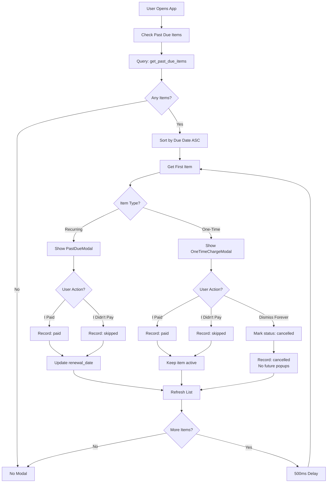

# One-Time Charge Past Due Popup - Design Document

## Overview
This document outlines the design and implementation plan for adding past due detection and popup functionality for one-time charges (`repeat_interval = 'never'`). The feature integrates with the existing past due system for recurring charges, creating a unified experience.

---

## Problem Statement

Currently, one-time charges are excluded from the past due popup system because:
- They don't need renewal date updates (no recurring payment)
- The existing system was designed specifically for recurring items
- Users have no way to track when they've paid one-time charges that are overdue

**User Need**: A way to record payment confirmation for one-time charges that have passed their due date, similar to the experience for recurring charges.

---

## Design Decisions

### 1. Unified Queue System
**Decision**: Mix recurring and one-time past due items in a single queue, ordered by oldest due date first.

**Rationale**: 
- Fairest approach - handles items in chronological order
- Users see the oldest overdue item first regardless of type
- Simpler mental model than separate queues
- Consistent with user expectation

### 2. Three-Button Interface for One-Time Charges
**Buttons**:
- **"I Paid"** - Marks as paid, records in payment history, keeps item active
- **"I Didn't Pay"** - Marks as skipped, records in payment history, keeps item active
- **"Dismiss Forever"** - Marks item as cancelled, won't appear in past due queue again

**Rationale**:
- Consistency with recurring charge UX (first two buttons)
- Additional "Dismiss Forever" addresses unique one-time charge scenario
- Users may realize a one-time charge is no longer relevant after it becomes past due

### 3. Keep Items Active After Payment
**Decision**: One-time charges remain visible in the subscription list after being marked as paid.

**Rationale**:
- Provides historical record of one-time expenses
- Users can see what they've paid in the past
- Consistent with general ledger/expense tracking patterns
- Users can manually delete items if desired

---

## Architecture

### System Flow



---

## Database Changes

### 1. Update `get_past_due_items` Function

**Location**: [`database/fix_get_past_due_items_function.sql`](../database/fix_get_past_due_items_function.sql)

**Changes**:
```sql
CREATE OR REPLACE FUNCTION public.get_past_due_items(p_user_id UUID)
RETURNS TABLE (
  id UUID,
  name TEXT,
  cost NUMERIC,
  renewal_date DATE,
  repeat_interval VARCHAR(20),
  days_past_due INTEGER,
  category TEXT,
  domain TEXT,
  color TEXT
)
LANGUAGE plpgsql
SECURITY DEFINER
AS $$
BEGIN
  RETURN QUERY
  SELECT 
    ri.id,
    ri.name,
    ri.cost,
    ri.renewal_date,
    ri.repeat_interval,
    (CURRENT_DATE - ri.renewal_date)::INTEGER AS days_past_due,
    ri.category,
    ri.domain,
    ri.color
  FROM public.recurring_items ri
  WHERE ri.user_id = p_user_id
    AND ri.renewal_date < CURRENT_DATE
    AND ri.status = 'active'
    -- REMOVED: AND ri.repeat_interval != 'never'
    -- Now includes one-time charges!
  ORDER BY ri.renewal_date ASC;  -- Oldest first
END;
$$;
```

**Key Change**: Removed the exclusion of `repeat_interval = 'never'` items, allowing one-time charges to appear in results.

### 2. Update `record_payment_and_update_renewal` Function

**Location**: [`database/payment_history_migration.sql`](../database/payment_history_migration.sql)

**Changes**:
```sql
-- In the function body, add conditional logic:

-- Calculate next renewal date from the original due date
-- Only relevant for recurring items
IF v_repeat_interval != 'never' THEN
  v_new_renewal_date := v_due_date + v_interval_days;
END IF;

-- Insert payment history record (for ALL items)
INSERT INTO public.payment_history (
  recurring_item_id,
  user_id,
  due_date,
  payment_date,
  status,
  amount,
  notes
) VALUES (
  p_recurring_item_id,
  p_user_id,
  v_due_date,
  p_payment_date,
  p_status,
  v_amount,
  p_notes
) RETURNING id INTO v_payment_id;

-- Update recurring item's renewal date (ONLY if not one-time)
IF v_repeat_interval != 'never' THEN
  UPDATE public.recurring_items
  SET 
    renewal_date = v_new_renewal_date,
    updated_at = NOW()
  WHERE id = p_recurring_item_id AND user_id = p_user_id;
END IF;
```

**Key Changes**: 
- Payment history is recorded for both recurring and one-time items
- Renewal date update is skipped for one-time charges
- Status remains 'active' for one-time charges (unless dismissed)

### 3. Add "Dismiss Forever" Support

**New Function**:
```sql
CREATE OR REPLACE FUNCTION public.dismiss_one_time_charge(
  p_recurring_item_id UUID,
  p_user_id UUID
)
RETURNS BOOLEAN
LANGUAGE plpgsql
SECURITY DEFINER
AS $$
DECLARE
  v_repeat_interval VARCHAR(20);
BEGIN
  -- Verify it's a one-time charge
  SELECT repeat_interval INTO v_repeat_interval
  FROM public.recurring_items
  WHERE id = p_recurring_item_id AND user_id = p_user_id;
  
  IF v_repeat_interval != 'never' THEN
    RAISE EXCEPTION 'Can only dismiss one-time charges';
  END IF;
  
  -- Mark as cancelled
  UPDATE public.recurring_items
  SET 
    status = 'cancelled',
    updated_at = NOW()
  WHERE id = p_recurring_item_id AND user_id = p_user_id;
  
  -- Record in payment history as cancelled
  INSERT INTO public.payment_history (
    recurring_item_id,
    user_id,
    due_date,
    payment_date,
    status,
    amount,
    notes
  ) SELECT
    id,
    user_id,
    renewal_date,
    CURRENT_DATE,
    'cancelled',
    cost,
    'Dismissed by user'
  FROM public.recurring_items
  WHERE id = p_recurring_item_id;
  
  RETURN TRUE;
END;
$$;
```

---

## Type System Updates

### PastDueItem Type Enhancement

**Location**: [`types/index.ts`](../types/index.ts)

**Add computed field**:
```typescript
export interface PastDueItem extends RecurringItem {
  days_past_due: number;
  is_one_time: boolean;  // Computed: repeat_interval === 'never'
}
```

### Payment History Status Update

**Add new status**:
```typescript
export type PaymentHistoryStatus = 'paid' | 'skipped' | 'pending' | 'cancelled';
```

---

## Component Architecture

### New Component: `OneTimeChargeModal.tsx`

**Purpose**: Simplified modal for one-time charge past due items.

**Key Differences from PastDueModal**:

| Aspect | PastDueModal (Recurring) | OneTimeChargeModal (One-Time) |
|--------|-------------------------|-------------------------------|
| Title | "Payment Due" | "One-Time Charge Due" |
| Subtitle | "Did you pay for this subscription?" | "Did you pay for this charge?" |
| Info Displayed | Name, Amount, Due Date, Days Past Due | Same |
| Buttons | 2: "I Paid", "I Didn't Pay" | 3: "I Paid", "I Didn't Pay", "Dismiss Forever" |
| Icon | Alert circle (warning) | Same or calendar icon |
| Next Renewal | Shows next renewal date | Not applicable |

**Component Interface**:
```typescript
interface OneTimeChargeModalProps {
  visible: boolean;
  item: PastDueItem | null;
  onPaid: (itemId: string) => Promise<void>;
  onSkipped: (itemId: string) => Promise<void>;
  onDismiss: (itemId: string) => Promise<void>;  // NEW
  onClose: () => void;
}
```

**Button Styling**:
- **"I Paid"**: Primary color (green/blue) - most prominent
- **"I Didn't Pay"**: Secondary/outlined - less prominent
- **"Dismiss Forever"**: Tertiary/text button with warning color - least prominent

---

## Service Layer Updates

### Update `pastDueService.ts`

**Location**: [`services/pastDueService.ts`](../services/pastDueService.ts)

**New Function**:
```typescript
/**
 * Dismiss a one-time charge forever (mark as cancelled)
 * 
 * @param recurringItemId - ID of the one-time charge
 * @returns Promise with result
 */
export async function dismissOneTimeCharge(
  recurringItemId: string
): Promise<{
  data: boolean | null;
  error: string | null;
}> {
  try {
    const { data: { session }, error: sessionError } = await supabase.auth.getSession();
    
    if (sessionError || !session) {
      return { data: null, error: 'No active session' };
    }

    const { data, error } = await supabase
      .rpc('dismiss_one_time_charge', {
        p_recurring_item_id: recurringItemId,
        p_user_id: session.user.id,
      });

    if (error) {
      console.error('Error dismissing one-time charge:', error);
      return { data: null, error: error.message };
    }

    return { data: data, error: null };
  } catch (err) {
    const message = err instanceof Error ? err.message : 'Failed to dismiss charge';
    console.error('Error in dismissOneTimeCharge:', err);
    return { data: null, error: message };
  }
}
```

**Add to export**:
```typescript
export const pastDueService = {
  getPastDueItems,
  recordPayment,
  getPaymentHistory,
  getPaymentStats,
  dismissOneTimeCharge,  // NEW
  isPastDue,
  getDaysPastDue,
};
```

---

## HomeScreen Integration

### Update HomeScreen Logic

**Location**: [`screens/HomeScreen.tsx`](../screens/HomeScreen.tsx)

**Add Handler**:
```typescript
// Handle dismiss forever for one-time charges
const handleDismissOneTime = useCallback(async (itemId: string) => {
  try {
    const { data, error } = await pastDueService.dismissOneTimeCharge(itemId);
    
    if (error) {
      throw new Error(error);
    }
    
    if (__DEV__) {
      console.log('One-time charge dismissed successfully');
    }
    
    // Close current modal
    setPastDueModalVisible(false);
    
    // Remove from past due list
    const remainingItems = pastDueItems.filter(item => item.id !== itemId);
    setPastDueItems(remainingItems);
    
    // Refresh to update UI
    await loadSubscriptions(true);
    
    // Show next item if available
    if (remainingItems.length > 0) {
      setTimeout(() => {
        setCurrentPastDueItem(remainingItems[0]);
        setPastDueModalVisible(true);
      }, 500);
    } else {
      setCurrentPastDueItem(null);
    }
  } catch (error) {
    console.error('Error dismissing one-time charge:', error);
    throw error;
  }
}, [pastDueItems, loadSubscriptions]);
```

**Update Modal Rendering**:
```typescript
{/* Past Due Modal - Dynamic based on item type */}
{currentPastDueItem?.repeat_interval === 'never' ? (
  <OneTimeChargeModal
    visible={pastDueModalVisible}
    item={currentPastDueItem}
    onPaid={handlePaymentPaid}
    onSkipped={handlePaymentSkipped}
    onDismiss={handleDismissOneTime}
    onClose={() => setPastDueModalVisible(false)}
  />
) : (
  <PastDueModal
    visible={pastDueModalVisible}
    item={currentPastDueItem}
    onPaid={handlePaymentPaid}
    onSkipped={handlePaymentSkipped}
    onClose={() => setPastDueModalVisible(false)}
  />
)}
```

---

## Edge Cases & Considerations

### 1. Item Due Today
- **Behavior**: Not considered past due yet
- **Logic**: `renewal_date < CURRENT_DATE` (strict less than)
- **Reason**: Give users until end of day to pay

### 2. Multiple Days Past Due
- **Behavior**: Show days past due count in modal
- **Calculation**: `CURRENT_DATE - renewal_date`
- **Display**: "5 days past due"

### 3. User Deletes Item Instead
- **Behavior**: CASCADE delete removes payment_history entries
- **Alternative**: User can use "Dismiss Forever" to keep history

### 4. Dismissed Item Later Edited
- **Behavior**: Status remains 'cancelled', won't appear in past due queue
- **User Action**: User must manually change status to 'active' if they want it back

### 5. Payment History Tracking
- **One-Time Paid**: Record with `status='paid'`, item stays active
- **One-Time Skipped**: Record with `status='skipped'`, item stays active
- **One-Time Dismissed**: Record with `status='cancelled'`, item marked cancelled

### 6. Mixed Queue Ordering
**Example**:
```
User has:
- Netflix (recurring, 5 days overdue)    → PastDueModal
- Doctor Bill (one-time, 3 days overdue) → OneTimeChargeModal
- Gym (recurring, 1 day overdue)         → PastDueModal

Display order:
1. Netflix (oldest)
2. Doctor Bill
3. Gym
```

### 7. Concurrent Past Due Items
- **Behavior**: Process one at a time with 500ms delay between modals
- **Reason**: Avoid overwhelming user with multiple popups

---

## User Experience Guidelines

### Modal Copy

**OneTimeChargeModal**:
- **Title**: "One-Time Charge Due"
- **Subtitle**: "Did you pay for this charge?"
- **Button 1**: "I Paid" (primary action)
- **Button 2**: "I Didn't Pay" (secondary action)
- **Button 3**: "Dismiss Forever" (tertiary, warning style)

### Visual Design
- Use same card/modal styling as [`PastDueModal`](../components/PastDueModal.tsx)
- Match theme colors (dark/light mode support)
- Add subtle visual indicator it's a one-time charge (optional badge)

### Haptic Feedback
- "I Paid": Success haptic
- "I Didn't Pay": Light haptic
- "Dismiss Forever": Warning haptic

### Accessibility
- Screen reader support for all buttons
- Clear button labels
- Adequate touch target sizes (minimum 44x44pt)

---

## Testing Strategy

### Unit Tests
- [ ] `pastDueService.dismissOneTimeCharge()` success case
- [ ] `pastDueService.dismissOneTimeCharge()` error handling
- [ ] Database function `dismiss_one_time_charge()` validation
- [ ] Payment history recording for cancelled status

### Integration Tests
- [ ] Mixed queue ordering (recurring + one-time)
- [ ] Sequential modal display after dismissing
- [ ] OneTimeChargeModal button interactions
- [ ] Status updates after dismiss

### User Acceptance Tests
1. Create one-time charge with past due date
2. Open app - verify OneTimeChargeModal appears
3. Click "I Paid" - verify payment recorded, item stays active
4. Create another past due one-time charge
5. Click "Dismiss Forever" - verify status='cancelled', no future popup
6. Mix recurring and one-time past due items - verify correct ordering

---

## Migration Path

### Phase 1: Database Updates
1. Update `get_past_due_items` function to include one-time charges
2. Update `record_payment_and_update_renewal` to handle one-time charges
3. Create `dismiss_one_time_charge` function
4. Test database changes in development

### Phase 2: Type System & Service Layer
1. Add `is_one_time` to `PastDueItem` type
2. Add 'cancelled' to `PaymentHistoryStatus` type
3. Implement `dismissOneTimeCharge` in pastDueService
4. Add unit tests

### Phase 3: Component Development
1. Create `OneTimeChargeModal.tsx` component
2. Add styling and animations
3. Implement three-button logic
4. Test in isolation

### Phase 4: Integration
1. Update HomeScreen to handle one-time charge modals
2. Add `handleDismissOneTime` handler
3. Update modal rendering logic
4. Test full flow

### Phase 5: Testing & Documentation
1. Comprehensive testing (unit, integration, UAT)
2. Update existing documentation
3. Create user-facing help text
4. Monitor analytics post-launch

---

## Success Metrics

- **Adoption**: % of users who interact with one-time past due popups
- **Completion**: % of one-time charges marked as paid within 24 hours
- **Dismissal Rate**: % of one-time charges dismissed vs paid/skipped
- **User Satisfaction**: Feedback on simplified one-time charge UX

---

## Future Enhancements

### V2 Features
- Bulk handling of multiple one-time charges
- "Remind me in X days" option for one-time charges
- One-time charge calendar view
- Statistics: Total one-time expenses over time
- Category-based insights for one-time charges

### Analytics Opportunities
- Track common one-time charge categories
- Identify patterns in dismissal vs payment
- Compare recurring vs one-time charge payment rates

---

## Rollout Strategy

1. **Deploy database migrations** (no user-facing changes yet)
2. **Deploy service layer** with feature flag disabled
3. **Internal testing** with development accounts
4. **Beta testing** with 5% of users (feature flag enabled)
5. **Monitor metrics** for 1 week
6. **Gradual rollout** to 100% of users
7. **Post-launch monitoring** for issues

---

## Security Considerations

- RLS policies: Users can only dismiss their own items
- Function security: `SECURITY DEFINER` with user_id validation
- No sensitive data logged in payment history
- Cascade deletes preserve referential integrity

---

## Performance Considerations

- Past due check: Once per app focus (cached)
- Database query: Indexed on `renewal_date` and `status`
- Modal rendering: Lazy-loaded, minimal re-renders
- No blocking operations on app startup

---

## Summary

This design provides a comprehensive solution for one-time charge past due tracking that:

✅ **Integrates seamlessly** with existing recurring charge system  
✅ **Maintains consistency** with familiar UX patterns  
✅ **Adds flexibility** with "Dismiss Forever" option  
✅ **Handles edge cases** thoughtfully  
✅ **Follows best practices** for database design, type safety, and testing  

The implementation is designed to be **incremental, testable, and maintainable**.