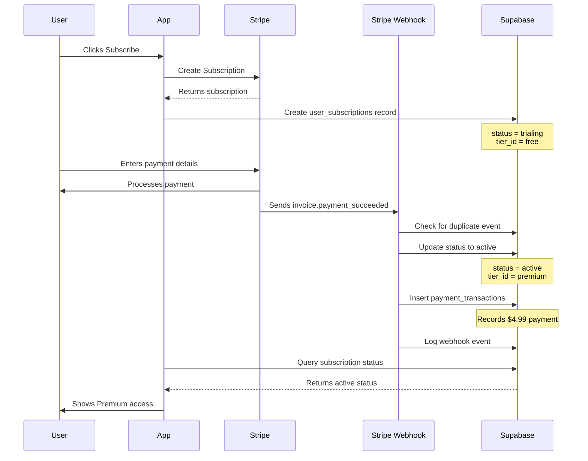
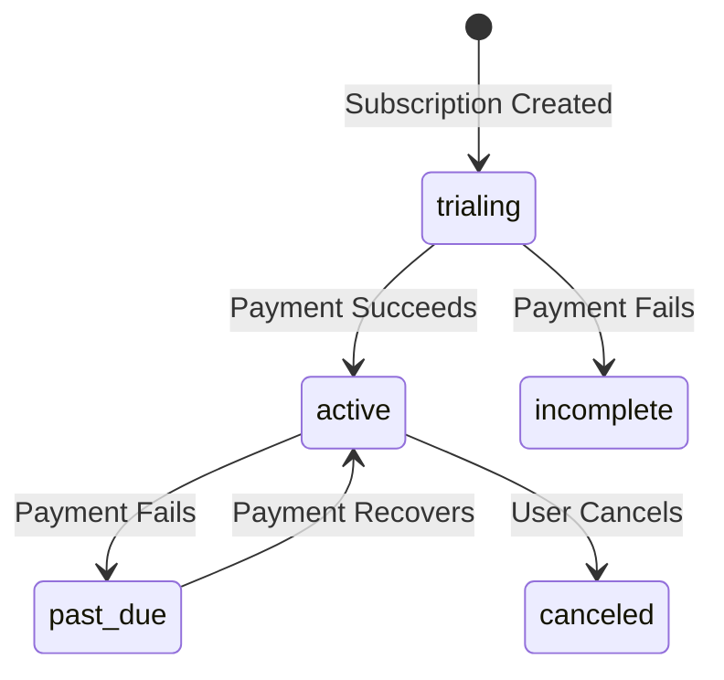
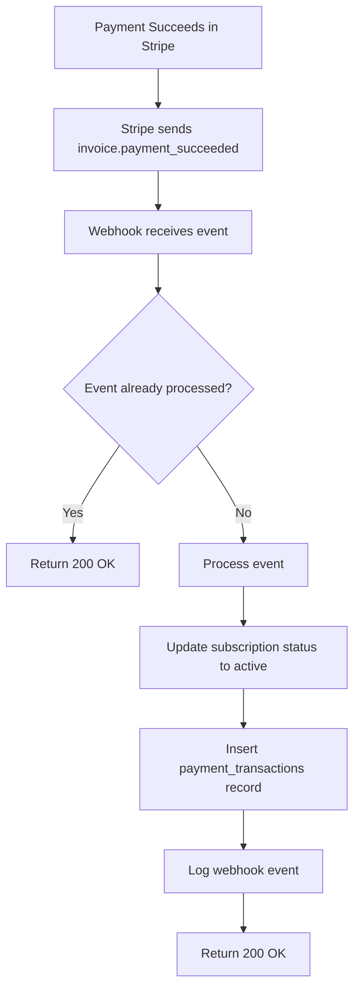

# Payment Flow Documentation: Trial Status & Empty Payment Transactions

## Table of Contents
1. [Payment Flow Architecture](#payment-flow-architecture)
2. [Why "Trial" Status Shows](#why-trial-status-shows)
3. [How payment_transactions Gets Populated](#how-payment_transactions-gets-populated)
4. [Troubleshooting Steps](#troubleshooting-steps)
5. [Prevention Measures](#prevention-measures)
6. [Code References](#code-references)

---

## Payment Flow Architecture

### Complete Payment Flow Diagram



### How It Works

1. **User Action**: User clicks subscribe and selects a plan (Monthly $4.99 or Yearly $39)
2. **Subscription Creation**: App calls [`create-subscription`](../supabase/functions/create-subscription/index.ts) Edge Function
3. **Initial Status**: Database record created with `status = 'trialing'` and `tier_id = 'free'`
4. **Payment Processing**: User completes payment in Stripe
5. **Webhook Delivery**: Stripe sends `invoice.payment_succeeded` event to [`stripe-webhook`](../supabase/functions/stripe-webhook/index.ts)
6. **Status Update**: Webhook updates `status = 'active'` and `tier_id = 'premium'`
7. **Transaction Record**: Webhook inserts payment details into `payment_transactions`

---

## Why "Trial" Status Shows

### The Root Cause

Your subscription currently shows `status = 'trialing'` in the database. This is the **initial status** set when the subscription is first created, **before** payment is processed.

### Status Flow Explanation



### Code: Status Mapping Logic

The webhook maps Stripe statuses to app statuses at [`stripe-webhook/index.ts:677-689`](../supabase/functions/stripe-webhook/index.ts:677):

```typescript
function mapStripeStatus(stripeStatus: Stripe.Subscription.Status): string {
  const statusMap: Record<string, string> = {
    'active': 'active',
    'past_due': 'past_due',
    'canceled': 'canceled',
    'incomplete': 'trialing',      // ⬅️ Initial status
    'incomplete_expired': 'canceled',
    'trialing': 'trialing',        // ⬅️ Your current status
    'unpaid': 'canceled',
  };
  return statusMap[stripeStatus] || 'canceled';
}
```

### When Status Updates to 'Active'

The webhook handler at [`stripe-webhook/index.ts:356-362`](../supabase/functions/stripe-webhook/index.ts:356) updates the status:

```typescript
// Update subscription status to active with explicit tier upgrade
const { error: updateError } = await supabase
  .from('user_subscriptions')
  .update({
    status: 'active',
    tier_id: premiumTier.tier_id, // Explicitly set to premium
    updated_at: new Date().toISOString(),
  })
  .eq('id', subRecord.id);
```

**This update happens when the `invoice.payment_succeeded` webhook event is received.**

---

## How payment_transactions Gets Populated

### The Webhook Event Flow



### Code: Payment Transaction Insertion

At [`stripe-webhook/index.ts:381-401`](../supabase/functions/stripe-webhook/index.ts:381), the webhook inserts the payment record:

```typescript
// Record payment transaction with all required fields
const { error: txError } = await supabase
  .from('payment_transactions')
  .insert({
    user_subscription_id: subRecord.id,
    stripe_payment_intent_id: invoice.payment_intent as string,
    stripe_invoice_id: invoice.id,
    amount: invoice.amount_paid / 100, // Convert from cents
    currency: invoice.currency,
    status: 'succeeded',
    payment_method_type: 'card',
    metadata: {
      billing_reason: invoice.billing_reason,
      subscription_id: invoice.subscription,
    },
  });
```

### What Data Gets Stored

The `payment_transactions` table (defined in [`paywall_migration.sql:97-122`](../database/paywall_migration.sql:97)) stores:

- **stripe_payment_intent_id**: Unique Stripe Payment Intent ID
- **stripe_invoice_id**: Invoice ID from Stripe
- **amount**: Payment amount (e.g., 4.99)
- **currency**: Currency code (e.g., 'usd')
- **status**: Payment status ('succeeded', 'failed', 'refunded')
- **payment_method_type**: Payment method (e.g., 'card')
- **metadata**: Additional context (billing reason, subscription ID)

### Why It's Currently Empty

The `payment_transactions` table is empty because **the webhook hasn't processed the payment yet**. This could happen if:

1. ⏰ **Webhook is delayed** - Stripe webhooks can take a few seconds to minutes
2. 🚫 **Webhook not configured** - Edge Function not deployed or webhook not registered
3. ❌ **Webhook failed** - Error during processing (check logs)
4. 🔒 **Signing secret mismatch** - Incorrect webhook signing secret

---

## Troubleshooting Steps

### Step 1: Check Stripe Dashboard

#### Find Webhook Event Logs

1. Go to [Stripe Dashboard](https://dashboard.stripe.com)
2. Navigate to **Developers → Webhooks**
3. Click on your webhook endpoint
4. Check the **Event logs** tab
5. Look for `invoice.payment_succeeded` events

**What to check:**
- ✅ Event delivered successfully (200 response)
- ❌ Event failed (4xx or 5xx response)
- ⏰ Event delivery timestamp

#### Verify Subscription Status

1. Go to **Customers** in Stripe Dashboard
2. Find your customer (search by email)
3. Click on the subscription
4. Check **Status** - should be `active`
5. Check **Latest invoice** - should be `paid`

#### Verify Webhook Configuration

1. Go to **Developers → Webhooks**
2. Verify endpoint URL matches your Supabase Edge Function URL:
   ```
   https://[your-project-ref].supabase.co/functions/v1/stripe-webhook
   ```
3. Check **Events to send** includes:
   - `customer.subscription.created`
   - `customer.subscription.updated`
   - `invoice.payment_succeeded`
   - `invoice.payment_failed`
   - `charge.refunded`

### Step 2: Check Supabase Database

#### Query Current Subscription Status

Run this SQL in Supabase SQL Editor:

```sql
-- Check your subscription status
SELECT 
  id,
  user_id,
  tier_id,
  status,
  billing_cycle,
  current_period_start,
  current_period_end,
  stripe_subscription_id,
  created_at,
  updated_at
FROM user_subscriptions
WHERE user_id = auth.uid();
```

**Expected after payment:**
- `status`: `'active'` (currently shows `'trialing'`)
- `tier_id`: Should reference premium tier
- `stripe_subscription_id`: Should have Stripe subscription ID

#### Check Webhook Events Table

```sql
-- Check if webhook was received
SELECT 
  event_id,
  event_type,
  processing_status,
  error_message,
  created_at,
  processed_at
FROM stripe_webhooks
ORDER BY created_at DESC
LIMIT 10;
```

**What to look for:**
- `event_type = 'invoice.payment_succeeded'`
- `processing_status = 'processed'` (success) or `'failed'` (error)
- Check `error_message` if status is `'failed'`

#### Check Payment Transactions

```sql
-- Check payment transactions (should see your $4.99 payment)
SELECT 
  pt.id,
  pt.amount,
  pt.currency,
  pt.status,
  pt.stripe_payment_intent_id,
  pt.stripe_invoice_id,
  pt.created_at,
  us.user_id
FROM payment_transactions pt
JOIN user_subscriptions us ON pt.user_subscription_id = us.id
WHERE us.user_id = auth.uid()
ORDER BY pt.created_at DESC;
```

**Expected result:**
- One row with `amount = 4.99` (or 39.00 for yearly)
- `status = 'succeeded'`
- `stripe_payment_intent_id` populated

### Step 3: Manual Fix Options

⚠️ **Use these only as temporary fixes. The webhook should be fixed for future payments.**

#### Option A: Manually Update Status to 'active'

```sql
-- Manual fix: Update subscription status
UPDATE user_subscriptions
SET 
  status = 'active',
  tier_id = (SELECT tier_id FROM subscription_tiers WHERE name = 'Premium'),
  updated_at = NOW()
WHERE user_id = auth.uid()
  AND status = 'trialing';
```

#### Option B: Manually Insert Payment Transaction

```sql
-- Manual fix: Insert payment transaction record
-- IMPORTANT: Replace the placeholder values with actual data from Stripe
INSERT INTO payment_transactions (
  user_subscription_id,
  stripe_payment_intent_id,
  stripe_invoice_id,
  amount,
  currency,
  status,
  payment_method_type,
  metadata
)
SELECT 
  us.id,
  'pi_XXXXXXXXXXXXX', -- ⚠️ Get from Stripe Dashboard
  'in_XXXXXXXXXXXXX', -- ⚠️ Get from Stripe Dashboard
  4.99,
  'usd',
  'succeeded',
  'card',
  jsonb_build_object(
    'billing_reason', 'subscription_create',
    'subscription_id', us.stripe_subscription_id
  )
FROM user_subscriptions us
WHERE us.user_id = auth.uid()
  AND NOT EXISTS (
    SELECT 1 FROM payment_transactions 
    WHERE user_subscription_id = us.id
  );
```

#### When to Use Manual Fixes

- ✅ **Webhook permanently broken** and needs immediate fix
- ✅ **Testing locally** without webhook endpoint
- ❌ **Don't use as permanent solution** - fix the webhook instead
- ❌ **Future payments** will still have the same issue

### Step 4: Webhook Configuration

#### Verify Edge Function Deployment

Check if the webhook Edge Function is deployed:

```bash
# List deployed functions
supabase functions list

# Deploy if not present
supabase functions deploy stripe-webhook
```

#### Check Webhook Signing Secret

1. Go to Stripe Dashboard → **Developers → Webhooks**
2. Click on your webhook endpoint
3. Click **Reveal** next to **Signing secret**
4. Copy the secret (starts with `whsec_`)
5. Add to Supabase environment variables:

```bash
# In Supabase Dashboard → Project Settings → Edge Functions
STRIPE_WEBHOOK_SECRET=whsec_xxxxxxxxxxxxxxxxxxxxx
```

#### Test Webhook Manually

Use Stripe CLI to test webhook locally:

```bash
# Install Stripe CLI
brew install stripe/stripe-cli/stripe

# Login to Stripe
stripe login

# Forward webhooks to local Supabase
stripe listen --forward-to http://localhost:54321/functions/v1/stripe-webhook

# Trigger test event
stripe trigger invoice.payment_succeeded
```

#### Check Edge Function Logs

View logs in Supabase Dashboard:

1. Go to **Edge Functions** in Supabase Dashboard
2. Click on `stripe-webhook`
3. View **Logs** tab
4. Look for errors or failed webhook processing

Common errors:
- `Missing Stripe signature` - Webhook signing secret not configured
- `Invalid signature` - Incorrect signing secret
- `No supabase_user_id in subscription metadata` - Subscription not linked to user

---

## Prevention Measures

### 1. Monitor Webhook Health

#### Set Up Webhook Monitoring

Create alerts for webhook failures:

```sql
-- Query to check webhook failures
SELECT 
  COUNT(*) as failed_webhooks,
  COUNT(*) FILTER (WHERE processing_status = 'failed') as processing_failures,
  COUNT(*) FILTER (WHERE processing_status = 'pending' AND created_at < NOW() - INTERVAL '1 hour') as stuck_webhooks
FROM stripe_webhooks
WHERE created_at > NOW() - INTERVAL '24 hours';
```

#### Monitor in Application

Add health check to [`stripe-webhook/index.ts`](../supabase/functions/stripe-webhook/index.ts):

```typescript
// Add endpoint for health checks
if (req.url.endsWith('/health')) {
  return new Response(JSON.stringify({ status: 'healthy' }), {
    headers: { 'Content-Type': 'application/json' },
    status: 200,
  });
}
```

### 2. Handle Webhook Failures Gracefully

#### Automatic Retry Logic

Stripe automatically retries failed webhooks with exponential backoff:
- Immediate retry
- 1 hour later
- 3 hours later
- 6 hours later
- 12 hours later

The webhook at [`stripe-webhook/index.ts:87-98`](../supabase/functions/stripe-webhook/index.ts:87) implements idempotency to handle retries:

```typescript
// Check idempotency - have we processed this event before?
const { data: existingEvent } = await supabase
  .from('stripe_webhooks')
  .select('id')
  .eq('event_id', event.id)
  .single();

if (existingEvent) {
  console.log(`Event ${event.id} already processed, skipping`);
  return new Response(JSON.stringify({ received: true, duplicate: true }), {
    status: 200,
  });
}
```

#### Add User-Facing Status

Update [`SubscriptionManagementScreen.tsx`](../screens/SubscriptionManagementScreen.tsx) to show processing status:

```typescript
// After line 96, add status message for trialing
if (subscription.status === 'trialing') {
  // Check if payment was made recently
  const recentPayment = await checkRecentPayment(subscription.stripe_subscription_id);
  
  if (recentPayment) {
    // Show processing message
    setProcessingPayment(true);
    setStatusMessage('Processing your payment... This may take a few minutes.');
  }
}
```

### 3. Best Practices for Webhook Reliability

#### Always Return 200 OK

The webhook at [`stripe-webhook/index.ts:161-168`](../supabase/functions/stripe-webhook/index.ts:161) follows this pattern:

```typescript
} catch (error) {
  console.error('Webhook processing error:', error);
  // Still return 200 to prevent Stripe from retrying
  const errorMessage = error instanceof Error ? error.message : 'Unknown error';
  return new Response(JSON.stringify({ received: true, error: errorMessage }), {
    headers: { ...corsHeaders, 'Content-Type': 'application/json' },
    status: 200,
  });
}
```

This prevents infinite retry loops for permanent errors.

#### Validate Event Signature

The webhook validates signatures at [`stripe-webhook/index.ts:62-77`](../supabase/functions/stripe-webhook/index.ts:62):

```typescript
// Verify the webhook signature (this authenticates it's from Stripe)
let event: Stripe.Event;
try {
  event = await verifyWebhookSignature(body, signature);
  console.log('✅ Webhook signature verified');
} catch (err) {
  console.error('❌ Webhook signature verification failed:', err.message);
  return new Response(
    JSON.stringify({ error: 'Invalid signature' }),
    { status: 401 }
  );
}
```

#### Log All Events

Every webhook event is logged at [`stripe-webhook/index.ts:145-153`](../supabase/functions/stripe-webhook/index.ts:145):

```typescript
// Mark event as processed
await supabase
  .from('stripe_webhooks')
  .insert({
    event_id: event.id,
    event_type: event.type,
    event_data: event,
    processing_status: 'processed',
    processed_at: new Date().toISOString(),
  });
```

This provides an audit trail for debugging.

---

## Code References

### Webhook Event Handlers

| Event Type | Handler Function | File:Line |
|-----------|------------------|-----------|
| `customer.subscription.created` | `handleSubscriptionCreated` | [`stripe-webhook/index.ts:175`](../supabase/functions/stripe-webhook/index.ts:175) |
| `customer.subscription.updated` | `handleSubscriptionUpdated` | [`stripe-webhook/index.ts:214`](../supabase/functions/stripe-webhook/index.ts:214) |
| `invoice.payment_succeeded` | `handlePaymentSucceeded` | [`stripe-webhook/index.ts:309`](../supabase/functions/stripe-webhook/index.ts:309) |
| `invoice.payment_failed` | `handlePaymentFailed` | [`stripe-webhook/index.ts:556`](../supabase/functions/stripe-webhook/index.ts:556) |
| `charge.refunded` | `handleChargeRefunded` | [`stripe-webhook/index.ts:611`](../supabase/functions/stripe-webhook/index.ts:611) |

### Status Update Logic

```typescript
// Status update at stripe-webhook/index.ts:356-362
const { error: updateError } = await supabase
  .from('user_subscriptions')
  .update({
    status: 'active',               // ⬅️ Changes from 'trialing' to 'active'
    tier_id: premiumTier.tier_id,  // ⬅️ Upgrades from free to premium
    updated_at: new Date().toISOString(),
  })
  .eq('id', subRecord.id);
```

### Payment Transaction Insertion

```typescript
// Payment transaction insertion at stripe-webhook/index.ts:381-395
const { error: txError } = await supabase
  .from('payment_transactions')
  .insert({
    user_subscription_id: subRecord.id,
    stripe_payment_intent_id: invoice.payment_intent as string,
    stripe_invoice_id: invoice.id,
    amount: invoice.amount_paid / 100,
    currency: invoice.currency,
    status: 'succeeded',
    payment_method_type: 'card',
    metadata: {
      billing_reason: invoice.billing_reason,
      subscription_id: invoice.subscription,
    },
  });
```

### Status Type Definitions

From [`types/index.ts:151`](../types/index.ts:151):

```typescript
export type SubscriptionStatus = 
  | 'active'       // ⬅️ Goal state after payment
  | 'canceled' 
  | 'past_due' 
  | 'grace_period' 
  | 'trialing';    // ⬅️ Current state before payment
```

### Database Schema

From [`paywall_migration.sql:56-84`](../database/paywall_migration.sql:56):

```sql
CREATE TABLE IF NOT EXISTS public.user_subscriptions (
  id UUID DEFAULT gen_random_uuid() PRIMARY KEY,
  user_id UUID REFERENCES auth.users(id) ON DELETE CASCADE NOT NULL,
  tier_id TEXT REFERENCES public.subscription_tiers(tier_id) NOT NULL DEFAULT 'free',
  billing_cycle TEXT CHECK (billing_cycle IN ('monthly', 'annual', 'none')) DEFAULT 'none',
  status TEXT CHECK (status IN ('active', 'canceled', 'past_due', 'trialing', 'incomplete', 'paused')) DEFAULT 'active',
  -- ... more fields
);
```

From [`paywall_migration.sql:97-122`](../database/paywall_migration.sql:97):

```sql
CREATE TABLE IF NOT EXISTS public.payment_transactions (
  id UUID DEFAULT gen_random_uuid() PRIMARY KEY,
  user_subscription_id UUID REFERENCES public.user_subscriptions(id) ON DELETE CASCADE NOT NULL,
  stripe_payment_intent_id TEXT UNIQUE NOT NULL,
  amount NUMERIC(10, 2) NOT NULL,
  currency TEXT DEFAULT 'usd',
  status TEXT CHECK (status IN ('pending', 'succeeded', 'failed', 'canceled', 'refunded')) NOT NULL,
  -- ... more fields
);
```

---

## Summary

### The Issue

1. **Status shows "trialing"** because the webhook hasn't updated it to "active" yet
2. **payment_transactions is empty** because the webhook hasn't inserted the payment record yet

### The Solution

1. **Check Stripe Dashboard** to verify webhook was sent and received
2. **Check Supabase Database** to see if webhook event was logged
3. **Fix webhook configuration** if events are failing
4. **Use manual fix** only as temporary measure while fixing webhook
5. **Monitor webhook health** to prevent future issues

### Key Takeaway

The webhook is the **single source of truth** for subscription status and payment records. If webhooks aren't working, the app will show incorrect status even though payment succeeded in Stripe.