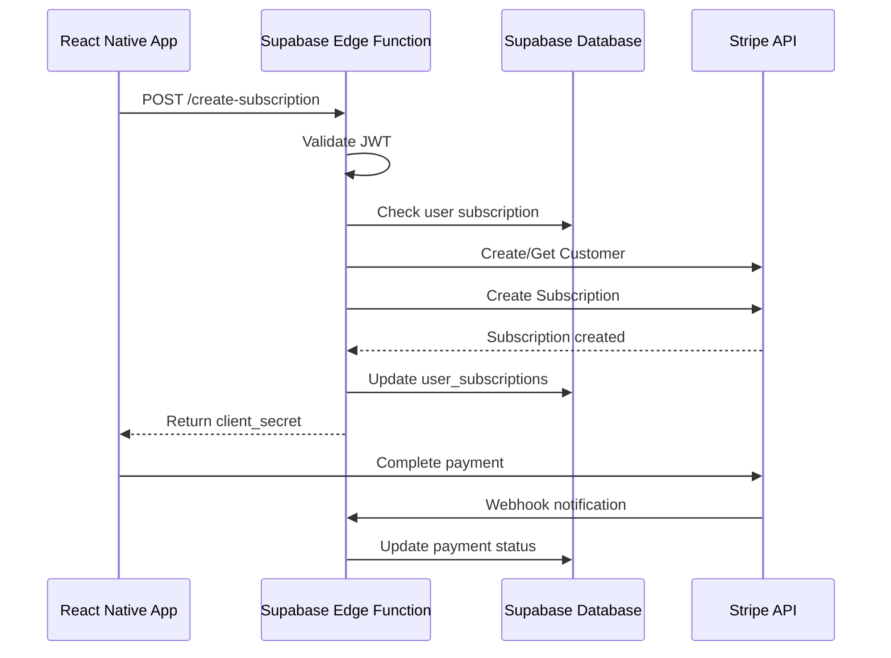

# Paywall System - API Architecture Specification

## Document Information
- **Version**: 1.0.0
- **Last Updated**: 2025-11-16
- **Status**: Draft

## Table of Contents
1. [API Overview](#api-overview)
2. [Architecture](#architecture)
3. [Authentication](#authentication)
4. [Edge Functions](#edge-functions)
5. [Error Handling](#error-handling)
6. [Rate Limiting](#rate-limiting)
7. [Testing](#testing)

---

## API Overview

### Technology Stack

- **Runtime**: Deno (Supabase Edge Functions)
- **Language**: TypeScript
- **Authentication**: Supabase Auth (JWT)
- **External APIs**: Stripe API v2023-10-16
- **Transport**: HTTPS/REST

### API Principles

1. **RESTful Design**: Follow REST conventions for endpoints
2. **Security First**: All endpoints require authentication (except webhooks)
3. **Idempotency**: Payment operations are idempotent
4. **Error Transparency**: Clear, actionable error messages
5. **Versioning**: API version in URL path (future-proofing)

---

## Architecture

### Edge Functions Structure

```
supabase/functions/
├── _shared/
│   ├── stripe.ts              # Stripe client configuration
│   ├── supabase.ts            # Supabase client setup
│   ├── auth.ts                # Authentication helpers
│   ├── errors.ts              # Custom error classes
│   └── types.ts               # Shared TypeScript types
├── stripe-webhook/
│   └── index.ts               # Webhook event handler
├── create-payment-intent/
│   └── index.ts               # Initialize payment
├── create-subscription/
│   └── index.ts               # Create Stripe subscription
├── cancel-subscription/
│   └── index.ts               # Cancel subscription
├── update-payment-method/
│   └── index.ts               # Update payment method
├── request-refund/
│   └── index.ts               # Process refund request
└── get-billing-portal/
    └── index.ts               # Get Stripe billing portal URL
```

### Request Flow



---

## Authentication

### JWT Authentication

All client-facing endpoints use Supabase JWT authentication.

```typescript
// Extract user from JWT
import { createClient } from '@supabase/supabase-js';

const authHeader = req.headers.get('Authorization');
if (!authHeader) {
  return new Response('Unauthorized', { status: 401 });
}

const supabase = createClient(
  Deno.env.get('SUPABASE_URL') ?? '',
  Deno.env.get('SUPABASE_ANON_KEY') ?? '',
  { global: { headers: { Authorization: authHeader } } }
);

const { data: { user }, error } = await supabase.auth.getUser();
if (error || !user) {
  return new Response('Unauthorized', { status: 401 });
}
```

### Webhook Authentication

Stripe webhooks use signature verification.

```typescript
import Stripe from 'stripe';

const signature = req.headers.get('stripe-signature');
const webhookSecret = Deno.env.get('STRIPE_WEBHOOK_SECRET');

let event: Stripe.Event;
try {
  event = stripe.webhooks.constructEvent(
    await req.text(),
    signature!,
    webhookSecret!
  );
} catch (err) {
  return new Response('Webhook signature verification failed', { 
    status: 400 
  });
}
```

---

## Edge Functions

### 1. Create Subscription

**Endpoint**: `POST /functions/v1/create-subscription`

**Purpose**: Creates a new Stripe subscription for the user

**Authentication**: Required (JWT)

#### Request Schema

```typescript
interface CreateSubscriptionRequest {
  priceId: string;           // Stripe Price ID (monthly or annual)
  paymentMethodId?: string;  // Optional: payment method for first payment
}
```

#### Request Example

```json
{
  "priceId": "price_1234567890",
  "paymentMethodId": "pm_1234567890"
}
```

#### Response Schema

```typescript
interface CreateSubscriptionResponse {
  subscriptionId: string;        // Stripe Subscription ID
  clientSecret: string;          // For confirming payment
  status: 'active' | 'incomplete';
  customerId: string;            // Stripe Customer ID
  currentPeriodEnd: string;      // ISO 8601 timestamp
}
```

#### Response Example

```json
{
  "subscriptionId": "sub_1234567890",
  "clientSecret": "pi_1234567890_secret_abcdef",
  "status": "incomplete",
  "customerId": "cus_1234567890",
  "currentPeriodEnd": "2025-12-16T19:00:00Z"
}
```

#### Error Responses

| Status | Error Code | Description |
|--------|------------|-------------|
| 400 | `invalid_price_id` | Invalid or unknown price ID |
| 401 | `unauthorized` | Missing or invalid JWT token |
| 409 | `already_subscribed` | User already has active subscription |
| 500 | `stripe_error` | Stripe API error |

#### Implementation Example

```typescript
// supabase/functions/create-subscription/index.ts
import { serve } from 'https://deno.land/std@0.168.0/http/server.ts';
import Stripe from 'stripe';
import { createClient } from '@supabase/supabase-js';

serve(async (req) => {
  try {
    // 1. Authenticate user
    const authHeader = req.headers.get('Authorization')!;
    const supabase = createClient(
      Deno.env.get('SUPABASE_URL') ?? '',
      Deno.env.get('SUPABASE_ANON_KEY') ?? '',
      { global: { headers: { Authorization: authHeader } } }
    );
    
    const { data: { user }, error: authError } = await supabase.auth.getUser();
    if (authError || !user) {
      return new Response(JSON.stringify({ error: 'Unauthorized' }), {
        status: 401,
        headers: { 'Content-Type': 'application/json' },
      });
    }

    // 2. Parse request
    const { priceId, paymentMethodId } = await req.json();

    // 3. Check for existing subscription
    const { data: existingSub } = await supabase
      .from('user_subscriptions')
      .select('status')
      .eq('user_id', user.id)
      .eq('status', 'active')
      .single();

    if (existingSub) {
      return new Response(JSON.stringify({ error: 'Already subscribed' }), {
        status: 409,
        headers: { 'Content-Type': 'application/json' },
      });
    }

    // 4. Initialize Stripe
    const stripe = new Stripe(Deno.env.get('STRIPE_SECRET_KEY') ?? '', {
      apiVersion: '2023-10-16',
    });

    // 5. Create or get Stripe Customer
    let customerId: string;
    const { data: userSub } = await supabase
      .from('user_subscriptions')
      .select('stripe_customer_id')
      .eq('user_id', user.id)
      .single();

    if (userSub?.stripe_customer_id) {
      customerId = userSub.stripe_customer_id;
    } else {
      const customer = await stripe.customers.create({
        email: user.email,
        metadata: { supabase_user_id: user.id },
      });
      customerId = customer.id;
    }

    // 6. Create subscription
    const subscription = await stripe.subscriptions.create({
      customer: customerId,
      items: [{ price: priceId }],
      payment_behavior: 'default_incomplete',
      payment_settings: { save_default_payment_method: 'on_subscription' },
      expand: ['latest_invoice.payment_intent'],
      metadata: { supabase_user_id: user.id },
    });

    // 7. Update database
    await supabase
      .from('user_subscriptions')
      .upsert({
        user_id: user.id,
        tier_id: 'premium',
        stripe_customer_id: customerId,
        stripe_subscription_id: subscription.id,
        stripe_price_id: priceId,
        status: subscription.status,
        current_period_start: new Date(subscription.current_period_start * 1000).toISOString(),
        current_period_end: new Date(subscription.current_period_end * 1000).toISOString(),
      });

    // 8. Return response
    const invoice = subscription.latest_invoice as Stripe.Invoice;
    const paymentIntent = invoice.payment_intent as Stripe.PaymentIntent;

    return new Response(JSON.stringify({
      subscriptionId: subscription.id,
      clientSecret: paymentIntent.client_secret,
      status: subscription.status,
      customerId: customerId,
      currentPeriodEnd: new Date(subscription.current_period_end * 1000).toISOString(),
    }), {
      headers: { 'Content-Type': 'application/json' },
    });

  } catch (error) {
    console.error('Error creating subscription:', error);
    return new Response(JSON.stringify({ 
      error: error instanceof Error ? error.message : 'Internal server error' 
    }), {
      status: 500,
      headers: { 'Content-Type': 'application/json' },
    });
  }
});
```

---

### 2. Stripe Webhook Handler

**Endpoint**: `POST /functions/v1/stripe-webhook`

**Purpose**: Processes Stripe webhook events

**Authentication**: Stripe signature verification

#### Supported Events

| Event Type | Action |
|------------|--------|
| `customer.subscription.created` | Create subscription record |
| `customer.subscription.updated` | Update subscription status |
| `customer.subscription.deleted` | Mark subscription as canceled |
| `invoice.payment_succeeded` | Record successful payment |
| `invoice.payment_failed` | Handle payment failure |
| `charge.refunded` | Record refund |

#### Request Schema

Standard Stripe webhook payload (varies by event type)

#### Response Schema

```typescript
interface WebhookResponse {
  received: boolean;
  eventId: string;
}
```

#### Implementation Example

```typescript
// supabase/functions/stripe-webhook/index.ts
import { serve } from 'https://deno.land/std@0.168.0/http/server.ts';
import Stripe from 'stripe';
import { createClient } from '@supabase/supabase-js';

serve(async (req) => {
  const stripe = new Stripe(Deno.env.get('STRIPE_SECRET_KEY') ?? '', {
    apiVersion: '2023-10-16',
  });

  // Verify webhook signature
  const signature = req.headers.get('stripe-signature')!;
  const webhookSecret = Deno.env.get('STRIPE_WEBHOOK_SECRET')!;
  
  let event: Stripe.Event;
  try {
    const body = await req.text();
    event = stripe.webhooks.constructEvent(body, signature, webhookSecret);
  } catch (err) {
    console.error('Webhook signature verification failed:', err);
    return new Response('Webhook Error', { status: 400 });
  }

  // Initialize Supabase with service role key for webhook processing
  const supabase = createClient(
    Deno.env.get('SUPABASE_URL') ?? '',
    Deno.env.get('SUPABASE_SERVICE_ROLE_KEY') ?? ''
  );

  try {
    // Log webhook event (idempotency check)
    const { data: existingEvent } = await supabase
      .from('stripe_webhooks')
      .select('id')
      .eq('event_id', event.id)
      .single();

    if (existingEvent) {
      console.log('Event already processed:', event.id);
      return new Response(JSON.stringify({ received: true, eventId: event.id }), {
        headers: { 'Content-Type': 'application/json' },
      });
    }

    // Insert webhook event
    await supabase
      .from('stripe_webhooks')
      .insert({
        event_id: event.id,
        event_type: event.type,
        event_data: event.data,
        processing_status: 'processing',
      });

    // Process event based on type
    switch (event.type) {
      case 'customer.subscription.created':
      case 'customer.subscription.updated':
        await handleSubscriptionUpdate(event.data.object as Stripe.Subscription, supabase);
        break;

      case 'customer.subscription.deleted':
        await handleSubscriptionDeleted(event.data.object as Stripe.Subscription, supabase);
        break;

      case 'invoice.payment_succeeded':
        await handlePaymentSucceeded(event.data.object as Stripe.Invoice, supabase);
        break;

      case 'invoice.payment_failed':
        await handlePaymentFailed(event.data.object as Stripe.Invoice, supabase);
        break;

      case 'charge.refunded':
        await handleRefund(event.data.object as Stripe.Charge, supabase);
        break;

      default:
        console.log('Unhandled event type:', event.type);
    }

    // Mark as processed
    await supabase
      .from('stripe_webhooks')
      .update({ processing_status: 'processed', processed_at: new Date().toISOString() })
      .eq('event_id', event.id);

    return new Response(JSON.stringify({ received: true, eventId: event.id }), {
      headers: { 'Content-Type': 'application/json' },
    });

  } catch (error) {
    console.error('Error processing webhook:', error);
    
    // Mark as failed
    await supabase
      .from('stripe_webhooks')
      .update({ 
        processing_status: 'failed', 
        error_message: error instanceof Error ? error.message : 'Unknown error'
      })
      .eq('event_id', event.id);

    return new Response('Webhook processing failed', { status: 500 });
  }
});

// Helper functions
async function handleSubscriptionUpdate(
  subscription: Stripe.Subscription,
  supabase: any
) {
  const userId = subscription.metadata.supabase_user_id;
  if (!userId) return;

  await supabase
    .from('user_subscriptions')
    .upsert({
      user_id: userId,
      tier_id: subscription.status === 'active' ? 'premium' : 'free',
      stripe_subscription_id: subscription.id,
      stripe_customer_id: subscription.customer as string,
      status: subscription.status,
      current_period_start: new Date(subscription.current_period_start * 1000).toISOString(),
      current_period_end: new Date(subscription.current_period_end * 1000).toISOString(),
      cancel_at_period_end: subscription.cancel_at_period_end,
    });
}

async function handleSubscriptionDeleted(
  subscription: Stripe.Subscription,
  supabase: any
) {
  await supabase
    .from('user_subscriptions')
    .update({
      tier_id: 'free',
      status: 'canceled',
      canceled_at: new Date().toISOString(),
    })
    .eq('stripe_subscription_id', subscription.id);
}

async function handlePaymentSucceeded(
  invoice: Stripe.Invoice,
  supabase: any
) {
  const subscription = await supabase
    .from('user_subscriptions')
    .select('id')
    .eq('stripe_subscription_id', invoice.subscription)
    .single();

  if (!subscription.data) return;

  await supabase
    .from('payment_transactions')
    .insert({
      user_subscription_id: subscription.data.id,
      stripe_payment_intent_id: invoice.payment_intent as string,
      stripe_charge_id: invoice.charge as string,
      stripe_invoice_id: invoice.id,
      amount: invoice.amount_paid / 100,
      currency: invoice.currency,
      status: 'succeeded',
      description: invoice.description,
    });
}

async function handlePaymentFailed(
  invoice: Stripe.Invoice,
  supabase: any
) {
  const subscription = await supabase
    .from('user_subscriptions')
    .select('id')
    .eq('stripe_subscription_id', invoice.subscription)
    .single();

  if (!subscription.data) return;

  await supabase
    .from('payment_transactions')
    .insert({
      user_subscription_id: subscription.data.id,
      stripe_payment_intent_id: invoice.payment_intent as string,
      amount: invoice.amount_due / 100,
      currency: invoice.currency,
      status: 'failed',
      failure_reason: 'Payment failed',
    });

  // Update subscription to past_due
  await supabase
    .from('user_subscriptions')
    .update({ status: 'past_due' })
    .eq('stripe_subscription_id', invoice.subscription);
}

async function handleRefund(
  charge: Stripe.Charge,
  supabase: any
) {
  // Update transaction status
  await supabase
    .from('payment_transactions')
    .update({ status: 'refunded' })
    .eq('stripe_charge_id', charge.id);

  // Update refund request if exists
  const refund = charge.refunds?.data[0];
  if (refund) {
    await supabase
      .from('refund_requests')
      .update({
        status: 'processed',
        stripe_refund_id: refund.id,
        processed_at: new Date().toISOString(),
      })
      .eq('stripe_refund_id', refund.id);
  }
}
```

---

### 3. Cancel Subscription

**Endpoint**: `POST /functions/v1/cancel-subscription`

**Purpose**: Cancels the user's subscription

**Authentication**: Required (JWT)

#### Request Schema

```typescript
interface CancelSubscriptionRequest {
  immediate?: boolean;  // Cancel immediately vs end of period
  reason?: string;      // Cancellation reason
}
```

#### Response Schema

```typescript
interface CancelSubscriptionResponse {
  success: boolean;
  canceledAt: string;        // ISO 8601 timestamp
  accessUntil: string;       // When access ends
  refundEligible: boolean;   // Within 7-day window
}
```

#### Implementation

```typescript
// supabase/functions/cancel-subscription/index.ts
serve(async (req) => {
  // 1. Authenticate user
  // 2. Get user's subscription
  // 3. Check if subscription exists
  // 4. Cancel in Stripe
  // 5. Update database
  // 6. Return response
});
```

---

### 4. Request Refund

**Endpoint**: `POST /functions/v1/request-refund`

**Purpose**: Processes a refund request

**Authentication**: Required (JWT)

#### Request Schema

```typescript
interface RefundRequest {
  transactionId: string;  // Payment transaction ID
  reason: string;         // Refund reason
  userNotes?: string;     // Optional user notes
}
```

#### Response Schema

```typescript
interface RefundResponse {
  success: boolean;
  refundId: string;       // Our refund request ID
  amount: number;         // Refund amount
  eligible: boolean;      // Within refund window
  processingTime: string; // Expected processing time
}
```

---

### 5. Get Billing Portal

**Endpoint**: `POST /functions/v1/get-billing-portal`

**Purpose**: Generates Stripe billing portal URL

**Authentication**: Required (JWT)

#### Request Schema

```typescript
interface BillingPortalRequest {
  returnUrl?: string;  // Optional return URL
}
```

#### Response Schema

```typescript
interface BillingPortalResponse {
  url: string;  // Stripe billing portal URL
}
```

---

## Error Handling

### Error Response Format

All errors follow a consistent format:

```typescript
interface ErrorResponse {
  error: {
    code: string;         // Machine-readable error code
    message: string;      // Human-readable message
    details?: any;        // Optional additional details
  };
}
```

### Error Codes

| Code | HTTP Status | Description |
|------|-------------|-------------|
| `unauthorized` | 401 | Missing or invalid authentication |
| `forbidden` | 403 | User lacks permission |
| `not_found` | 404 | Resource not found |
| `already_exists` | 409 | Resource already exists |
| `invalid_request` | 400 | Invalid request parameters |
| `stripe_error` | 500 | Stripe API error |
| `database_error` | 500 | Database operation failed |
| `internal_error` | 500 | Unexpected server error |

### Example Error Responses

```json
{
  "error": {
    "code": "already_subscribed",
    "message": "User already has an active Premium subscription",
    "details": {
      "currentTier": "premium",
      "expiresAt": "2025-12-16T19:00:00Z"
    }
  }
}
```

```json
{
  "error": {
    "code": "stripe_error",
    "message": "Payment method was declined",
    "details": {
      "declineCode": "insufficient_funds"
    }
  }
}
```

---

## Rate Limiting

### Client Rate Limits

| Endpoint | Limit | Window |
|----------|-------|--------|
| `/create-subscription` | 5 requests | 1 hour |
| `/cancel-subscription` | 10 requests | 1 hour |
| `/request-refund` | 3 requests | 1 day |
| `/get-billing-portal` | 20 requests | 1 hour |

### Webhook Rate Limits

Webhooks have no rate limit (Stripe controls retry logic).

### Rate Limit Response

```json
{
  "error": {
    "code": "rate_limit_exceeded",
    "message": "Too many requests. Please try again later.",
    "details": {
      "retryAfter": 3600
    }
  }
}
```

---

## Testing

### Test Environment Setup

```bash
# Set test mode environment variables
STRIPE_SECRET_KEY=sk_test_...
STRIPE_PUBLISHABLE_KEY=pk_test_...
STRIPE_WEBHOOK_SECRET=whsec_test_...
```

### Testing Webhooks Locally

```bash
# Install Stripe CLI
brew install stripe/stripe-cli/stripe

# Login to Stripe
stripe login

# Forward webhooks to local function
stripe listen --forward-to localhost:54321/functions/v1/stripe-webhook

# Trigger test events
stripe trigger customer.subscription.created
stripe trigger invoice.payment_succeeded
stripe trigger charge.refunded
```

### Test Scenarios

#### 1. Successful Subscription Creation

```bash
curl -X POST http://localhost:54321/functions/v1/create-subscription \
  -H "Authorization: Bearer $JWT_TOKEN" \
  -H "Content-Type: application/json" \
  -d '{
    "priceId": "price_test_monthly"
  }'
```

#### 2. Payment Failure

```bash
# Use Stripe test card: 4000 0000 0000 0341
# This card will be declined with insufficient_funds
```

#### 3. Refund Request

```bash
curl -X POST http://localhost:54321/functions/v1/request-refund \
  -H "Authorization: Bearer $JWT_TOKEN" \
  -H "Content-Type: application/json" \
  -d '{
    "transactionId": "trans_123",
    "reason": "Not satisfied with service",
    "userNotes": "I expected more features"
  }'
```

---

## Monitoring and Logging

### Log Levels

```typescript
// Use structured logging
console.log('[INFO]', { message: 'Subscription created', userId, subId });
console.error('[ERROR]', { message: 'Payment failed', error, userId });
console.warn('[WARN]', { message: 'Webhook retry', attempt, eventId });
```

### Metrics to Track

1. **API Performance**
   - Response time (p50, p95, p99)
   - Error rate by endpoint
   - Success rate

2. **Business Metrics**
   - Successful subscriptions
   - Failed payments
   - Refund requests
   - Cancellations

3. **System Health**
   - Edge function cold starts
   - Database query performance
   - Webhook processing time

---

## Security Considerations

### 1. Input Validation

```typescript
// Validate all inputs
function validatePriceId(priceId: string): boolean {
  return /^price_[a-zA-Z0-9]+$/.test(priceId);
}

function validateAmount(amount: number): boolean {
  return amount > 0 && amount < 1000000;
}
```

### 2. SQL Injection Prevention

Use parameterized queries (Supabase client handles this):

```typescript
// ✅ Safe
await supabase
  .from('user_subscriptions')
  .select('*')
  .eq('user_id', userId);

// ❌ Never do this
await supabase.rpc('raw_sql', { 
  query: `SELECT * FROM user_subscriptions WHERE user_id = '${userId}'` 
});
```

### 3. Secrets Management

```typescript
// ✅ Use environment variables
const stripeKey = Deno.env.get('STRIPE_SECRET_KEY');

// ❌ Never hardcode
const stripeKey = 'sk_live_abc123';
```

### 4. CORS Configuration

```typescript
// Set appropriate CORS headers
const corsHeaders = {
  'Access-Control-Allow-Origin': '*',
  'Access-Control-Allow-Headers': 'authorization, x-client-info, apikey, content-type',
};

return new Response(JSON.stringify(data), {
  headers: { ...corsHeaders, 'Content-Type': 'application/json' },
});
```

---

## Appendix

### Environment Variables Reference

| Variable | Purpose | Example |
|----------|---------|---------|
| `SUPABASE_URL` | Supabase project URL | `https://xxx.supabase.co` |
| `SUPABASE_ANON_KEY` | Public anon key | `eyJhbG...` |
| `SUPABASE_SERVICE_ROLE_KEY` | Service role key (webhooks) | `eyJhbG...` |
| `STRIPE_SECRET_KEY` | Stripe secret key | `sk_test_...` or `sk_live_...` |
| `STRIPE_PUBLISHABLE_KEY` | Stripe publishable key | `pk_test_...` or `pk_live_...` |
| `STRIPE_WEBHOOK_SECRET` | Webhook signing secret | `whsec_...` |

### Stripe API Version

All functions use Stripe API version: `2023-10-16`

### Type Definitions

```typescript
// supabase/functions/_shared/types.ts
export interface UserSubscription {
  id: string;
  user_id: string;
  tier_id: 'free' | 'premium';
  billing_cycle: 'monthly' | 'annual' | 'none';
  status: 'active' | 'canceled' | 'past_due' | 'trialing' | 'incomplete' | 'paused';
  stripe_customer_id: string | null;
  stripe_subscription_id: string | null;
  current_period_start: string | null;
  current_period_end: string | null;
  created_at: string;
  updated_at: string;
}

export interface PaymentTransaction {
  id: string;
  user_subscription_id: string;
  stripe_payment_intent_id: string;
  amount: number;
  currency: string;
  status: 'pending' | 'succeeded' | 'failed' | 'canceled' | 'refunded';
  created_at: string;
}
```

---

**End of API Architecture Specification**