# Paywall System - System Architecture

## Document Information
- **Version**: 1.0.0
- **Last Updated**: 2025-11-16
- **Status**: Draft

## Table of Contents
1. [High-Level Architecture](#high-level-architecture)
2. [Component Architecture](#component-architecture)
3. [Data Flow Diagrams](#data-flow-diagrams)
4. [Sequence Diagrams](#sequence-diagrams)
5. [Security Architecture](#security-architecture)
6. [Integration Architecture](#integration-architecture)
7. [Deployment Architecture](#deployment-architecture)

---

## High-Level Architecture

### System Overview

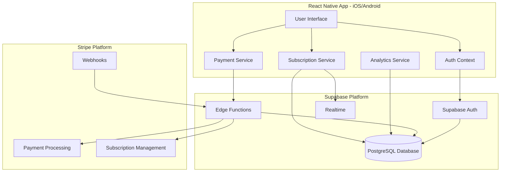
```mermaid
graph TB
    subgraph Client[React Native App - iOS/Android]
        UI[User Interface]
        AuthCtx[Auth Context]
        PaySvc[Payment Service]
        SubSvc[Subscription Service]
        AnalSvc[Analytics Service]
    end

    subgraph Supabase[Supabase Platform]
        DB[(PostgreSQL Database)]
        Auth[Supabase Auth]
        Edge[Edge Functions]
        RT[Realtime]
    end

    subgraph Stripe[Stripe Platform]
        StripePay[Payment Processing]
        StripeSub[Subscription Management]
        StripeWH[Webhooks]
    end

    UI --> AuthCtx
    UI --> PaySvc
    UI --> SubSvc
    AuthCtx --> Auth
    PaySvc --> Edge
    SubSvc --> DB
    SubSvc --> RT
    AnalSvc --> DB

    Edge --> DB
    Edge --> StripePay
    Edge --> StripeSub
    StripeWH --> Edge

    Auth --> DB
```

### Architecture Layers

1. **Presentation Layer** (React Native)
   - User Interface Components
   - Navigation
   - State Management (Context API)

2. **Business Logic Layer** (React Native Services)
   - Payment Processing
   - Subscription Management
   - Analytics Tracking
   - Data Transformation

3. **API Layer** (Supabase Edge Functions)
   - RESTful Endpoints
   - Webhook Handlers
   - Authentication Middleware
   - Error Handling

4. **Data Layer** (Supabase PostgreSQL)
   - User Data
   - Subscription Records
   - Transaction History
   - Analytics Events

5. **External Services**
   - Stripe (Payment Processing)
   - Supabase Auth (Authentication)

---

## Component Architecture

### Frontend Components

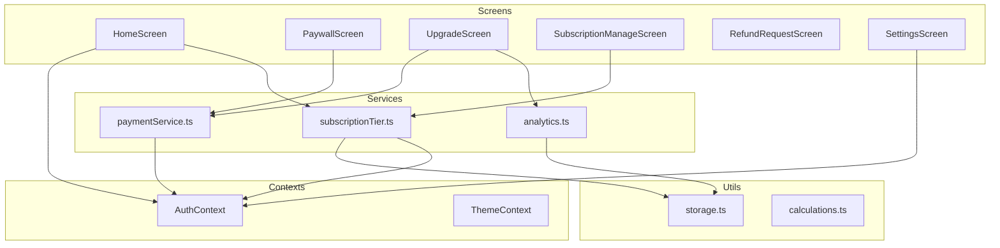
```mermaid
graph TD
    subgraph Screens
        Home[HomeScreen]
        Paywall[PaywallScreen]
        Upgrade[UpgradeScreen]
        Manage[SubscriptionManageScreen]
        Refund[RefundRequestScreen]
        Settings[SettingsScreen]
    end

    subgraph Services
        PaymentSvc[paymentService.ts]
        SubTierSvc[subscriptionTier.ts]
        AnalyticsSvc[analytics.ts]
    end

    subgraph Contexts
        AuthContext[AuthContext]
        ThemeContext[ThemeContext]
    end

    subgraph Utils
        Storage[storage.ts]
        Calculations[calculations.ts]
    end

    Home --> AuthContext
    Home --> SubTierSvc
    Paywall --> PaymentSvc
    Upgrade --> PaymentSvc
    Upgrade --> AnalyticsSvc
    Manage --> SubTierSvc
    Settings --> AuthContext

    PaymentSvc --> AuthContext
    SubTierSvc --> Storage
    SubTierSvc --> AuthContext
    AnalyticsSvc --> Storage
```

### Backend Components

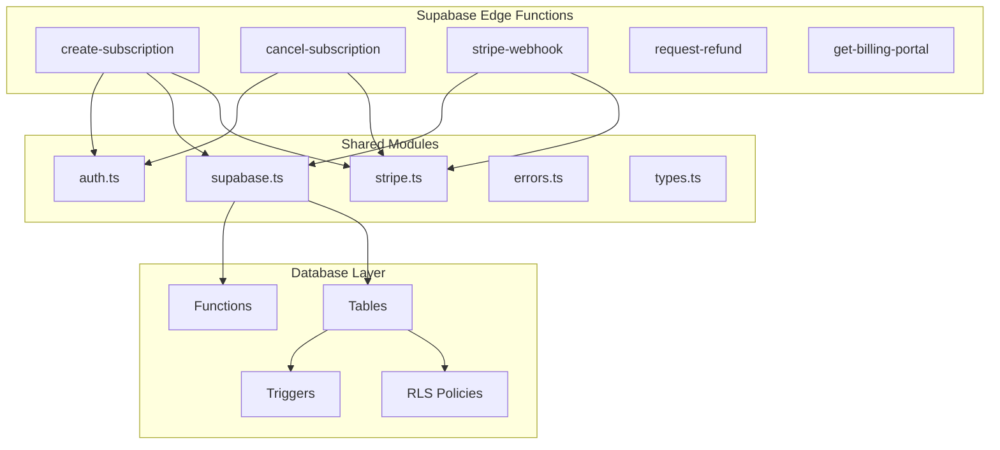
```mermaid
graph TD
    subgraph EdgeFunctions[Supabase Edge Functions]
        CreateSub[create-subscription]
        CancelSub[cancel-subscription]
        Webhook[stripe-webhook]
        Refund[request-refund]
        Portal[get-billing-portal]
    end

    subgraph Shared[Shared Modules]
        StripeClient[stripe.ts]
        SupaClient[supabase.ts]
        AuthHelper[auth.ts]
        ErrorHandler[errors.ts]
        Types[types.ts]
    end

    subgraph Database[Database Layer]
        Tables[Tables]
        Functions[Functions]
        RLS[RLS Policies]
        Triggers[Triggers]
    end

    CreateSub --> StripeClient
    CreateSub --> SupaClient
    CreateSub --> AuthHelper
    
    Webhook --> StripeClient
    Webhook --> SupaClient
    
    CancelSub --> StripeClient
    CancelSub --> AuthHelper
    
    SupaClient --> Tables
    SupaClient --> Functions
    Tables --> RLS
    Tables --> Triggers
```

---

## Data Flow Diagrams

### 1. User Hits Subscription Limit

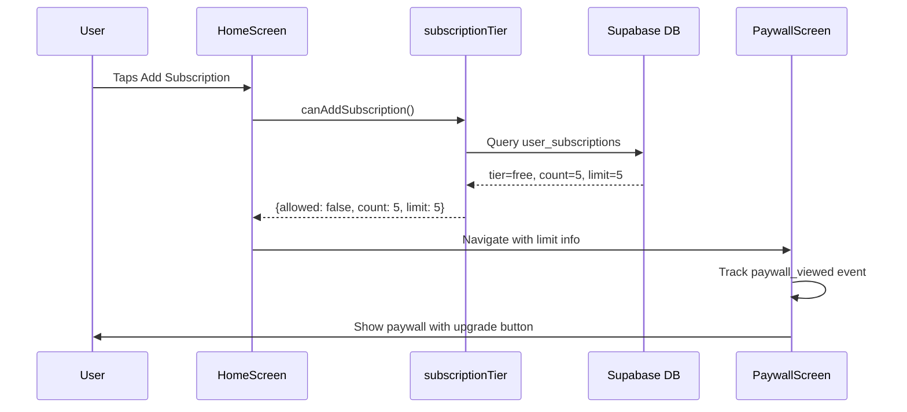
```mermaid
sequenceDiagram
    participant User
    participant Home as HomeScreen
    participant SubSvc as subscriptionTier
    participant DB as Supabase DB
    participant Paywall as PaywallScreen

    User->>Home: Taps Add Subscription
    Home->>SubSvc: canAddSubscription()
    SubSvc->>DB: Query user_subscriptions
    DB-->>SubSvc: tier=free, count=5, limit=5
    SubSvc-->>Home: {allowed: false, count: 5, limit: 5}
    Home->>Paywall: Navigate with limit info
    Paywall->>Paywall: Track paywall_viewed event
    Paywall->>User: Show paywall with upgrade button
```

### 2. Complete Payment Flow

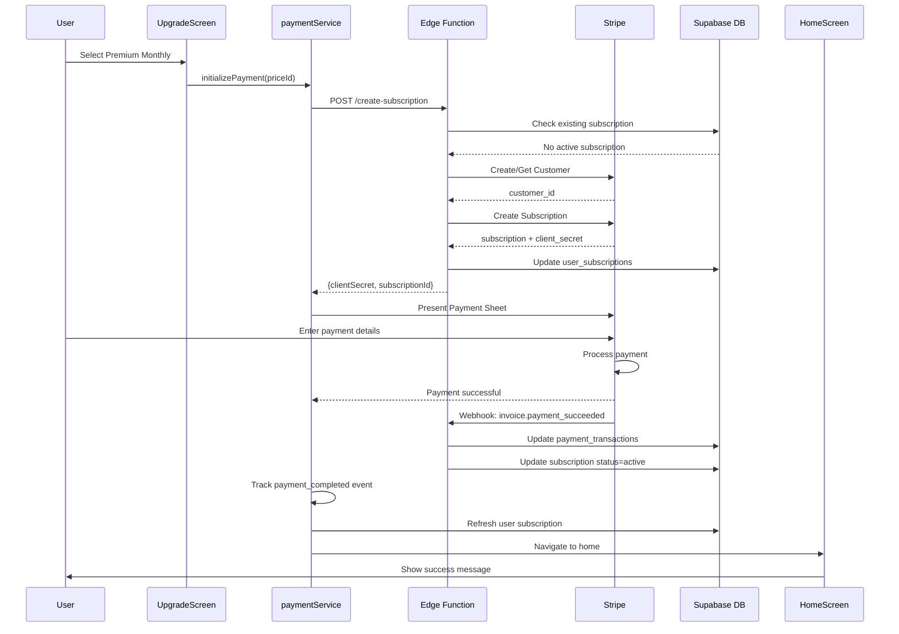
```mermaid
sequenceDiagram
    participant User
    participant Upgrade as UpgradeScreen
    participant PaySvc as paymentService
    participant Edge as Edge Function
    participant Stripe
    participant DB as Supabase DB
    participant Home as HomeScreen

    User->>Upgrade: Select Premium Monthly
    Upgrade->>PaySvc: initializePayment(priceId)
    PaySvc->>Edge: POST /create-subscription
    
    Edge->>DB: Check existing subscription
    DB-->>Edge: No active subscription
    
    Edge->>Stripe: Create/Get Customer
    Stripe-->>Edge: customer_id
    
    Edge->>Stripe: Create Subscription
    Stripe-->>Edge: subscription + client_secret
    
    Edge->>DB: Update user_subscriptions
    Edge-->>PaySvc: {clientSecret, subscriptionId}
    
    PaySvc->>Stripe: Present Payment Sheet
    User->>Stripe: Enter payment details
    Stripe->>Stripe: Process payment
    Stripe-->>PaySvc: Payment successful
    
    Stripe->>Edge: Webhook: invoice.payment_succeeded
    Edge->>DB: Update payment_transactions
    Edge->>DB: Update subscription status=active
    
    PaySvc->>PaySvc: Track payment_completed event
    PaySvc->>DB: Refresh user subscription
    PaySvc->>Home: Navigate to home
    Home->>User: Show success message
```

### 3. Webhook Processing Flow

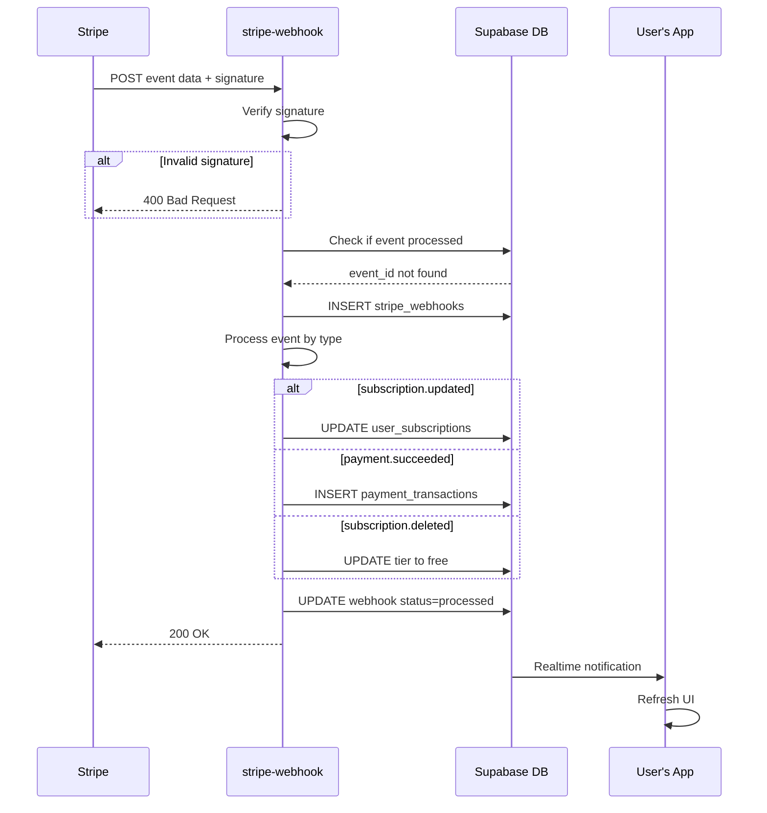
```mermaid
sequenceDiagram
    participant Stripe
    participant Webhook as stripe-webhook
    participant DB as Supabase DB
    participant User as User's App

    Stripe->>Webhook: POST event data + signature
    Webhook->>Webhook: Verify signature
    
    alt Invalid signature
        Webhook-->>Stripe: 400 Bad Request
    end
    
    Webhook->>DB: Check if event processed
    DB-->>Webhook: event_id not found
    
    Webhook->>DB: INSERT stripe_webhooks
    Webhook->>Webhook: Process event by type
    
    alt subscription.updated
        Webhook->>DB: UPDATE user_subscriptions
    else payment.succeeded
        Webhook->>DB: INSERT payment_transactions
    else subscription.deleted
        Webhook->>DB: UPDATE tier to free
    end
    
    Webhook->>DB: UPDATE webhook status=processed
    Webhook-->>Stripe: 200 OK
    
    DB->>User: Realtime notification
    User->>User: Refresh UI
```

### 4. Cancellation Flow

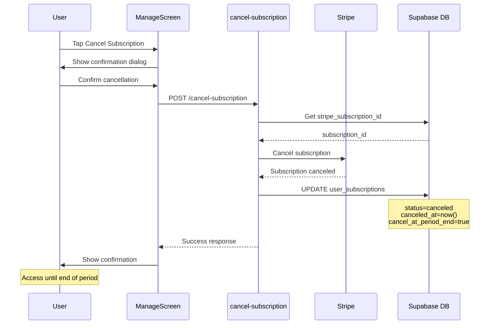
```mermaid
sequenceDiagram
    participant User
    participant Manage as ManageScreen
    participant Edge as cancel-subscription
    participant Stripe
    participant DB as Supabase DB

    User->>Manage: Tap Cancel Subscription
    Manage->>User: Show confirmation dialog
    User->>Manage: Confirm cancellation
    
    Manage->>Edge: POST /cancel-subscription
    Edge->>DB: Get stripe_subscription_id
    DB-->>Edge: subscription_id
    
    Edge->>Stripe: Cancel subscription
    Stripe-->>Edge: Subscription canceled
    
    Edge->>DB: UPDATE user_subscriptions
    Note over DB: status=canceled<br/>canceled_at=now()<br/>cancel_at_period_end=true
    
    Edge-->>Manage: Success response
    Manage->>User: Show confirmation
    Note over User: Access until end of period
```

### 5. Refund Request Flow

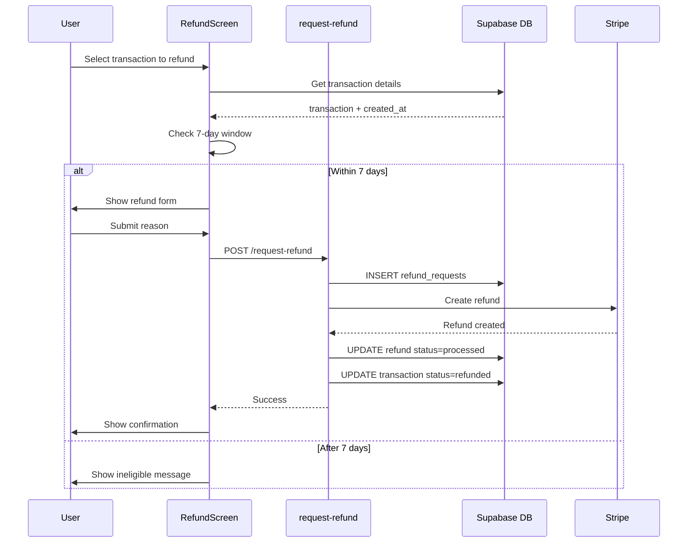
```mermaid
sequenceDiagram
    participant User
    participant Refund as RefundScreen
    participant Edge as request-refund
    participant DB as Supabase DB
    participant Stripe

    User->>Refund: Select transaction to refund
    Refund->>DB: Get transaction details
    DB-->>Refund: transaction + created_at
    
    Refund->>Refund: Check 7-day window
    
    alt Within 7 days
        Refund->>User: Show refund form
        User->>Refund: Submit reason
        
        Refund->>Edge: POST /request-refund
        Edge->>DB: INSERT refund_requests
        Edge->>Stripe: Create refund
        Stripe-->>Edge: Refund created
        
        Edge->>DB: UPDATE refund status=processed
        Edge->>DB: UPDATE transaction status=refunded
        Edge-->>Refund: Success
        
        Refund->>User: Show confirmation
    else After 7 days
        Refund->>User: Show ineligible message
    end
```

---

## Sequence Diagrams

### Subscription Limit Check on App Launch

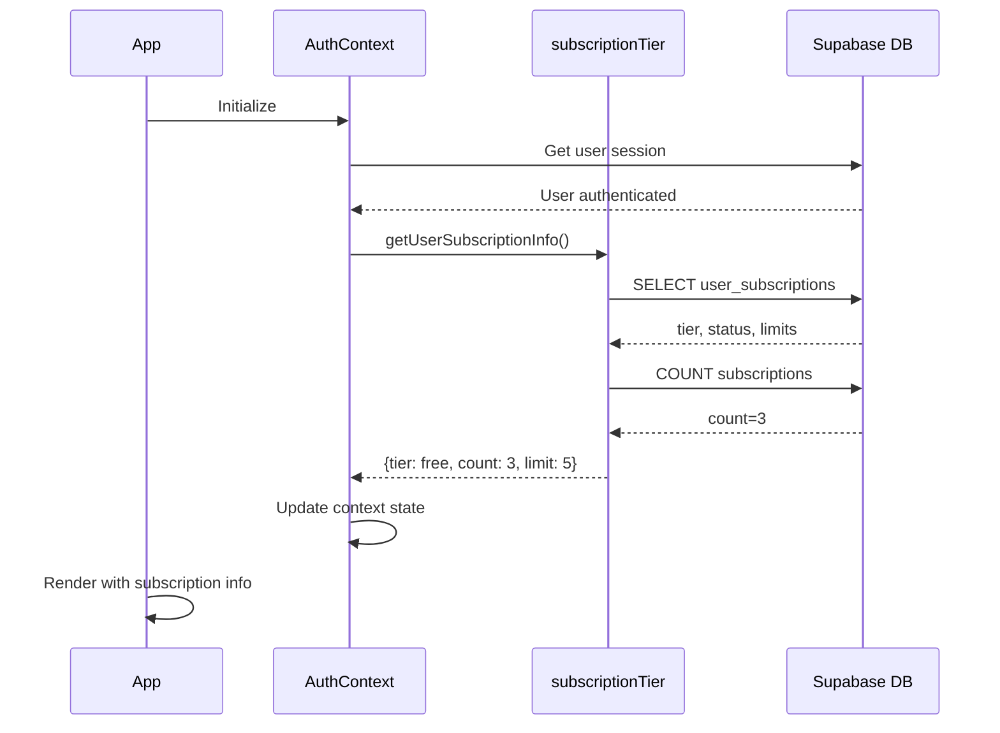
```mermaid
sequenceDiagram
    participant App
    participant Auth as AuthContext
    participant SubSvc as subscriptionTier
    participant DB as Supabase DB

    App->>Auth: Initialize
    Auth->>DB: Get user session
    DB-->>Auth: User authenticated
    
    Auth->>SubSvc: getUserSubscriptionInfo()
    SubSvc->>DB: SELECT user_subscriptions
    DB-->>SubSvc: tier, status, limits
    
    SubSvc->>DB: COUNT subscriptions
    DB-->>SubSvc: count=3
    
    SubSvc-->>Auth: {tier: free, count: 3, limit: 5}
    Auth->>Auth: Update context state
    App->>App: Render with subscription info
```

### Payment Method Update

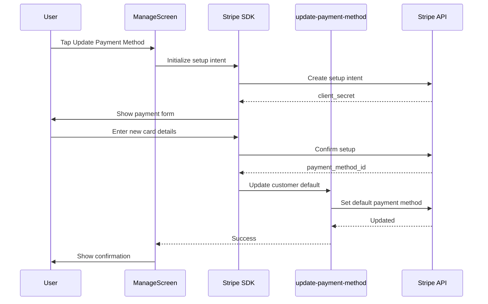
```mermaid
sequenceDiagram
    participant User
    participant Manage as ManageScreen
    participant Stripe as Stripe SDK
    participant Edge as update-payment-method
    participant StripeAPI as Stripe API

    User->>Manage: Tap Update Payment Method
    Manage->>Stripe: Initialize setup intent
    Stripe->>StripeAPI: Create setup intent
    StripeAPI-->>Stripe: client_secret
    
    Stripe->>User: Show payment form
    User->>Stripe: Enter new card details
    Stripe->>StripeAPI: Confirm setup
    StripeAPI-->>Stripe: payment_method_id
    
    Stripe->>Edge: Update customer default
    Edge->>StripeAPI: Set default payment method
    StripeAPI-->>Edge: Updated
    
    Edge-->>Manage: Success
    Manage->>User: Show confirmation
```

---

## Security Architecture

### Security Layers

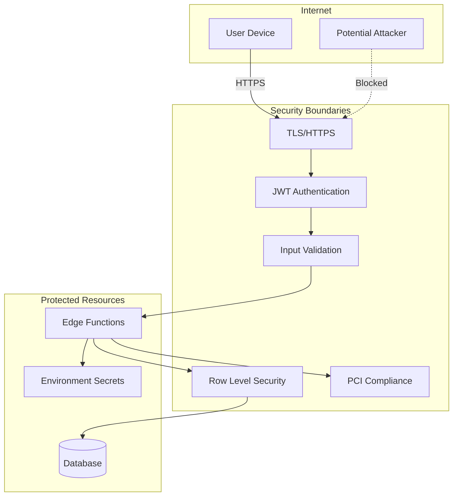
```mermaid
graph TB
    subgraph Internet
        User[User Device]
        Attacker[Potential Attacker]
    end

    subgraph SecurityLayer[Security Boundaries]
        TLS[TLS/HTTPS]
        Auth[JWT Authentication]
        RLS[Row Level Security]
        Validation[Input Validation]
        Stripe[PCI Compliance]
    end

    subgraph Protected[Protected Resources]
        EdgeFn[Edge Functions]
        DB[(Database)]
        Secrets[Environment Secrets]
    end

    User -->|HTTPS| TLS
    Attacker -.->|Blocked| TLS
    
    TLS --> Auth
    Auth --> Validation
    Validation --> EdgeFn
    EdgeFn --> RLS
    RLS --> DB
    
    EdgeFn --> Secrets
    EdgeFn --> Stripe
```

### Authentication Flow

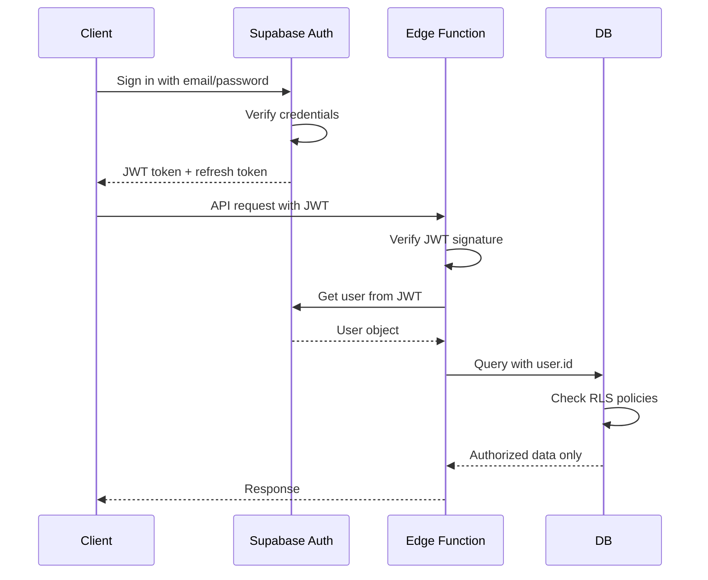
```mermaid
sequenceDiagram
    participant Client
    participant Supabase as Supabase Auth
    participant Edge as Edge Function
    participant DB

    Client->>Supabase: Sign in with email/password
    Supabase->>Supabase: Verify credentials
    Supabase-->>Client: JWT token + refresh token
    
    Client->>Edge: API request with JWT
    Edge->>Edge: Verify JWT signature
    Edge->>Supabase: Get user from JWT
    Supabase-->>Edge: User object
    
    Edge->>DB: Query with user.id
    DB->>DB: Check RLS policies
    DB-->>Edge: Authorized data only
    Edge-->>Client: Response
```

### Data Access Control

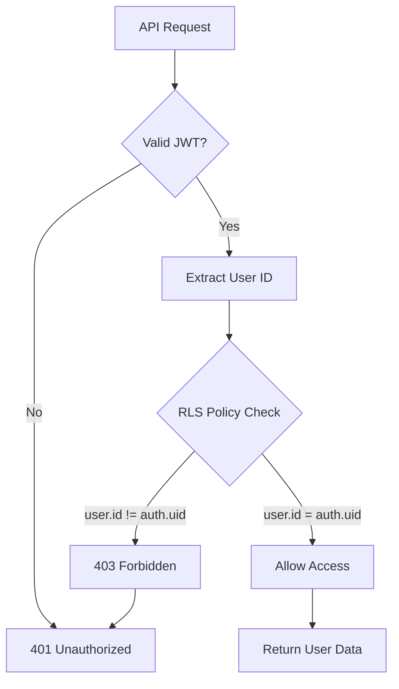
```mermaid
graph TD
    Request[API Request] --> JWT{Valid JWT?}
    JWT -->|No| Reject[401 Unauthorized]
    JWT -->|Yes| ExtractUser[Extract User ID]
    
    ExtractUser --> RLS{RLS Policy Check}
    RLS -->|user.id = auth.uid| Allow[Allow Access]
    RLS -->|user.id != auth.uid| Deny[403 Forbidden]
    
    Allow --> Data[Return User Data]
    Deny --> Reject
```

### PCI Compliance

**Payment Data Never Touches Our Servers**:

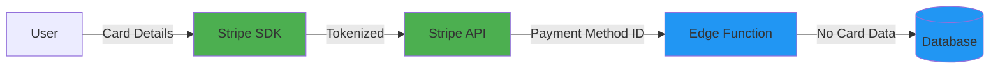
```mermaid
graph LR
    User[User] -->|Card Details| Stripe[Stripe SDK]
    Stripe -->|Tokenized| StripeAPI[Stripe API]
    StripeAPI -->|Payment Method ID| Edge[Edge Function]
    Edge -->|No Card Data| DB[(Database)]
    
    style Stripe fill:#4CAF50
    style StripeAPI fill:#4CAF50
    style Edge fill:#2196F3
    style DB fill:#2196F3
```

---

## Integration Architecture

### External Service Integration

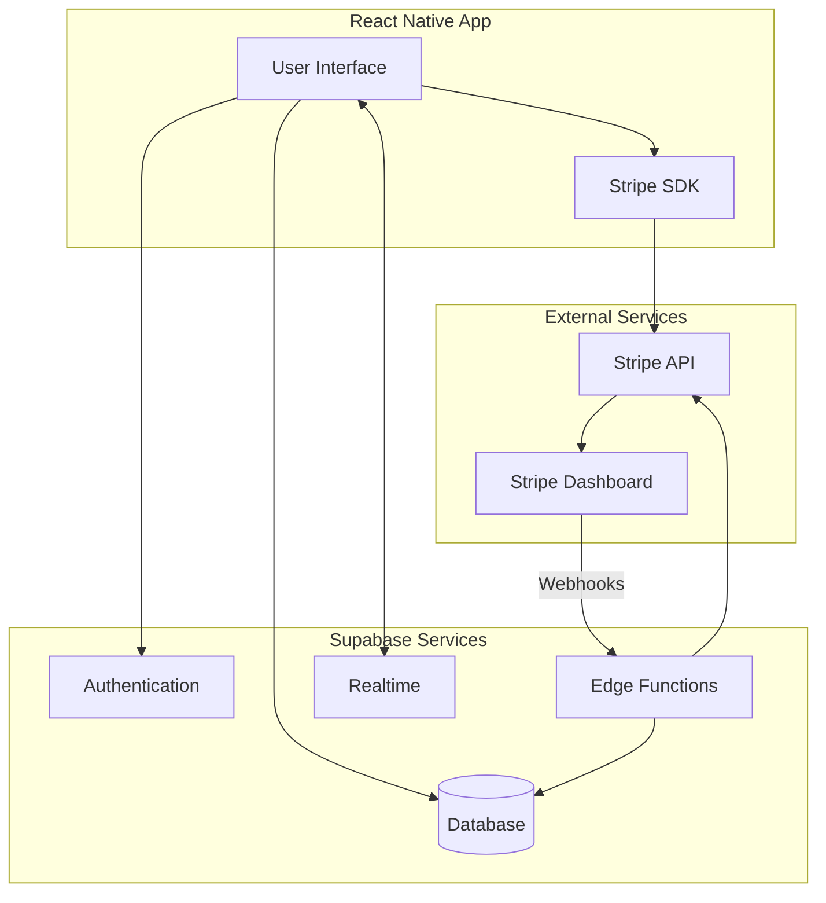
```mermaid
graph TB
    subgraph App[React Native App]
        UI[User Interface]
        SDK[Stripe SDK]
    end

    subgraph Supabase[Supabase Services]
        Auth[Authentication]
        DB[(Database)]
        Edge[Edge Functions]
        RT[Realtime]
    end

    subgraph External[External Services]
        StripeAPI[Stripe API]
        StripeDash[Stripe Dashboard]
    end

    UI --> SDK
    UI --> Auth
    UI --> DB
    UI <--> RT
    
    SDK --> StripeAPI
    Edge --> StripeAPI
    StripeAPI --> StripeDash
    
    StripeDash -->|Webhooks| Edge
    Edge --> DB
```

### Data Synchronization

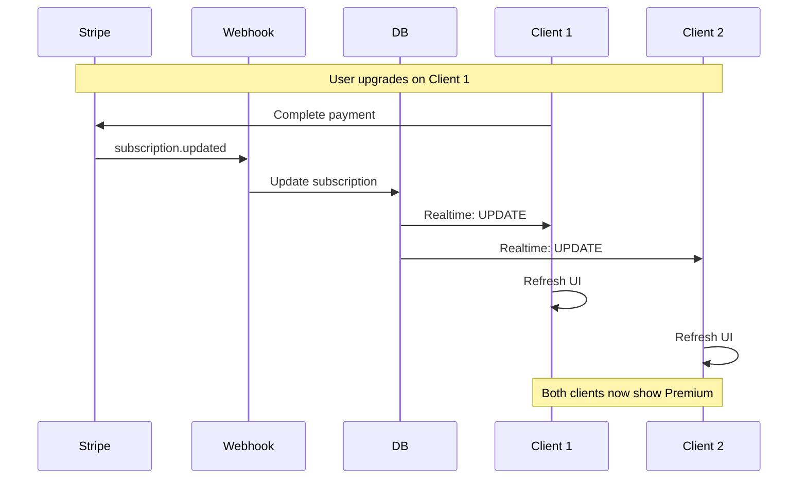
```mermaid
sequenceDiagram
    participant Stripe
    participant Webhook
    participant DB
    participant Client1 as Client 1
    participant Client2 as Client 2

    Note over Stripe,Client2: User upgrades on Client 1
    
    Client1->>Stripe: Complete payment
    Stripe->>Webhook: subscription.updated
    Webhook->>DB: Update subscription
    
    DB->>Client1: Realtime: UPDATE
    DB->>Client2: Realtime: UPDATE
    
    Client1->>Client1: Refresh UI
    Client2->>Client2: Refresh UI
    
    Note over Client1,Client2: Both clients now show Premium
```

### Webhook Retry Logic

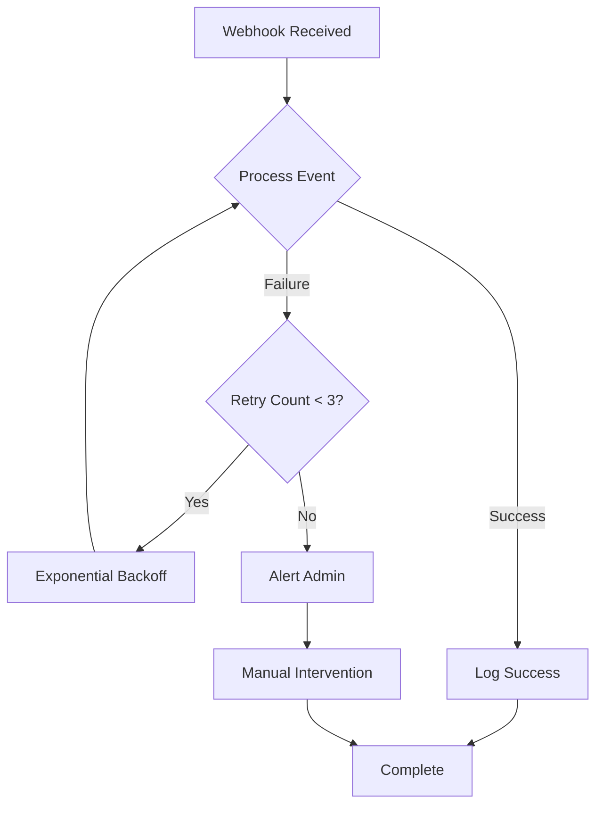
```mermaid
graph TD
    Webhook[Webhook Received] --> Process{Process Event}
    Process -->|Success| Log[Log Success]
    Process -->|Failure| Retry{Retry Count < 3?}
    
    Retry -->|Yes| Wait[Exponential Backoff]
    Wait --> Process
    
    Retry -->|No| Alert[Alert Admin]
    Alert --> Manual[Manual Intervention]
    
    Log --> Complete[Complete]
    Manual --> Complete
```

---

## Deployment Architecture

### Production Environment

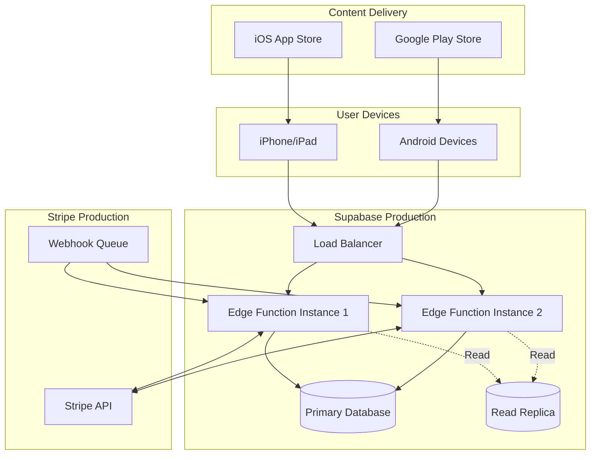
```mermaid
graph TB
    subgraph CDN[Content Delivery]
        iOS[iOS App Store]
        Android[Google Play Store]
    end

    subgraph Client[User Devices]
        iPhone[iPhone/iPad]
        AndroidDev[Android Devices]
    end

    subgraph Supabase[Supabase Production]
        LB[Load Balancer]
        Edge1[Edge Function Instance 1]
        Edge2[Edge Function Instance 2]
        DB1[(Primary Database)]
        DB2[(Read Replica)]
    end

    subgraph Stripe[Stripe Production]
        StripeAPI[Stripe API]
        WebhookQueue[Webhook Queue]
    end

    iOS --> iPhone
    Android --> AndroidDev
    
    iPhone --> LB
    AndroidDev --> LB
    
    LB --> Edge1
    LB --> Edge2
    
    Edge1 --> DB1
    Edge2 --> DB1
    Edge1 -.->|Read| DB2
    Edge2 -.->|Read| DB2
    
    Edge1 <--> StripeAPI
    Edge2 <--> StripeAPI
    
    WebhookQueue --> Edge1
    WebhookQueue --> Edge2
```

### Staging Environment

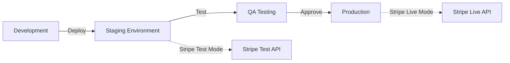
```mermaid
graph LR
    Dev[Development] -->|Deploy| Staging[Staging Environment]
    Staging -->|Test| QA[QA Testing]
    QA -->|Approve| Prod[Production]
    
    Staging -.->|Stripe Test Mode| StripeTest[Stripe Test API]
    Prod -.->|Stripe Live Mode| StripeLive[Stripe Live API]
```

### Environment Configuration

| Component | Development | Staging | Production |
|-----------|-------------|---------|------------|
| **Supabase** | Local/Dev Project | Staging Project | Production Project |
| **Stripe** | Test Mode | Test Mode | Live Mode |
| **Database** | Local PostgreSQL | Staging DB | Production DB + Replica |
| **Edge Functions** | Local Deno | Deployed to Staging | Deployed to Production |
| **Webhooks** | Stripe CLI Forward | Test Webhooks | Production Webhooks |

---

## Scalability Considerations

### Horizontal Scaling

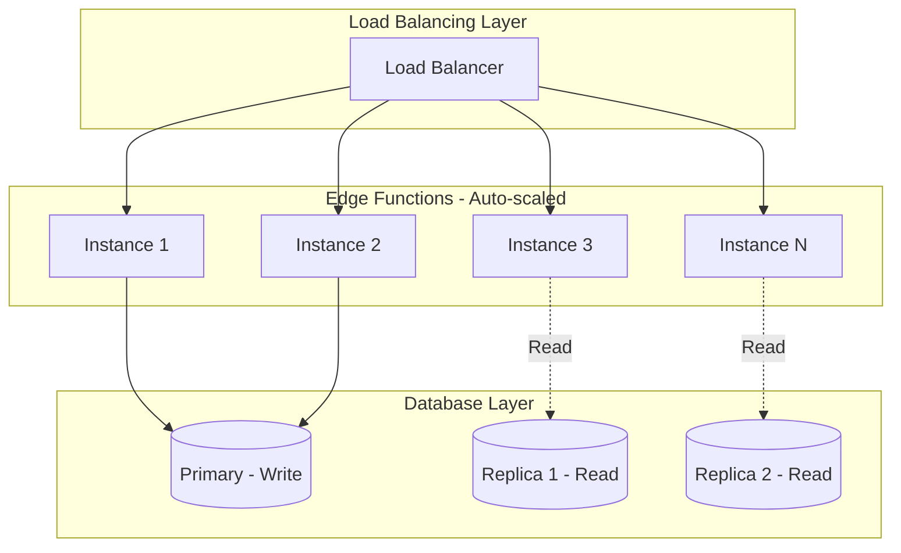
```mermaid
graph TB
    subgraph LoadBalancing[Load Balancing Layer]
        LB[Load Balancer]
    end

    subgraph EdgeLayer[Edge Functions - Auto-scaled]
        E1[Instance 1]
        E2[Instance 2]
        E3[Instance 3]
        EN[Instance N]
    end

    subgraph DatabaseLayer[Database Layer]
        Primary[(Primary - Write)]
        Replica1[(Replica 1 - Read)]
        Replica2[(Replica 2 - Read)]
    end

    LB --> E1
    LB --> E2
    LB --> E3
    LB --> EN

    E1 --> Primary
    E2 --> Primary
    E3 -.->|Read| Replica1
    EN -.->|Read| Replica2
```

### Caching Strategy

```mermaid
graph LR
    Client[Client Request] --> Cache{Cache Hit?}
    Cache -->|Yes| Return[Return Cached]
    Cache -->|No| DB[Query Database]
    DB --> Store[Store in Cache]
    Store --> Return
    
    Return --> Client
```

**Cached Data**:
- User subscription tier (TTL: 5 minutes)
- Subscription limits (TTL: 5 minutes)
- Available tiers (TTL: 1 hour)

---

## Monitoring Architecture

### Observability Stack

```mermaid
graph TB
    subgraph Sources[Data Sources]
        App[React Native App]
        Edge[Edge Functions]
        DB[(Database)]
        Stripe[Stripe]
    end

    subgraph Collection[Collection Layer]
        Logs[Log Aggregation]
        Metrics[Metrics Collection]
        Events[Event Tracking]
    end

    subgraph Analysis[Analysis Layer]
        Dashboard[Dashboards]
        Alerts[Alert System]
        Analytics[Analytics Engine]
    end

    App --> Logs
    App --> Events
    Edge --> Logs
    Edge --> Metrics
    DB --> Metrics
    Stripe --> Events

    Logs --> Dashboard
    Metrics --> Dashboard
    Events --> Analytics

    Metrics --> Alerts
    Logs --> Alerts
```

### Key Metrics Dashboard

**Business Metrics**:
- Active subscriptions (Free vs Premium)
- Conversion rate (Paywall views → Purchases)
- Monthly Recurring Revenue (MRR)
- Churn rate
- Refund rate

**Technical Metrics**:
- API response times (p50, p95, p99)
- Error rates by endpoint
- Webhook processing success rate
- Database query performance
- Cold start frequency

**User Metrics**:
- Daily Active Users (DAU)
- Subscription limit usage
- Feature adoption rates

---

## Disaster Recovery

### Backup Strategy

```mermaid
graph LR
    DB[(Production DB)] -->|Continuous| WAL[Write-Ahead Log]
    DB -->|Daily| Snapshot[Daily Snapshots]
    DB -->|Streaming| Replica[(Read Replica)]
    
    WAL --> S3[Backup Storage]
    Snapshot --> S3
    Replica -.->|Failover| Primary[Promote to Primary]
```

### Recovery Procedures

1. **Database Failure**:
   - Automatic failover to read replica
   - Promote replica to primary
   - Recovery time: < 5 minutes

2. **Edge Function Failure**:
   - Automatic restart
   - Load balancer routes to healthy instances
   - Recovery time: < 1 minute

3. **Stripe Webhook Failure**:
   - Retry with exponential backoff
   - Manual reconciliation for missed events
   - Recovery time: < 1 hour

---

## Future Architecture Enhancements

### Planned Improvements

1. **Caching Layer**: Redis for improved performance
2. **Event Streaming**: Kafka for real-time analytics
3. **Service Mesh**: Better observability and control
4. **Multi-region**: Geographic distribution
5. **CDN**: Static asset delivery optimization

---

**End of System Architecture Document**