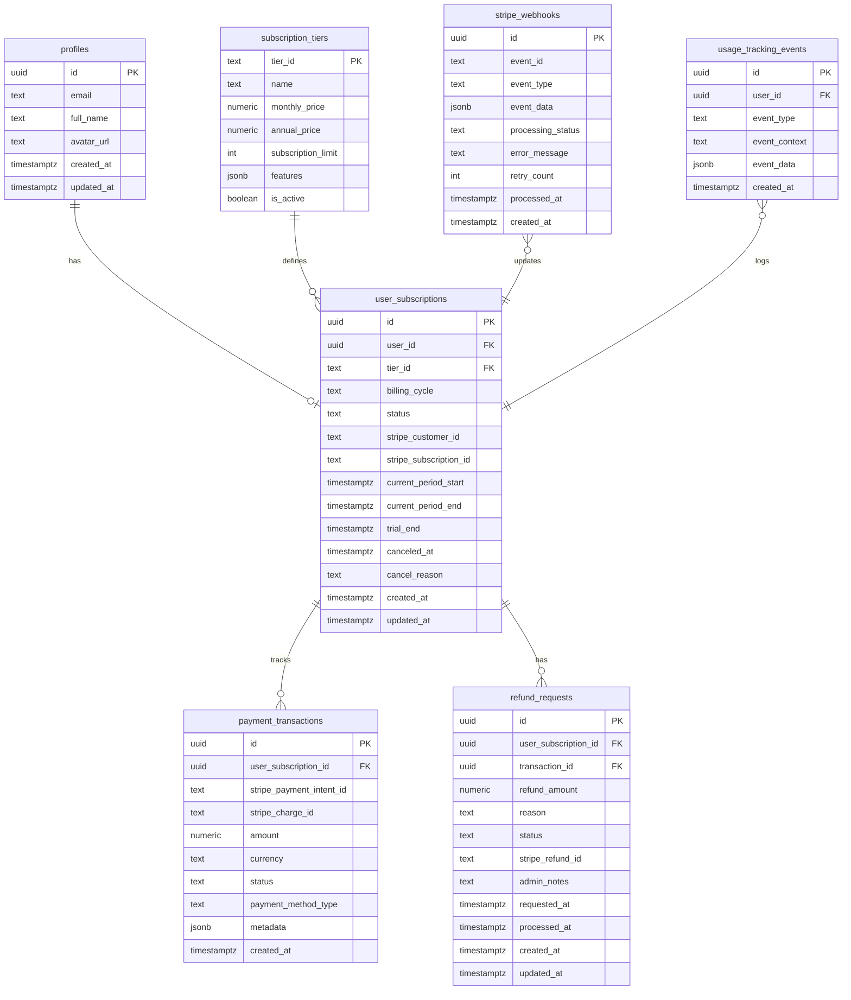

# Paywall System - Database Schema Documentation

## Overview

This document defines the complete database schema for the paywall/subscription system. The schema is designed for PostgreSQL (Supabase) and includes tables, indexes, RLS policies, triggers, and functions.

## Table of Contents
1. [Schema Design Principles](#schema-design-principles)
2. [Entity Relationship Diagram](#entity-relationship-diagram)
3. [Table Definitions](#table-definitions)
4. [Indexes](#indexes)
5. [Row Level Security Policies](#row-level-security-policies)
6. [Database Functions](#database-functions)
7. [Triggers](#triggers)
8. [Migration Scripts](#migration-scripts)

---

## Schema Design Principles

1. **Data Integrity**: Foreign keys and constraints ensure referential integrity
2. **Security**: RLS policies enforce user-level data isolation
3. **Audit Trail**: Created/updated timestamps on all tables
4. **Idempotency**: Unique constraints prevent duplicate webhook processing
5. **Performance**: Strategic indexes for common query patterns
6. **Scalability**: Normalized design with efficient relationships

---

## Entity Relationship Diagram



---

## Table Definitions

### 1. subscription_tiers

Defines available subscription tiers (Free and Premium).

```sql
-- Subscription tier definitions
CREATE TABLE IF NOT EXISTS public.subscription_tiers (
  tier_id TEXT PRIMARY KEY,
  name TEXT NOT NULL,
  description TEXT,
  monthly_price NUMERIC(10, 2) NOT NULL DEFAULT 0.00,
  annual_price NUMERIC(10, 2) NOT NULL DEFAULT 0.00,
  subscription_limit INTEGER NOT NULL DEFAULT 5,
  features JSONB DEFAULT '[]'::jsonb,
  is_active BOOLEAN DEFAULT TRUE,
  display_order INTEGER DEFAULT 0,
  created_at TIMESTAMPTZ DEFAULT NOW(),
  updated_at TIMESTAMPTZ DEFAULT NOW()
);

-- Add table comment
COMMENT ON TABLE public.subscription_tiers IS 'Defines available subscription tiers and their features';
COMMENT ON COLUMN public.subscription_tiers.subscription_limit IS 'Maximum number of subscriptions allowed (-1 for unlimited)';
COMMENT ON COLUMN public.subscription_tiers.features IS 'JSON array of feature identifiers';

-- Insert default tiers
INSERT INTO public.subscription_tiers (tier_id, name, description, monthly_price, annual_price, subscription_limit, features, display_order) VALUES
('free', 'Free', 'Basic subscription tracking', 0.00, 0.00, 5, '["cloud_sync", "renewal_reminders", "basic_stats"]'::jsonb, 1),
('premium', 'Premium', 'Unlimited subscription tracking with advanced features', 4.99, 39.00, -1, '["cloud_sync", "renewal_reminders", "basic_stats", "advanced_analytics", "priority_support"]'::jsonb, 2)
ON CONFLICT (tier_id) DO NOTHING;
```

### 2. user_subscriptions

Tracks each user's subscription status and Stripe integration.

```sql
-- User subscription status
CREATE TABLE IF NOT EXISTS public.user_subscriptions (
  id UUID DEFAULT gen_random_uuid() PRIMARY KEY,
  user_id UUID REFERENCES auth.users(id) ON DELETE CASCADE NOT NULL,
  tier_id TEXT REFERENCES public.subscription_tiers(tier_id) NOT NULL DEFAULT 'free',
  billing_cycle TEXT CHECK (billing_cycle IN ('monthly', 'annual', 'none')) DEFAULT 'none',
  status TEXT CHECK (status IN ('active', 'canceled', 'past_due', 'trialing', 'incomplete', 'paused')) DEFAULT 'active',
  
  -- Stripe integration
  stripe_customer_id TEXT UNIQUE,
  stripe_subscription_id TEXT UNIQUE,
  stripe_price_id TEXT,
  
  -- Billing dates
  current_period_start TIMESTAMPTZ,
  current_period_end TIMESTAMPTZ,
  trial_end TIMESTAMPTZ,
  
  -- Cancellation tracking
  canceled_at TIMESTAMPTZ,
  cancel_at_period_end BOOLEAN DEFAULT FALSE,
  cancel_reason TEXT,
  
  -- Timestamps
  created_at TIMESTAMPTZ DEFAULT NOW(),
  updated_at TIMESTAMPTZ DEFAULT NOW(),
  
  -- Ensure one active subscription per user
  UNIQUE (user_id)
);

-- Add table comments
COMMENT ON TABLE public.user_subscriptions IS 'Tracks user subscription tier and billing status';
COMMENT ON COLUMN public.user_subscriptions.status IS 'Current subscription status from Stripe';
COMMENT ON COLUMN public.user_subscriptions.cancel_at_period_end IS 'If true, subscription will cancel at end of current period';
```

### 3. payment_transactions

Records all payment transactions for audit and history.

```sql
-- Payment transaction history
CREATE TABLE IF NOT EXISTS public.payment_transactions (
  id UUID DEFAULT gen_random_uuid() PRIMARY KEY,
  user_subscription_id UUID REFERENCES public.user_subscriptions(id) ON DELETE CASCADE NOT NULL,
  
  -- Stripe references
  stripe_payment_intent_id TEXT UNIQUE NOT NULL,
  stripe_charge_id TEXT,
  stripe_invoice_id TEXT,
  
  -- Payment details
  amount NUMERIC(10, 2) NOT NULL,
  currency TEXT DEFAULT 'usd',
  status TEXT CHECK (status IN ('pending', 'succeeded', 'failed', 'canceled', 'refunded')) NOT NULL,
  payment_method_type TEXT,
  
  -- Metadata
  description TEXT,
  failure_reason TEXT,
  metadata JSONB DEFAULT '{}'::jsonb,
  
  -- Timestamps
  created_at TIMESTAMPTZ DEFAULT NOW()
);

-- Add table comments
COMMENT ON TABLE public.payment_transactions IS 'Audit trail of all payment transactions';
COMMENT ON COLUMN public.payment_transactions.metadata IS 'Additional Stripe metadata and context';
```

### 4. refund_requests

Tracks refund requests and processing status.

```sql
-- Refund request tracking
CREATE TABLE IF NOT EXISTS public.refund_requests (
  id UUID DEFAULT gen_random_uuid() PRIMARY KEY,
  user_subscription_id UUID REFERENCES public.user_subscriptions(id) ON DELETE CASCADE NOT NULL,
  transaction_id UUID REFERENCES public.payment_transactions(id) ON DELETE CASCADE,
  
  -- Refund details
  refund_amount NUMERIC(10, 2) NOT NULL,
  reason TEXT NOT NULL,
  user_notes TEXT,
  
  -- Processing
  status TEXT CHECK (status IN ('pending', 'approved', 'rejected', 'processed', 'failed')) DEFAULT 'pending',
  stripe_refund_id TEXT UNIQUE,
  admin_notes TEXT,
  
  -- Timestamps
  requested_at TIMESTAMPTZ DEFAULT NOW(),
  processed_at TIMESTAMPTZ,
  created_at TIMESTAMPTZ DEFAULT NOW(),
  updated_at TIMESTAMPTZ DEFAULT NOW()
);

-- Add table comments
COMMENT ON TABLE public.refund_requests IS 'Tracks user refund requests and processing status';
COMMENT ON COLUMN public.refund_requests.status IS 'Current status of refund request';
```

### 5. stripe_webhooks

Logs all Stripe webhook events for debugging and idempotency.

```sql
-- Stripe webhook event log
CREATE TABLE IF NOT EXISTS public.stripe_webhooks (
  id UUID DEFAULT gen_random_uuid() PRIMARY KEY,
  
  -- Event details
  event_id TEXT UNIQUE NOT NULL,
  event_type TEXT NOT NULL,
  event_data JSONB NOT NULL,
  
  -- Processing status
  processing_status TEXT CHECK (processing_status IN ('pending', 'processing', 'processed', 'failed', 'ignored')) DEFAULT 'pending',
  error_message TEXT,
  retry_count INTEGER DEFAULT 0,
  processed_at TIMESTAMPTZ,
  
  -- Timestamps
  created_at TIMESTAMPTZ DEFAULT NOW()
);

-- Add table comments
COMMENT ON TABLE public.stripe_webhooks IS 'Audit log of all Stripe webhook events for idempotency and debugging';
COMMENT ON COLUMN public.stripe_webhooks.event_id IS 'Unique Stripe event ID for idempotency';
```

### 6. usage_tracking_events

Tracks user interactions with paywall for analytics.

```sql
-- Usage and analytics tracking
CREATE TABLE IF NOT EXISTS public.usage_tracking_events (
  id UUID DEFAULT gen_random_uuid() PRIMARY KEY,
  user_id UUID REFERENCES auth.users(id) ON DELETE CASCADE NOT NULL,
  
  -- Event details
  event_type TEXT NOT NULL, -- 'paywall_viewed', 'plan_selected', 'payment_initiated', etc.
  event_context TEXT, -- 'add_subscription_limit', 'settings_upgrade', etc.
  event_data JSONB DEFAULT '{}'::jsonb,
  
  -- Timestamps
  created_at TIMESTAMPTZ DEFAULT NOW()
);

-- Add table comments
COMMENT ON TABLE public.usage_tracking_events IS 'Tracks paywall interaction events for conversion analytics';
COMMENT ON COLUMN public.usage_tracking_events.event_type IS 'Type of event being tracked';
COMMENT ON COLUMN public.usage_tracking_events.event_context IS 'Context where event occurred';
```

---

## Indexes

### Performance Indexes

```sql
-- user_subscriptions indexes
CREATE INDEX IF NOT EXISTS idx_user_subscriptions_user_id ON public.user_subscriptions(user_id);
CREATE INDEX IF NOT EXISTS idx_user_subscriptions_stripe_customer ON public.user_subscriptions(stripe_customer_id) WHERE stripe_customer_id IS NOT NULL;
CREATE INDEX IF NOT EXISTS idx_user_subscriptions_stripe_subscription ON public.user_subscriptions(stripe_subscription_id) WHERE stripe_subscription_id IS NOT NULL;
CREATE INDEX IF NOT EXISTS idx_user_subscriptions_status ON public.user_subscriptions(status);
CREATE INDEX IF NOT EXISTS idx_user_subscriptions_tier ON public.user_subscriptions(tier_id);

-- payment_transactions indexes
CREATE INDEX IF NOT EXISTS idx_payment_transactions_user_sub ON public.payment_transactions(user_subscription_id);
CREATE INDEX IF NOT EXISTS idx_payment_transactions_stripe_intent ON public.payment_transactions(stripe_payment_intent_id);
CREATE INDEX IF NOT EXISTS idx_payment_transactions_status ON public.payment_transactions(status);
CREATE INDEX IF NOT EXISTS idx_payment_transactions_created ON public.payment_transactions(created_at DESC);

-- refund_requests indexes
CREATE INDEX IF NOT EXISTS idx_refund_requests_user_sub ON public.refund_requests(user_subscription_id);
CREATE INDEX IF NOT EXISTS idx_refund_requests_status ON public.refund_requests(status);
CREATE INDEX IF NOT EXISTS idx_refund_requests_requested ON public.refund_requests(requested_at DESC);

-- stripe_webhooks indexes
CREATE INDEX IF NOT EXISTS idx_stripe_webhooks_event_id ON public.stripe_webhooks(event_id);
CREATE INDEX IF NOT EXISTS idx_stripe_webhooks_event_type ON public.stripe_webhooks(event_type);
CREATE INDEX IF NOT EXISTS idx_stripe_webhooks_status ON public.stripe_webhooks(processing_status);
CREATE INDEX IF NOT EXISTS idx_stripe_webhooks_created ON public.stripe_webhooks(created_at DESC);

-- usage_tracking_events indexes
CREATE INDEX IF NOT EXISTS idx_usage_events_user_id ON public.usage_tracking_events(user_id);
CREATE INDEX IF NOT EXISTS idx_usage_events_type ON public.usage_tracking_events(event_type);
CREATE INDEX IF NOT EXISTS idx_usage_events_created ON public.usage_tracking_events(created_at DESC);
```

---

## Row Level Security Policies

### Enable RLS

```sql
-- Enable Row Level Security
ALTER TABLE public.subscription_tiers ENABLE ROW LEVEL SECURITY;
ALTER TABLE public.user_subscriptions ENABLE ROW LEVEL SECURITY;
ALTER TABLE public.payment_transactions ENABLE ROW LEVEL SECURITY;
ALTER TABLE public.refund_requests ENABLE ROW LEVEL SECURITY;
ALTER TABLE public.stripe_webhooks ENABLE ROW LEVEL SECURITY;
ALTER TABLE public.usage_tracking_events ENABLE ROW LEVEL SECURITY;
```

### Subscription Tiers Policies

```sql
-- subscription_tiers: Anyone can read active tiers
CREATE POLICY "Anyone can view active subscription tiers"
  ON public.subscription_tiers
  FOR SELECT
  USING (is_active = TRUE);

-- subscription_tiers: Only service role can modify
CREATE POLICY "Service role can manage subscription tiers"
  ON public.subscription_tiers
  FOR ALL
  USING (auth.jwt()->>'role' = 'service_role');
```

### User Subscriptions Policies

```sql
-- user_subscriptions: Users can view their own subscription
CREATE POLICY "Users can view own subscription"
  ON public.user_subscriptions
  FOR SELECT
  USING (auth.uid() = user_id);

-- user_subscriptions: Users can insert their own subscription
CREATE POLICY "Users can create own subscription"
  ON public.user_subscriptions
  FOR INSERT
  WITH CHECK (auth.uid() = user_id);

-- user_subscriptions: Users can update their own subscription
CREATE POLICY "Users can update own subscription"
  ON public.user_subscriptions
  FOR UPDATE
  USING (auth.uid() = user_id)
  WITH CHECK (auth.uid() = user_id);

-- user_subscriptions: Service role can manage all subscriptions (for webhooks)
CREATE POLICY "Service role can manage all subscriptions"
  ON public.user_subscriptions
  FOR ALL
  USING (auth.jwt()->>'role' = 'service_role');
```

### Payment Transactions Policies

```sql
-- payment_transactions: Users can view their own transactions
CREATE POLICY "Users can view own transactions"
  ON public.payment_transactions
  FOR SELECT
  USING (
    EXISTS (
      SELECT 1 FROM public.user_subscriptions
      WHERE user_subscriptions.id = payment_transactions.user_subscription_id
      AND user_subscriptions.user_id = auth.uid()
    )
  );

-- payment_transactions: Service role can manage all transactions
CREATE POLICY "Service role can manage all transactions"
  ON public.payment_transactions
  FOR ALL
  USING (auth.jwt()->>'role' = 'service_role');
```

### Refund Requests Policies

```sql
-- refund_requests: Users can view their own refund requests
CREATE POLICY "Users can view own refund requests"
  ON public.refund_requests
  FOR SELECT
  USING (
    EXISTS (
      SELECT 1 FROM public.user_subscriptions
      WHERE user_subscriptions.id = refund_requests.user_subscription_id
      AND user_subscriptions.user_id = auth.uid()
    )
  );

-- refund_requests: Users can create their own refund requests
CREATE POLICY "Users can create own refund requests"
  ON public.refund_requests
  FOR INSERT
  WITH CHECK (
    EXISTS (
      SELECT 1 FROM public.user_subscriptions
      WHERE user_subscriptions.id = refund_requests.user_subscription_id
      AND user_subscriptions.user_id = auth.uid()
    )
  );

-- refund_requests: Service role can manage all refund requests
CREATE POLICY "Service role can manage all refund requests"
  ON public.refund_requests
  FOR ALL
  USING (auth.jwt()->>'role' = 'service_role');
```

### Stripe Webhooks Policies

```sql
-- stripe_webhooks: Only service role can access webhooks
CREATE POLICY "Service role can manage webhooks"
  ON public.stripe_webhooks
  FOR ALL
  USING (auth.jwt()->>'role' = 'service_role');
```

### Usage Tracking Policies

```sql
-- usage_tracking_events: Users can view their own events
CREATE POLICY "Users can view own usage events"
  ON public.usage_tracking_events
  FOR SELECT
  USING (auth.uid() = user_id);

-- usage_tracking_events: Users can insert their own events
CREATE POLICY "Users can track own usage events"
  ON public.usage_tracking_events
  FOR INSERT
  WITH CHECK (auth.uid() = user_id);

-- usage_tracking_events: Service role can access all events
CREATE POLICY "Service role can access all usage events"
  ON public.usage_tracking_events
  FOR ALL
  USING (auth.jwt()->>'role' = 'service_role');
```

---

## Database Functions

### 1. Get User Subscription Limit

```sql
-- Function to get user's subscription limit
CREATE OR REPLACE FUNCTION public.get_user_subscription_limit(p_user_id UUID)
RETURNS INTEGER
LANGUAGE plpgsql
SECURITY DEFINER
AS $$
DECLARE
  v_limit INTEGER;
BEGIN
  -- Get the subscription limit for the user's current tier
  SELECT st.subscription_limit INTO v_limit
  FROM public.user_subscriptions us
  JOIN public.subscription_tiers st ON us.tier_id = st.tier_id
  WHERE us.user_id = p_user_id
  AND us.status = 'active';
  
  -- If no active subscription found, return free tier limit
  IF v_limit IS NULL THEN
    SELECT subscription_limit INTO v_limit
    FROM public.subscription_tiers
    WHERE tier_id = 'free';
  END IF;
  
  RETURN COALESCE(v_limit, 5);
END;
$$;

COMMENT ON FUNCTION public.get_user_subscription_limit IS 'Returns the subscription limit for a user based on their tier';
```

### 2. Can User Add Subscription

```sql
-- Function to check if user can add a subscription
CREATE OR REPLACE FUNCTION public.can_user_add_subscription(p_user_id UUID)
RETURNS TABLE(
  allowed BOOLEAN,
  current_count INTEGER,
  limit_count INTEGER,
  tier TEXT
)
LANGUAGE plpgsql
SECURITY DEFINER
AS $$
DECLARE
  v_count INTEGER;
  v_limit INTEGER;
  v_tier TEXT;
BEGIN
  -- Get current subscription count
  SELECT COUNT(*) INTO v_count
  FROM public.subscriptions
  WHERE user_id = p_user_id;
  
  -- Get user's tier and limit
  SELECT us.tier_id, st.subscription_limit
  INTO v_tier, v_limit
  FROM public.user_subscriptions us
  JOIN public.subscription_tiers st ON us.tier_id = st.tier_id
  WHERE us.user_id = p_user_id
  AND us.status = 'active';
  
  -- Default to free tier if no subscription found
  IF v_tier IS NULL THEN
    v_tier := 'free';
    v_limit := 5;
  END IF;
  
  -- -1 means unlimited
  IF v_limit = -1 THEN
    RETURN QUERY SELECT TRUE, v_count, v_limit, v_tier;
  ELSE
    RETURN QUERY SELECT (v_count < v_limit), v_count, v_limit, v_tier;
  END IF;
END;
$$;

COMMENT ON FUNCTION public.can_user_add_subscription IS 'Checks if user can add a new subscription based on their tier limit';
```

### 3. Initialize User Subscription

```sql
-- Function to initialize user subscription (called on user creation)
CREATE OR REPLACE FUNCTION public.initialize_user_subscription()
RETURNS TRIGGER
LANGUAGE plpgsql
SECURITY DEFINER
AS $$
BEGIN
  -- Create free tier subscription for new user
  INSERT INTO public.user_subscriptions (user_id, tier_id, billing_cycle, status)
  VALUES (NEW.id, 'free', 'none', 'active')
  ON CONFLICT (user_id) DO NOTHING;
  
  RETURN NEW;
END;
$$;

COMMENT ON FUNCTION public.initialize_user_subscription IS 'Automatically creates free tier subscription for new users';
```

### 4. Process Stripe Webhook Event

```sql
-- Function to process Stripe webhook events (idempotent)
CREATE OR REPLACE FUNCTION public.process_stripe_webhook(
  p_event_id TEXT,
  p_event_type TEXT,
  p_event_data JSONB
)
RETURNS UUID
LANGUAGE plpgsql
SECURITY DEFINER
AS $$
DECLARE
  v_webhook_id UUID;
  v_existing_id UUID;
BEGIN
  -- Check if event already processed (idempotency)
  SELECT id INTO v_existing_id
  FROM public.stripe_webhooks
  WHERE event_id = p_event_id;
  
  IF v_existing_id IS NOT NULL THEN
    -- Event already processed, return existing ID
    RETURN v_existing_id;
  END IF;
  
  -- Insert new webhook event
  INSERT INTO public.stripe_webhooks (event_id, event_type, event_data, processing_status)
  VALUES (p_event_id, p_event_type, p_event_data, 'pending')
  RETURNING id INTO v_webhook_id;
  
  RETURN v_webhook_id;
END;
$$;

COMMENT ON FUNCTION public.process_stripe_webhook IS 'Idempotent function to log and process Stripe webhook events';
```

### 5. Track Usage Event

```sql
-- Function to track usage events
CREATE OR REPLACE FUNCTION public.track_usage_event(
  p_user_id UUID,
  p_event_type TEXT,
  p_event_context TEXT,
  p_event_data JSONB DEFAULT '{}'::jsonb
)
RETURNS UUID
LANGUAGE plpgsql
SECURITY DEFINER
AS $$
DECLARE
  v_event_id UUID;
BEGIN
  INSERT INTO public.usage_tracking_events (user_id, event_type, event_context, event_data)
  VALUES (p_user_id, p_event_type, p_event_context, p_event_data)
  RETURNING id INTO v_event_id;
  
  RETURN v_event_id;
END;
$$;

COMMENT ON FUNCTION public.track_usage_event IS 'Tracks user interaction events with the paywall system';
```

---

## Triggers

### 1. Auto-update Timestamps

```sql
-- Trigger to update updated_at on subscription_tiers
CREATE TRIGGER update_subscription_tiers_updated_at
  BEFORE UPDATE ON public.subscription_tiers
  FOR EACH ROW
  EXECUTE FUNCTION update_updated_at_column();

-- Trigger to update updated_at on user_subscriptions
CREATE TRIGGER update_user_subscriptions_updated_at
  BEFORE UPDATE ON public.user_subscriptions
  FOR EACH ROW
  EXECUTE FUNCTION update_updated_at_column();

-- Trigger to update updated_at on refund_requests
CREATE TRIGGER update_refund_requests_updated_at
  BEFORE UPDATE ON public.refund_requests
  FOR EACH ROW
  EXECUTE FUNCTION update_updated_at_column();
```

### 2. Initialize User Subscription on Signup

```sql
-- Trigger to create free subscription for new users
CREATE TRIGGER on_user_created_subscription
  AFTER INSERT ON auth.users
  FOR EACH ROW
  EXECUTE FUNCTION public.initialize_user_subscription();
```

---

## Migration Scripts

### Complete Migration SQL

Save the following as `database/paywall_schema.sql` and run in Supabase SQL Editor:

```sql
-- ============================================================================
-- PAYWALL SYSTEM DATABASE MIGRATION
-- ============================================================================
-- Run this script in Supabase SQL Editor to set up the paywall database schema
-- ============================================================================

-- 1. CREATE TABLES
-- ============================================================================

-- Subscription tier definitions
CREATE TABLE IF NOT EXISTS public.subscription_tiers (
  tier_id TEXT PRIMARY KEY,
  name TEXT NOT NULL,
  description TEXT,
  monthly_price NUMERIC(10, 2) NOT NULL DEFAULT 0.00,
  annual_price NUMERIC(10, 2) NOT NULL DEFAULT 0.00,
  subscription_limit INTEGER NOT NULL DEFAULT 5,
  features JSONB DEFAULT '[]'::jsonb,
  is_active BOOLEAN DEFAULT TRUE,
  display_order INTEGER DEFAULT 0,
  created_at TIMESTAMPTZ DEFAULT NOW(),
  updated_at TIMESTAMPTZ DEFAULT NOW()
);

-- User subscription status
CREATE TABLE IF NOT EXISTS public.user_subscriptions (
  id UUID DEFAULT gen_random_uuid() PRIMARY KEY,
  user_id UUID REFERENCES auth.users(id) ON DELETE CASCADE NOT NULL,
  tier_id TEXT REFERENCES public.subscription_tiers(tier_id) NOT NULL DEFAULT 'free',
  billing_cycle TEXT CHECK (billing_cycle IN ('monthly', 'annual', 'none')) DEFAULT 'none',
  status TEXT CHECK (status IN ('active', 'canceled', 'past_due', 'trialing', 'incomplete', 'paused')) DEFAULT 'active',
  stripe_customer_id TEXT UNIQUE,
  stripe_subscription_id TEXT UNIQUE,
  stripe_price_id TEXT,
  current_period_start TIMESTAMPTZ,
  current_period_end TIMESTAMPTZ,
  trial_end TIMESTAMPTZ,
  canceled_at TIMESTAMPTZ,
  cancel_at_period_end BOOLEAN DEFAULT FALSE,
  cancel_reason TEXT,
  created_at TIMESTAMPTZ DEFAULT NOW(),
  updated_at TIMESTAMPTZ DEFAULT NOW(),
  UNIQUE (user_id)
);

-- Payment transaction history
CREATE TABLE IF NOT EXISTS public.payment_transactions (
  id UUID DEFAULT gen_random_uuid() PRIMARY KEY,
  user_subscription_id UUID REFERENCES public.user_subscriptions(id) ON DELETE CASCADE NOT NULL,
  stripe_payment_intent_id TEXT UNIQUE NOT NULL,
  stripe_charge_id TEXT,
  stripe_invoice_id TEXT,
  amount NUMERIC(10, 2) NOT NULL,
  currency TEXT DEFAULT 'usd',
  status TEXT CHECK (status IN ('pending', 'succeeded', 'failed', 'canceled', 'refunded')) NOT NULL,
  payment_method_type TEXT,
  description TEXT,
  failure_reason TEXT,
  metadata JSONB DEFAULT '{}'::jsonb,
  created_at TIMESTAMPTZ DEFAULT NOW()
);

-- Refund request tracking
CREATE TABLE IF NOT EXISTS public.refund_requests (
  id UUID DEFAULT gen_random_uuid() PRIMARY KEY,
  user_subscription_id UUID REFERENCES public.user_subscriptions(id) ON DELETE CASCADE NOT NULL,
  transaction_id UUID REFERENCES public.payment_transactions(id) ON DELETE CASCADE,
  refund_amount NUMERIC(10, 2) NOT NULL,
  reason TEXT NOT NULL,
  user_notes TEXT,
  status TEXT CHECK (status IN ('pending', 'approved', 'rejected', 'processed', 'failed')) DEFAULT 'pending',
  stripe_refund_id TEXT UNIQUE,
  admin_notes TEXT,
  requested_at TIMESTAMPTZ DEFAULT NOW(),
  processed_at TIMESTAMPTZ,
  created_at TIMESTAMPTZ DEFAULT NOW(),
  updated_at TIMESTAMPTZ DEFAULT NOW()
);

-- Stripe webhook event log
CREATE TABLE IF NOT EXISTS public.stripe_webhooks (
  id UUID DEFAULT gen_random_uuid() PRIMARY KEY,
  event_id TEXT UNIQUE NOT NULL,
  event_type TEXT NOT NULL,
  event_data JSONB NOT NULL,
  processing_status TEXT CHECK (processing_status IN ('pending', 'processing', 'processed', 'failed', 'ignored')) DEFAULT 'pending',
  error_message TEXT,
  retry_count INTEGER DEFAULT 0,
  processed_at TIMESTAMPTZ,
  created_at TIMESTAMPTZ DEFAULT NOW()
);

-- Usage and analytics tracking
CREATE TABLE IF NOT EXISTS public.usage_tracking_events (
  id UUID DEFAULT gen_random_uuid() PRIMARY KEY,
  user_id UUID REFERENCES auth.users(id) ON DELETE CASCADE NOT NULL,
  event_type TEXT NOT NULL,
  event_context TEXT,
  event_data JSONB DEFAULT '{}'::jsonb,
  created_at TIMESTAMPTZ DEFAULT NOW()
);

-- 2. INSERT DEFAULT DATA
-- ============================================================================

INSERT INTO public.subscription_tiers (tier_id, name, description, monthly_price, annual_price, subscription_limit, features, display_order) VALUES
('free', 'Free', 'Basic subscription tracking', 0.00, 0.00, 5, '["cloud_sync", "renewal_reminders", "basic_stats"]'::jsonb, 1),
('premium', 'Premium', 'Unlimited subscription tracking with advanced features', 4.99, 39.00, -1, '["cloud_sync", "renewal_reminders", "basic_stats", "advanced_analytics", "priority_support"]'::jsonb, 2)
ON CONFLICT (tier_id) DO NOTHING;

-- 3. CREATE INDEXES
-- ============================================================================

CREATE INDEX IF NOT EXISTS idx_user_subscriptions_user_id ON public.user_subscriptions(user_id);
CREATE INDEX IF NOT EXISTS idx_user_subscriptions_stripe_customer ON public.user_subscriptions(stripe_customer_id);
CREATE INDEX IF NOT EXISTS idx_user_subscriptions_stripe_subscription ON public.user_subscriptions(stripe_subscription_id);
CREATE INDEX IF NOT EXISTS idx_user_subscriptions_status ON public.user_subscriptions(status);
CREATE INDEX IF NOT EXISTS idx_payment_transactions_user_sub ON public.payment_transactions(user_subscription_id);
CREATE INDEX IF NOT EXISTS idx_payment_transactions_stripe_intent ON public.payment_transactions(stripe_payment_intent_id);
CREATE INDEX IF NOT EXISTS idx_refund_requests_user_sub ON public.refund_requests(user_subscription_id);
CREATE INDEX IF NOT EXISTS idx_stripe_webhooks_event_id ON public.stripe_webhooks(event_id);
CREATE INDEX IF NOT EXISTS idx_usage_events_user_id ON public.usage_tracking_events(user_id);
CREATE INDEX IF NOT EXISTS idx_usage_events_type ON public.usage_tracking_events(event_type);

-- 4. ENABLE ROW LEVEL SECURITY
-- ============================================================================

ALTER TABLE public.subscription_tiers ENABLE ROW LEVEL SECURITY;
ALTER TABLE public.user_subscriptions ENABLE ROW LEVEL SECURITY;
ALTER TABLE public.payment_transactions ENABLE ROW LEVEL SECURITY;
ALTER TABLE public.refund_requests ENABLE ROW LEVEL SECURITY;
ALTER TABLE public.stripe_webhooks ENABLE ROW LEVEL SECURITY;
ALTER TABLE public.usage_tracking_events ENABLE ROW LEVEL SECURITY;

-- 5. CREATE RLS POLICIES
-- ============================================================================

-- Subscription tiers policies
CREATE POLICY "Anyone can view active subscription tiers" ON public.subscription_tiers FOR SELECT USING (is_active = TRUE);
CREATE POLICY "Service role can manage subscription tiers" ON public.subscription_tiers FOR ALL USING (auth.jwt()->>'role' = 'service_role');

-- User subscriptions policies
CREATE POLICY "Users can view own subscription" ON public.user_subscriptions FOR SELECT USING (auth.uid() = user_id);
CREATE POLICY "Users can create own subscription" ON public.user_subscriptions FOR INSERT WITH CHECK (auth.uid() = user_id);
CREATE POLICY "Users can update own subscription" ON public.user_subscriptions FOR UPDATE USING (auth.uid() = user_id);
CREATE POLICY "Service role can manage all subscriptions" ON public.user_subscriptions FOR ALL USING (auth.jwt()->>'role' = 'service_role');

-- Payment transactions policies
CREATE POLICY "Users can view own transactions" ON public.payment_transactions FOR SELECT 
  USING (EXISTS (SELECT 1 FROM public.user_subscriptions WHERE user_subscriptions.id = payment_transactions.user_subscription_id AND user_subscriptions.user_id = auth.uid()));
CREATE POLICY "Service role can manage all transactions" ON public.payment_transactions FOR ALL USING (auth.jwt()->>'role' = 'service_role');

-- Refund requests policies
CREATE POLICY "Users can view own refund requests" ON public.refund_requests FOR SELECT 
  USING (EXISTS (SELECT 1 FROM public.user_subscriptions WHERE user_subscriptions.id = refund_requests.user_subscription_id AND user_subscriptions.user_id = auth.uid()));
CREATE POLICY "Users can create own refund requests" ON public.refund_requests FOR INSERT 
  WITH CHECK (EXISTS (SELECT 1 FROM public.user_subscriptions WHERE user_subscriptions.id = refund_requests.user_subscription_id AND user_subscriptions.user_id = auth.uid()));
CREATE POLICY "Service role can manage all refund requests" ON public.refund_requests FOR ALL USING (auth.jwt()->>'role' = 'service_role');

-- Stripe webhooks policies
CREATE POLICY "Service role can manage webhooks" ON public.stripe_webhooks FOR ALL USING (auth.jwt()->>'role' = 'service_role');

-- Usage tracking policies
CREATE POLICY "Users can view own usage events" ON public.usage_tracking_events FOR SELECT USING (auth.uid() = user_id);
CREATE POLICY "Users can track own usage events" ON public.usage_tracking_events FOR INSERT WITH CHECK (auth.uid() = user_id);
CREATE POLICY "Service role can access all usage events" ON public.usage_tracking_events FOR ALL USING (auth.jwt()->>'role' = 'service_role');

-- 6. CREATE FUNCTIONS
-- ============================================================================

-- Get user subscription limit
CREATE OR REPLACE FUNCTION public.get_user_subscription_limit(p_user_id UUID)
RETURNS INTEGER
LANGUAGE plpgsql SECURITY DEFINER
AS $$
DECLARE v_limit INTEGER;
BEGIN
  SELECT st.subscription_limit INTO v_limit
  FROM public.user_subscriptions us
  JOIN public.subscription_tiers st ON us.tier_id = st.tier_id
  WHERE us.user_id = p_user_id AND us.status = 'active';
  IF v_limit IS NULL THEN
    SELECT subscription_limit INTO v_limit FROM public.subscription_tiers WHERE tier_id = 'free';
  END IF;
  RETURN COALESCE(v_limit, 5);
END;
$$;

-- Check if user can add subscription
CREATE OR REPLACE FUNCTION public.can_user_add_subscription(p_user_id UUID)
RETURNS TABLE(allowed BOOLEAN, current_count INTEGER, limit_count INTEGER, tier TEXT)
LANGUAGE plpgsql SECURITY DEFINER
AS $$
DECLARE
  v_count INTEGER;
  v_limit INTEGER;
  v_tier TEXT;
BEGIN
  SELECT COUNT(*) INTO v_count FROM public.subscriptions WHERE user_id = p_user_id;
  SELECT us.tier_id, st.subscription_limit INTO v_tier, v_limit
  FROM public.user_subscriptions us
  JOIN public.subscription_tiers st ON us.tier_id = st.tier_id
  WHERE us.user_id = p_user_id AND us.status = 'active';
  IF v_tier IS NULL THEN
    v_tier := 'free';
    v_limit := 5;
  END IF;
  IF v_limit = -1 THEN
    RETURN QUERY SELECT TRUE, v_count, v_limit, v_tier;
  ELSE
    RETURN QUERY SELECT (v_count < v_limit), v_count, v_limit, v_tier;
  END IF;
END;
$$;

-- Initialize user subscription
CREATE OR REPLACE FUNCTION public.initialize_user_subscription()
RETURNS TRIGGER
LANGUAGE plpgsql SECURITY DEFINER
AS $$
BEGIN
  INSERT INTO public.user_subscriptions (user_id, tier_id, billing_cycle, status)
  VALUES (NEW.id, 'free', 'none', 'active')
  ON CONFLICT (user_id) DO NOTHING;
  RETURN NEW;
END;
$$;

-- Process Stripe webhook
CREATE OR REPLACE FUNCTION public.process_stripe_webhook(p_event_id TEXT, p_event_type TEXT, p_event_data JSONB)
RETURNS UUID
LANGUAGE plpgsql SECURITY DEFINER
AS $$
DECLARE
  v_webhook_id UUID;
  v_existing_id UUID;
BEGIN
  SELECT id INTO v_existing_id FROM public.stripe_webhooks WHERE event_id = p_event_id;
  IF v_existing_id IS NOT NULL THEN
    RETURN v_existing_id;
  END IF;
  INSERT INTO public.stripe_webhooks (event_id, event_type, event_data, processing_status)
  VALUES (p_event_id, p_event_type, p_event_data, 'pending')
  RETURNING id INTO v_webhook_id;
  RETURN v_webhook_id;
END;
$$;

-- Track usage event
CREATE OR REPLACE FUNCTION public.track_usage_event(p_user_id UUID, p_event_type TEXT, p_event_context TEXT, p_event_data JSONB DEFAULT '{}'::jsonb)
RETURNS UUID
LANGUAGE plpgsql SECURITY DEFINER
AS $$
DECLARE v_event_id UUID;
BEGIN
  INSERT INTO public.usage_tracking_events (user_id, event_type, event_context, event_data)
  VALUES (p_user_id, p_event_type, p_event_context, p_event_data)
  RETURNING id INTO v_event_id;
  RETURN v_event_id;
END;
$$;

-- 7. CREATE TRIGGERS
-- ============================================================================

CREATE TRIGGER update_subscription_tiers_updated_at BEFORE UPDATE ON public.subscription_tiers
  FOR EACH ROW EXECUTE FUNCTION update_updated_at_column();

CREATE TRIGGER update_user_subscriptions_updated_at BEFORE UPDATE ON public.user_subscriptions
  FOR EACH ROW EXECUTE FUNCTION update_updated_at_column();

CREATE TRIGGER update_refund_requests_updated_at BEFORE UPDATE ON public.refund_requests
  FOR EACH ROW EXECUTE FUNCTION update_updated_at_column();

CREATE TRIGGER on_user_created_subscription AFTER INSERT ON auth.users
  FOR EACH ROW EXECUTE FUNCTION public.initialize_user_subscription();

-- ============================================================================
-- MIGRATION COMPLETE
-- ============================================================================
```

---

## Testing and Validation

### Test Queries

```sql
-- Test 1: Verify tiers exist
SELECT * FROM public.subscription_tiers;

-- Test 2: Check user subscription
SELECT * FROM public.can_user_add_subscription(auth.uid());

-- Test 3: Get subscription limit
SELECT public.get_user_subscription_limit(auth.uid());

-- Test 4: View own subscription
SELECT * FROM public.user_subscriptions WHERE user_id = auth.uid();

-- Test 5: Track test event
SELECT public.track_usage_event(
  auth.uid(),
  'test_event',
  'testing',
  '{"test": true}'::jsonb
);
```

---

## Maintenance and Monitoring

### Regular Maintenance Tasks

1. **Monitor webhook processing**: Check for failed webhooks regularly
```sql
SELECT * FROM public.stripe_webhooks 
WHERE processing_status = 'failed' 
ORDER BY created_at DESC 
LIMIT 100;
```

2. **Review payment failures**: Identify patterns in failed payments
```sql
SELECT status, COUNT(*), AVG(amount) as avg_amount
FROM public.payment_transactions 
WHERE created_at > NOW() - INTERVAL '30 days'
GROUP BY status;
```

3. **Track refund rates**: Monitor refund request trends
```sql
SELECT 
  DATE_TRUNC('week', requested_at) as week,
  COUNT(*) as refund_count,
  SUM(refund_amount) as total_refunded
FROM public.refund_requests
WHERE requested_at > NOW() - INTERVAL '90 days'
GROUP BY week
ORDER BY week DESC;
```

---

**End of Database Schema Documentation**