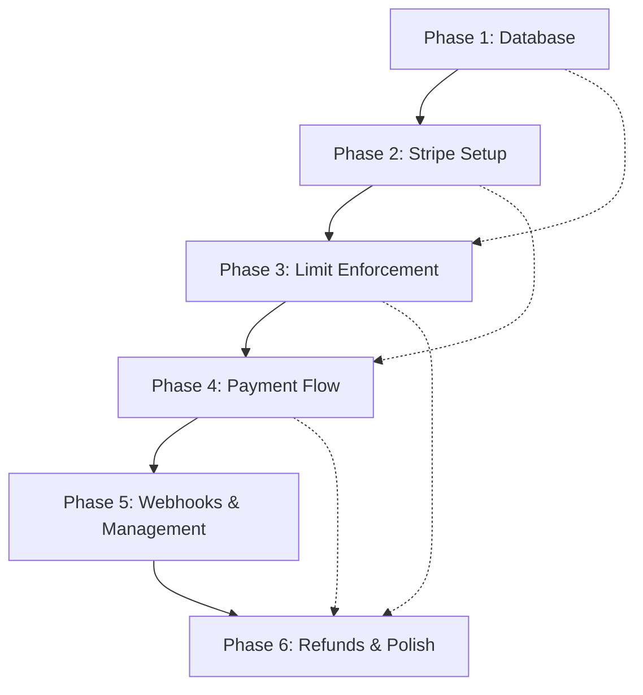

# Paywall System - Implementation Roadmap

## Document Information
- **Version**: 1.0.0
- **Last Updated**: 2025-11-16
- **Status**: Draft

## Table of Contents
1. [Overview](#overview)
2. [Implementation Phases](#implementation-phases)
3. [Phase Dependencies](#phase-dependencies)
4. [Timeline Estimates](#timeline-estimates)
5. [Risk Mitigation](#risk-mitigation)
6. [Testing Strategy](#testing-strategy)

---

## Overview

### Implementation Strategy

The paywall system will be implemented in 6 phases over approximately 8-10 weeks, following an iterative approach that prioritizes core functionality and minimizes risk. Each phase builds upon the previous one and can be tested independently.

### Guiding Principles

1. **Incremental Delivery**: Each phase delivers working, testable functionality
2. **Database First**: Establish data structures before business logic
3. **Backend Before Frontend**: Complete API layer before UI implementation
4. **Test as You Go**: Comprehensive testing at each phase
5. **Minimal Disruption**: Maintain app stability throughout implementation

---

## Implementation Phases

### Phase 1: Database Foundation (Week 1)

**Objective**: Establish database schema and core data structures

#### Tasks

1. **Database Schema Implementation**
   - [ ] Run [`docs/PAYWALL_DATABASE_SCHEMA.md`](docs/PAYWALL_DATABASE_SCHEMA.md) migration in Supabase
   - [ ] Verify all tables created successfully
   - [ ] Confirm indexes are in place
   - [ ] Test RLS policies with test users

2. **Initialize Existing Users**
   - [ ] Create migration script to add free tier subscription for existing users
   - [ ] Run migration for all existing auth.users records
   - [ ] Verify each user has a user_subscriptions record

3. **Database Function Testing**
   - [ ] Test [`get_user_subscription_limit()`](docs/PAYWALL_DATABASE_SCHEMA.md:425)
   - [ ] Test [`can_user_add_subscription()`](docs/PAYWALL_DATABASE_SCHEMA.md:449)
   - [ ] Test [`initialize_user_subscription()`](docs/PAYWALL_DATABASE_SCHEMA.md:495) trigger
   - [ ] Verify RLS policies block unauthorized access

**Deliverables**:
- ✅ All tables, indexes, and RLS policies deployed
- ✅ Database functions tested and working
- ✅ All existing users migrated to free tier

**Testing**:
- Manual SQL queries to verify data integrity
- Test RLS policies with different user contexts
- Verify foreign key constraints
- Check trigger execution on user signup

**Success Criteria**:
- [ ] All tables exist with correct schema
- [ ] RLS policies enforce user isolation
- [ ] Database functions return correct results
- [ ] No performance degradation from new tables

**Estimated Duration**: 3-4 days

---

### Phase 2: Stripe Integration Setup (Week 1-2)

**Objective**: Configure Stripe account and integrate basic payment infrastructure

#### Tasks

1. **Stripe Account Configuration**
   - [ ] Create/configure Stripe account
   - [ ] Set up Products in Stripe Dashboard
     - [ ] Create "Premium Subscription" product
     - [ ] Add Monthly price ($4.99/month)
     - [ ] Add Annual price ($39.00/year)
   - [ ] Configure webhook endpoints
   - [ ] Obtain API keys (test and live)

2. **React Native SDK Integration**
   - [ ] Install `@stripe/stripe-react-native` package
   - [ ] Create [`services/paymentService.ts`](services/paymentService.ts)
   - [ ] Implement StripeProvider in App root
   - [ ] Add Stripe publishable key to environment variables

3. **Supabase Edge Functions Setup**
   - [ ] Set up Supabase CLI and local development
   - [ ] Create edge function structure: [`supabase/functions/`](supabase/functions/)
   - [ ] Implement [`stripe-webhook/index.ts`](supabase/functions/stripe-webhook/index.ts)
   - [ ] Deploy test webhook handler
   - [ ] Configure Stripe to send webhooks to Supabase

4. **Environment Configuration**
   - [ ] Add `EXPO_PUBLIC_STRIPE_PUBLISHABLE_KEY` to .env
   - [ ] Add `STRIPE_SECRET_KEY` to Supabase secrets
   - [ ] Add `STRIPE_WEBHOOK_SECRET` to Supabase secrets
   - [ ] Document all environment variables

**Deliverables**:
- ✅ Stripe account configured with products/prices
- ✅ React Native Stripe SDK integrated
- ✅ Basic webhook handler deployed
- ✅ Environment variables configured

**Testing**:
- Test Stripe SDK initialization
- Send test webhook events from Stripe Dashboard
- Verify webhook events are logged in database
- Confirm no PCI data is stored locally

**Success Criteria**:
- [ ] Stripe SDK loads without errors
- [ ] Test webhook events successfully received
- [ ] Events logged in [`stripe_webhooks`](docs/PAYWALL_DATABASE_SCHEMA.md:344) table
- [ ] No secrets exposed in client code

**Estimated Duration**: 4-5 days

---

### Phase 3: Subscription Limit Enforcement (Week 2-3)

**Objective**: Implement subscription limit checks and paywall display

#### Tasks

1. **Subscription Tier Service**
   - [ ] Create [`services/subscriptionTier.ts`](services/subscriptionTier.ts)
   - [ ] Implement `getUserSubscriptionInfo()` function
   - [ ] Implement `canAddSubscription()` client function
   - [ ] Add caching for subscription info

2. **Context Extension**
   - [ ] Extend [`contexts/AuthContext.tsx`](contexts/AuthContext.tsx:1) with subscription data
   - [ ] Add `subscriptionTier` property
   - [ ] Add `canAddSubscription` property
   - [ ] Add `subscriptionCount` and `subscriptionLimit` properties
   - [ ] Fetch subscription info on login

3. **Home Screen Updates**
   - [ ] Update [`screens/HomeScreen.tsx`](screens/HomeScreen.tsx:1) to check limit before add
   - [ ] Show subscription count badge (e.g., "3/5 subscriptions")
   - [ ] Disable add button when limit reached
   - [ ] Show upgrade prompt on add button press when at limit

4. **Paywall Screen**
   - [ ] Create [`screens/PaywallScreen.tsx`](screens/PaywallScreen.tsx)
   - [ ] Design hard paywall UI
   - [ ] Show current tier and limit information
   - [ ] Add "Upgrade to Premium" button
   - [ ] Track paywall view events

**Deliverables**:
- ✅ Subscription limit checking implemented
- ✅ AuthContext extended with subscription data
- ✅ PaywallScreen created and functional
- ✅ Home screen shows subscription count

**Testing**:
- Test with users at different subscription counts (0, 3, 5, 6)
- Verify free users blocked at 5 subscriptions
- Test paywall display and messaging
- Verify analytics events tracked

**Success Criteria**:
- [ ] Free users cannot add >5 subscriptions
- [ ] Paywall displayed when limit reached
- [ ] Premium users bypass all limits
- [ ] UI clearly shows subscription count/limit

**Estimated Duration**: 5-6 days

---

### Phase 4: Payment Flow Implementation (Week 3-4)

**Objective**: Implement complete payment processing from selection to confirmation

#### Tasks

1. **Plan Selection Screen**
   - [ ] Create [`screens/UpgradeScreen.tsx`](screens/UpgradeScreen.tsx)
   - [ ] Design plan cards (Monthly vs Annual)
   - [ ] Show pricing and savings calculation
   - [ ] Implement plan selection logic
   - [ ] Add "Continue" button

2. **Payment Sheet Integration**
   - [ ] Implement Stripe Payment Sheet in [`services/paymentService.ts`](services/paymentService.ts)
   - [ ] Create payment intent via Edge Function
   - [ ] Initialize payment sheet with client secret
   - [ ] Handle payment success/failure
   - [ ] Show loading states

3. **Edge Function: Create Payment**
   - [ ] Create [`supabase/functions/create-payment-intent/index.ts`](supabase/functions/create-payment-intent/index.ts)
   - [ ] Validate user authentication
   - [ ] Create Stripe Customer if needed
   - [ ] Create Stripe Subscription
   - [ ] Return client secret
   - [ ] Handle errors gracefully

4. **Post-Payment Handling**
   - [ ] Update UI immediately after successful payment
   - [ ] Refresh user subscription data
   - [ ] Show success message
   - [ ] Track payment completion event
   - [ ] Navigate back to home

**Deliverables**:
- ✅ Complete payment flow from selection to success
- ✅ Stripe Payment Sheet integrated
- ✅ Edge Function for payment creation
- ✅ Error handling for all failure scenarios

**Testing**:
- Test successful payment (both plans)
- Test payment failures (card declined, etc.)
- Test network errors during payment
- Verify Stripe Customer creation
- Confirm subscription status updates

**Success Criteria**:
- [ ] Users can successfully upgrade to Premium
- [ ] Payment errors handled gracefully
- [ ] Stripe Customer created on first payment
- [ ] Subscription status updates immediately
- [ ] Analytics tracking works end-to-end

**Estimated Duration**: 6-7 days

---

### Phase 5: Webhook Processing & Subscription Management (Week 4-6)

**Objective**: Complete webhook handling and subscription lifecycle management

#### Tasks

1. **Webhook Event Handlers**
   - [ ] Implement `customer.subscription.created` handler
   - [ ] Implement `customer.subscription.updated` handler
   - [ ] Implement `customer.subscription.deleted` handler
   - [ ] Implement `invoice.payment_succeeded` handler
   - [ ] Implement `invoice.payment_failed` handler
   - [ ] Implement `charge.refunded` handler

2. **Webhook Processing Logic**
   - [ ] Update [`user_subscriptions`](docs/PAYWALL_DATABASE_SCHEMA.md:184) table from events
   - [ ] Create [`payment_transactions`](docs/PAYWALL_DATABASE_SCHEMA.md:257) records
   - [ ] Handle idempotency with [`process_stripe_webhook()`](docs/PAYWALL_DATABASE_SCHEMA.md:569)
   - [ ] Implement retry logic for failed processing
   - [ ] Log all events to [`stripe_webhooks`](docs/PAYWALL_DATABASE_SCHEMA.md:344) table

3. **Subscription Management Screen**
   - [ ] Create [`screens/SubscriptionManageScreen.tsx`](screens/SubscriptionManageScreen.tsx)
   - [ ] Show current plan and billing cycle
   - [ ] Display next billing date
   - [ ] Show billing history
   - [ ] Add "Change Plan" option
   - [ ] Add "Cancel Subscription" button

4. **Cancellation Flow**
   - [ ] Create [`supabase/functions/cancel-subscription/index.ts`](supabase/functions/cancel-subscription/index.ts)
   - [ ] Implement cancellation in Stripe
   - [ ] Update database records
   - [ ] Send confirmation email (future)
   - [ ] Handle immediate vs end-of-period cancellation

5. **Settings Screen Integration**
   - [ ] Update [`screens/SettingsScreen.tsx`](screens/SettingsScreen.tsx:1) to show subscription info
   - [ ] Add "Subscription" section
   - [ ] Show current tier badge
   - [ ] Add "Manage Subscription" button
   - [ ] Link to subscription management screen

**Deliverables**:
- ✅ All webhook events processed correctly
- ✅ Subscription management screen functional
- ✅ Cancellation flow implemented
- ✅ Settings screen updated

**Testing**:
- Send test webhook events from Stripe
- Test subscription updates
- Test payment failure scenarios
- Test cancellation (immediate and scheduled)
- Verify database consistency
- Test idempotency (duplicate events)

**Success Criteria**:
- [ ] All webhook events processed without errors
- [ ] Database stays in sync with Stripe
- [ ] Users can cancel subscriptions
- [ ] Cancellations reflected in UI immediately
- [ ] Payment failures trigger grace period
- [ ] No duplicate processing of events

**Estimated Duration**: 8-10 days

---

### Phase 6: Refunds, Downgrades & Polish (Week 6-8)

**Objective**: Complete remaining features and polish the user experience

#### Tasks

1. **Refund Request Flow**
   - [ ] Create [`screens/RefundRequestScreen.tsx`](screens/RefundRequestScreen.tsx)
   - [ ] Add 7-day refund eligibility check
   - [ ] Create refund request form
   - [ ] Implement [`supabase/functions/request-refund/index.ts`](supabase/functions/request-refund/index.ts)
   - [ ] Process refunds through Stripe
   - [ ] Update [`refund_requests`](docs/PAYWALL_DATABASE_SCHEMA.md:299) table

2. **Downgrade Handling**
   - [ ] Implement read-only mode for downgrades with >5 subscriptions
   - [ ] Update subscription count badge to show "6/5" in red
   - [ ] Prevent adding new subscriptions until count ≤ 4
   - [ ] Show upgrade prompt when trying to add
   - [ ] Allow editing/deleting existing subscriptions

3. **Analytics Implementation**
   - [ ] Create [`services/analytics.ts`](services/analytics.ts)
   - [ ] Implement event tracking functions
   - [ ] Track conversion funnel events:
     - [ ] `paywall_viewed`
     - [ ] `plan_selected`
     - [ ] `payment_initiated`
     - [ ] `payment_completed`
     - [ ] `payment_failed`
   - [ ] Store events in [`usage_tracking_events`](docs/PAYWALL_DATABASE_SCHEMA.md:368)

4. **Error Handling & Edge Cases**
   - [ ] Add comprehensive error messages
   - [ ] Handle network failures gracefully
   - [ ] Implement retry logic for failed requests
   - [ ] Add loading states to all async operations
   - [ ] Handle expired payment intents

5. **UI/UX Polish**
   - [ ] Design professional paywall UI
   - [ ] Add smooth transitions and animations
   - [ ] Implement haptic feedback for key actions
   - [ ] Add success animations
   - [ ] Optimize for both iOS and Android
   - [ ] Test on various screen sizes

6. **Documentation**
   - [ ] Create user-facing FAQ about subscriptions
   - [ ] Document refund policy clearly
   - [ ] Add tooltips for subscription features
   - [ ] Create support documentation
   - [ ] Document edge cases for support team

**Deliverables**:
- ✅ Complete refund flow
- ✅ Downgrade handling implemented
- ✅ Analytics tracking functional
- ✅ Polished UI/UX
- ✅ Comprehensive error handling

**Testing**:
- Test refund requests (eligible and ineligible)
- Test downgrade with >5 subscriptions
- Test read-only mode behavior
- Verify analytics events
- Test all error scenarios
- Cross-platform testing (iOS and Android)
- Performance testing under load

**Success Criteria**:
- [ ] Refunds processed within policy window
- [ ] Downgrades don't lose user data
- [ ] Analytics capture full conversion funnel
- [ ] UI polished and professional
- [ ] All error cases handled gracefully
- [ ] App remains performant

**Estimated Duration**: 10-12 days

---

## Phase Dependencies



### Critical Path

1. Database schema must be completed before any other work
2. Stripe integration required before payment flow
3. Limit enforcement should be completed before payment flow (UX dependency)
4. Webhook handling must be done before subscription management
5. All core functionality before polish phase

### Parallel Work Opportunities

- Phase 2 (Stripe setup) and Phase 3 (UI work) can partially overlap
- Analytics implementation can be done alongside webhook work
- UI polish can start during Phase 5

---

## Timeline Estimates

### Optimistic Timeline (8 weeks)
- Phase 1: 3 days
- Phase 2: 4 days
- Phase 3: 5 days
- Phase 4: 6 days
- Phase 5: 8 days
- Phase 6: 10 days
- **Total: 36 working days (~7-8 weeks)**

### Realistic Timeline (10 weeks)
- Phase 1: 4 days
- Phase 2: 5 days
- Phase 3: 6 days
- Phase 4: 7 days
- Phase 5: 10 days
- Phase 6: 12 days
- Buffer: 1 week for testing and fixes
- **Total: 44 working days + buffer (~9-10 weeks)**

### Conservative Timeline (12 weeks)
- Phase 1: 5 days
- Phase 2: 6 days
- Phase 3: 7 days
- Phase 4: 8 days
- Phase 5: 12 days
- Phase 6: 14 days
- Testing & fixes: 2 weeks
- **Total: 52 working days + buffer (~11-12 weeks)**

### Recommended Approach
**10-week timeline** with weekly milestones and checkpoints to catch issues early.

---

## Risk Mitigation

### High-Risk Areas

#### 1. Webhook Reliability
**Risk**: Webhook events fail to process or are delayed
**Mitigation**:
- Implement idempotency checks
- Add retry logic with exponential backoff
- Create manual reconciliation process
- Monitor webhook processing regularly
- Set up alerts for failed webhooks

#### 2. Race Conditions
**Risk**: Concurrent requests cause data inconsistency
**Mitigation**:
- Use database transactions for critical operations
- Implement row-level locking where needed
- Add unique constraints on Stripe IDs
- Test concurrent scenarios thoroughly

#### 3. Payment Failures
**Risk**: Payment processing fails silently
**Mitigation**:
- Comprehensive error handling
- Log all payment attempts
- Retry failed payments with user notification
- Implement grace period for retries
- Clear user communication about failures

#### 4. Database Migration Issues
**Risk**: Migration breaks existing functionality
**Mitigation**:
- Test migration in staging environment
- Create rollback plan
- Backup production data before migration
- Run migration during low-traffic period
- Monitor for errors after deployment

#### 5. Stripe API Changes
**Risk**: Breaking changes in Stripe API
**Mitigation**:
- Pin Stripe SDK version
- Subscribe to Stripe changelog
- Use versioned API endpoints
- Test with Stripe test mode extensively

---

## Testing Strategy

### Unit Testing

**Phase 1-2**:
- Database functions
- Subscription limit calculations
- Data transformations

**Phase 3-4**:
- Subscription tier service functions
- Payment service methods
- Validation logic

**Phase 5-6**:
- Webhook processing functions
- Refund eligibility checks
- Analytics tracking

### Integration Testing

**All Phases**:
- Stripe API integration
- Supabase Edge Functions
- Database operations
- Real-time data sync

### End-to-End Testing

**Critical Flows**:
1. **Free to Premium Upgrade**
   - User reaches limit
   - Views paywall
   - Selects plan
   - Completes payment
   - Gets immediate access

2. **Subscription Management**
   - View billing history
   - Change plans
   - Cancel subscription
   - Request refund

3. **Downgrade Handling**
   - Premium cancels with >5 subscriptions
   - View/edit existing subscriptions
   - Cannot add new subscriptions
   - Delete subscriptions until ≤4

### Performance Testing

**Metrics to Monitor**:
- Subscription limit check: < 200ms
- Payment sheet initialization: < 1s
- Webhook processing: < 3s
- Database queries: < 100ms (p95)

### Security Testing

**Security Checklist**:
- [ ] No payment data stored locally
- [ ] RLS policies prevent data leaks
- [ ] Stripe keys not exposed in client
- [ ] Webhook signature validation
- [ ] SQL injection prevention
- [ ] XSS prevention in user inputs

### User Acceptance Testing

**Test Scenarios**:
1. Happy path: New user to Premium
2. Payment failure recovery
3. Cancellation and immediate re-subscription
4. Downgrade with data retention
5. Refund request process
6. Multiple devices sync

---

## Deployment Strategy

### Staging Environment

1. **Set up staging Supabase project**
   - Separate from production
   - Use Stripe test mode
   - Test webhook delivery

2. **Deploy phases to staging first**
   - Test each phase thoroughly
   - Get stakeholder approval
   - Fix bugs before production

3. **Production deployment**
   - Deploy during low-traffic window
   - Monitor for errors
   - Have rollback plan ready

### Feature Flags (Optional)

Consider feature flags for:
- Paywall display (can be enabled per user for testing)
- Payment processing (test with beta users first)
- New tier features

### Rollout Strategy

**Recommended Approach**: Phased rollout
1. Week 1: Internal testing only
2. Week 2: Beta users (10-20 users)
3. Week 3: Limited rollout (20% of users)
4. Week 4: Full rollout (100% of users)

---

## Success Metrics

### Technical Metrics
- [ ] Zero data loss during migrations
- [ ] <2% payment failure rate (excluding user errors)
- [ ] 99.9% webhook processing success
- [ ] <200ms subscription limit checks
- [ ] Zero PCI compliance violations

### Business Metrics
- [ ] Conversion rate from paywall views
- [ ] Average revenue per user (ARPU)
- [ ] Churn rate after first month
- [ ] Refund rate < 5%
- [ ] Customer lifetime value (CLV)

### User Experience Metrics
- [ ] <3 taps to complete purchase
- [ ] Clear error messages for all failures
- [ ] <5 second payment completion
- [ ] Positive user feedback on paywall UX

---

## Post-Implementation

### Monitoring Setup

1. **Set up alerts for**:
   - Failed webhook processing
   - Payment failures
   - Subscription limit errors
   - Database errors

2. **Create dashboards for**:
   - Conversion funnel
   - Revenue metrics
   - Active subscriptions
   - Refund trends

3. **Regular reviews**:
   - Weekly: Monitor key metrics
   - Monthly: Review conversion rates
   - Quarterly: Analyze pricing strategy

### Future Enhancements

**Phase 7+ (Future)**:
- Family sharing
- Promotional codes
- Multiple currencies
- Lifetime licenses
- Business/team plans
- Advanced analytics features
- Priority support for Premium

---

## Appendix

### Key Files Reference

| File | Purpose | Phase |
|------|---------|-------|
| [`docs/PAYWALL_TECHNICAL_SPEC.md`](docs/PAYWALL_TECHNICAL_SPEC.md) | Technical specification | Planning |
| [`docs/PAYWALL_DATABASE_SCHEMA.md`](docs/PAYWALL_DATABASE_SCHEMA.md) | Database schema | Phase 1 |
| [`docs/PAYWALL_API_SPEC.md`](docs/PAYWALL_API_SPEC.md) | API specifications | Phase 2 |
| [`docs/PAYWALL_ARCHITECTURE.md`](docs/PAYWALL_ARCHITECTURE.md) | System architecture | Planning |
| [`services/subscriptionTier.ts`](services/subscriptionTier.ts) | Tier management | Phase 3 |
| [`services/paymentService.ts`](services/paymentService.ts) | Payment operations | Phase 4 |
| [`services/analytics.ts`](services/analytics.ts) | Analytics tracking | Phase 6 |
| [`screens/PaywallScreen.tsx`](screens/PaywallScreen.tsx) | Paywall UI | Phase 3 |
| [`screens/UpgradeScreen.tsx`](screens/UpgradeScreen.tsx) | Plan selection | Phase 4 |
| [`screens/SubscriptionManageScreen.tsx`](screens/SubscriptionManageScreen.tsx) | Subscription management | Phase 5 |
| [`screens/RefundRequestScreen.tsx`](screens/RefundRequestScreen.tsx) | Refund requests | Phase 6 |

### Development Environment Setup

1. **Required Tools**:
   - Node.js 16+
   - Supabase CLI
   - Stripe CLI (for webhook testing)
   - React Native development environment

2. **Environment Variables**:
   ```bash
   EXPO_PUBLIC_SUPABASE_URL=your_supabase_url
   EXPO_PUBLIC_SUPABASE_ANON_KEY=your_anon_key
   EXPO_PUBLIC_STRIPE_PUBLISHABLE_KEY=pk_test_...
   ```

3. **Supabase Secrets** (via Supabase Dashboard):
   ```bash
   STRIPE_SECRET_KEY=sk_test_...
   STRIPE_WEBHOOK_SECRET=whsec_...
   ```

### Resources

- [Stripe API Documentation](https://stripe.com/docs/api)
- [Stripe React Native SDK](https://stripe.dev/stripe-react-native/)
- [Supabase Edge Functions](https://supabase.com/docs/guides/functions)
- [React Navigation](https://reactnavigation.org/)

---

**End of Implementation Roadmap**