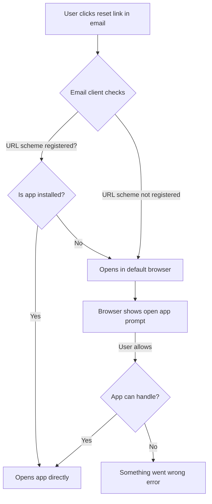
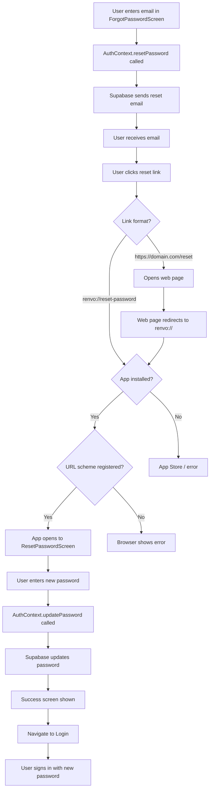

# Supabase Deep Linking Setup & Troubleshooting Guide

## Overview

This guide helps you configure and troubleshoot deep linking for password reset functionality using Supabase Auth with the custom URL scheme `renvo://`. 

**Good News:** If you can see redirect URLs configured in your Supabase Dashboard (Authentication → URL Configuration), your Supabase setup is likely correct! The issue is usually with native app configuration or testing methodology.

---

## Table of Contents

1. [Verify Supabase Configuration](#1-verify-supabase-configuration)
2. [Understanding the Problem](#2-understanding-the-problem)
3. [Native Build Requirements](#3-native-build-requirements)
4. [Verification Checklist](#4-verification-checklist)
5. [Testing Deep Links](#5-testing-deep-links)
6. [Alternative Solutions](#6-alternative-solutions)
7. [Troubleshooting](#7-troubleshooting)

---

## 1. Verify Supabase Configuration

### Step 1.1: Check URL Configuration

Navigate to your Supabase Dashboard:
```
Dashboard → Authentication → URL Configuration
```

You should see:

**Site URL:**
```
renvo://
```

**Redirect URLs:**
```
renvo://reset-password
renvo://**
```

### Step 1.2: Verify Your Setup

✅ **If you see these values, your Supabase configuration is CORRECT!**

The configuration shown above allows:
- `renvo://reset-password` - Specific reset password route
- `renvo://**` - Wildcard for any other deep links in your app

### Why Custom URL Schemes Need to be Added

By default, Supabase only allows HTTP/HTTPS redirect URLs for security. Custom URL schemes (like `renvo://`) must be explicitly whitelisted in the "Redirect URLs" section.

**Security Note:** Custom URL schemes are less secure than Universal Links/App Links because any app can register the same scheme. For production apps, consider using Universal Links (iOS) or App Links (Android) instead.

---

## 2. Understanding the Problem

### Why Deep Links Open in Browser

Even with correct Supabase configuration, deep links might open in a browser because:



### Common Causes

1. **Not using a development/production build** - Expo Go doesn't support custom URL schemes
2. **Native build not updated** - URL scheme not registered in native code
3. **Email client behavior** - Some email clients prefer opening links in browser first
4. **App not installed from build** - Testing with wrong app version
5. **Platform-specific configuration missing** - iOS/Android requires native setup

---

## 3. Native Build Requirements

### Expo Go vs Development Builds

| Feature | Expo Go | Development Build | Production Build |
|---------|---------|-------------------|------------------|
| Custom URL Schemes | ❌ No | ✅ Yes | ✅ Yes |
| Deep Linking | Limited | Full Support | Full Support |
| Setup Required | None | `expo prebuild` or `eas build` | `eas build` |

**Important:** Custom URL schemes like `renvo://` **ONLY work with development or production builds**, not Expo Go!

### Creating a Development Build

#### Option A: Using EAS Build (Recommended)
```bash
# Install EAS CLI if not already installed
npm install -g eas-cli

# Login to your Expo account
eas login

# Create a development build for iOS
eas build --profile development --platform ios

# Create a development build for Android
eas build --profile development --platform android
```

#### Option B: Using expo prebuild (Local Builds)
```bash
# Generate native code
npx expo prebuild

# For iOS
cd ios
pod install
cd ..
npx expo run:ios

# For Android
npx expo run:android
```

### When to Rebuild

You MUST rebuild your app when:
- ✅ Changing URL scheme in [`app.json`](../app.json:65)
- ✅ Adding new deep link routes
- ✅ Modifying native configuration
- ✅ After running `npx expo prebuild` for the first time

You do NOT need to rebuild for:
- ❌ JavaScript/TypeScript code changes (with development builds)
- ❌ Supabase redirect URL changes
- ❌ Styling changes

---

## 4. Verification Checklist

### 4.1 Verify app.json Configuration

Check [`app.json`](../app.json:65):
```json
{
  "expo": {
    "scheme": "renvo",
    "ios": {
      "bundleIdentifier": "com.ronnie39.renvo"
    },
    "android": {
      "package": "com.ronnie39.renvo"
    }
  }
}
```

### 4.2 Verify iOS URL Scheme Registration

After running `npx expo prebuild`, check `ios/[YourAppName]/Info.plist`:

```xml
<key>CFBundleURLTypes</key>
<array>
  <dict>
    <key>CFBundleURLSchemes</key>
    <array>
      <string>renvo</string>
    </array>
  </dict>
</array>
```

**How to Check:**
```bash
# If you have ios folder (after prebuild)
cat ios/*/Info.plist | grep -A 5 "CFBundleURLSchemes"
```

### 4.3 Verify Android Intent Filter

After running `npx expo prebuild`, check `android/app/src/main/AndroidManifest.xml`:

```xml
<intent-filter>
  <action android:name="android.intent.action.VIEW" />
  <category android:name="android.intent.category.DEFAULT" />
  <category android:name="android.intent.category.BROWSABLE" />
  <data android:scheme="renvo" />
</intent-filter>
```

**How to Check:**
```bash
# If you have android folder (after prebuild)
cat android/app/src/main/AndroidManifest.xml | grep -A 5 "android:scheme"
```

### 4.4 Verify Deep Link Configuration in Code

Check [`App.tsx`](../App.tsx:66-85) has the deep link listener:
```typescript
React.useEffect(() => {
  const subscription = Linking.addEventListener('url', ({ url }) => {
    console.log('[App] Deep link received:', url);
  });
  return () => subscription.remove();
}, []);
```

Check [`AppNavigator.tsx`](../navigation/AppNavigator.tsx:301-307) has linking config:
```typescript
<NavigationContainer
  linking={{
    prefixes: ['renvo://'],
    config: {
      screens: {
        ResetPassword: 'reset-password',
      },
    },
  }}>
```

---

## 5. Testing Deep Links

### 5.1 Manual Testing Commands

Test that your app can handle the deep link before testing with email:

#### iOS Simulator
```bash
xcrun simctl openurl booted "renvo://reset-password?access_token=test123&type=recovery"
```

#### Android Emulator
```bash
adb shell am start -W -a android.intent.action.VIEW -d "renvo://reset-password?access_token=test123&type=recovery"
```

#### Physical Device (using Expo CLI)
```bash
npx uri-scheme open "renvo://reset-password?access_token=test123&type=recovery" --ios
# or
npx uri-scheme open "renvo://reset-password?access_token=test123&type=recovery" --android
```

### 5.2 Expected Behavior

When the deep link works correctly:
1. App opens (or comes to foreground if already open)
2. Console shows: `[App] Deep link received: renvo://reset-password?...`
3. Navigation occurs to ResetPasswordScreen
4. Screen shows password reset form
5. Token is extracted from URL parameters

### 5.3 Testing with Email

1. Request password reset from app
2. Check email on the same device where app is installed
3. Click the reset link
4. Note what happens:
   - ✅ **Correct:** App opens directly
   - ⚠️ **Common:** Browser opens with "Open in app" prompt
   - ❌ **Problem:** Browser shows error

### 5.4 Email Client Behavior

Different email clients handle custom URL schemes differently:

| Email Client | Behavior |
|--------------|----------|
| iOS Mail | Usually opens app directly |
| Gmail App | Often opens in Gmail's in-app browser first |
| Outlook | May show security warning |
| Web Mail (Safari/Chrome) | Opens browser with app prompt |

**This is normal!** Most email clients will show a confirmation prompt before opening custom URL schemes for security reasons.

---

## 6. Alternative Solutions

If custom URL schemes are problematic for your use case, consider these alternatives:

### Option A: Web Redirect Bridge

Create a simple web page that redirects to your app.

**Pros:**
- Works with any email client
- No browser security warnings
- Can provide fallback instructions
- Easy to implement

**Cons:**
- Requires hosting a web page
- Extra redirect step
- Need to maintain web infrastructure

**Implementation:**
```html
<!-- hosted at https://yourdomain.com/reset-password -->
<!DOCTYPE html>
<html>
<head>
  <title>Redirecting to Renvo...</title>
  <meta http-equiv="refresh" content="0;url=renvo://reset-password">
</head>
<body>
  <script>
    // Immediate redirect
    window.location.replace('renvo://reset-password' + window.location.search);
    
    // Fallback message
    setTimeout(() => {
      document.body.innerHTML = `
        <h1>Opening Renvo App...</h1>
        <p>If the app doesn't open automatically:</p>
        <ol>
          <li>Make sure Renvo app is installed</li>
          <li><a href="renvo://reset-password${window.location.search}">Click here to open manually</a></li>
          <li>Or <a href="https://apps.apple.com/app/your-app">download from App Store</a></li>
        </ol>
      `;
    }, 2000);
  </script>
</body>
</html>
```

**Supabase Configuration:**
```
Site URL: https://yourdomain.com/reset-password
Redirect URLs: https://yourdomain.com/reset-password
```

### Option B: Universal Links (iOS) / App Links (Android)

Use platform-specific deep linking that doesn't require custom URL schemes.

**Pros:**
- More secure (verified domain ownership)
- No browser prompts or warnings
- Falls back to web if app not installed
- Better user experience
- Recommended for production apps

**Cons:**
- More complex setup
- Requires domain ownership
- Requires Apple App Site Association (iOS)
- Requires Digital Asset Links (Android)
- More maintenance

**Setup Overview:**

1. **Host verification files:**
   - iOS: `https://yourdomain.com/.well-known/apple-app-site-association`
   - Android: `https://yourdomain.com/.well-known/assetlinks.json`

2. **Configure app.json:**
```json
{
  "expo": {
    "ios": {
      "associatedDomains": ["applinks:yourdomain.com"]
    },
    "android": {
      "intentFilters": [
        {
          "action": "VIEW",
          "autoVerify": true,
          "data": [
            {
              "scheme": "https",
              "host": "yourdomain.com",
              "pathPrefix": "/reset-password"
            }
          ],
          "category": ["BROWSABLE", "DEFAULT"]
        }
      ]
    }
  }
}
```

3. **Update Supabase:**
```
Site URL: https://yourdomain.com
Redirect URLs: https://yourdomain.com/reset-password
```

**Resources:**
- [iOS Universal Links Guide](https://developer.apple.com/documentation/xcode/supporting-universal-links-in-your-app)
- [Android App Links Guide](https://developer.android.com/training/app-links)
- [Expo Linking Documentation](https://docs.expo.dev/guides/linking/)

### Option C: Hybrid Approach

Use both custom URL schemes (for development) and Universal Links (for production).

**app.json configuration:**
```json
{
  "expo": {
    "scheme": "renvo",  // For development
    "ios": {
      "associatedDomains": ["applinks:yourdomain.com"]  // For production
    }
  }
}
```

**Supabase Configuration:**
```
Site URL: https://yourdomain.com
Redirect URLs:
  - https://yourdomain.com/reset-password (production)
  - renvo://reset-password (development)
  - renvo://** (development wildcard)
```

### Comparison Table

| Feature | Custom URL Scheme | Web Bridge | Universal Links/App Links |
|---------|-------------------|------------|---------------------------|
| Setup Complexity | ⭐ Easy | ⭐⭐ Medium | ⭐⭐⭐ Complex |
| Security | ⚠️ Low | ⭐⭐ Medium | ⭐⭐⭐ High |
| User Experience | ⚠️ Browser prompts | ⭐⭐ Extra redirect | ⭐⭐⭐ Seamless |
| Email Client Support | ⚠️ Varies | ⭐⭐⭐ Excellent | ⭐⭐⭐ Excellent |
| Production Ready | ⚠️ Not recommended | ⭐⭐ Yes | ⭐⭐⭐ Recommended |
| Domain Required | ❌ No | ✅ Yes | ✅ Yes |
| Works Offline | ✅ Yes | ❌ No | ✅ Yes |
| Development Friendly | ⭐⭐⭐ Excellent | ⭐⭐ Good | ⭐ Requires setup |

---

## 7. Troubleshooting

### Issue: "This site is trying to open another application"

**Cause:** Email client or browser security prompt for custom URL schemes.

**Solution:**
- ✅ This is normal behavior
- ✅ User must tap "Allow" or "Open"
- ✅ Consider Universal Links for production to avoid this

### Issue: "Something went wrong" after allowing

**Cause:** App can't handle the deep link URL.

**Solutions:**
1. Verify app is built with URL scheme (not using Expo Go)
2. Check console logs for navigation errors
3. Verify token parameter is being extracted correctly
4. Test deep link manually using commands in [Section 5.1](#51-manual-testing-commands)

### Issue: Link opens browser instead of app

**Causes & Solutions:**

| Cause | How to Check | Solution |
|-------|--------------|----------|
| Using Expo Go | Check if app icon shows Expo logo | Build development build with `eas build` |
| URL scheme not registered | Check Info.plist/AndroidManifest.xml | Run `npx expo prebuild` and rebuild |
| Old build installed | Check build date | Uninstall app, reinstall new build |
| Email client caching | - | Clear email app cache or use different client |

### Issue: Deep link works in simulator but not on device

**Causes:**
1. Different builds installed (simulator vs device)
2. Email client behavior differs
3. iOS/Android version differences

**Solutions:**
```bash
# Rebuild for device
eas build --profile development --platform ios
# or
eas build --profile development --platform android

# Verify URL scheme is registered
npx uri-scheme list
```

### Issue: Token not found in URL

**Check these files:**

1. [`ResetPasswordScreen.tsx`](../screens/ResetPasswordScreen.tsx:58):
```typescript
const route = useRoute<ResetPasswordRouteProp>();
const token = route.params?.token || route.params?.access_token;
```

2. Console logs:
```
[ResetPasswordScreen] Route params: {...}
[ResetPasswordScreen] Token: present/missing
```

**Debug:**
```bash
# Test with explicit token parameter
xcrun simctl openurl booted "renvo://reset-password?access_token=test123&type=recovery"
```

### Issue: Works in development, fails in production

**Common causes:**
1. Different bundle identifier
2. Production build not updated
3. Different Supabase project
4. Redirect URLs not added to production Supabase

**Verification:**
```bash
# Check production build bundle ID matches app.json
# iOS
cat ios/*/Info.plist | grep -A 1 "CFBundleIdentifier"

# Android
cat android/app/build.gradle | grep "applicationId"

# Verify Supabase project
# Check .env file or Expo secrets for correct project URL
```

### Issue: Token expired

**Symptoms:**
- Email link works but password reset fails
- Error: "Link expired" or similar

**Causes:**
- Supabase password reset tokens typically expire after 1 hour
- User waited too long to click link

**Solution:**
1. Request new password reset email
2. Click link within expiration time
3. Consider increasing token expiration in Supabase settings (not recommended for security)

### Common Console Errors

| Error Message | Cause | Solution |
|---------------|-------|----------|
| `No route found` | Linking config missing | Check [`AppNavigator.tsx`](../navigation/AppNavigator.tsx:301-307) |
| `Invalid URL` | URL format wrong | Check Supabase email template |
| `AuthSessionMissingError` | Token invalid/expired | Request new reset email |
| `Network error` | No internet | Check device connection |

---

## Development vs Production Considerations

### Development Setup
```
URL Scheme: renvo://
Testing: Manual commands + email on device
Supabase URLs: Both HTTP and custom schemes for flexibility
```

### Production Setup
```
Recommended: Universal Links/App Links
Fallback: Custom URL scheme with web bridge
Supabase URLs: HTTPS only for security
Email Template: User-friendly with clear instructions
```

---

## Password Reset Flow Diagram



---

## Quick Reference

### Files Involved
- [`app.json`](../app.json:65) - URL scheme configuration
- [`App.tsx`](../App.tsx:66-85) - Deep link listener
- [`AppNavigator.tsx`](../navigation/AppNavigator.tsx:301-307) - Linking configuration
- [`contexts/AuthContext.tsx`](../contexts/AuthContext.tsx:766) - Reset password with redirect URL
- [`screens/ResetPasswordScreen.tsx`](../screens/ResetPasswordScreen.tsx) - Password reset UI

### Key Commands
```bash
# Test deep link (iOS Simulator)
xcrun simctl openurl booted "renvo://reset-password?access_token=test"

# Test deep link (Android Emulator)  
adb shell am start -W -a android.intent.action.VIEW -d "renvo://reset-password?access_token=test"

# Generate native code
npx expo prebuild

# Build development version
eas build --profile development --platform ios
eas build --profile development --platform android

# Check URL schemes
npx uri-scheme list
```

### Supabase Dashboard Path
```
Dashboard → Authentication → URL Configuration
```

---

## Next Steps

1. ✅ Verify Supabase redirect URLs are configured
2. ✅ Ensure you're using a development/production build (not Expo Go)
3. ✅ Test deep link manually before testing with email
4. ✅ Check console logs for debugging information
5. ✅ Consider Universal Links for production deployment

For more testing guidance, see [`FORGOT_PASSWORD_TESTING_GUIDE.md`](./FORGOT_PASSWORD_TESTING_GUIDE.md).

---

## Additional Resources

- [Expo Linking Documentation](https://docs.expo.dev/guides/linking/)
- [React Navigation Deep Linking](https://reactnavigation.org/docs/deep-linking/)
- [Supabase Auth Documentation](https://supabase.com/docs/guides/auth)
- [iOS Universal Links](https://developer.apple.com/documentation/xcode/supporting-universal-links-in-your-app)
- [Android App Links](https://developer.android.com/training/app-links)