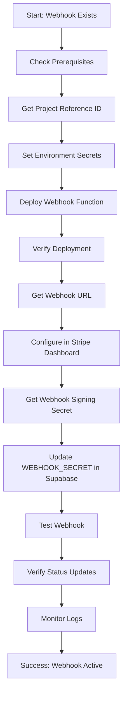

# Webhook Deployment & Configuration Guide

## Overview

This guide provides step-by-step instructions to deploy the Stripe webhook Edge Function and configure it in your Stripe Dashboard. Based on investigation findings, your webhook code is complete but needs deployment and configuration to enable automatic subscription status updates and payment tracking.

**Current Status:**
- ✅ Webhook code exists at [`supabase/functions/stripe-webhook/index.ts`](../supabase/functions/stripe-webhook/index.ts)
- ✅ Handles 8 critical events (subscription lifecycle, payments, refunds)
- ❌ Not deployed to Supabase (likely cause of empty payment_transactions)
- ❌ Not configured in Stripe Dashboard
- ❌ Environment secrets may not be set

---

## Deployment Workflow



---

## Section 1: Pre-Deployment Checklist

### Prerequisites Verification

Before starting deployment, verify you have:

1. **Supabase CLI Access** ✓
   - CLI is installed and logged in
   - Skip installation steps

2. **Stripe Account Access**
   - Dashboard access: https://dashboard.stripe.com
   - Products and prices already created ✓

3. **Required Information**
   - Supabase project reference ID
   - Stripe Secret Key (`sk_test_...`)
   - Stripe Dashboard access for webhook configuration

### Check Current Deployment Status

Run this command to see if webhook is already deployed:

```bash
supabase functions list
```

**Expected Output:**
```
Function Name       Version  Created At
stripe-webhook      1        2024-01-XX (if deployed)
create-subscription 1        2024-01-XX
```

> **💡 Note:** If `stripe-webhook` is NOT listed, it needs to be deployed.

### Get Your Supabase Project Reference

Your project reference ID is needed for the webhook URL. Find it by:

**Option 1: From Supabase Dashboard**
1. Go to https://supabase.com/dashboard
2. Select your project
3. Go to **Settings** → **General**
4. Copy the **Reference ID** (e.g., `gtgzrykzddokjcndxmxh`)

**Option 2: From CLI**
```bash
supabase projects list
```

**Save this value - you'll need it multiple times:**
```
PROJECT_REF=[YOUR_PROJECT_REF]
```

---

## Section 2: Environment Variables Setup

### Required Secrets

The webhook function requires these environment variables:

| Secret Name | Description | Where to Find |
|-------------|-------------|---------------|
| `STRIPE_SECRET_KEY` | Stripe API secret key | Stripe Dashboard → Developers → API keys |
| `STRIPE_WEBHOOK_SECRET` | Webhook signing secret | Created in Section 4 after webhook endpoint setup |
| `PROJECT_URL` | Supabase project URL | Auto-provided by Supabase |
| `SERVICE_ROLE_KEY` | Supabase service role key | Auto-provided by Supabase |

> ⚠️ **Important:** `PROJECT_URL` and `SERVICE_ROLE_KEY` are automatically provided by Supabase to Edge Functions. You only need to set `STRIPE_SECRET_KEY` and `STRIPE_WEBHOOK_SECRET`.

### Get Stripe Secret Key

1. Go to **Stripe Dashboard**: https://dashboard.stripe.com
2. Click **Developers** in left sidebar
3. Click **API keys**
4. In **Standard keys** section, find **Secret key**
5. Click **Reveal test key** (shows `sk_test_...`)
6. Copy the key (it starts with `sk_test_` for test mode)

> 🔒 **Security:** Never commit this key to version control or share it publicly.

### Set Secrets in Supabase

**Step 1: Set Stripe Secret Key**

```bash
supabase secrets set STRIPE_SECRET_KEY=sk_test_YOUR_SECRET_KEY_HERE
```

**Expected Output:**
```
Setting secret STRIPE_SECRET_KEY...
Finished supabase secrets set.
```

> ⏱️ **Why this step:** The webhook needs this key to verify events came from Stripe and to process refunds/cancellations.

**Step 2: Verify Secret is Set**

```bash
supabase secrets list
```

**Expected Output:**
```
NAME                  DIGEST
STRIPE_SECRET_KEY     [digest-hash]
```

> ⚠️ **Note:** You'll set `STRIPE_WEBHOOK_SECRET` in Section 4 after creating the webhook endpoint in Stripe Dashboard.

---

## Section 3: Deploy Webhook Function

### Deployment Command

From your project root directory:

```bash
supabase functions deploy stripe-webhook
```

**Expected Output:**
```
Deploying stripe-webhook function...
Packaging function...
Uploading function...
Deployed stripe-webhook function.
```

> ⏱️ **Why this step:** This uploads your webhook code to Supabase's edge network, making it accessible via HTTPS URL.

**Deployment Time:** Usually 10-30 seconds

### Verify Deployment Success

**Step 1: List Functions**
```bash
supabase functions list
```

**Expected Output:**
```
Function Name       Version  Created At
stripe-webhook      1        2024-11-19T02:45:00Z  ← Should appear
```

**Step 2: Get Webhook URL**

Your webhook URL will be:
```
https://[PROJECT_REF].supabase.co/functions/v1/stripe-webhook
```

Replace `[PROJECT_REF]` with your project reference from Section 1.

**Example:**
```
https://gtgzrykzddokjcndxmxh.supabase.co/functions/v1/stripe-webhook
```

> 💾 **Save this URL** - you'll need it for Stripe Dashboard configuration in Section 4.

### Troubleshooting Deployment Errors

**Error: "Project not linked"**
```bash
# Re-link your project
supabase link --project-ref [YOUR_PROJECT_REF]
```

**Error: "Function already exists"**
```bash
# This means it was previously deployed - you can redeploy
supabase functions deploy stripe-webhook --no-verify-jwt
```

**Error: "Invalid configuration"**
```bash
# Check config file exists
cat supabase/functions/config.toml
# Should show verify_jwt = false for stripe-webhook
```

---

## Section 4: Configure Stripe Dashboard

### Create Webhook Endpoint

**Step 1: Navigate to Webhooks**
1. Go to **Stripe Dashboard**: https://dashboard.stripe.com
2. Click **Developers** in left sidebar
3. Click **Webhooks**
4. Click **+ Add endpoint** button (top right)

**Step 2: Enter Endpoint URL**

In the **Endpoint URL** field, paste your webhook URL from Section 3:
```
https://[YOUR_PROJECT_REF].supabase.co/functions/v1/stripe-webhook
```

**Example:**
```
https://gtgzrykzddokjcndxmxh.supabase.co/functions/v1/stripe-webhook
```

**Step 3: Enter Description (Optional)**
```
Smart Subscription Tracker - Production Webhook
```

**Step 4: Select Events to Listen To**

Click **Select events** button and choose these **8 events** (exact matches):

| Event Name | Purpose |
|------------|---------|
| ✅ `customer.subscription.created` | New subscription created |
| ✅ `customer.subscription.updated` | Subscription status/details changed |
| ✅ `customer.subscription.deleted` | Subscription canceled/expired |
| ✅ `invoice.payment_succeeded` | Payment successful - **Critical for status updates** |
| ✅ `invoice.payment_failed` | Payment failed |
| ✅ `payment_intent.succeeded` | Payment intent succeeded - **Alternative status trigger** |
| ✅ `payment_intent.payment_failed` | Payment intent failed |
| ✅ `charge.refunded` | Charge refunded |

> ⏱️ **Why these events:** These 8 events cover the complete subscription lifecycle. `invoice.payment_succeeded` and `payment_intent.succeeded` are particularly important for updating subscription status to "active" and populating `payment_transactions` table.

**Step 5: Add Endpoint**

Click **Add endpoint** button at the bottom.

### Get Webhook Signing Secret

**Step 1: View Endpoint Details**

After creating the endpoint, you'll see the endpoint details page.

**Step 2: Reveal Signing Secret**
1. Scroll to **Signing secret** section
2. Click **Reveal** (or **Click to reveal**)
3. Copy the secret (starts with `whsec_`)

**Example format:**
```
whsec_1234567890abcdefghijklmnopqrstuvwxyz
```

> 🔒 **Security:** This secret verifies that webhook events are genuinely from Stripe, not malicious actors.

**Step 3: Set Webhook Secret in Supabase**

```bash
supabase secrets set STRIPE_WEBHOOK_SECRET=whsec_YOUR_WEBHOOK_SECRET_HERE
```

**Expected Output:**
```
Setting secret STRIPE_WEBHOOK_SECRET...
Finished supabase secrets set.
```

**Step 4: Verify Both Secrets are Set**

```bash
supabase secrets list
```

**Expected Output:**
```
NAME                     DIGEST
STRIPE_SECRET_KEY        [digest-hash]
STRIPE_WEBHOOK_SECRET    [digest-hash]
```

> ✅ **Success Checkpoint:** Both secrets should now be listed.

---

## Section 5: Testing the Webhook

### Test 1: Send Test Event from Stripe Dashboard

**Step 1: Navigate to Webhook Endpoint**
1. Go to **Developers** → **Webhooks** in Stripe Dashboard
2. Click on your webhook endpoint

**Step 2: Send Test Event**
1. Click **Send test webhook** button (top right)
2. Select event: `customer.subscription.created`
3. Click **Send test webhook**

**Expected Result:**
- Status: **✓ Succeeded** (green checkmark)
- Response code: `200`
- Response body: `{"received":true}`

**If Test Fails:**
- Status: **✗ Failed** (red X)
- Check Section 7 (Troubleshooting) for solutions

### Test 2: Monitor Webhook Logs

**View Real-Time Logs:**
```bash
supabase functions logs stripe-webhook --tail
```

**Expected Output:**
```
2024-11-19T02:45:30.123Z [stripe-webhook] 🔍 Received webhook request
2024-11-19T02:45:30.124Z [stripe-webhook] Signature header: t=1234567890...
2024-11-19T02:45:30.125Z [stripe-webhook] ✅ Webhook signature verified
2024-11-19T02:45:30.126Z [stripe-webhook] Event type: customer.subscription.created
2024-11-19T02:45:30.127Z [stripe-webhook] ✅ Subscription status updated to active
```

> 💡 **Success Indicators:**
> - `✅ Webhook signature verified` - Authentication passed
> - `✅ Subscription status updated` - Database updated
> - No error messages in logs

**Stop Monitoring:**
Press `Ctrl+C` to stop tailing logs.

### Test 3: Check Database Updated

**Query Webhook Events Table:**
```sql
SELECT event_id, event_type, processing_status, created_at 
FROM stripe_webhooks 
ORDER BY created_at DESC 
LIMIT 5;
```

**Expected Result:**
```
event_id          | event_type                      | processing_status | created_at
evt_test_123...   | customer.subscription.created   | processed        | 2024-11-19 02:45:30
```

> ✅ **Success:** Event appears with `processed` status.

---

## Section 6: Verify Status Update

### Query Current Subscription Status

Run this query in **Supabase SQL Editor** or using `psql`:

```sql
SELECT 
  us.user_id,
  us.tier_id,
  us.status,
  us.billing_cycle,
  us.stripe_subscription_id,
  us.current_period_end,
  us.updated_at
FROM user_subscriptions us
WHERE us.user_id = '[YOUR_USER_ID]';
```

**Expected After Successful Payment:**
```
user_id    | tier_id | status | billing_cycle | stripe_subscription_id | updated_at
uuid-123   | premium | active | monthly       | sub_abc123...         | 2024-11-19 02:45:30
```

> ✅ **Success Indicators:**
> - `status` = `active` (not `trialing` or `incomplete`)
> - `tier_id` = `premium` (not `free`)
> - `stripe_subscription_id` is populated
> - `updated_at` is recent

### Query Payment Transactions

```sql
SELECT 
  pt.id,
  pt.stripe_payment_intent_id,
  pt.amount,
  pt.status,
  pt.created_at
FROM payment_transactions pt
JOIN user_subscriptions us ON pt.user_subscription_id = us.id
WHERE us.user_id = '[YOUR_USER_ID]'
ORDER BY pt.created_at DESC
LIMIT 5;
```

**Expected After Successful Payment:**
```
id        | stripe_payment_intent_id | amount | status    | created_at
uuid-456  | pi_abc123...            | 4.99   | succeeded | 2024-11-19 02:45:30
```

> ✅ **Success:** Payment transaction recorded with `succeeded` status.

**If payment_transactions is EMPTY:**
- Webhook hasn't processed a payment event yet
- See Section 7 (Troubleshooting) → "Events delivered but not processed"

### Manual Status Update (Temporary Fix)

**⚠️ Use ONLY if webhook isn't working yet and you need immediate access:**

```sql
-- Manually set status to active and tier to premium
UPDATE user_subscriptions
SET 
  status = 'active',
  tier_id = 'premium',
  updated_at = NOW()
WHERE user_id = '[YOUR_USER_ID]';
```

> ⚠️ **Warning:** This is a temporary fix. The webhook MUST be configured properly for ongoing subscription management.

### Verify Logs Show Processing

**Check what webhook is logging:**
```bash
supabase functions logs stripe-webhook --limit 50
```

**Look for these diagnostic logs:**
```
🔍 [DIAGNOSTIC] Current subscription state BEFORE update
🔍 [DIAGNOSTIC]   - Current status: trialing
🔍 [DIAGNOSTIC]   - Current tier_id: free
✅ Subscription status updated to active with premium tier
🔍 [DIAGNOSTIC] Subscription state AFTER status update
🔍 [DIAGNOSTIC]   - New status: active
🔍 [DIAGNOSTIC]   - tier_id (upgraded to premium): premium
✅ Payment transaction recorded
✅ Payment completed event tracked
```

---

## Section 7: Troubleshooting Guide

### Issue 1: "Webhook signature verification failed"

**Symptoms:**
- Stripe Dashboard shows failed delivery
- Response: `401 Unauthorized` or `400 Bad Request`
- Logs show: `❌ Webhook signature verification failed`

**Solutions:**

**A. Verify Webhook Secret is Correct**
```bash
# Check if secret exists
supabase secrets list | grep STRIPE_WEBHOOK_SECRET
```

If missing or incorrect:
```bash
# Get correct secret from Stripe Dashboard (Developers → Webhooks → Your endpoint → Signing secret)
supabase secrets set STRIPE_WEBHOOK_SECRET=whsec_CORRECT_SECRET_HERE
```

**B. Redeploy Function After Setting Secret**
```bash
supabase functions deploy stripe-webhook
```

> ⏱️ **Why:** Functions need to restart to pick up new environment variables.

---

### Issue 2: "Function not found" (404 Error)

**Symptoms:**
- Stripe Dashboard shows `404 Not Found`
- Webhook URL returns 404

**Solutions:**

**A. Verify Function is Deployed**
```bash
supabase functions list
```

If `stripe-webhook` is missing:
```bash
supabase functions deploy stripe-webhook
```

**B. Verify URL Format**

Correct format:
```
https://[PROJECT_REF].supabase.co/functions/v1/stripe-webhook
                                           ^^^^^ Must be exactly this
```

**C. Check Project Reference ID**
```bash
supabase projects list
# Verify PROJECT_REF matches what's in your webhook URL
```

---

### Issue 3: Events Delivered but Not Processed

**Symptoms:**
- Stripe shows `200 OK` response
- But `payment_transactions` table is empty
- Or subscription status not updating

**Solutions:**

**A. Check Database Permissions**

Verify service role can write to tables:
```sql
-- Run in Supabase SQL Editor
SELECT 
  tablename,
  pg_catalog.has_table_privilege('service_role', tablename, 'INSERT') as can_insert,
  pg_catalog.has_table_privilege('service_role', tablename, 'UPDATE') as can_update
FROM pg_tables
WHERE schemaname = 'public' 
  AND tablename IN ('user_subscriptions', 'payment_transactions', 'stripe_webhooks');
```

**Expected Result:**
All should show `true` for both `can_insert` and `can_update`.

**B. Check Webhook Processing Logs**
```bash
supabase functions logs stripe-webhook --limit 100
```

Look for error messages like:
- `Error updating subscription:`
- `Failed to insert payment transaction:`
- `No subscription record found`

**C. Verify Required Tables Exist**
```sql
-- Check tables exist
SELECT table_name 
FROM information_schema.tables 
WHERE table_schema = 'public' 
  AND table_name IN ('user_subscriptions', 'payment_transactions', 'stripe_webhooks', 'subscription_tiers');
```

All 4 tables should be listed.

---

### Issue 4: Database Permission Errors

**Symptoms:**
- Logs show: `permission denied for table user_subscriptions`
- Webhook events logged but data not updated

**Solutions:**

**A. Verify RLS Policies Allow Service Role**

Each table should have this policy:
```sql
-- Check if service role policy exists
SELECT policyname, tablename 
FROM pg_policies 
WHERE policyname LIKE '%service_role%';
```

**B. Grant Service Role Access (if missing)**
```sql
-- Grant access to service role (run if policies missing)
GRANT ALL ON public.user_subscriptions TO service_role;
GRANT ALL ON public.payment_transactions TO service_role;
GRANT ALL ON public.stripe_webhooks TO service_role;
GRANT ALL ON public.usage_tracking_events TO service_role;
```

**C. Verify RLS is Configured Correctly**

RLS policies should exist from [`database/paywall_migration.sql`](../database/paywall_migration.sql) (already run during setup).

---

### Issue 5: Redeploy Not Picking Up Changes

**Symptoms:**
- Made code changes but webhook still using old version
- Environment variables updated but not reflected

**Solutions:**

**A. Force Redeploy**
```bash
# Clear any cached builds and redeploy
supabase functions deploy stripe-webhook --no-verify-jwt
```

**B. Check Function Version**
```bash
supabase functions list
# Version number should increment after each deploy
```

**C. Verify Secrets Loaded**

Add temporary logging to verify secrets (remove after testing):
```typescript
console.log('STRIPE_SECRET_KEY present:', !!Deno.env.get('STRIPE_SECRET_KEY'));
console.log('WEBHOOK_SECRET present:', !!Deno.env.get('STRIPE_WEBHOOK_SECRET'));
```

Then check logs:
```bash
supabase functions logs stripe-webhook
```

---

## Section 8: Quick Reference Commands

### Complete Setup Sequence

```bash
# 1. Get project reference (save for later use)
supabase projects list

# 2. Set Stripe secret key
supabase secrets set STRIPE_SECRET_KEY=sk_test_YOUR_KEY_HERE

# 3. Deploy webhook function
supabase functions deploy stripe-webhook

# 4. List functions to verify deployment
supabase functions list

# 5. After creating webhook in Stripe Dashboard, set webhook secret
supabase secrets set STRIPE_WEBHOOK_SECRET=whsec_YOUR_SECRET_HERE

# 6. Verify secrets are set
supabase secrets list

# 7. Monitor logs during testing
supabase functions logs stripe-webhook --tail
```

### Monitoring & Debugging Commands

```bash
# View recent webhook logs (last 50 entries)
supabase functions logs stripe-webhook --limit 50

# Monitor logs in real-time
supabase functions logs stripe-webhook --tail

# Check function deployment status
supabase functions list

# List all environment secrets (shows names only, not values)
supabase secrets list

# Redeploy function
supabase functions deploy stripe-webhook
```

### Database Verification Queries

```sql
-- Check webhook events processed
SELECT event_type, processing_status, COUNT(*) 
FROM stripe_webhooks 
GROUP BY event_type, processing_status 
ORDER BY event_type;

-- Check user subscription status
SELECT user_id, tier_id, status, billing_cycle, stripe_subscription_id, updated_at
FROM user_subscriptions
WHERE user_id = '[YOUR_USER_ID]';

-- Check payment transactions
SELECT pt.stripe_payment_intent_id, pt.amount, pt.status, pt.created_at
FROM payment_transactions pt
JOIN user_subscriptions us ON pt.user_subscription_id = us.id
WHERE us.user_id = '[YOUR_USER_ID]'
ORDER BY pt.created_at DESC;

-- Check recent webhook events
SELECT event_id, event_type, processing_status, created_at
FROM stripe_webhooks
ORDER BY created_at DESC
LIMIT 10;
```

---

## Success Validation Checklist

After completing all sections, verify:

- [ ] Webhook function deployed: `supabase functions list` shows `stripe-webhook`
- [ ] Webhook URL accessible: `https://[PROJECT_REF].supabase.co/functions/v1/stripe-webhook`
- [ ] Webhook endpoint created in Stripe Dashboard with 8 events selected
- [ ] `STRIPE_SECRET_KEY` secret set in Supabase
- [ ] `STRIPE_WEBHOOK_SECRET` secret set in Supabase
- [ ] Test event sent from Stripe Dashboard returns `200 OK`
- [ ] Webhook logs show signature verification success
- [ ] `stripe_webhooks` table contains processed events
- [ ] `payment_transactions` table populated after payment
- [ ] Subscription `status` = `active` and `tier_id` = `premium` after payment
- [ ] Real-time log monitoring shows webhook processing successfully

---

## Next Steps After Successful Deployment

1. **Test Real Payment Flow**
   - Process an actual test payment
   - Verify status updates automatically
   - Check payment transaction recorded

2. **Monitor for 24 Hours**
   - Watch logs for any errors
   - Verify all webhook events process correctly
   - Check for any retry attempts from Stripe

3. **Set Up Production Webhook**
   - Switch to live Stripe keys (`sk_live_`)
   - Create production webhook endpoint
   - Update secrets with production values
   - Test with real payment

4. **Configure Monitoring Alerts**
   - Set up alerts for webhook failures
   - Monitor webhook processing latency
   - Track subscription status changes

---

## Support & Resources

- **Webhook Code**: [`supabase/functions/stripe-webhook/index.ts`](../supabase/functions/stripe-webhook/index.ts)
- **Shared Utilities**: [`supabase/functions/_shared/stripe.ts`](../supabase/functions/_shared/stripe.ts)
- **Database Schema**: [`database/paywall_migration.sql`](../database/paywall_migration.sql)
- **Stripe Webhooks Docs**: https://stripe.com/docs/webhooks
- **Supabase Edge Functions**: https://supabase.com/docs/guides/functions

---

## Deployment Summary

**What This Guide Accomplishes:**

1. ✅ Set up environment variables (`STRIPE_SECRET_KEY`, `STRIPE_WEBHOOK_SECRET`)
2. ✅ Deployed webhook Edge Function to Supabase
3. ✅ Configured webhook endpoint in Stripe Dashboard
4. ✅ Connected Stripe events to your database
5. ✅ Enabled automatic subscription status updates
6. ✅ Set up payment transaction tracking
7. ✅ Provided troubleshooting for common issues

**Result:** Your webhook is now deployed and configured to automatically:
- Update subscription status when payments succeed
- Record payment transactions
- Handle subscription lifecycle events
- Process refunds and cancellations
- Maintain data synchronization between Stripe and your database