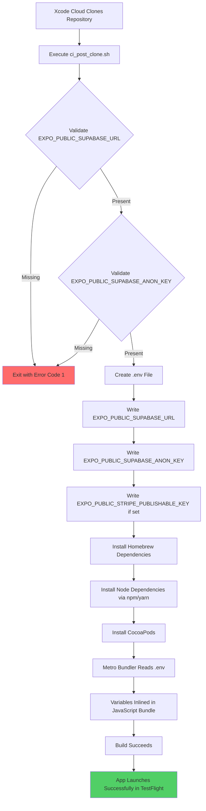
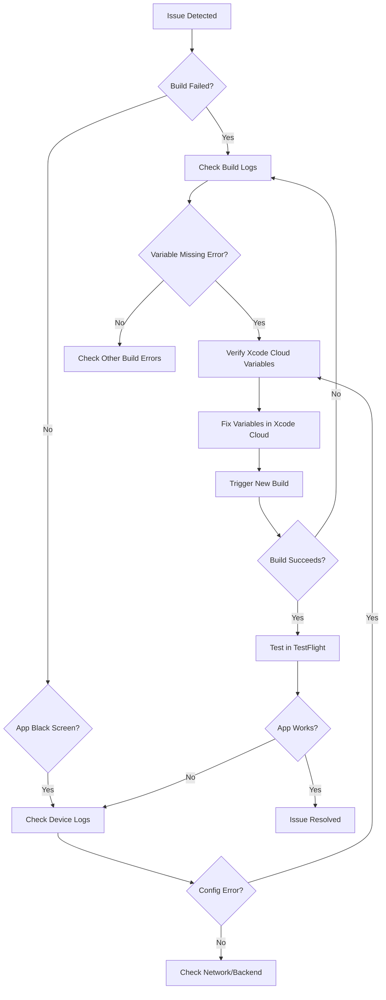

# Xcode Cloud Environment Setup Guide

## Table of Contents
- [Overview](#overview)
- [Configuration Steps](#configuration-steps)
- [Testing Instructions](#testing-instructions)
- [Troubleshooting](#troubleshooting)
- [Technical Details](#technical-details)
- [Best Practices](#best-practices)

---

## Overview

### Problem Fixed
This guide addresses the **black screen issue** that appeared when launching the app through TestFlight. The root cause was missing environment variables during the Xcode Cloud build process, which prevented the app from initializing properly.

### Why This Fix Was Necessary
The app uses environment variables (specifically Supabase and Stripe configuration) that are required at build time. Metro bundler, which processes our React Native/Expo app, inlines these environment variables into the JavaScript bundle during compilation. When these variables were undefined in the Xcode Cloud CI environment:

1. The [`config/supabase.ts`](../config/supabase.ts:7-8) file couldn't initialize the Supabase client
2. The bundled JavaScript contained `undefined` values for critical configuration
3. The app failed to connect to backend services, resulting in a black screen

### Solution Implemented
We modified the [`ios/ci_scripts/ci_post_clone.sh`](../ios/ci_scripts/ci_post_clone.sh) script to:
- Extract environment variables from Xcode Cloud's environment
- Create a `.env` file before the build process
- Validate that required variables are present
- Fail gracefully with clear error messages if configuration is missing

---

## Configuration Steps

Follow these steps to configure environment variables in Xcode Cloud:

### Step 1: Access Xcode Cloud Settings

1. Go to [App Store Connect](https://appstoreconnect.apple.com/)
2. Navigate to **Apps** → Select your app (Renvo)
3. Click on **Xcode Cloud** in the left sidebar
4. Select your workflow (or create one if it doesn't exist)
5. Click **Edit Workflow**

**Screenshot Placeholder:** _Xcode Cloud Workflow Settings Page_

### Step 2: Navigate to Environment Variables

1. In the workflow editor, find the **Environment** section
2. Scroll down to **Environment Variables**
3. Click **+** to add a new environment variable

**Screenshot Placeholder:** _Environment Variables Section in Xcode Cloud_

### Step 3: Add Required Variables

Add the following environment variables one by one:

#### Required Variables

##### 1. EXPO_PUBLIC_SUPABASE_URL
- **Name:** `EXPO_PUBLIC_SUPABASE_URL`
- **Value:** Your Supabase project URL (e.g., `https://your-project.supabase.co`)
- **Secret:** No (this is a public URL)
- **Description:** Supabase project URL for database and authentication services

**Where to find this value:**
- Open your local `.env` file
- Copy the value of `EXPO_PUBLIC_SUPABASE_URL`
- Alternatively, find it in [Supabase Dashboard](https://supabase.com/dashboard) → Project Settings → API → Project URL

##### 2. EXPO_PUBLIC_SUPABASE_ANON_KEY
- **Name:** `EXPO_PUBLIC_SUPABASE_ANON_KEY`
- **Value:** Your Supabase anonymous key (starts with `eyJ...`)
- **Secret:** ✅ **YES** - Mark this as a secret
- **Description:** Supabase anonymous/public key for client-side authentication

**Where to find this value:**
- Open your local `.env` file
- Copy the value of `EXPO_PUBLIC_SUPABASE_ANON_KEY`
- Alternatively, find it in [Supabase Dashboard](https://supabase.com/dashboard) → Project Settings → API → Project API keys → `anon` `public`

**⚠️ IMPORTANT:** While this is called an "anonymous" key and is safe to expose in client applications, you should still mark it as a secret in Xcode Cloud to:
- Prevent it from appearing in build logs
- Follow security best practices
- Maintain consistency with secret management

#### Optional But Recommended Variables

##### 3. EXPO_PUBLIC_STRIPE_PUBLISHABLE_KEY
- **Name:** `EXPO_PUBLIC_STRIPE_PUBLISHABLE_KEY`
- **Value:** Your Stripe publishable key (starts with `pk_test_` or `pk_live_`)
- **Secret:** No (publishable keys are safe to expose)
- **Description:** Stripe publishable key for payment processing

**Where to find this value:**
- Open your local `.env` file
- Copy the value of `EXPO_PUBLIC_STRIPE_PUBLISHABLE_KEY`
- Alternatively, find it in [Stripe Dashboard](https://dashboard.stripe.com/) → Developers → API keys → Publishable key

**Note:** If you don't include this variable, payment features will be disabled but the app will still launch.

### Step 4: Mark Sensitive Variables as Secrets

For variables marked as "Secret" above:

1. Click the **Secret** checkbox when adding the variable
2. Verify the value is masked (shown as `••••••••`)
3. Save the configuration

**Screenshot Placeholder:** _Environment Variable with Secret Checkbox Enabled_

### Step 5: Save Workflow Configuration

1. Review all added environment variables
2. Click **Save** or **Update** at the top of the workflow editor
3. Confirm the changes are applied

---

## Testing Instructions

### Triggering a Test Build

1. **Commit and Push Changes** (if you made any code changes):
   ```bash
   git add .
   git commit -m "chore: test xcode cloud environment configuration"
   git push origin main
   ```

2. **Trigger Manual Build**:
   - Go to Xcode Cloud workflow in App Store Connect
   - Click **Start Build** or **Build Now**
   - Select the branch to build (e.g., `main`)
   - Wait for the build to start

### Verifying the Build Process

#### 1. Check Build Logs

Navigate to the build details in Xcode Cloud and look for these success indicators in the logs:

```
🏗️ Starting ci_post_clone.sh setup...
📝 Creating .env file from environment variables...
✅ Environment file created successfully
🍺 Installing Node and CocoaPods via Homebrew...
Installing Node dependencies...
Installing CocoaPods...
```

**Expected Success Pattern:**
- ✅ No error messages about missing environment variables
- ✅ `.env` file creation confirmed
- ✅ Build proceeds to compilation phase

#### 2. Check for Variable Validation

The script validates required variables. A successful validation means:
- No "ERROR: EXPO_PUBLIC_SUPABASE_URL not set" message
- No "ERROR: EXPO_PUBLIC_SUPABASE_ANON_KEY not set" message

#### 3. Monitor Build Progress

Watch the build progress through these phases:
1. **Clone Repository** ✓
2. **Post-clone Script** ✓ (this is where our fix runs)
3. **Install Dependencies** ✓
4. **Build** ✓
5. **Archive** ✓
6. **Distribute to TestFlight** ✓

### Verifying the App in TestFlight

After the build is distributed to TestFlight:

1. **Install the Latest Build**:
   - Open TestFlight app on your iOS device
   - Install the latest build version

2. **Launch the App**:
   - Open the app
   - ✅ **Success:** App displays the login/home screen (not a black screen)
   - ✅ **Success:** You can interact with the app

3. **Test Core Functionality**:
   - Try logging in (tests Supabase connection)
   - Navigate through different screens
   - Verify data loads correctly

### What a Successful Launch Looks Like

✅ **App launches to the login screen or home screen**  
✅ **No black screen or immediate crash**  
✅ **Supabase authentication works**  
✅ **Data from Supabase loads correctly**  
✅ **No console errors about undefined environment variables**

---

## Troubleshooting

### Common Issues and Solutions

#### Issue 1: Build Fails with "EXPO_PUBLIC_SUPABASE_URL not set"

**Error Message:**
```
❌ ERROR: EXPO_PUBLIC_SUPABASE_URL not set in Xcode Cloud environment
```

**Solution:**
1. Verify the variable is added in Xcode Cloud workflow settings
2. Check the variable name is **exactly** `EXPO_PUBLIC_SUPABASE_URL` (case-sensitive)
3. Ensure there are no extra spaces in the variable name
4. Re-save the workflow configuration
5. Trigger a new build

#### Issue 2: Build Fails with "EXPO_PUBLIC_SUPABASE_ANON_KEY not set"

**Error Message:**
```
❌ ERROR: EXPO_PUBLIC_SUPABASE_ANON_KEY not set in Xcode Cloud environment
```

**Solution:**
1. Verify the variable is added in Xcode Cloud workflow settings
2. Check the variable name is **exactly** `EXPO_PUBLIC_SUPABASE_ANON_KEY` (case-sensitive)
3. Ensure the value is the full key (starts with `eyJ...`)
4. Verify you marked it as a secret
5. Re-save the workflow configuration
6. Trigger a new build

#### Issue 3: App Still Shows Black Screen After Build Succeeds

**Possible Causes:**
1. **Incorrect variable values**: Double-check that you copied the correct values from your `.env` file
2. **Wrong Supabase project**: Ensure the URL and key match the same Supabase project
3. **Expired or invalid keys**: Regenerate keys in Supabase if needed
4. **Network issues**: Check if the device has internet connectivity

**Solution:**
1. Verify values in Xcode Cloud match your local `.env` file exactly
2. Test the values locally first: `npm start` and verify the app works
3. Check Supabase Dashboard → Project Settings → API to confirm keys are valid
4. Review device logs in Xcode → Window → Devices and Simulators → Select device → View device logs

#### Issue 4: Build Succeeds But Variables Are Undefined in App

**Symptoms:**
- Build completes successfully
- No validation errors in logs
- App still shows black screen or errors about missing config

**Solution:**
1. Verify the [`ios/ci_scripts/ci_post_clone.sh`](../ios/ci_scripts/ci_post_clone.sh) script is present and executable:
   ```bash
   ls -la ios/ci_scripts/ci_post_clone.sh
   # Should show: -rwxr-xr-x (executable)
   ```

2. If not executable, make it executable:
   ```bash
   chmod +x ios/ci_scripts/ci_post_clone.sh
   git add ios/ci_scripts/ci_post_clone.sh
   git commit -m "fix: make ci_post_clone.sh executable"
   git push
   ```

3. Ensure the script is committed to git:
   ```bash
   git ls-files ios/ci_scripts/ci_post_clone.sh
   # Should output: ios/ci_scripts/ci_post_clone.sh
   ```

#### Issue 5: Cannot Find Environment Variables Section in Xcode Cloud

**Solution:**
1. Ensure you're editing a workflow (not just viewing)
2. Scroll down in the workflow editor - Environment Variables may be in the middle or bottom
3. Try creating a new workflow if the option is missing
4. Verify you have the correct permissions in App Store Connect (Admin or App Manager role)

### How to Check Environment Variables Are Set Correctly

#### Method 1: Review Xcode Cloud Workflow
1. Go to App Store Connect → Xcode Cloud → Your Workflow
2. Click Edit
3. Scroll to Environment Variables section
4. Verify all required variables are listed
5. Check that secret variables show `••••••••`

#### Method 2: Check Build Logs
1. Go to completed build in Xcode Cloud
2. View build logs
3. Look for the "Creating .env file" section
4. Verify success message appears
5. Check for any validation errors

#### Method 3: Add Temporary Debug Logging

If you need to verify values (without exposing secrets):

1. Temporarily edit [`ios/ci_scripts/ci_post_clone.sh`](../ios/ci_scripts/ci_post_clone.sh):
   ```bash
   # Add after line 11
   echo "📊 Checking environment variables..."
   if [ -n "$EXPO_PUBLIC_SUPABASE_URL" ]; then
       echo "✅ EXPO_PUBLIC_SUPABASE_URL is set"
   else
       echo "❌ EXPO_PUBLIC_SUPABASE_URL is NOT set"
   fi
   
   if [ -n "$EXPO_PUBLIC_SUPABASE_ANON_KEY" ]; then
       echo "✅ EXPO_PUBLIC_SUPABASE_ANON_KEY is set (first 10 chars: ${EXPO_PUBLIC_SUPABASE_ANON_KEY:0:10}...)"
   else
       echo "❌ EXPO_PUBLIC_SUPABASE_ANON_KEY is NOT set"
   fi
   ```

2. Push changes and trigger new build
3. Review logs to see which variables are available
4. **Remove debug logging** after verification (security best practice)

---

## Technical Details

### How the CI Script Works

The [`ios/ci_scripts/ci_post_clone.sh`](../ios/ci_scripts/ci_post_clone.sh) script is automatically executed by Xcode Cloud after cloning your repository but before building. Here's what it does:

#### Script Execution Flow



#### Key Script Components

**1. Variable Validation (Lines 13-21):**
```bash
if [ -z "$EXPO_PUBLIC_SUPABASE_URL" ]; then
    echo "❌ ERROR: EXPO_PUBLIC_SUPABASE_URL not set in Xcode Cloud environment"
    exit 1
fi

if [ -z "$EXPO_PUBLIC_SUPABASE_ANON_KEY" ]; then
    echo "❌ ERROR: EXPO_PUBLIC_SUPABASE_ANON_KEY not set in Xcode Cloud environment"
    exit 1
fi
```
- Checks if required variables are present
- Exits with error code 1 if missing (fails the build immediately)
- Provides clear error messages for debugging

**2. Environment File Creation (Lines 24-28):**
```bash
cat > .env << EOF
EXPO_PUBLIC_SUPABASE_URL=${EXPO_PUBLIC_SUPABASE_URL}
EXPO_PUBLIC_SUPABASE_ANON_KEY=${EXPO_PUBLIC_SUPABASE_ANON_KEY}
EXPO_PUBLIC_STRIPE_PUBLISHABLE_KEY=${EXPO_PUBLIC_STRIPE_PUBLISHABLE_KEY}
EOF
```
- Creates `.env` file in project root
- Populates with values from Xcode Cloud environment
- Uses heredoc syntax for clean file creation

**3. Dependency Installation (Lines 32-58):**
- Installs Node.js and CocoaPods via Homebrew
- Installs npm/yarn packages
- Installs iOS pods
- Ensures all build dependencies are available

### Environment Variable Injection Process

#### How Metro Bundler Handles Environment Variables

1. **Read Phase**: Metro bundler reads `.env` file during build
2. **Parse Phase**: Parses environment variables using `react-native-dotenv` or similar
3. **Inline Phase**: Replaces `process.env.EXPO_PUBLIC_*` references with actual values
4. **Bundle Phase**: Creates JavaScript bundle with hardcoded values

**Example:**

Before bundling ([`config/supabase.ts`](../config/supabase.ts:7-8)):
```typescript
const supabaseUrl = process.env.EXPO_PUBLIC_SUPABASE_URL || '';
const supabaseAnonKey = process.env.EXPO_PUBLIC_SUPABASE_ANON_KEY || '';
```

After bundling:
```typescript
const supabaseUrl = 'https://your-project.supabase.co';
const supabaseAnonKey = 'eyJhbGc...';
```

This is why environment variables **must be available at build time** - they become part of the compiled JavaScript bundle.

### Why This Approach Works

1. **Early Validation**: Script fails fast if required variables are missing
2. **Standard .env Pattern**: Uses the same `.env` file pattern as local development
3. **Metro Compatibility**: Works seamlessly with Metro bundler's existing environment variable handling
4. **Security**: Secrets are managed in Xcode Cloud and never committed to git
5. **Transparency**: Clear logging makes debugging straightforward

---

## Best Practices

### Security Considerations

#### 1. Never Commit Secrets to Git

**❌ Don't:**
```bash
# .env file (committed to git)
EXPO_PUBLIC_SUPABASE_ANON_KEY=eyJhbGc...  # Never do this!
```

**✅ Do:**
- Keep `.env` in `.gitignore`
- Use `.env.example` for documentation only (with placeholder values)
- Configure actual values in Xcode Cloud environment variables

#### 2. Use Xcode Cloud's Secret Masking

For sensitive variables:
- ✅ Mark as "Secret" in Xcode Cloud
- ✅ Values are masked in logs as `••••••••`
- ✅ Prevents accidental exposure in build logs

#### 3. Rotate Secrets Periodically

**Recommended Schedule:**
- **Supabase Keys**: Every 90-180 days
- **Stripe Keys**: After any security incident
- **All Keys**: Immediately if compromised

**How to Rotate:**
1. Generate new keys in respective services
2. Update Xcode Cloud environment variables
3. Trigger new build
4. Verify app works with new keys
5. Revoke old keys

#### 4. Limit Access to Environment Variables

- Only give Xcode Cloud environment access to Admin or App Manager roles
- Regularly audit who has access to App Store Connect
- Use least-privilege principle for team access

### Environment Management Best Practices

#### 1. Separate Environments for Different Stages

**Recommended Setup:**

| Environment | Xcode Cloud Workflow | Supabase Project | Stripe Account |
|-------------|---------------------|------------------|----------------|
| Development | `develop-workflow` | `project-dev` | Test Mode |
| Staging | `staging-workflow` | `project-staging` | Test Mode |
| Production | `production-workflow` | `project-prod` | Live Mode |

**Implementation:**
1. Create separate workflows in Xcode Cloud for each environment
2. Use different Supabase projects for each environment
3. Use Stripe test keys for dev/staging, live keys for production
4. Configure different environment variables per workflow

#### 2. Document Your Environment Variables

Maintain a `README` or documentation that lists:
- Which variables are required
- Which are optional
- Where to find values
- When they were last rotated

**Example Documentation:**
```markdown
## Environment Variables

### Required
- `EXPO_PUBLIC_SUPABASE_URL`: Supabase project URL (Supabase Dashboard → API)
- `EXPO_PUBLIC_SUPABASE_ANON_KEY`: Public anon key (marked as secret)

### Optional
- `EXPO_PUBLIC_STRIPE_PUBLISHABLE_KEY`: Stripe publishable key for payments

### Last Rotated
- Supabase Keys: 2024-01-15
- Stripe Keys: Never (consider rotating quarterly)
```

#### 3. Use Consistent Naming Conventions

**Expo Naming Rule:**
- All frontend environment variables MUST be prefixed with `EXPO_PUBLIC_`
- This prefix tells Metro bundler to inline these variables
- Without the prefix, variables won't be available in the app

**Examples:**
- ✅ `EXPO_PUBLIC_SUPABASE_URL`
- ✅ `EXPO_PUBLIC_STRIPE_PUBLISHABLE_KEY`
- ❌ `SUPABASE_URL` (won't work in Expo)
- ❌ `STRIPE_KEY` (won't work in Expo)

#### 4. Test Locally Before CI Deployment

Always test configuration changes locally first:

```bash
# 1. Update your local .env file
# 2. Clear Metro cache
npx expo start --clear

# 3. Test the app
# 4. Only after local verification, update Xcode Cloud variables
```

#### 5. Monitor Build Success Rates

Track your Xcode Cloud builds:
- Set up notifications for failed builds
- Review build logs regularly
- Investigate any sudden changes in success rate
- Keep build history for troubleshooting

### Troubleshooting Workflow

When issues arise, follow this systematic approach:



---

## Additional Resources

### Related Documentation
- [`.env.example`](../.env.example) - Template for environment variables
- [`ios/ci_scripts/ci_post_clone.sh`](../ios/ci_scripts/ci_post_clone.sh) - CI script implementation
- [`config/supabase.ts`](../config/supabase.ts) - Supabase client configuration
- [Expo Documentation](https://docs.expo.dev/guides/environment-variables/) - Environment variables in Expo
- [Xcode Cloud Documentation](https://developer.apple.com/documentation/xcode/xcode-cloud) - Official Xcode Cloud docs

### Support Contacts

If you continue to experience issues after following this guide:

1. **Check Xcode Cloud Status**: [Apple Developer System Status](https://developer.apple.com/system-status/)
2. **Review App Store Connect**: Ensure all workflows are properly configured
3. **Verify Service Status**:
   - [Supabase Status](https://status.supabase.com/)
   - [Stripe Status](https://status.stripe.com/)

---

## Changelog

| Date | Version | Changes |
|------|---------|---------|
| 2024-11-25 | 1.0.0 | Initial release - Documents fix for TestFlight black screen issue |

---

**Last Updated:** November 25, 2024  
**Document Version:** 1.0.0  
**Script Version:** [`ios/ci_scripts/ci_post_clone.sh`](../ios/ci_scripts/ci_post_clone.sh) - Lines 1-72